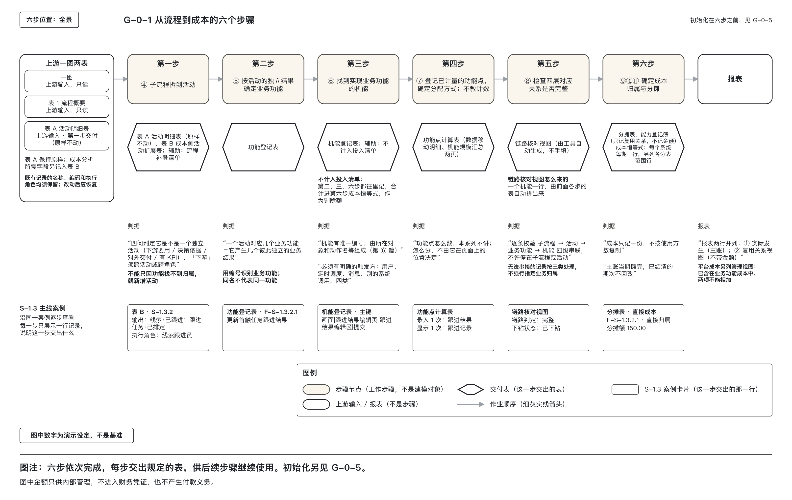
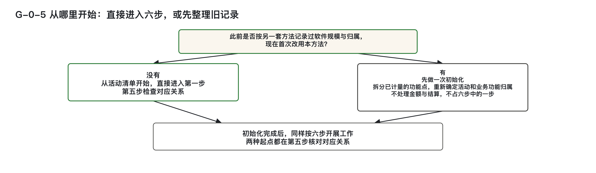
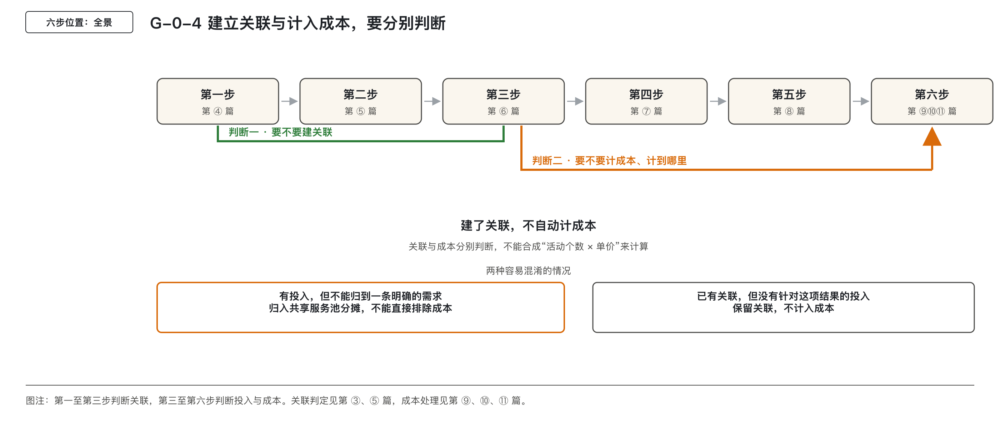
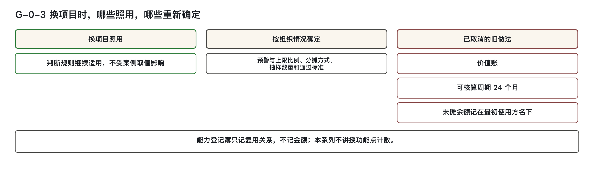
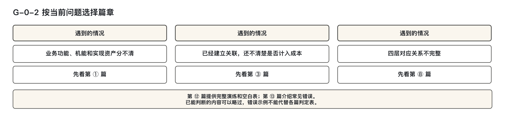

# 从活动清单到软件成本：先把业务与软件对应起来

流程梳理完成后，手头有一份活动清单，但还不能直接估算软件建设成本。不同活动对软件实现的需求差异显著：有的需要独立界面，有的依赖已有接口，有的通过系统间消息传递完成。共用能力、平台支撑和跨流程复用的部分，也无法通过“活动个数 × 单价”来反映。

本系列共十四篇，面向做过流程或成本分析、但未使用本方法的读者。读完本篇，可以判断是否需要初始化旧记录、从哪一步开始，以及下一步该查哪一篇。功能点计数属于另一套计量方法，本系列不讲授。

---

## 一、从一次客户跟进，看清四层关系

以汽车经销商（4S 店）的销售线索跟进为例。这里的“线索”是有购车意向的客户留下的一条记录；第一次联系上客户称为“首触”；客户最终不买了称为“战败”。这些术语将在后续各篇持续使用。

在子流程 S-1.3“门店线索跟进”中，包含一项具体工作：活动 S-1.3.2“更新第一次接触后的跟进结果”。这项活动完成后，交付的成果是业务功能 F-S-1.3.2.1“更新首触任务跟进结果”。活动描述的是执行动作，业务功能强调的是可单独指认的产出结果。一个活动可能产生多个独立结果，从而对应多个业务功能。

接下来，软件如何实现这一结果？需拆解到“机能”层级——即可以被外部触发、用来登记软件规模的交付单位。先看这个业务功能的画面和接口两个机能：

- **画面“跟进结果编辑区”**：用户界面上能独立交出结果的一块区域；
- **接口“提交跟进结果”**：供其他程序调用的入口。

事件处理要分清发布、分发、消费三个阶段：

- 发布跟产生事件的业务动作走。事件发布能力已由开发框架实现，因此一般不单列机能；若单列，归产生方对应的业务功能。
- 分发由领域事件总线 RabbitMQ 负责，不单列机能。
- 消费机能归受影响的下游活动对应的业务功能。同一事件影响多个下游时，各下游有自己的消费者程序。

“更新首触任务跟进结果”产生“线索状态变更”事件。就这条事件而言，上游负责发布，消费由下游承担。例如，下游需要更新客户状态时，由自己的消费者接收事件并处理。消费者是一段程序，不是岗位。

机能与内部实现也要分开。**实现资产**是系统内部没有自身外部触发方的逻辑，会发生工时，但不单独计算规模。定时任务由时间触发，可以登记为机能。

菜单只用于打开下一个页面，不单独建模；页面是容器，不能直接作为切分边界；按钮多数并入所在区域。具体判定见第 ① 篇和第 ⑥ 篇。

功能点表示已计量的软件规模，登记在机能上，不登记在活动个数上。本例沿子流程、活动、业务功能、机能四层找清对应关系后，成本记在这项业务功能上，不按活动个数计算。

案例中的 S- 编号用于区分教学记录与真实项目。S-1 是流程，S-1.3 是其下的子流程，S-1.3.2 是其中的活动；F-S-1.3.2.1 是这个活动交出的第一个业务功能。金额与比例仅用于演示，不可照搬。换一个行业，名称虽变，判断方法不变。后续第④至第⑪篇将局部使用此案例，第⑫篇再完整填表。本篇仅展示对应关系，不提前填写整套表格。

## 二、活动清单怎样成为估算的依据

“活动个数 × 单价”有两个问题：活动不是相同的软件规模单位，先完成映射的那批活动也不能代表其余活动。

首先，不同活动对软件实现的需求不同。有的活动几乎没有软件实现，有的需要画面、接口和定时任务。一项业务功能可以对应多个机能，还有一些规模由多个活动共用，或属于全系统共用的平台部分。活动个数相同，不代表软件规模相同。

其次，用于计算单价的那批活动，已经完成了从活动到业务功能、再到机能的映射，并登记了功能点。能否走到这一步，取决于材料是否齐备、归属是否明确，与活动本身的规模大小无关。先算出来的，总是材料齐备、归属明确的一批，并不是随机样本。

材料不足、归属还不清楚，或规模落在共用机能、平台部分的，不会以相同机会进入这批活动。把这批活动的单价套到全部活动上，就默认其余活动与它们相同，也漏掉了尚未登记、共用和平台部分的规模。

这种做法导致的结果是：总成本一定偏低。因为活动个数进入了算式，但真正构成软件规模的共用部分、平台部分、以及尚未完成映射的规模，却未被纳入。

估算需要更细的依据。先找出可以观察的特征，按这些特征把活动分类，建立以后可以继续使用的成本模型。遇到新活动、新流程时，再按已有分类估计软件规模和成本范围。

六步会用到几个名称。**流程资产**是一张流程图加一份活动明细表；本方法使用其中的子流程、活动两层，分别记作 L4、L5，不使用 L1 至 L3。**下钻**是沿四级链路逐层找对应记录，并注明找到了哪一层。**池**用于把暂时无法归到单一对象的成本先放在一起。

六步依次取得建模所需的依据。每一步的产出交给后续步骤使用：

| 步骤 | 篇号 | 输入 | 产出 |
|------|------|------|------|
| 第一步：认定活动 | 第④篇 | 子流程与活动两层的流程资产（L4、L5）；没有流程图时，不能用需求清单或系统菜单代替 | 活动清单 |
| 第二步：确定业务功能 | 第⑤篇 | 活动及其产生的业务结果 | 业务功能；根据活动产生的彼此独立的业务结果，判断有几个功能 |
| 第三步：确定机能 | 第⑥篇 | 业务功能 | 机能；规模此后登记在这一层 |
| 第四步：登记功能点 | 第⑦篇 | 机能与已计量的功能点 | 功能点登记到哪个机能、在机能之间如何分配；本系列不教功能点计数 |
| 第五步：检查对应关系 | 第⑧篇 | 四级链路（子流程→活动→业务功能→机能） | 四级链路已串接完整，不能串接的另行处理；同时检查初始化是否完成 |
| 第六步：归集成本 | 第⑨⑩⑪篇 | 已登记规模与实际投入 | 按内部管理口径，成本归属哪个业务功能、暂时归不到单一对象时进入哪个池，以及跨版本时是否调整 |

初始化是进入六步前只做一次的工作，具体是否需要见下一节。前四步确定“规模记在哪里”，第五步验证链条是否完整，第六步才开始成本归集。活动个数只是第一步的输出，既不是软件规模，也不是金额。不能在中间某一层停下，再拿那一层的数量乘单价。

本系列不采用任何项目实测的活动个数或归属比例作为论据。这些数字只能说明特定批次材料的状态，不具备通用性。不能直接把它们当成方法参数。

图 G-0-1　六步依次完成，每一步形成的记录供后续步骤继续使用。图中金额仅作教学演示。

## 三、有旧记录时，先做一次初始化

从活动清单新开始，直接进入第一步，不做初始化，也不需要已经填好的旧表。

初始化只在特定条件下触发：**组织以前已用其他方法对软件规模和归属做过记录，现在首次切换到本方法**。此时必须将已有功能点重新拆分，重新指定其归属于哪个活动、哪项业务结果。这一过程仅涉及功能点的拆解与归属重分配，不处理金额和结算。具体登记到哪个机能，仍在第三步、第四步完成。

初始化只做一次，不因周期重复，也不因发现错误而重做。它不属于六步流程中的任何一步，完成后与从活动清单开始的情况完全一致，均从第一步起继续推进。无论是否经过初始化，第五步都需检查所有记录是否已有明确归属——每条记录都要有归属，不得留有“找不到归属”的空白。

**有归属，并不等于唯一归属**。同一事件可能影响多个下游，每个下游的消费者程序分别归属于各自的业务功能。不能因同一事件有多个下游，就把整个事件链视为一个共享消费者并按受益活动分摊。

确实存在机能被多个业务功能共用的情形，仍按原共用规则判断。定时任务可以按受益的多个活动分配。消息或事件处理程序是否共用，应依据其支撑的实际业务功能判断，而非仅凭程序名称或模块命名。

系统间调用时，谁发出调用，成本就记在谁身上。这是系统级交互，非人工岗位操作。

初始化清理的是尚未写明归属的记录。具体如何划分，见第⑧篇。实施范围、执行人、签字确认人、数量分配方式等，属于项目层面事项，本系列不展开。

图 G-0-5　初始化仅用于首次改用本方法时整理旧记录。机能登记仍在第三、第四步完成，两种起点都在第五步核对对应关系。

## 四、关联建好了，成本还要另作判断

在表上记录“这个活动对应这项业务结果”，即建立了关联。是否建立这条关联，依据第③篇和第⑤篇的判断标准。关联建立后，仍需单独判断相关投入是否计入该业务结果的成本。

两个关键情形需区分处理：

- 若已有投入，但无法归入一条明确的需求，应按共享服务分摊处理。暂时无法归到单一业务结果的成本先放入共享服务池，不能写为“不计算”。
- 若已有关联，但无针对该结果的投入，保留关联关系，不计入成本。

因此，建了关联不等于要计成本；有投入也不一定就能归到单一结果。关联与成本是两个独立的判断环节，贯穿后续工作，不能合成一次乘法。

成本处理中涉及三个核心概念：**归集**是把一笔笔成本收上来，记到某个对象名下；**归属**是认定这笔成本算谁的；**分摊**是将多个对象共同耗用的成本，按可说明的依据分配给各方。共用成本的分摊规则见第⑨篇，平台成本处理见第⑩篇，跨版本成本问题见第⑪篇。

图 G-0-4　建立关联与计入成本要分别判断：无法归到单一需求的投入仍须处理；已有关系但没有针对这项结果的投入时，保留关联、不计成本。

## 五、报表上的哪些金额不能相加

在本系列的管理口径下，所有金额仅用于信息技术部门内部核算、报价测算与复用效益分析。它们不是企业会计科目，不进入财务凭证，不产生付款义务，也不能作为应付款项或结算依据。“成本记在某个功能上”指的是归属关系，不表示付款义务。

报表中存在两行必须分列且**不可相加**的数据：

- **平台功能的管理视图**：单独列出登录、权限这类不挂在具体业务上、全系统共用的功能的实际投入金额；
- **业务功能成本**：已包含分摊进来的平台成本。

若将两者相加，会导致平台成本被重复计算。因此，这两行必须分开呈现，并明确标注“不能相加”。具体填报方式见第⑩篇。

另一个易混淆的视图是**能力登记簿**。它只记录复用关系——即某项能力在建设时由谁使用，后来谁又使用了它。登记簿中不记录金额、周期、回收额和余额，也不与主账求和。公共能力和平台功能不进入该登记簿。

主账记录的是当期实际发生的成本，当期完成分摊。一旦某期成本结清，无论后期有多少新使用方接入，都不再重新分配该期建设成本。复用关系如何记录，详见第⑪篇。

> 历史做法中的“价值账”“可核算周期24个月”“未摊余额挂最初使用方”三项规则均已取消。现行方法仅通过能力登记簿记录复用关系，不再沿用旧有账务逻辑。

## 六、换项目时，哪些规则照用，哪些要重新确定

方法中的判断规则可以沿用，组织选定的比例和处理方式则需要另作判断。某个项目用了一个比例，不代表其他组织也应照用；重新确定比例时，判断规则仍然不变。

以下七项判断在更换项目后依然适用。前文讲过的判断，此处列出结论及查阅位置：

| 可以沿用的判断 | 含义 | 查阅篇章 |
|----------------|------|----------|
| 按功能编号归集 | 同名功能可对应多条记录，归集以编号为准，名称不能替代 | 第⑤篇 |
| 关联和成本分开判断 | 建立活动与业务功能之间的关联，不自动意味着计入成本 | 第③、⑤篇 |
| 页面位置不能决定功能点划分 | 已计量的功能点如何分配，不由其在页面上的上下左右位置决定 | 第⑦篇 |
| 复用不减少对内核算规模 | 机能被复用时，对内核算规模不乘折扣；对外报价若需折减，幅度由组织自行设定 | 第⑦篇 |
| 当期摊完，已结清期次不回改 | 成本一旦在某一期完成分摊并结清，后续使用方不得重新分配该期投入 | 第⑪篇 |
| 按自身触发方判断机能 | 没有自身外部触发方的内部实现逻辑，不单独计算规模 | 第①篇 |
| 按输入和结果判断画面机能 | 须同时具备输入区与结果区；只读列表只需结果区。单独按钮或搜索框不算 | 第⑥篇 |

以下五类取值或处理方式则需由各组织根据自身情况自行确定。这些数值不是通用基准，也不代表推荐标准。更换组织后需重新确定，不可直接套用。

| 需要自行确定的项目 | 本系列的取值或处理方式 | 查阅篇章 |
|----------------------|--------------------------|----------|
| 平台功能占比的预警线、上限 | 占比公式：平台功能功能点之和 ÷ 全部机能功能点之和。本系列取预警线 10%、上限 15%；更换组织后重新确定这两个比例 | 第⑩篇 |
| 共用机能的成本分摊 | 当前先按业务功能个数平均分摊，并在报表中标注“较粗的算法”；有实际使用量依据后，改回按使用量分摊 | 第⑨篇 |
| 活动层查看视图的分摊 | 从业务功能成本向下摊至活动，默认平均分摊；仅用于查看，不参与结算，不标“较粗的算法” | 第⑨篇 |
| 抽样复核的条数与通过标准 | 不规定具体条数，也不规定一致程度的阈值；由组织自行定义 | 第⑥、⑦篇 |
| 画面机能切分的粗细 | 切分粒度可调，但判定方法不变 | 第⑥篇 |

平台功能占比达到预警线时，只提醒，不拦截后续处理；达到上限仍然摊入，但必须逐条复核并保留记录。这一规则不可改为“到线即拦”，组织只能调整两个比例本身。

复核必须由另一个人独立重做，不得自行复核。这是方法要求；抽查多少条、一致到什么程度算通过，才由组织自行确定。

“新增 2 CFP、变更 1 CFP”属于功能点怎么计数，不是组织自定参数。CFP 是功能点的计数单位；计数细则、数据移动的识别和一次触发的判定，属于 COSMIC——一种按数据移动计量软件规模的方法。本系列不讲授计数，只处理已计量的功能点登记到哪个机能，以及如何在机能之间分配。

本篇不新增任何数值。各篇末尾还列有该篇需要组织自行确定的项目，实际采用时可以逐项查看。

图 G-0-3　组织可以重新确定适用取值与分摊方式，判断规则继续适用。已取消的旧做法不再沿用。

## 七、接下来按问题选读

建议通读全套，目的在于熟悉整体框架与各篇职责，不必背诵。实际操作中，直接根据当前遇到的问题，查对应篇章的判定表即可。若对某一步有分歧，再回看该篇的详细判断标准。

各篇开头提供问题索引，正文提供发生分歧时可查的判定表。已经分得清的内容可以略过；三个名称尚不清楚时，先读第 ① 篇。

图 G-0-2　三个常见问题对应三个阅读入口；各篇的完整适用情况见下表。

| 当前问题 | 应读篇号 | 可略过的情形或阅读边界 |
|----------|----------|--------------|
| 菜单、页面、按钮属于哪个层级；业务功能、机能、实现资产三者如何区分 | ① | 已能清晰区分三个名称 |
| 流程语句中出现表名、字段名或工具名；准备修改活动以匹配功能 | ② | 当前不修改流程正文 |
| 协同工具、电子表格、设备、通知等是否算功能支撑；已有关联但成本是否计入未定 | ③ | 问题与支撑手段无关 |
| 流程图和活动明细尚未可用；内部任务与独立活动难分；同一活动出现在多条子流程 | ④ | 活动认定已按第 ④ 篇完成 |
| 一个活动跨多个画面；功能数量未定；准备按功能名称归集 | ⑤ | 业务功能编号与独立结果数已明确 |
| 搜索框、按钮、整页是否构成一个机能；机能缺乏稳定唯一编号 | ⑥ | 机能记录可按编号复核 |
| 复杂页面应按整页还是区块登记功能点；多个终端如何记 | ⑦ | 第 ⑦ 篇处理已计量功能点的登记与分配；要学计数方法，另查计量资料 |
| 需求只对应到子流程或活动；四级链路可能断开；需确认初始化是否完成 | ⑧ | 四层已完整串接，且不涉及初始化 |
| 同一接口被多个业务功能调用，成本记几份、如何分摊 | ⑨ | 不存在共用情况 |
| 登录、权限、审计无明确业务归属，成本记在何处 | ⑩ | 当前对象能挂到业务活动 |
| 上期建设的接口本期继续使用，建设成本是否重新分配 | ⑪ | 无跨版本复用场景 |
| 想通过教学案例演练全流程，练习填写整套空白表 | ⑫ | 本篇仅作预告，表在第⑫篇提供 |
| 想了解常见错误做法的形态，用于自检 | ⑬ | 尚未做到相关步骤时先不读，不能代替判定表 |

第 ⑫ 篇用教学案例从头完成演练，并提供整套空白表；本篇只作预告，不提前填表。第 ⑬ 篇讲“反模式”，即常见错误做法的形态，供对照自查，不能代替各篇的判定表。

## 练习与自测

针对当前要估算的一笔成本，完成以下三项行动。本篇不填六步的表，也不设作业批改：

1. 写明这个金额由哪两个因素相乘得到。若为“活动个数 × 单价”，回到第二节检查，不用它估算总成本。

2. 判断本组织是否从活动清单新开始。若此前已按其他方法记录过软件规模与归属，现首次改用本方法，则需先读第⑧篇进行初始化；否则，直接进入当前应做的步骤。

3. 从第七节的选读表中只选定一篇。三个名称尚不清晰时，优先选择第①篇。

---

以下四题供自行对照，不另设评分。

1. **能否以活动个数乘单价估算总成本？**

   不能。活动需要的软件实现不同，先完成映射的那批活动也不能代表其余活动。应先按可观察特征分类，建立成本模型，再估计范围。

2. **以前按另一套方法记过记录，现在首次改用本方法，先做什么？**

   先做一次初始化，拆分已有功能点并重新指定归属。初始化不属于六步，不处理金额和结算。从活动清单新开始的，不做初始化。

3. **平台管理视图与业务功能成本能否相加？**

   不能。业务功能成本已包含分摊的平台成本，再相加会重复计算。两者都采用内部管理口径，须分列并注明不能相加。

4. **能力登记簿是否记录金额、可核算周期或未摊余额？**

   不记录，只记复用关系。“价值账”“24个月周期”“未摊余额挂最初使用方”的旧做法均已取消。

---

## 本篇依据

本节用于追溯，不要求阅读。

- `CM-ADR-001`：明确指出“活动个数 × 单价”不能直接用于报价，本篇沿用结构论证，不引用任何项目实测的活动个数或归属比例作为论据。
- 教学纲目第0篇：确立六步顺序、两种起点（新开始/初始化）、通用判断标准与组织自定参数范围。
- 第⑧篇：界定初始化边界，说明其仅限于已有记录的组织首次切换方法时执行。
- 第⑩篇：规定平台管理视图与业务功能成本不得相加，防止重复归集。
- 第⑪篇：确认能力登记簿仅记录复用关系，不涉及金额、周期或余额。
