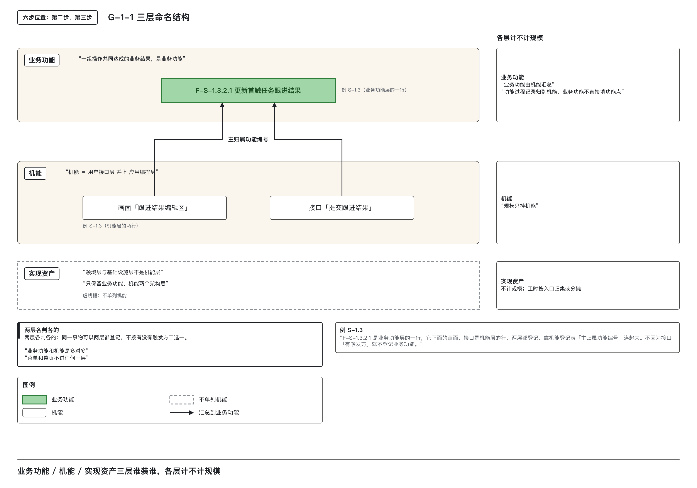
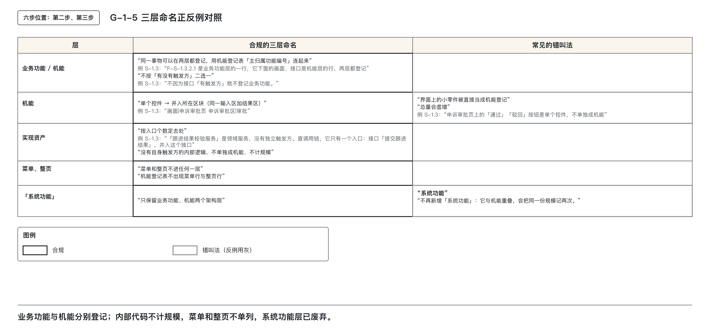
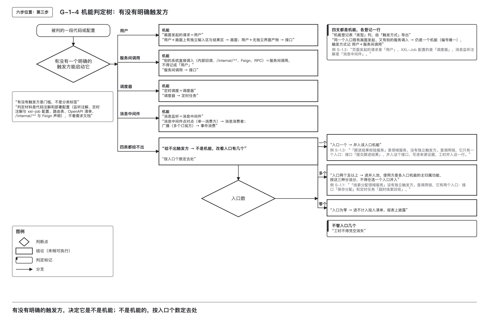
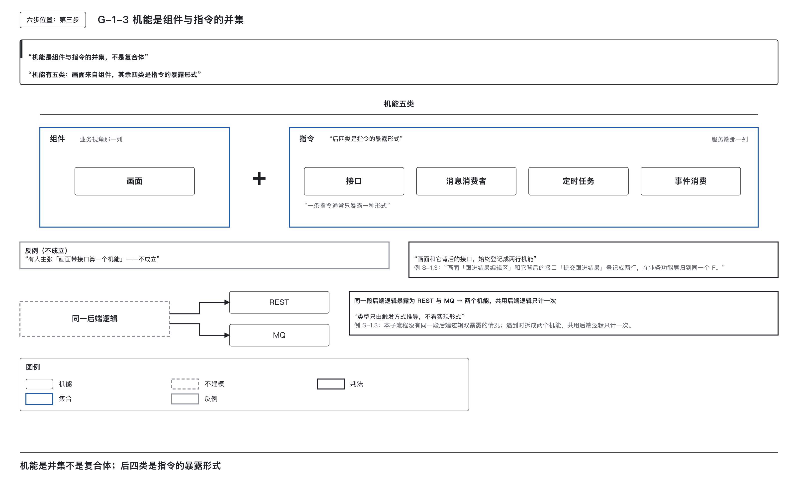
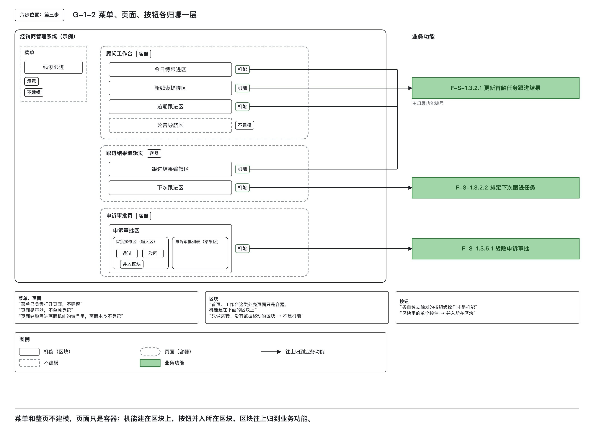

# 业务结果、交付入口与内部代码怎样分开登记

## 一、先分清业务结果、交付入口和内部代码

完成本篇后，能够：

1. 分清业务功能、机能、实现资产三层，判定一个对象落在哪一层、计不计规模。  
2. 说出触发方的四类（用户、调度器、消息中间件、服务间调用），并凭代码注解或部署配置，把一个入口归入其中一类。  
3. 判定菜单、页面、页面上的区块、按钮、接口、定时任务、消息消费者各归哪一层。  
4. 说明一个画面和它背后的接口为什么要登记成两个机能。  
5. 按入口个数确定一段没有触发方的内部逻辑并入何处，并写出它的工时去向。

在软件交付与成本归集过程中，若不区分“做什么”“谁来触发”“怎么实现”，就会出现业务认领不清、成本归属混乱的问题。这篇从已有的软件清单出发，说明哪些项要登记、规模记在哪里，以及内部代码的工时怎样找到去处。

### 三层命名的由来与核心问题

- **业务功能**：回答“我们完成了什么业务结果？”  
  指一项可以被独立指认、验收或停止的业务成果。例如：“更新首触任务跟进结果”“线索·已跟进”。业务方能单独认领这项结果。其规模由下层机能汇总而来，自身不直接计功能点。这里的“业务功能”是本方法的术语，与某些架构框架中的同名元素不同。它以编号确定身份，不能只看名称；编号规则见第 ⑤ 篇。

- **机能**：回答“哪个交付单元能被外部单独启动、验收和计量？”  
  是能被外部触发、用于登记规模的交付单位。包括画面、接口、定时任务、消息消费者、事件消费等五类。每条机能对应一个唯一编号，功能过程记录（如一次触发引起的一串处理）均归入该编号。

- **实现资产**：回答“这个结果靠什么内部逻辑实现？”  
  指系统内部、无外部直接触发方的代码单元，如领域服务、私有方法、客户端调用代码等。它们发生工时，但不计规模；其工时去向按入口数量决定：只有一个入口的，并入那个机能；有多个入口的，进入并入池；入口为零的，进入不计入投入清单并披露。

> 图 G-1-1　规模只登记在机能上，再汇总到业务功能；实现资产不计规模，工时另按入口确定去向。

### 分层解决哪些问题

若不分层，将导致以下问题：

| 问题类型 | 具体表现 | 后果 |
|--------|--------|------|
| 业务认领失真 | 将“提交按钮”“表单字段”当作功能，使业务活动退化为操作步骤清单 | 业务方无法识别自己真正要的结果 |
| 成本归集失真 | 同一业务结果跨越多个终端、多个画面，各计各的功能，汇总拼合方式因人而异 | 成本无法准确映射到真实业务结果 |
| 规模重复 | 若引入“系统功能”作为中间层，同一对象可能被记两次（一人视作系统功能，另一人视作机能） | 成本虚高，归属冲突 |

只保留业务目的这一层也不够：功能之下有哪些可以交付、计量的单元，多端共用接口由谁使用、应该登记几份，都需要明确的位置。业务功能和机能两层分别解决业务认领与交付计量的问题。

本方法不再使用“系统功能”这一已被废弃的层级。旧文档中出现的“系统功能”，应根据其实际所指，归入**业务功能**或**机能**，不得照抄原名。

> 图 G-1-5　三类对象分别登记；“系统功能”与机能重叠，不再增加这一层。

### 业务结果和交付单位分别判定

一个对象可能同时属于两层，甚至三者皆非。关键在于分别回答两个问题：

1. **它是不是业务功能？**  
   → 业务能否独立认领、验收或停止它？

2. **它是不是机能？**  
   → 能否被外部直接触发、单独交付？

若两个问题答案均为“是”，则应在**业务功能层**与**机能层**各登记一行。此时，机能行的“主归属功能编号”填写对应的业务功能编号。

- “更新首触任务跟进结果”是一个业务功能（F-S-1.3.2.1）  
- 对应的提交接口「提交跟进结果」是机能  
- 在机能登记表中，“主归属功能编号”填 F-S-1.3.2.1

> 常见误判：  
> “既然接口是机能，就不必再登记业务功能。”  
> ——这是把两层当成二选一，违背了“业务结果”与“交付单元”本质分离的原则。

### 三层之外：不建模对象

以下对象不属于任何一层，**不登记**：

- 菜单项  
- 导航栏  
- 工作台外壳  
- 整个页面  

菜单和导航只负责打开页面；整页和工作台外壳只是容器。它们不独立登记为业务功能或机能。

### 三层判定表

| 待判问题 | 判定方法 | 结论写在哪里 |
|---|---|---|
| 它是不是业务功能 | 业务能不能单独认领、验收或停止它 | 功能登记表，一行一个 F 编号 |
| 它是不是机能 | 能不能被外部直接触发、单独交付（触发方怎么判定见第二节） | 机能登记表，一行一个唯一编号 |
| 两层都满足时怎么办 | 两层各登记一行，不二选一 | 机能行的「主归属功能编号」填该 F 编号 |
| 它计不计规模 | 只有机能计；业务功能由机能汇总；实现资产不计 | 主张「它计规模」的一方，指出它在机能登记表的哪一行 |
| 菜单、整页 | 不进任何一层 | 不登记 |

### 规模怎样拆回明细

规模只登记在机能上，业务功能由机能汇总，实现资产不计。报表里某一业务功能的规模，一定能拆回若干机能行；某一机能的规模，一定能拆回若干功能过程记录。任何一层凭空多出的规模，都表明有对象被重复登记。

功能过程是“一次触发引起的一串处理”的完整链条，是 COSMIC（一种按数据移动计量软件规模的方法）中的计量明细。每个功能过程归属于一个机能，一个机能可包含多个功能过程。本系列不讲功能点怎样计数，只把已计量的功能点登记到对应机能上。

### 机能的软件分层位置：用户接口层 + 应用编排层

判定一个对象是否为机能，需先确定其在软件架构中的位置。本方法采用 Domain-Driven Design（领域驱动设计，简称 DDD）四层模型作为参考：

1. **用户接口层**：前端页面、对外暴露的API接口。  
2. **应用编排层**（应用层）：接收外部请求、消息或定时调度，再组织领域层完成处理。  
3. **领域层**：业务对象的规则和领域服务。  
4. **基础设施层**：数据库访问、消息客户端等技术部件。

**机能仅存在于用户接口层与应用编排层**。这里以两点判定：

- 机能必须具备**外部可触发性**：只有这两层能被用户、调度器、消息中间件或服务间调用直接唤起。  
- 领域层与基础设施层的代码没有独立触发方，只能被上层调用，其价值必须通过某个入口体现。

> 若将领域服务或私有方法视为机能，将带来两大后果：  
> 1. **规模重复**：同一逻辑在入口处计一次，在服务内又计一次；  
> 2. **判定不一致**：切分粒度依赖代码写法，不同开发者会得出不同数量的“机能”。

#### 应用侧两列的来历

这一划分也对应软件架构中“应用侧两列”的来源：

- 业务视角那一列，从应用域细化到功能，再细化到组件，组件经常是画面中的一个局部。  
- 服务端那一列，从服务领域细化到应用服务、聚合，再细化到指令；指令本身是内部业务逻辑，接口、消费者、定时任务等对外能力是它的暴露形式。

机能的成员来自这两列的最底层：画面类来自组件，其余几类来自指令。

### 汽车类比辅助理解（仅作比喻，不代替判据）

- “自适应巡航”是车主可独立开启、关闭、验收的业务功能。  
- 驾驶员按下方向盘上的巡航键 → 触发一个机能；  
- 前向雷达按固定周期上报目标 → 另一个机能；  
- 车身总线上收到制动报文即退出巡航 → 又一个机能；  
- 另一个控制器通过服务接口读取当前设定车速 → 也是机能；  
- 跟车距离怎么计算、雷达信号怎么滤波 → 这些内部函数没有外部可以直接唤起的触发方，只在上述动作中被调用，对应实现资产。

类比至此为止。实际判定仍以本篇提供的判定标准为准。

---

### 快速定位：清单里这一项先看什么

面对一张未分层的软件清单，可先用此表快速定位对象所属层级。注意：此表仅为初步指引，最终结论须依据后文各节判定标准，并附上触发证据。

| 当前材料 | 先问一句 | 初步判定 | 详细阅读 |
|---------|----------|----------|----------|
| 一个菜单项、一个导航栏、一个工作台外壳 | 它自身产生数据吗 | 不产生：只负责打开页面，不建模 | 第五节 |
| 一整个页面 | 页面上有几块各自能说明业务目的的区域 | 页面只是容器，机能建在区块上 | 第五节 |
| 一个按钮 | 能不能用「动词＋对象」单独说明一个业务目的，自带输入区和结果区、能单独验收 | 多数并入所在区块，不单独成机能 | 第五节 |
| 一个接口、一个定时任务、一个消息监听 | 由谁启动 | 有触发方就是机能 | 第二节 |
| 一个领域服务、一个私有方法 | 能不能从外部直接调用 | 不能：实现资产，按入口并入 | 第四节 |
| 一件业务方要求的事，例如「更新首触任务跟进结果」 | 业务能不能单独认领、验收或停止 | 业务功能 | 第一节 |

> 注：输入区指界面上填东西的地方，结果区指出结果的地方。此表仅用于定位，不可替代后续判定规则。

## 二、谁启动它，属于哪类机能

### 2.1 查实现，确定四类触发方

一个对象是否为机能，关键在于是否存在明确的外部触发方。触发方不等于“人”，而是指能启动该功能过程的实体或系统。本方法将触发方严格限定为以下四类，每类均有对应的代码或配置证据：

| 触发方 | 典型载体 | 对应机能类型 |
|--------|----------|--------------|
| 用户 | 画面发起的请求（画面背后的应用程序接口，即 API） | 画面、接口 |
| 调度器 | 定时任务调度者，如 xxl-job 配置、Spring 的 `@Scheduled` 注解 | 定时任务 |
| 消息中间件 | 消息监听机制，如 `@RabbitListener`、`@KafkaListener` | 消息消费者、事件消费 |
| 服务间调用 | 其他系统或服务直接调入：内部回调、`/internal/**` 路径、Feign 声明（一种服务间调用的代码声明）、RPC（远程过程调用） | 接口 |

**核心原则**：  
- 触发方是门槛，不是分类标签。无法提供四类之一的，**不是机能**。第 ③ 篇判断“功能支撑业务”时，行为性条件问的也是有没有明确触发方，两处使用同一判据。  
- 第四类“服务间调用”极易被误记为“用户”。一旦错误归类，将导致接口类型统计失真，并在后续归属判定中丢失调用链线索——第 ⑧ 篇沿调用方线索核对归属。

> 图 G-1-4　有明确外部触发方才可能是机能；没有自身触发方的内部逻辑，按入口数量确定工时去向。

#### 判定依据必须来自代码与配置
判定触发方式，必须以**实现事实**为依据，而非需求文档中的描述。例如，“用户可以查询”仅表示期望，不能作为触发方证据。真实证据包括：
- 页面路由表
- OpenAPI 清单（对外接口的机器可读清单）
- 消息监听注解（如 `@RabbitListener`）
- 定时任务配置或 `@Scheduled` 注解
- `/internal/**` 路径定义
- Feign 接口声明

主张某项为机能的一方，须在“来源证据”栏中填写具体代码位置或配置路径。

#### 同一入口由画面和服务共同调用
同一个入口既有画面发起又有其他服务调入，仍是一个机能，编号唯一。触发方式记 `用户＋服务间调用`，服务间调入的调用方写入来源证据。

**判定表**

| 调用来源 | 触发方式 | 说明 |
|----------|----------|------|
| 画面发起的请求 | 用户 | 画面本身和它发起的接口分两行登记 |
| 其他系统或服务直接调入 | 服务间调用 | 不得记成「用户」 |
| 定时调度 | 调度器 | 以调度配置或定时注解为证 |
| 消息监听 | 消息中间件 | 以监听注解为证 |
| 同一入口既有画面发起又有服务调入 | `用户＋服务间调用` | 仍是一个机能；调用方写入来源证据 |
| 四类都给不出 | 不是机能 | 按入口个数定去处：一个入口并入该入口机能，多个入口进并入池，入口为零进不计入投入清单并披露 |

---

### 2.2 按触发方式确定五类机能

五类机能是画面、接口、消息消费者、定时任务、事件消费。画面来自业务视角的组件，后四类来自服务端指令，是指令对外暴露的四种形式；类型按触发方式和附加条件推导。实现形式（如 REST（一种常见的接口风格）、MQ（消息队列）、XXL-Job、H5（手机浏览器中的网页）、原生页面）仅用于描述技术形态，不参与分类。

#### 类型推导规则

| 触发方式 | 附加条件 | 类型 |
|----------|----------|------|
| 用户 | 画面上有独立的输入区和结果区 | 画面 |
| 用户 | 没有独立的界面产物 | 接口 |
| 用户＋服务间调用 | 同一个入口 | 接口 |
| 服务间调用 | 无 | 接口 |
| 调度器 | 无 | 定时任务 |
| 消息中间件 | 点对点，单一消费方 | 消息消费者 |
| 消息中间件 | 广播，多个订阅方 | 事件消费 |
| 同一段后端逻辑同时暴露为 REST 与 MQ | 无 | 拆成两个机能，共用后端逻辑只计一次 |

#### 推导逻辑说明

- **触发方式回答“谁叫它起来”**，决定其是否为机能及归属路径。
- **实现形式回答“它长什么样”**，仅作技术描述，可多选，不影响分类。
- 若同一段后端逻辑既暴露为 REST 接口，又暴露为 MQ 消费者，则必须拆分为两个机能。这两种触发事件对应两条功能过程，共用的编排和领域逻辑只计一次。机能按对外入口切分，规模按不重复的逻辑登记。通常一条指令只采用一种暴露形式，API 与 MQ 一般不同时存在。

#### 为什么必须按触发方式推导？

类型标错会导致后续归属路径错误：
- 画面类需有人认领；
- 消息消费者与事件消费者需先确定实际下游结果再判断归属；
- 定时任务按原有规则处理。

若将“列表分页查询接口”误标为“画面”，因其无独立界面产物，实际应为“接口”。类型错误将导致整行走错路径，影响成本归集准确性。

---

### 2.3 实际案例主键与触发证据对照

以下五条是汽车经销商门店销售线索跟进教学案例中的示范登记。线索指有购车意向的客户留下的记录；名称、编号与细节用于演示，不是可以直接照用的标准值。主键是表里唯一识别一行的编号：

| 主键 | 触发方式 | 依据 |
|------|----------|------|
| `接口\|POST /api/testdrive/book\|预约` | 用户 | 线索跟进员在试驾预约页上提交 |
| `定时\|XxlJob#recycleTimeout\|超时线索回收` | 调度器 | 定时任务配置 |
| `消费者\|clue.status.changed customer-status-group\|更新客户状态` | 消息中间件 | 监听器清单 |
| `接口\|POST /api/clue/grade\|评级` | 服务间调用 | 由线索评级智能体（AI 系统）经服务间调用发起 |
| `接口\|GET /api/clue/pool\|查询` | 用户＋服务间调用 | 分配页面发起，定时任务「超时线索回收」也经服务间调用来查 |

> 注：`接口\|GET /api/clue/pool\|查询` 为混合触发，主键唯一，触发方式记为 `用户＋服务间调用`，调用方信息写入“来源证据”。

---

## 三、画面和接口分开登记，业务归属分别确定

### 画面与接口必须分两行登记

一个查询页面与其背后调用的接口，在机能层始终应登记为两个独立条目，各自拥有唯一编号。这一做法源于“并集”原则：画面类（来自组件）与接口、消息消费者、定时任务、事件消费（来自指令）在机能层并列存在，互不包含。

#### 多端场景下的规模防重机制

当同一画面在不同终端（如 PC、iOS、Android）上存在独立代码库、独立交付物与发布节奏时，画面需按端拆分为多行。例如，“跟进结果编辑区”在三端各有一份实现，应登记为三行画面。而其背后的接口「提交跟进结果」仅有一个，不论服务多少端，只登记一行。

若将画面与接口绑定为一个复合体，则三端将产生三个“画面带接口”的机能条目，导致接口逻辑被重复计数三次，违背“后端只计一次”的成本控制原则。

#### 更换端而不更换接口的可追溯性需求

当某端的画面被重构或重做，但接口未变时，若画面与接口绑定为一个整体，则系统无法表达“只有画面发生了变化”这一事实。这种绑定会掩盖变更的真实范围，影响版本追踪与成本归集的准确性。

因此，机能层采用并集结构：画面与接口各自独立登记，互不依附。这确保了在多端部署、界面迭代等场景下，规模计算不会因物理位置或表现形式的变化而失真。

---

### 业务功能层合并归集，主归属唯一且不可复制

业务功能按业务结果切分，机能按可独立触发、可独立交付切分。切分依据不同，两层之间保留多对多：一个业务功能可使用多个机能，一个机能也可服务多个功能。在业务功能层，多个机能可归入同一个业务功能编号（F 编号）。例如，「更新首触任务跟进结果」（F-S-1.3.2.1）这一业务功能，其对应的画面与接口均归属于该编号。

但关键约束在于：**每个机能必须且只能有一个主归属功能**。主归属功能负责定义、变更及规模防重；其他使用该机能的功能仅作引用，不复制机能，也不重复计规模。

#### 主归属规则：按 F 编号升序取第一个

当一个机能被多个业务功能使用时，主归属只允许填写一个 F 编号。具体选择方式为：从所有使用方中，按 F 编号升序排列，取第一个作为主归属。

其余使用方在分摊表中留痕——记录判断依据以备查证，非签字流程。成本如何分摊，详见第⑨篇。

> 接口「查询线索详情」在教学案例中被三个业务功能使用，按 F 编号升序取第一个作主归属；另两个使用方在分摊表中留下依据，不能复制接口规模。

---

### 数据功能与平台功能可作为主归属

主归属不一定落在业务活动相关的功能上。以下两类功能也可担任主归属角色：

- **数据功能**：承接数据本身的处理逻辑，不挂载于具体业务活动。例如，“线索数据流转”作为数据功能，是超时回收机能的主归属。
- **平台功能**：全系统共用的能力，如登录、权限管理等。

但需注意：事件消费者不能因收到事件就自动归入数据功能。其归属应基于实际下游结果判断。

---

### 事件发布、分发与消费的归属裁决

发布、分发与消费各自跟随所处理的结果：

- **事件发布**：一般不单列机能。若确有单独发布行为，仍归入产生该事件的业务功能。
- **RabbitMQ 领域事件总线**：不单列机能。由它承担事件分发，不另登记事件分发机能。
- **事件消费**：跟受影响的下游业务活动对应的业务功能走。一条事件可能触发多个下游，每个下游消费者对应各自的业务功能。

“更新首触任务跟进结果”产生“线索状态变更”事件。发布能力已经由开发框架实现，一般不另列机能；确实单列时仍归产生方。事件分发交给 RabbitMQ 领域事件总线，不另列机能。下游如“更新客户状态”，由自己的消费者处理，归该下游活动对应的业务功能，不能列为上游功能的第三个机能。消费者是程序，不是岗位。

先识别每个消费者实际处理的下游结果，再判断是否存在真实共用投入。真实共用机能和实现资产的分摊仍然适用，不能推成“消费者禁止共享”，也不能按类型统一判为无单一归属。原名“线索建档广播”需要依据实际处理行为核实，名称本身不能证明它是 RabbitMQ 的事件分发；现有证据不足时，不猜测它的下游编号或新的归属。

---

### 画面与接口判定表

| 情形 | 机能层 | 业务功能层 |
|------|--------|------------|
| 画面与它所调用的接口 | 两行，各有唯一编号 | 归进同一个 F 编号 |
| 画面按端拆成几行、接口只有一个 | 画面若干行、接口一行 | 都归进同一个 F 编号 |
| 一个机能被若干功能使用 | 一行，主归属只填一个 F 编号（按 F 编号升序取第一个） | 其余功能作引用，不复制规模 |
| 有人主张“画面带接口算一个” | 本条下不成立 | 不适用 |

> 图 G-1-3　画面与服务端入口各自独立登记；接口、消息消费者、定时任务和事件消费是指令的四种暴露形式。

## 四、内部代码不计规模，工时按入口找去向

没有自身触发方的内部逻辑——包括领域服务、私有方法、与其他系统对接的客户端代码等——不单独成机能，也不计规模。但其发生的工时必须有明确去向，避免在成本账上凭空消失。去向由其**入口个数**决定：一个入口并入该入口机能，两个及以上入口进入并入池，零个入口则进不计入投入清单并在报表上披露。

### 入口定义与判定依据

**入口**指调用该内部逻辑、且本身能被四类触发方之一直接启动的机能。判定以当前定版封存的代码中可直接观察到的调用位置为准。

- 主张“并入某机能”的一方，须提供调用出处；
- 主张“入口为零”的一方，须说明已查遍哪些调用链。

#### 单一入口：并入唯一入口机能

当一段内部逻辑仅被一个机能调用时，其工时并入该入口机能，来源证据中标注 `归挂：〈名称〉`。

**案例**：  
“跟进结果校验服务”是领域服务，调用链上只有一个入口：接口「提交跟进结果」。  
→ 工时并入该接口行，来源证据填 `归挂：跟进结果校验服务`。

#### 多个入口：进入并入池，按三分法分摊

多个入口不得任选其一并入。若随意选择，会导致不同填报人得出不同归属结果，违背一致性原则。

正确做法是：将工时归入**并入池**（一种共享池），由所有入口机能的主归属功能按以下顺序分摊：

1. **直接归属**：能明确指出具体使用方的，直接计入该方；
2. **消费占比**：按各方实际消耗的功能点比例分摊；
3. **等分**：各方平均分配。

**消费占比暂不启用**，优先使用直接归属或等分。

**案例**：  
“线索分配领域服务”有两个入口：  
- 接口「保存分配」  
- 定时任务「超时线索回收」

→ 工时进并入池，两个入口机能的来源证据均写 `归挂：线索分配领域服务`。

若经 F 编号去重后，只剩一个使用方，则按**直接成本**处理——不经过池，直接记入该功能头上。

#### 零个入口：进不计入投入清单并披露

若查遍所有调用链，未发现任何调用者，该内部逻辑无入口，工时不计入任何功能，进入**不计入投入清单**。

- 在报表上予以披露，确保金额可见；
- 用于审计和成本透明性，防止遗漏。

---

### 与其他系统对接的客户端代码：同理判定

本系统主动调用其他系统时，常存在一段客户端代码。它本身无触发方，同样按入口个数确定去向。

- 仅有一个调用方的，并入该调用方；
- 有两个及以上调用方的，进入并入池。

**案例**：  
“整车厂线索回传客户端”有两个调用方：  
- 接口「登记线索」  
- 接口「提交跟进结果」

→ 机能登记表中无“回传”一行；  
→ 两个调用方的来源证据均写 `归挂：整车厂线索回传客户端`；  
→ 工时进并入池。

---

### 按入口数量填写去向

| 入口数 | 去处 | 登记位置 | 填写规范 |
|--------|------|----------|----------|
| 一个 | 并入该入口机能，工时并入这一行 | 入口机能的「来源证据」栏 | `归挂：〈内部逻辑名〉` |
| 两个及以上 | 进并入池，使用方为各入口机能的主归属功能，按直接归属、消费占比、等分顺序判定；不得任选一个入口 | 分摊表，池类型为共享池，成本池写 `归挂：〈名称〉` | 当前只用直接归属或等分；消费占比暂不启用 |
| 零个 | 进不计入投入清单，并在报表上披露 | 不计入投入清单 | 金额可见，不挂任何功能 |
| 与其他系统对接的客户端代码 | 同上，按调用方个数判定 | 同上 | 同上 |

固定填法“归挂”在来源证据和成本池名称中表示“并入”，按附录 D 的格式填写。共享池是把多个功能共用的金额放在一起的池，之后按规定依据分给使用方。并入池专收多个入口内部逻辑的工时。

## 五、菜单、页面、按钮分别怎样登记

菜单、页面、区块和按钮要分开判定。下面用“门店线索跟进”的界面，说明哪些登记为机能，哪些并入所在区块。

### 核心原则：以业务动作判定独立性，不看背后是否单独请求

- **“独立”按业务动作判定**：一个操作能否用「动词＋对象」单独说明其业务目的，是否具备自身的输入区和结果区，能否被单独验收，是判断是否成机能的关键。
- **请求是否独立，只影响功能过程计数**：一个按钮背后是否有独立的接口调用，不影响它是否构成独立机能；若多个按钮共同完成一项业务结果，则合并为一个机能。
- **页面只是容器**：页面本身不登记为机能，其名称仅用于画面机能编号中的“所在页面部分”。

---

### 界面元素登记判定表

| 界面事物 | 归哪一层 | 登记吗 | 理由 |
|---------|----------|--------|------|
| 菜单、导航栏 | 不进任何一层 | 不登记 | 导航聚合，不产生数据，仅提供跳转路径 |
| 整个页面、工作台外壳 | 不进任何一层 | 不单独登记 | 容器角色；名称写入画面机能编号的“所在页面”部分 |
| 页面上能说明独立业务目的、能单独验收的区块 | 机能（画面） | 登记 | 具备独立输入区与结果区（只读列表有结果区即可），可单独验收 |
| 只做跳转、没有数据移动的区块 | 不进任何一层 | 不登记 | 按导航聚合处理，如公告导航区 |
| 区块中的单个按钮、控件 | 并入所在区块 | 不单独登记 | 单个控件不成机能；属于区块的一部分 |
| 能用「动词＋对象」单独说明业务目的、带有自身的输入区和结果区、能单独验收的操作 | 机能 | 登记 | 各自独立触发，按业务动作判定；有没有单独请求只影响功能过程数 |
| 跨页面的同名局部 | 两个机能 | 各登记一行 | 所在画面不同，即使名称相同也视为两个独立机能 |
| 一组操作共同达成的业务结果 | 业务功能 | 登记 | 能被业务方独立认领、验收或停止 |

> 图 G-1-2：页面承载机能，菜单负责导航；区块按业务动作登记，区块中的单个按钮并入所属机能。

---

### 案例解析：从界面到业务功能的完整映射

#### 1. 菜单：导航聚合，不建模
- **场景**：系统左侧菜单栏中存在「线索跟进」项，点击后可进入「跟进结果编辑页」「战败申诉页」等。
- **判定**：菜单本身不产生数据，仅负责打开目标页面，无独立业务结果。
- **结论**：不登记，不进任何一层。其路径不得写入业务流程。

#### 2. 页面：容器角色，整页不登记
- **场景**：「跟进结果编辑页」包含两个区域：
  - 跟进结果编辑区（提交跟进内容）
  - 下次跟进区（排定下次跟进时间）
- **判定**：
  - 两块区域业务目的不同：前者登记跟进结果，后者安排后续动作。
  - 均有独立输入区与结果区，可单独验收。
- **结论**：
  - 整页不登记；
  - 分别登记为两个画面机能：
    - `画面|跟进结果编辑页 跟进结果编辑区|提交` → 归 F-S-1.3.2.1 更新首触任务跟进结果
    - `画面|跟进结果编辑页 下次跟进区|排定` → 归 F-S-1.3.2.2 排定下次跟进任务

> 注：若将整页登记为一个机能，会导致两个独立业务结果被捆绑，违背“独立验收”原则。

#### 3. 工作台外壳：区块逐个判别
- **场景**：「顾问工作台」上有四个区块：
  - 今日待跟进区（查看待跟进线索）
  - 新线索提醒区（查看新分配线索）
  - 逾期跟进区（查看逾期跟进）
  - 公告导航区（仅跳转，无数据移动）
- **判定**：
  - 前三者均可用「动词＋对象」描述：查看待跟进线索、查看新分配线索、查看逾期跟进；
  - 能分别验收各自的业务结果；
  - 公告导航区仅为跳转，无数据移动，属导航聚合。
- **结论**：
  - 前三个区块分别登记为机能；
  - 公告导航区不登记；
  - 整页不登记。

#### 4. 按钮：并入所在区块，不单独成机能
- **场景**：「申诉审批页」上有「通过」「驳回」两个按钮，位于同一输入区（审批操作区），结果均落于同一结果区（申诉审批列表）。
- **判定**：
  - 两个按钮共同完成“审批战败申诉”这一单一业务结果；
  - 无独立输入区与结果区；
- **结论**：
  - 两个按钮并入所在区块；
  - 登记为一个机能：`画面|申诉审批页 申诉审批区|审批`；
  - 不因背后可能有独立请求而拆分。

> 特别强调：**是否独立请求，不影响机能划分**；机能最小粒度是“输入区加结果区”。单个控件（如按钮、输入框）不成机能。

#### 5. 跨页面同名局部：分别登记，不可合并
- **场景**：两个不同页面上各有一个「搜索框 + 结果列表」，名称相同。
- **判定**：
  - 名称相同，但所在页面不同；
  - 每个局部均有独立输入区与结果区；
  - 可被单独验收。
- **结论**：
  - 两个局部分别登记为独立机能；
  - 编号中必须带上所在页面名与区块名，避免误并。

---

### 只读列表与业务结果

只读列表有结果区即可，仍须能说明独立业务目的、能单独验收。不能据此把任意提示文本或状态标签都登记成机能。

“跟进结果编辑区”的三端画面和“提交跟进结果”接口共同实现“线索·已跟进”，归业务功能 F-S-1.3.2.1。更新首触任务跟进结果产生“线索状态变更”；框架发布一般不另列机能，若单列仍归产生方。下游“更新客户状态”的消费者归该下游活动对应的业务功能，不能列为上游的第三个机能。消费者是程序，不是岗位。

## 六、用案例复核登记结果

### 三层命名与是否计规模

| | 例子 | 判法与结论 |
|---|---|---|
| 正例 1 | F-S-1.3.2.1 更新首触任务跟进结果，下面有画面「跟进结果编辑区」、接口「提交跟进结果」等机能 | 业务功能层一行，机能层若干行，靠「主归属功能编号」连接；规模登记在机能行上 |
| 正例 2 | 试驾协议签署单搭在协同平台上 | 业务功能层登记 F-S-1.4.3.1，机能层登记它的签署区画面，两层都登记；不因为画面有触发方就不登记业务功能 |
| 正例 3 | 跟进结果校验服务 | 实现资产，不计规模；工时并入接口「提交跟进结果」 |
| 反例 1 | 界面上的小零件（单个控件、明细条目）被逐个当成功能登记 | 总量会虚增，虚增部分和真实规模混在同一张表里分不开。先按「输入区加结果区」归并，再判定是不是机能 |
| 反例 2 | 旧文档在业务功能和机能之间多登记一层「系统功能」，同一对象在两张表里各记一次规模 | 规模被重复计算，归属互相冲突。「系统功能」已废弃，按实际所指归到业务功能或机能 |

---

### 机能五类及其关系

| | 例子 | 判法与结论 |
|---|---|---|
| 正例 1 | `消费者\|clue.status.changed customer-status-group\|更新客户状态` | 触发方式是消息中间件，点对点，推导为消息消费者 |
| 正例 2 | `事件\|ClueCreated ClueBroadcastHandler\|线索建档广播` | 消息中间件触发，处理器刷新线索缓存；按事件消费登记，实际下游归属另核实 |
| 正例 3 | `定时\|XxlJob#autoApprove\|战败自动审批` | 触发方式是调度器，推导为定时任务；实现形式 XXL-Job 只作描述 |
| 反例 1 | 一个「列表分页查询接口」，前端恰好是页面，类型被标成「画面」 | 整行会在后续分流中走错路径。按触发方式推导，它是用户发起、没有独立界面产物的请求，类型是接口；类型这一列在分类前必须复核 |

---

### 机能必须有明确触发方

| | 例子 | 判法与结论 |
|---|---|---|
| 正例 1 | `接口\|POST /api/clue/grade\|评级` | 由线索评级智能体经服务间调用发起，触发方式记服务间调用，不记用户 |
| 正例 2 | `接口\|GET /api/clue/pool\|查询` | 分配页面发起，定时任务也经服务间调用来查；仍是一个机能，触发方式记 `用户＋服务间调用`，调用方写入来源证据 |
| 正例 3 | `定时\|XxlJob#recycleTimeout\|超时线索回收` | 没有人点击按钮，但调度器是触发方，仍然是机能 |
| 反例 1 | 被其他服务调用的内部接口，触发方式一律填「用户」 | 接口统计失真，并失去「被谁调用」这条线索，后续判定归属时找不到调用方 |
| 反例 2 | 触发方按需求文档中的「用户可以……」填写 | 需求写的是期望，不是这个入口实际由谁启动。判定材料是代码注解和部署配置 |

---

### 机能是并集

| | 例子 | 判法与结论 |
|---|---|---|
| 正例 1 | 画面「跟进结果编辑区」与接口「提交跟进结果」 | 登记成两行，在业务功能层归进同一个 F-S-1.3.2.1 |
| 正例 2 | 跟进结果编辑区三端各有独立代码库、交付物、发布节奏 | 画面三行，接口仍只一行；接口规模只计一次 |
| 正例 3 | 画面「评级复核页 复核操作区」与接口「定级」 | 两行，都归 F-S-1.2.3.1 |
| 反例 1 | 一个画面带着它背后的接口算成一个机能 | 多端时接口规模被重复计算；画面换端、接口不换时也无法表达 |

---

### 无独立触发方的内部逻辑

| | 例子 | 判法与结论 |
|---|---|---|
| 正例 1 | 跟进结果校验服务，只有一个入口 | 并入接口「提交跟进结果」，工时并入这一行 |
| 正例 2 | 线索分配领域服务，入口是接口「保存分配」和定时任务「超时线索回收」 | 进并入池，按这三种分法，在两个入口的主归属功能之间分 |
| 正例 3 | 整车厂线索回传客户端，调用方是接口「登记线索」和接口「提交跟进结果」 | 与其他系统对接的客户端代码不单独成行，进并入池 |
| 反例 1 | 领域服务的工时「没有机能可挂」，因而不予登记 | 工时会凭空消失，估算所得成本低于实际，且无人察觉 |
| 反例 2 | 多入口的领域服务，填表人任选一个入口并入 | 两个人会并到两个位置。多入口一律进并入池 |

---

### 组织自行确定的粒度

| 数字 | 本篇的用法 | 换组织是否重新确定 |
|---|---|---|
| 机能最小粒度＝输入区加结果区 | “菜单、页面、按钮”一节按它把按钮并入区块 | 判据通用，粒度可微调；完整判法和本系列的取值见第 ⑥ 篇 |

---

### 练习

选一张实际业务页面，列出菜单、整页、区块、按钮、各接口，以及相关定时任务和消息监听，再完成下面五项核查：

1. 用“界面元素登记判定表”确定层级，分别标出导航、容器和机能。
2. 对机能列出具体业务动作，检查是否把控件或整页错当成机能。
3. 对照“触发方判定表”记录触发方式及代码或配置证据；给不出触发方时，按内部逻辑入口数确定去处。
4. 用“机能类型判定表”推导类型，列出现有标注与判定不一致的行。
5. 这些机能共同交出了几个可独立验收的结果？每个结果对应一个业务功能。

完成后请另一人按同一套判定表独立复核。结论不一致时，回到对应判定表，查明哪一步的依据不清楚。

### 自测

1. **一个领域服务、线索跟进员能单独验收的「线索·已跟进」这一结果、一个由调度器每晚启动的任务，各属哪一层，计不计规模？**  
   > 领域服务是实现资产，不计规模，工时按入口个数定去处；「线索·已跟进」是业务功能，自身不填写功能点，规模由它下面的机能汇总；由调度器每晚启动的任务是机能（定时任务），计规模，触发方是调度器。

2. **触发方有哪四类，各举一个典型载体？**  
   > 用户（画面发起的请求）；调度器（xxl-job 配置、`@Scheduled` 注解）；消息中间件（`@RabbitListener`、`@KafkaListener`）；服务间调用（内部回调、`/internal/**` 路径、Feign 声明、RPC）。

3. **一个接口既由画面发起，又被另一个服务调用，登记成几个机能，触发方式怎么填？**  
   > 一个机能，唯一编号只有一个；触发方式记 `用户＋服务间调用`，服务间调入的调用方写入来源证据。

4. **一段后端逻辑同时暴露为 REST 接口和 MQ 消费者，机能有几个，规模计几次？**  
   > 两个机能，因为两个触发事件构成两条功能过程；后端共用的逻辑只计一次。

5. **在三端场景中，「画面带着它的接口算一个机能」与「画面、接口各算一个」两种做法，各得出什么结果？**  
   > 绑成一个时，三端有三个「画面带接口」，接口规模被计三遍；分开时，画面三行、接口一行，接口只计一次。

6. **一个领域服务有三个入口，填表人准备把它并到调用最频繁的那个入口上，是否成立？**  
   > 不成立。多入口不得任选一个并入，也不按调用频次挑选；应进并入池，使用方为三个入口机能的主归属功能，按这三种分法分；按功能编号去重后只剩一个使用方的，按直接成本归它。

7. **工作台上有一个只做跳转、没有数据移动的公告导航区，它归哪一层？**  
   > 哪一层都不进，按导航聚合处理，不建机能。

8. **用一句话复述「机能必须有明确触发方」这条规则。**  
   > 机能是能被外部触发、用来登记规模的交付单位，用户、调度器、消息中间件、服务间调用四类触发方必居其一；有没有触发方是门槛，不是分类标签。

---

### 本篇依据

> 本节供追溯用，不要求阅读。

- 三层划分（只保留业务功能、机能两个架构层）、类型枚举的读法、暴露形式互斥：CM-ADR-012 §3.1。机能是并集、业务功能层不跟着拆：同文件 §3.1.1。功能过程是机能下的度量明细：§3.2。功能与机能多对多、唯一主归属：§3.3。机能编号须带所在画面：§5.2。其中包含机能层并集（D1）、跨页面同名局部算两个机能（D4）、后四类是指令暴露形式（N4）三项裁决。「应用侧两列」的元模型同出此文件。
- 触发方四类，以及没有独立触发方的内部逻辑不单独成机能（一个入口并入那个入口机能；多个入口进并入池；入口为零进不计入投入清单并披露，工时不许凭空消失）：没有 ADR 条款直接承载，属教学侧裁决；四类与 CM-ADR-008 §4.1 的行为性判据同源。多入口进并入池、与其他系统对接的客户端代码并入调用方，是本系列的约定。
- 各条判定的四栏（谁判、在哪判、谁举证、并列时怎么定）见附录 B；机能登记表、分摊表等表的列名和填写格式以附录 D 为准（「归挂：〈名称〉」等固定填法照该附录原样使用）；案例全表见附录 E。

---
