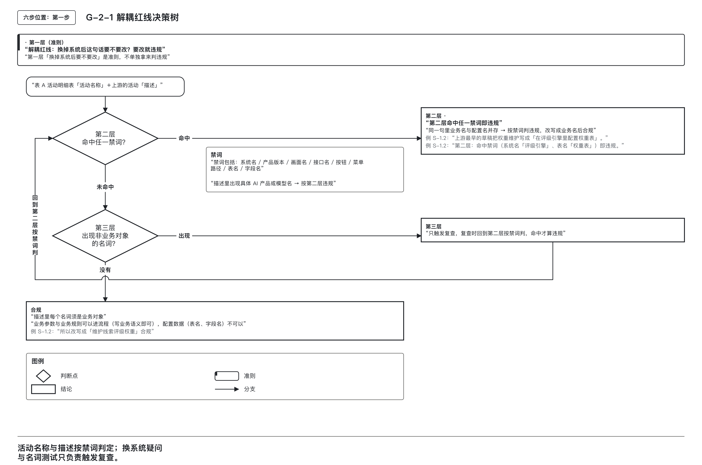
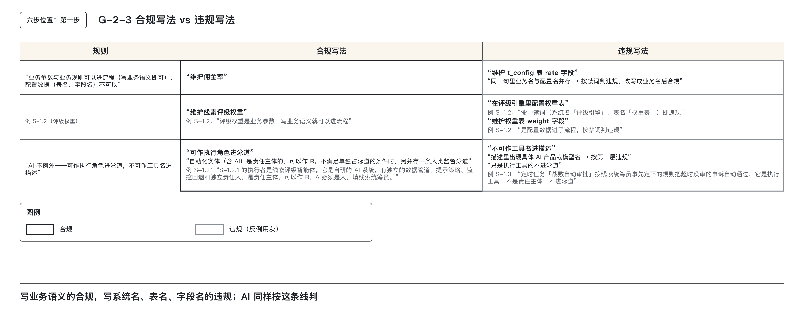
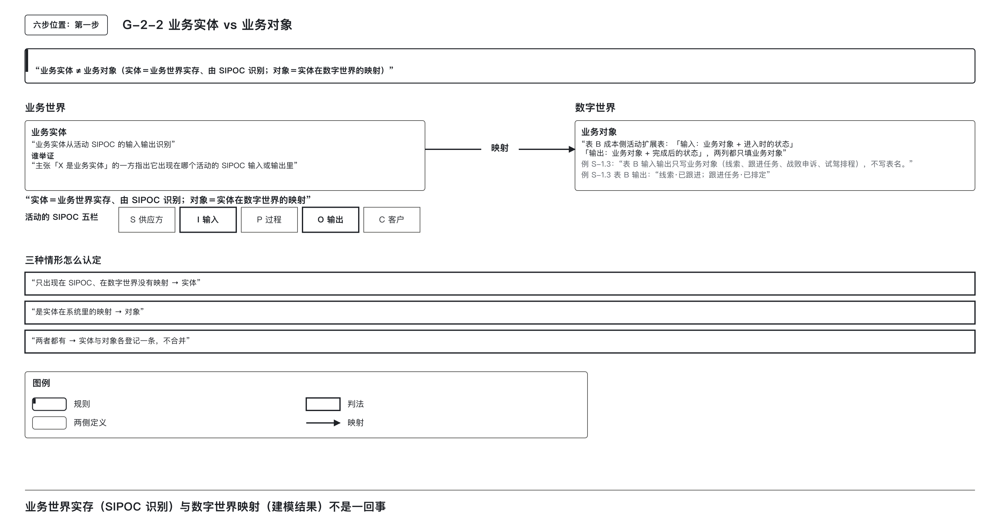
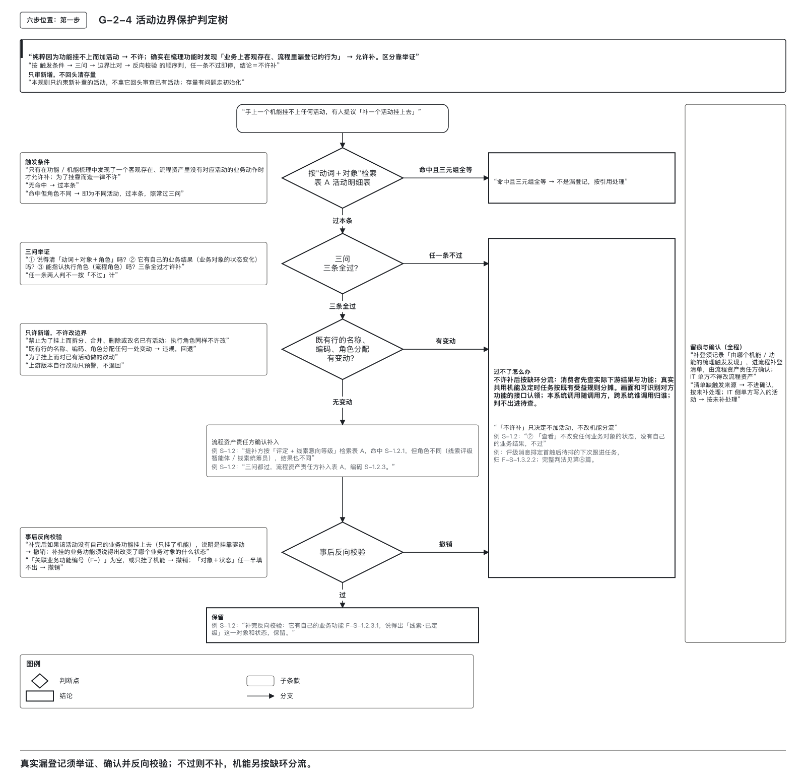

# 业务的归业务、系统的归系统：解耦红线

## 一、活动写业务语义，工具写在操作规程

业务流程的本质是描述真实世界中发生的、可被识别和追踪的业务动作。其稳定性不应依赖于支撑系统的更换或升级。一旦流程描述中嵌入了系统实现细节，如系统名、表名、字段名等，流程资产便失去了跨系统演进的独立性，系统更换时就得跟着改。

本篇给出活动名称、描述和补登的判断方法。活动名称与描述都须经过“解耦红线”检验，任何违反者均不得进入流程资产。

### 学习目标

完成本篇后，能够：

1. 准确说出解耦红线的判定逻辑，并运用三层判法对一句活动描述进行合规性判断。
2. 区分业务规则、业务参数与配置数据，将违规写法改写为符合业务语义的合规表达。
3. 明确业务实体与业务对象的差异，正确填写表 B 的输入与输出列。
4. 判断自动化实体（含 AI）是否可作为执行角色进入泳道，并识别必须保留人类监督泳道的情形。
5. 严格遵循“不许为了挂功能而补活动”的七子条款，按顺序验证一条补登申请的成立条件。

---

### 红线准则：换掉系统后，这句话要不要改？

若答案为“要改”，则该描述已将实现细节嵌入业务流程，属于违规。此条用于引发警惕，但**不单独作为判定依据**。

### 第二层：禁词清单——客观判定标准

凡活动描述中出现以下任一名称，即判定为违规：

- 系统名  
- 产品版本  
- 画面名  
- 接口名  
- 按钮  
- 菜单路径  
- 表名  
- 字段名  

命中任意一项，立即违规，无需进一步分析。

> **示例**：  
> “在评级引擎里配置权重表” → 命中“评级引擎”（系统名）、“权重表”（表名），违规。  
> “维护 t_config 表 rate 字段” → 命中“t_config”（表名）、“rate”（字段名），违规。

### 第三层：名词测试——主观筛查机制

对描述中的每个名词，逐一判断其是否为**业务对象**。若非，则触发复查，需返回第二层检查是否命中禁词。

- 若命中禁词 → 违规  
- 若未命中 → 可能合规，但须说明该名词对应的业务对象

> **关键点**：第三层仅用于提醒与复核，不直接下“违规”结论。

---

### 规则、参数与配置分别怎样写

| 类别 | 说明 | 是否可进入流程 | 写法要求 |
|------|------|----------------|----------|
| 业务参数（业务对象） | 由业务方决定取值的真实存在物，如佣金率、评级权重、阈值等 | 可以 | 使用业务名称书写，如「维护佣金率」「调整线索评级权重」 |
| 业务规则（决策逻辑） | 决策判断的逻辑条件，如“近期有到店意向的线索记 A 级” | 可以，但不单列活动 | 作为活动属性管理，不独立成活动 |
| 配置数据 | 实现层面的存储结构，如某表某字段、某配置项 | 不可以 | 必须改写为所代表的业务参数或规则 |

### 合规与违规对比

| 描述 | 分析 | 结论 |
|------|------|------|
| 维护佣金率 | 佣金率是业务参数，属业务对象，无系统名/表名/字段名 | 合规 |
| 在评级引擎里配置权重表 | 命中“评级引擎”（系统名）、“权重表”（表名） | 违规 |
| 维护佣金率（t_config.rate） | 虽然括号内含配置信息，但整体描述中出现“t_config”（表名） | 违规 |
| 维护线索评级权重 | 仅使用业务名称，无任何实现痕迹 | 合规 |

> **教学案例走法**：原“在评级引擎里配置权重表”因命中系统名与表名，判定违规。上游修改为“维护线索评级权重”后，该动作用于独立活动 S-1.2.2，它被初评与定级两处读取，由线索统筹员维护，独立成 S-1.2.2。是否独立看数据流向，不能仅凭专人维护；只给本活动使用的参数是内部一步，具体判法见第 ④ 篇。评级规则作活动属性，不单列活动。

---

工具和操作顺序写在操作规程，流程图和活动明细表只写业务行为。活动的身份是动词、对象、执行角色组成的三元组；把系统或画面名称带进去，既会让不同人认不出同一活动，也会让活动之下的关联和成本跟着系统变更而改动。反过来，不能为了给软件机能找位置而造活动，真漏登的业务动作须按补登规则举证。

流程资产是上游流程建模方交付的流程图与活动明细表。活动明细表在本系列称表 A，交付后成本侧不改列；成本所需字段另写表 B（成本侧活动扩展表）。下钻是沿子流程、活动、业务功能、机能逐层找到对应的那一行，并记录找到哪一层。业务功能是可以单独指认的业务结果，机能是软件规模登记单元。

| 当前情况 | 先读 |
|---|---|
| 活动名称或描述含系统、画面、按钮或表名 | 本节红线判定 |
| 维护参数是否写成配置数据 | 本节参数分类 |
| 表 B 输入输出应填实体还是对象 | 第二节实体与对象 |
| AI、机器人、自动任务能否进入泳道 | 第二节自动化角色 |
| 机能找不到活动，准备补登 | 第三节补登条件 |

| 步骤 | 问题 | 结论 |
|---|---|---|
| 第一层：准则 | 换掉系统后这句话要不要改 | 引起疑问，不单独判违规 |
| 第二层：禁词 | 有没有系统名、产品版本、画面名、接口名、按钮、菜单路径、表名、字段名 | 命中任一即违规 |
| 第三层：名词测试 | 每个名词是否业务对象 | 有疑问回到第二层复查，命中禁词才违规 |
| 判定材料 | 表 A 活动名称，以及上游展开编辑面板中的活动描述 | 描述不属于表 A 的列，同样须守红线 |

主张合规的一方，应指出每个名词对应的业务对象。第一层和第三层都有主观成分，只负责引起疑问和复查；第二层才下违规结论。

业务参数写参数本身，不加“表”字；业务名和配置名混写也按禁词处理。主张它是业务参数或规则的一方，须指出对应业务对象或决策逻辑。“维护权重表 weight 字段”仍然违规。

> 图 G-2-1　疑问和名词测试都需回到禁词检查，命中八类实现名称才判违规。

> 图 G-2-3　佣金率、评级权重按业务名称书写；表名、字段名与具体产品名称不写入活动描述。

这些名称和编码取自汽车经销商销售线索跟进教学案例，只供演示，不是各项目的标准值。“在评级引擎里配置权重表”已在正式发布前由上游改正。

## 二、对象怎样填，自动化角色怎样判

表 B 的输入输出写数字世界的对象，执行角色则按责任主体判定。两项分别核查。

### 业务实体与业务对象的识别与登记规则

SIPOC 用 Supplier、Input、Process、Output、Customer 五栏描述活动，分别是供应方、输入、过程、输出、客户。输入输出中的物体或概念用于识别实体。

业务实体是业务世界中真实存在的物体或概念，存在于活动的 SIPOC 输入或输出之中。业务对象是该实体在信息系统中的数字化表达，是信息建模的结果。二者不可混同，否则将导致后续成本归属与功能判定路径断裂。

**判定表**

| 情形 | 认定 | 登记 |
|---|---|---|
| 只出现在 SIPOC 中，数字世界没有映射 | 业务实体 | 不进入表 B 输入输出列 |
| 是某个业务实体在系统中的映射 | 业务对象 | 表 B 输入输出列写「对象·状态」 |
| 两者都有 | 实体与对象各登记一条，不合并 | 表 B 只写对象那一条 |
| 举证 | 主张「X 是业务实体」的一方指出它出现在哪个活动的 SIPOC 输入或输出中 | 不适用 |

以汽车经销商场景为例：展厅内停放的试驾车是业务实体；车辆管理系统中“试驾车占用”记录是其业务对象。客户签署的试驾协议是业务实体；系统中状态为“已签署”的试驾协议记录是其业务对象。

表 B 的输入与输出列仅填写业务对象及其状态，如「试驾排程·已预约」「线索·已跟进」，不得填写表名、字段名或实物描述。此规定保障了“谁的输出是谁的输入”比对的口径一致性。若实体与对象混淆，将无法沿“数据对象→业务实体→活动 SIPOC”路径进行第 ⑩ 篇的平台功能判定，只能依赖主观记忆判断，结果不可复现。

名词测试用于验证描述中的名词是否为业务对象。若非，则须返回第二层检查是否命中禁词。第三层仅为筛查机制，不直接下违规结论。

> 图 G-2-2　业务实体从活动输入输出中识别；表 B 填写它在数字世界映射出的业务对象及状态。

---

表 A 的列头是流程角色，任务型活动按 RASCI 填分工：R（Responsible，执行）实际做事；A（Accountable，问责）对结果担责；S（Support，支持）配合执行；C（Consulted，咨询）事前征询；I（Informed，知会）事后告知。

### 自动化实体能否作执行角色

随着流程自动化程度提升，规则引擎、机器人流程自动化、AI 智能体、定时任务等逐渐承担执行职责。但其是否可作为执行角色进入 BPMN（Business Process Model and Notation，业务流程模型与标记法）的泳道（流程图里按角色划分的长条），需依据三抽象层进行判断：

- **角色层**：回答“谁负责”，责任主体可以是人或具备自主决策能力的自动化实体。
- **工具层**：回答“用什么”，具体软件产品或模型仅为执行手段，不进入泳道。
- **编排层**：回答“流程如何运行”，工作流引擎、流水线本身是流程定义，不能同时是参与者。

判定一个自动化实体是否可作执行角色，按以下顺序提问：

1. 它是流程定义或编排引擎本身吗？  
   - 是 → 不进入泳道  
   - 否 → 进入第 2 步

2. 它是责任主体（自主决策、有异常处理机制），还是执行工具？  
   - 责任主体 → 可作 R（Responsible），进入第 3 步  
   - 执行工具 → 不进入泳道，写在操作规程中

3. 是否满足单独占泳道的条件？（任务确定、结果可自动验证、历史可靠率达标；具体门槛另有规定，本篇不展开）  
   - 满足 → 可单独作泳道角色  
   - 不满足 → 必须并存一条人类监督泳道

**始终要求**：A（Accountable，问责）角色必须为人。R 问的是“谁来做”，自动化实体可承担；A 问的是“出了问题谁担责”，需具备判断力与权威，只能由人类角色承担。

此外，活动名称或描述中禁止出现具体的 AI 产品名或模型名。此类名称属于第二层禁词（系统名、产品版本），一经命中即判定违规。允许使用角色化命名，如「线索评级智能体」，不能写具体产品名或模型名。

**判定表**

| 顺序 | 问题 | 是 | 否 |
|---|---|---|---|
| 1 | 它是流程定义或编排引擎本身吗？ | 不进入泳道 | 到 2 |
| 2 | 它是责任主体（自主决策、有异常处理），还是执行工具？ | 责任主体：可作 R，到 3 | 执行工具：不进入泳道，在操作规程中写 |
| 3 | 满足单独占泳道的条件吗？ | 可单独作泳道角色 | 可作泳道角色，但并存一条人类监督泳道 |
| 始终 | 填 A 的角色格 | 必须是人类角色 | 不适用 |
| 始终 | 描述中出现 AI 产品名或模型名 | 按第二层禁词违规 | 不适用 |

**教学案例走法**：

- 在线索评级子流程中，S-1.2.1「评定线索意向等级」的执行者为「线索评级智能体」。它是自研 AI 系统，具备独立数据管道、提示策略、监控回退机制与责任方，属自主决策型责任主体，承担 R；A 落在「线索统筹员」列。因未满足单独占泳道条件，流程上并存一条人类监督泳道：线索统筹员对初评结果定级，对应活动 S-1.2.3。
  
- 在门店线索跟进子流程中，定时任务「战败自动审批」按线索统筹员预先设定的规则自动通过超时未审的申诉。该任务自身不作决策，仅按规则执行，属执行工具，不进入泳道；S-1.3.5 的 R 仍落在「线索统筹员」列。

---

## 三、什么时候真能补活动：七子条款与判定流程

业务流程资产的完整性，依赖于对真实业务动作的准确记录。当梳理功能或机能时发现某项客观存在的业务行为在流程中未登记，允许补登；但为挂靠系统机能而虚构活动，坚决禁止。补登须由提补方举证，并经流程资产责任方确认。

### 3.1 发现漏记才补登

第 ⑤ 篇、第 ⑥ 篇分别把业务功能和机能逐层挂到活动上。补登活动的前提是：**在功能或机能梳理过程中，发现一个真实存在、但流程资产中尚未登记的业务动作**。若该行为仅因系统结构导致无法挂接，便强行新增活动以“找位置”，属于用实现逻辑扭曲业务事实，违背流程资产独立性原则。

虚设活动一旦进入流程，后续所有功能、机能、成本都将沿此虚设活动归集，历史数据不可逆地被污染。更隐蔽的风险在于，流程从此不再反映真实业务流，而变成“系统里有什么就有什么”的产物。

因此，补登须依据需通过严格举证才能成立的例外操作。举证责任由提补方承担，七个子条款分别规定补登条件、确认、后续去向和适用范围。

---

### 3.2 七个子条款

消息消费者是收到消息后继续处理的程序；事件消费是一条消息被多方收到、各自继续处理的那类；定时任务由时间启动。这些类型只说明触发与处理方式，消费者的业务归属仍须核对实际下游结果。

| 子条款 | 内容 |
|--------|------|
| **触发条件** | 只有在功能或机能梳理中，发现了一个客观存在、流程资产中没有对应活动的业务动作时，才允许补；为了挂靠而造，一律不许 |
| **三问举证** | ① 能否说明「动词＋对象＋角色」？② 它有自己的业务结果（业务对象的状态变化）吗？③ 能否指认执行角色（流程角色）？三条全过才允许补 |
| **只许新增，不许改边界** | 禁止拆分、合并、删除或改名已有活动来给机能找挂靠；执行角色同样不许改。上游自行发版的例外见 3.3 节 |
| **留痕与确认** | 补登须记录「由哪个机能或功能的梳理触发发现」，进入流程补登清单，由流程资产责任方确认；IT 侧单方不得改流程资产 |
| **事后反向校验** | 补完后，若该活动没有自己的业务功能挂上来（只挂了机能），说明是挂靠驱动，撤销；所补的业务功能还须说明它改变了哪个业务对象的何种状态，说不出则撤销 |
| **过不了时的去向** | 不许补。补不上的，该机能按缺环分流处理：消息消费者与事件消费先查实际下游结果，归相应下游活动的业务功能；确实没有单一归属的共用机能才按受益活动分摊，定时任务按原有受益活动规则分摊；画面和认得出对方功能的接口要认领；本系统内调来的随调用方；对不上的进待查清单。与其他系统对接的，谁调用归谁。不强制认领，也不一律归入一类 |
| **只审新增，不回溯清存量** | 本规则只约束新补登的活动，不用它回溯审查已有活动 |

> **注释**：  
> - “流程补登清单”是专门登记补登申请的台账，每条申请一行。  
> - “缺环分流”指子流程、活动、业务功能、机能四级链路中某一环节缺失时，对该机能的处理路径。  
> - “受益活动”指该项机能实际服务到的那些活动。  
> - “待查清单”用于存放类型判不出、判定悬着的条目，关账前须清零。关账指期末封存这一期的账，之后不再改动。

---

### 3.3 各子条款为什么这样规定

#### 先核查发现来源
补登必须由一次具体的功能或机能梳理引出，并明确标注触发来源。这确保每一条补登都有可追查的业务依据，避免“无中生有”式的补录。  
- 若提补方无法说明是哪个功能或机能的梳理发现了该行为，则视为无证据支持，不予受理。  
- 在提出补登前，应先以「动词＋对象」为关键词检索已有活动：  
  - 若没有命中 → 本条通过，进入三问举证；  
  - 若命中且三元组完全一致 → 属于同一活动被多处引用，按引用处理（见第④篇）；  
  - 若命中但角色不同 → 是不同活动，本条通过，进入三问举证。

#### 三问举证：堵住三类典型错误
三问构成补登前的核心过滤器，分别针对“身份模糊”“结果虚化”“责任空心”三类问题：

1. **能否说明「动词＋对象＋角色」？**  
   堵住“说不清是什么”的问题。若三者任一缺失，该行为无明确身份，无法判断是否与已有活动重复或独立。  
   > *例如，缺少动词、对象或角色时，无法确定活动身份。*

2. **是否有自身的业务结果（业务对象的状态变化）？**  
   堵住“只是别人一步”的问题。若该行为不改变任何业务对象的状态，则仅为另一活动中的子步骤，不应独立成活动。  
   - 判法标准：该行为在表 B 中写出的「对象＋状态」，与同一子流程中某个已有活动的输出完全相同 → 判定为“只是别人的一步”，本问不过。  
   - 举例：若“查看评级结果”仅展示信息，未更新任何状态，则无自身业务结果。

3. **能否指认执行角色（流程角色）？**  
   堵住“找不到责任人”的问题。执行角色必须是流程角色，非岗位名。  
   - 自动化实体（含 AI）承担责任主体时可作执行角色，须指出作 A 的人类角色；不满足单独占泳道条件时，还须并存人类监督角色；  
   - 仅作为工具的“系统”“平台”“框架”等笼统名称，不能作执行角色；  
   - 两人判定结论不一致时，按“不过”计。  
   > *原因：补错代价远大于漏补。漏补可在下次梳理中补，补错则会导致后续对象挂错，影响成本归集与功能分析。*

#### 新增不能改写已有边界
对已有活动进行任何形式的修改以求挂靠——包括名称、编码、角色分配——均属违规。  
- 拆分、合并、删除、改名已有活动，本质是用实现逻辑重构业务流程。  
- 最隐蔽的是更改执行角色：活动名与边界不变，仅将 R 移至另一角色列，即可改变成本归属。  
- 上游发布新版本自行改动已有活动的名称或角色分配，不按本条回退：版本比对仅预警，报送流程资产责任方，成本侧不退回，表 B 按新名称所在的编码继续填写。

#### 谁记录，谁确认
- 补登申请须记录由哪个机能或功能的梳理触发，并录入流程补登清单。缺来源不进入确认，按“未补”处理。
- 流程资产责任方是一种职能，由哪个岗位担任，各组织自行确定。确认流程与人员安排属于项目实施事项，本系列不展开。  
- 必须由流程资产责任方确认，方可生效。  
- IT 侧单方写入的活动，按“未补”处理，不进入流程资产。

#### 补完后检查自身结果
补登后仍需进行反向验证：
- 若补完后该活动**没有自己的业务功能挂上来**（仅挂了机能），说明当初是为了给机能找位置，应撤销。  
- 若所补的业务功能无法说明其改变了哪个业务对象的何种状态，也应撤销。  

#### 过不了时的去向：不补 ≠ 无处理
不能补登时，登记“未覆盖”，不得反过来改流程。“不许补”不等于该机能无需处理，仍按缺环分流规则确定去向：
- **消息消费者与事件消费**：先查其实际下游结果，归入相应下游活动的业务功能；  
- **确实无单一归属的共用机能**：按受益活动分摊；  
- **定时任务**：按原有受益活动规则分摊；  
- **画面与可识别对方功能的接口**：必须有人认领；  
- **本系统内调用的**：随调用方归属；  
- **与其他系统对接的**：谁调用归谁；  
- **类型判不出的**：进入待查清单，关账前清零。

> **特别强调**：  
> - 不得因“是消息消费者”就直接认定为共享，必须查实际下游结果；  
> - 不能因“是定时任务”就自动归入某类，必须遵循原有规则；  
> - 不强制认领，也不一律归入一类。

#### 只审新增，不回溯清存量：划定适用范围
本规则仅适用于**补登清单中的新增行**。  
- 已有活动的登记问题，不通过本规则回溯审查。  
- 多数已有活动当初为何如此登记，已无从考证。  
- 存量问题统一通过一次性初始化处理（见第⑧篇），不在此处翻查。

---

### 3.4 按顺序判定

F 编号是业务功能的编号，以 `F-` 开头，例如 F-S-1.2.3.1。

补登申请的判定必须按以下顺序逐项执行，任一环节“不过”，即停止本次申请，结论为“不许补”。其中，“只许新增、不许改边界”不过时，还需将已有活动上的改动回退。

| 顺序 | 看什么 | 不过的情形 | 结论 |
|------|--------|-------------|-------|
| 1 | 流程补登清单「触发来源」；按「动词＋对象」检索已有活动 | 缺少触发来源；命中且三元组全等（按引用处理） | 不许补，或转引用 |
| 2 | 三问：三元组、对象状态变化、执行角色 | 任一问不过；任一问两人判定不一致 | 不许补 |
| 3 | 对已有活动所作的挂靠驱动修改动：名称、编码、角色分配前后比对 | 任何一处变动 | 违规，回退；上游版本自行改动只预警，不退回 |
| 4 | 表 B「关联业务功能编号」和「对象＋状态」 | 没有 F 编号，或只挂了机能；对象或状态任一半填不出 | 撤销 |
| 全程 | 补登清单留痕，流程资产责任方确认 | IT 侧单方写入 | 按未补处理 |
| 之后 | 不许补的机能 | 不适用 | 按缺环分流处理 |
| 范围 | 只看补登清单中的新增行 | 不适用 | 已有活动不回溯审查 |

举证方是提补方；审核方是流程资产责任方，IT 侧不得单方判定。反向校验发生在补入表 A 之后，此时“不许补”落实为撤销。

> 图 G-2-4：补登先举证客观业务行为，再核查三问和既有边界，补完后检查自身业务功能；不过时按缺环分流处理。
---

### 3.5 两个补登申请

#### 案例一：成功补登——“评定＋线索意向等级＋线索统筹员”

- **背景**：在梳理“线索评级子流程”时，发现“评级复核页 复核操作区”的操作行为未在流程中登记。
- **三元组检索**：以“评定＋线索意向等级”为关键词检索，命中 S-1.2.1，但角色不同（S-1.2.1 执行角色为“线索评级智能体”，此处为“线索统筹员”），故为不同活动，本条通过。
- **三问举证**：
  1. 三元组“评定＋线索意向等级＋线索统筹员”可说明 → 通过；
  2. 业务结果为“线索由‘已初评’变为‘已定级’”，与 S-1.2.1 输出“已初评”不同 → 有自身业务结果 → 通过；
  3. 执行角色可指认 → 通过。
- **判定结论**：三问全过，流程资产责任方确认补入，编码 S-1.2.3。
- **事后反向校验**：该活动挂上业务功能 F-S-1.2.3.1，能说明“线索·已定级”状态变更 → 保留。

> **附加说明**：该活动就是第二节所述的人类监督泳道；案例中的智能体不满足单独占泳道条件，须并存人类监督角色。

#### 案例二：拒绝补登——“查看线索评级结果”活动

- **背景**：有人提议补一个“查看线索评级结果”的活动，执行角色为“线索跟进员”，以便将“排定下次跟进任务”这一消息消费者挂上去。
- **三问举证**：
  1. 三元组“查看＋线索评级结果＋线索跟进员”可说明 → 通过；
  2. 此处只为给消费者挂靠而提出“查看”，没有自身的对象状态变化 → 不过；
  3. 执行角色可指认 → 通过。
- **判定结论**：三问中有一问不过，不许补。

> **重要澄清**：  
> - 拒绝补“查看”活动，**不等于**“排定下次跟进任务”已被证明为共享。  
> - 本例改用门店排程：首触记录已完成，下一次跟进任务尚未排定，此时最终定级消息到达。消费者完成的是这次首触后的跟进安排，归已有 S-1.3.2 的功能 F-S-1.3.2.2。  
> - 活动输入补充评级结果，输出仍是“跟进任务·已排定”。人工与消息是替代入口，不能各写一次任务；后续任意评级变化不因此重新执行首触。  
> - 不能因它是消息消费者就直接按“受益活动分摊”处理。

初始化覆盖哪些历史记录、由谁实施、何时完成，属于项目实施事项，本系列不展开。

## 四、审一张流程草稿

拿线索评级的上游草稿逐项审查，分别处理参数、执行角色、输入输出和补登。

---

### 1. 权重表配置如何改写为合规业务描述？

草稿中“在评级引擎里配置权重表”这一项，因涉及系统名与表名，触发第二层禁词检查，判定违规。  
根据业务参数与配置数据的区分原则，该行为本质是维护**评级权重**这一业务参数，而非操作底层数据结构。  
应将其改写为业务语言：“维护线索评级权重”。  
此改写后，需判断其是否独立成活动：由于该权重被初评、定级两处复用，由线索统筹员维护，作为其他活动的输入数据，具备独立性，故应单独登记为一个活动。若只给本活动自己用，则仅为内部步骤，不独立成行；判据见第 ④ 篇。

---

### 2. AI执行者如何处理才能合规进入泳道？

草稿中将初评活动的执行者写为具体模型名称（此处假设草稿如此填写，教学案例原稿没有这一笔），违反禁词规则，属系统名类违规。  
需重新评估自动化实体的可入泳道条件：  
- 该AI系统具备独立数据管道、监控回退机制及明确责任方，构成责任主体；  
- 因此可作R角色，但必须以业务角色命名，不得暴露模型名，应写为“线索评级智能体”；  
- A角色须填写实际人类监督者，即“线索统筹员”；  
- 该智能体不满足“单独占泳道”条件，因此必须并存人类监督泳道，不可省略。

---

### 3. 表B中的输入输出如何填写？实体与对象如何区分？

填写表B时，输入与输出均应采用**业务对象加状态**的表达方式，禁止使用库表名或虚构概念。  
- 初评活动的输入为：「线索·已建档；评级权重·已生效」  
- 输出为：「线索·已初评」  

这里填写业务对象加状态，不填库表名，也不填“客户意向”这种只在业务世界中指称实体的说法。输入输出统一口径，才能逐项比对上下游。

---

### 4. 机能无法挂靠时，如何判定补登与分流？

在梳理机能阶段，发现两个缺失点：  
- 画面“评级复核页 复核操作区”无对应活动；  
- 初查未找到消费者“排定下次跟进任务”对应的活动。

对两者分别启动补登判定：

#### （1）“评级复核页 复核操作区”补登申请  
- 三问举证：  
  ① 可说明“评定＋线索意向等级＋线索统筹员” → 通过；  
  ② 有自身业务结果：“线索由‘已初评’变为‘已定级’”，与已有活动输出不同 → 通过；  
  ③ 执行角色可指认 → 通过。  
- 结论：三问全过，允许补登，编码为S-1.2.3。  
- 该活动同时构成人类监督泳道，因为智能体不满足独占泳道条件，须保留这条人类监督泳道。

#### （2）“查看线索评级结果”补登申请  
- 三问举证：  
  ① 三元组“查看＋线索评级结果＋线索跟进员”可说明 → 通过；  
  ② 无自身业务对象状态变化，仅为信息展示，不改变任何状态 → 不过；  
  ③ 执行角色可指认 → 通过。  
- 结论：第②问不过，不许补登。  
- 该消费者不能凭名称或类型直接认定归属，必须先查明其实际下游结果。  
- 本例现采用门店排程：首触已记录、下一次跟进尚未排定时，最终定级消息到达，消费者排定该次首触后的下一次跟进任务。它归既有 S-1.3.2 的 F-S-1.3.2.2，不补“查看”或“同步”活动。人工与消息为替代入口，不能重复写任务。期次-示例-2新建消息入口，原人工入口当期未改，不重复计量；消息已含客户标识及排程必要信息，不额外读取或外发，E评级消息、W跟进任务共2 CFP，发生额100.00直接归该功能。

---

这次审查中，解耦红线先定位实现细节；参数和自动化角色规则给出改法；实体与对象的区别使表 B 能比对；补登规则防止为了挂接改写业务边界。各项分别核查，前一步改过也不能替代后一步判断。

## 五、正反例与练习自测

### 正反例

**解耦红线**

| | 例子 | 判法与结论 |
|---|---|---|
| 正例 1 | 门店线索跟进子流程的六个活动，如「更新首触跟进结果」「战败申诉审批」 | 活动名称中没有系统名、画面名、按钮名，第二层不命中，合规 |
| 正例 2 | 「维护线索评级权重」 | 更换系统不必改，名词「线索评级权重」是业务对象，合规 |
| 反例 1 | 活动名写成「在某业务系统的某页面点击保存」 | 命中系统名、画面名、按钮，第二层违规。这样写，系统一换流程就要重写，活动身份也跟着改变 |
| 反例 2 | 活动描述中带有一串菜单路径，说明「从哪个菜单进入」 | 命中菜单路径，违规。导航路径属于操作规程，不属于流程 |

**业务参数、业务规则与配置数据**

| | 例子 | 判法与结论 |
|---|---|---|
| 正例 1 | 「维护线索评级权重」独立成活动 S-1.2.2 | 评级权重是业务参数，用业务名书写，合规 |
| 正例 2 | 评级规则（何种条件记何种等级） | 业务规则，作为活动属性，不单列活动 |
| 反例 1 | 流程中写「修改某配置表的某字段」 | 配置数据进入了流程，按禁词（表名、字段名）违规；改写成它所代表的业务参数名 |

**业务实体与业务对象**

| | 例子 | 判法与结论 |
|---|---|---|
| 正例 1 | 表 B 中 S-1.4.1 的输出写「试驾排程·已预约」 | 所填的是业务对象加状态，可以用来与下游活动的输入比对 |
| 正例 2 | 门店线索跟进子流程的表 B，输入输出只写线索、跟进任务、战败申诉、到店邀约 | 只写业务对象，不写表名 |
| 反例 1 | 表 B 的输入、输出两列，有的行写表名，有的行写实物描述 | 口径混用，下游比对「谁的输出是谁的输入」时无法对应，后续的共用判定和平台判定都会中断 |

**AI 不例外**

| | 例子 | 判法与结论 |
|---|---|---|
| 正例 1 | S-1.2.1 的 R 落在「线索评级智能体」列，A 落在「线索统筹员」列 | 智能体是责任主体，可作 R；A 是人 |
| 正例 2 | 线索评级智能体不满足单独占泳道的条件，并存人类监督泳道 S-1.2.3 | 不满足单独占泳道的条件时必须并存人类监督泳道 |
| 正例 3 | 定时任务「战败自动审批」 | 按规则执行、自身不决策，是执行工具，不进入泳道 |
| 反例 1 | 活动描述中写了某个具体的大模型产品名 | 按第二层禁词违规。流程中写角色，不写工具名 |
| 反例 2 | 把 A 填进 AI 智能体的角色格 | A 必须是人类角色，A 要填在担责的人类角色列 |

**活动边界保护**

| | 例子 | 判法与结论 |
|---|---|---|
| 正例 1 | 画面「评级复核页 复核操作区」触发补登，三问为过/过/过 | 流程资产责任方确认，补入 S-1.2.3；反向校验有 F-S-1.2.3.1，保留 |
| 正例 2 | 为消费者「排定下次跟进任务」提议补「查看线索评级结果」 | 第②问不过，不许补；查明首触后尚未完成的排程结果，归已有 S-1.3.2 的 F-S-1.3.2.2，不默认共享 |
| 正例 3 | S-1.3 流程图上的「取消试驾排程」与 S-1.4.2 三元组全等 | 是同一活动被引用，不新建（这是第 ④ 篇的引用判定；检索命中且三元组全等时同样如此处理） |
| 反例 1 | 为了给一个挂不上的机能寻找去处，补一个「查看某某结果」类的活动 | 没有自身的业务结果，是挂靠驱动。这样补登，后面的功能和成本会一串挂错 |
| 反例 2 | 为了让机能挂上去，把已有活动的执行角色换成另一个角色 | 已有活动不回溯修改。活动名没动，成本却更换了归属方，须回退 |

---

### 实施参数

本篇没有新增组织自行确定的数字。独占泳道的具体条款与门槛另有规定，不属于本系列的组织参数。

### 练习

取一条真实需求，或一张业务流程图，按本篇的判定表走一遍：

1. 列出图上每个活动的名称和描述，逐句过解耦红线的三层：先问更换系统后要不要改，再查禁词，再做名词测试。命中禁词的，改写成业务语义。
2. 找出流程中出现的参数和规则，逐个归类为业务参数、业务规则或配置数据。
3. 选取一个活动，写出它 SIPOC 的输入和输出，从中认出业务实体，再写出表 B 应填的「对象·状态」。
4. 流程中若有 AI、机器人或自动任务，按第二节自动化角色判定表走一遍：它是编排引擎、执行工具还是责任主体？A 所填的是不是人？
5. 选取一次「功能挂不上活动」的情形，按活动边界保护的顺序写出三问的结论，判定当初是否应当补登。

完成后，由另一人独立判定三问。凡两人判定不一致的一问，按规则计为「不过」，并回头检查是哪一句举证没写清楚。

---

### 自测

1. 说出解耦红线的一句话，并列出第二层的禁词类别。  
2. 判定并改写：「在评级引擎里配置权重表」。  
3. 区分：佣金率、「到店意向与等级的对应规则」、某配置表的 rate 字段，各属业务参数、业务规则还是配置数据？哪些可以进入流程？  
4. 比较业务实体和业务对象，并指出表 B 的输入、输出两列填哪一个。  
5. 判定：一个 AI 智能体自主给线索初评等级，有异常回退机制，不满足单独占泳道的条件。它能否作 R？A 填谁？流程上还须增加什么？  
6. 判定：一个定时任务按人事先定下的规则自动通过超时申诉。它是否进入泳道？  
7. 列出活动边界保护的判定顺序，并判定：有人为案例中的「排定下次跟进任务」消费者提议补「查看评级结果」，三问结论是「过/不过/过」，能否补登？该机能接下来如何处理？  
8. 举例说明为何已有活动不回溯修改，连执行角色也不许改。  
9. 判定：三问中的第①问，两个判定人一个判过、一个判不过，结论是什么？

---

### 答案要点

1. 换掉系统后，这句话要不要改？要改就违规。禁词：系统名、产品版本、画面名、接口名、按钮、菜单路径、表名、字段名。  
2. 违规：第二层命中系统名「评级引擎」和表名「权重表」。改写成「维护线索评级权重」。  
3. 佣金率是业务参数，对应规则是业务规则，两者用业务语义书写都可以进入流程（规则作为活动属性）；rate 字段是配置数据，不能进入流程。  
4. 业务实体是业务世界中的实存，从活动 SIPOC 的输入、输出中识别；业务对象是实体在数字世界中的映射，是建模结果。表 B 的输入、输出两列填业务对象加状态。  
5. 能作 R（它是责任主体）；A 必须填一个人类角色；不满足单独占泳道的条件，须并存一条人类监督泳道。  
6. 不进入。它按规则执行、自身不作决策，是执行工具，写在操作规程中；该活动的 R 仍是人类角色。  
7. 顺序是触发条件、三问举证、只许新增且不许改边界、事后反向校验，任一条不过即停止。「过/不过/过」不许补。本例查明消费者完成的是首触已记录、仍待排定的下一次跟进安排，归已有 S-1.3.2 的 F-S-1.3.2.2；人工与消息为替代入口，不能重复写任务，不能按消费者类型认定无归属或共享。  
8. 例如把某活动的 R 从甲角色换成乙角色，活动名和边界都没动，但挂在它上面的成本随角色换了归属方。这种改动最难被发现。  
9. 按「不过」计，结论为不许补。

---

### 本篇依据

本节供追溯用，不要求阅读。

- 解耦红线的三层判法、业务规则与业务参数是两类对象：CM-ADR-013 §3.4、§4。  
- 业务实体与业务对象的区分：CM-ADR-007 §4.4.2（D3 裁决）。  
- 自研 AI 系统与既有功能内嵌 AI 特性两行：CM-ADR-008 §4.3。  
- 角色层、工具层、编排层三层分离，自动化实体进入泳道的判定顺序、单独占泳道的条件、A 必须是人：参考库 AD-011，及 R1～R5 角色抽象度分级。  
- 活动边界保护的七个子条款没有 ADR 条款直接承载，属教学侧裁决。  
- 缺环分流的完整判法见第 ⑧ 篇；其中「与其他系统对接的，谁调用归谁」一项是本系列约定。  
- 补登确认环节的组织、初始化覆盖哪些历史记录：属项目实施事项，本系列不展开。  
- 各条判定由谁判、在哪判、谁举证、并列时怎么定：附录 B 及其附表 B-1。填写格式：附录 D。案例全表：附录 E。
