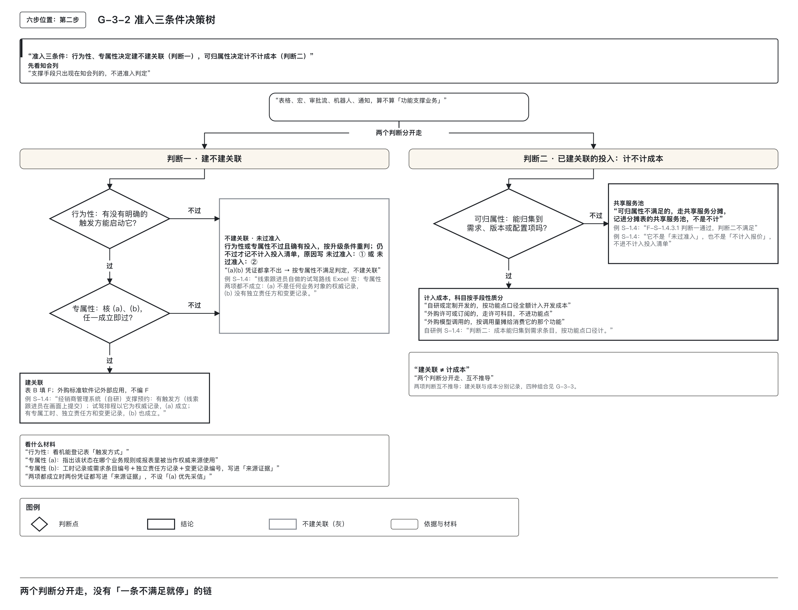
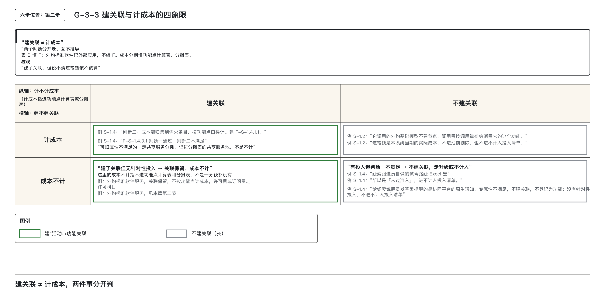
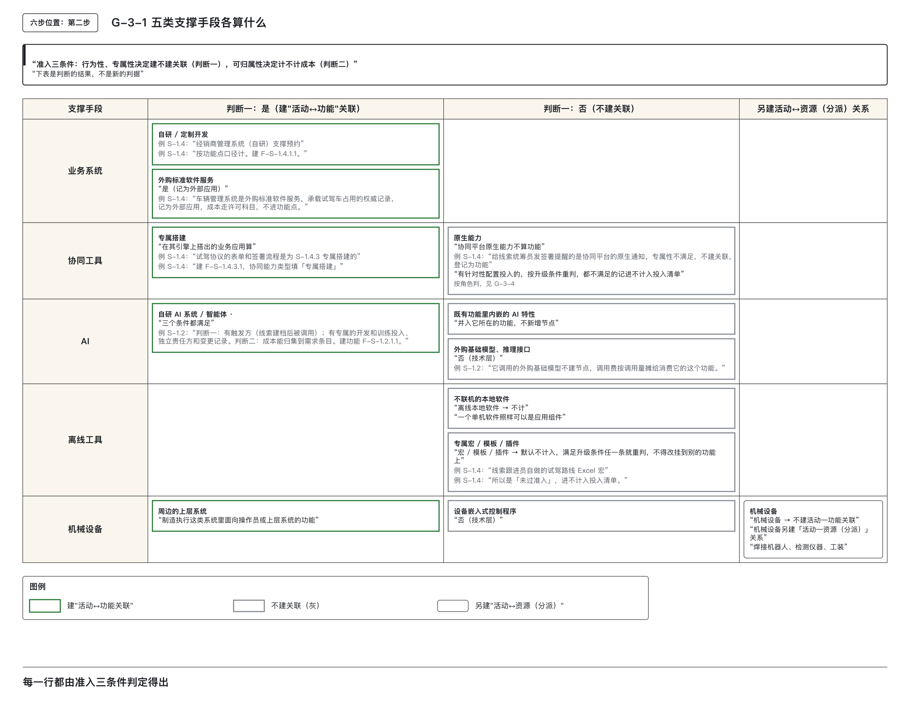
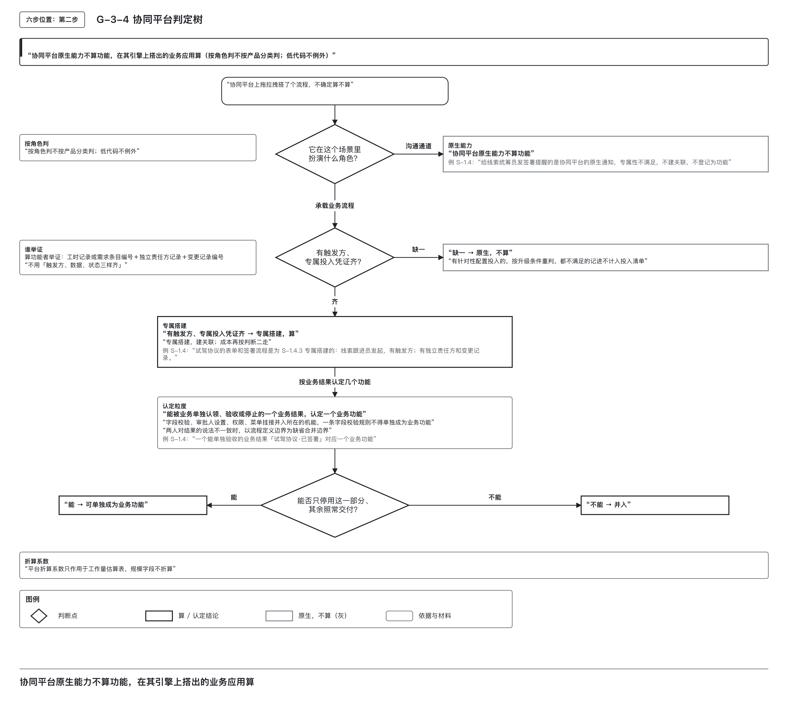

# 哪些支撑手段算「功能支撑业务」

> **副标题：电子表格是否计入？审批流是否计入？焊接机器人是否计入？一律计入，关联表就失去区分能力。**

本篇是模块一第③篇，讨论支撑手段能否建立“活动↔功能”关联，以及投入进入哪个科目。**支撑手段种类繁多，若统一判定“计入”，关联表将因冗余而失效；若统一判定“不计入”，真实投入又会遗漏。** 为此，本方法将判断拆分为两个独立步骤：

1. **建关联**：判断某支撑手段是否以软件行为、且专门地支撑了某个业务活动——这是架构层面的判定。
2. **计成本**：判断该手段的投入金额能否归集到可辨认的交付边界，如某个需求、版本或具体配置项——这是成本管理层面的判定。

两者分别判定，不能互相推导。第⑤篇主干规则“建关联 ≠ 计成本”的来源，即在此处确立。

---

## 一、先分开判断支撑关系和投入去向

### 学习目标

完成本篇后，能够：

1. 准确说出准入三条件（行为性、专属性、可归属性）各自的判定维度：前两条决定是否建立“活动↔功能”关联，第三条决定成本进入哪个科目。
2. 对任意一项支撑手段，分别判断是否应建立“活动↔功能”关联，以及其成本应归入哪个核算路径。
3. 区分协同平台的原生能力与在它之上搭建的业务应用，并依据业务结果认定后者包含几个独立业务功能。
4. 明确机械设备、离线软件、宏、模板、插件各自的处理方式，列出宏类对象升级重判的三个触发条件。
5. 判断仅以知会方式参与活动的工具是否触发准入判定。

---

### 按手段定位

建关联与计成本是两件事，必须分开判定。  
- **建关联**：问的是——该手段是否以软件行为、并且专门地支撑了这个活动。  
- **计成本**：问的是——其投入金额是否具备可归集性，能否收上来并记入本次交付的对象。

表中“关联”指在关联表中记录一行：“此活动由该项功能支撑”。

| 当前的支撑手段 | 初步判定 | 详细阅读 |
|----------------|----------|----------|
| 自研业务系统中的功能 | 建关联，按功能点计 | 第二节 |
| 外购的标准软件服务 | 建关联（记为外部应用），走许可或订阅科目 | 第二节 |
| 协同平台的消息、通知、群聊 | 不建关联，不计 | 第三节 |
| 在协同平台上搭建的审批流、表单 | 建关联；成本看能否归集 | 第三节 |
| 电子表格、文字处理这类离线软件 | 不建关联，不计 | 第四节 |
| 为离线软件做的宏、模板、插件 | 默认不计入，满足升级条件再重判 | 第四节 |
| 焊接机器人、检测仪器、工装 | 不建「活动↔功能」关联，另建「活动↔资源」关系 | 第四节 |
| 只以知会方式参与活动的工具 | 不触发判定 | 第四节 |

---

### 两种一律处理会漏掉什么

一个业务活动落地时，可能涉及多种支撑手段：自研或外购的业务系统、协同办公平台及其上的应用、AI模型与智能体、本地运行的电子表格、以及焊接机器人、检测仪器、工装等实体设备。

若**全部计入**，则几乎所有活动都会挂上“协同工具”作为支撑——因为每个活动都需通知某人，而通知必经某种协同手段。这将导致“活动↔功能”关联表迅速膨胀，真正为特定活动发生的专用投入被淹没在大量通用关联中，**关联表失去区分能力**，成本归属被稀释。

若**全部不计入**，则为某项活动专门开发的低代码审批流、定制化模型训练等真实投入将被忽略，造成成本漏报。

因此，单一标准无法适用。本方法采用双判断机制：
- **第一判断**：是否建立“活动↔功能”关联？——由行为性、专属性决定。
- **第二判断**：成本是否可归集？——由可归属性决定。

两个判断分别作答，不能由已经建立关联就推定计入成本，也不能由不按功能点计成本就删掉关联。第⑤篇的核心规则“建关联 ≠ 计成本”，正是基于本篇所立的准入三条件展开的日常操作基础。

---

## 二、准入三条件：两条管建关联，一条管成本路径

行为性、专属性、可归属性用于两个判断。前两个条件决定是否建立关联（判断一），第三个条件决定成本归集路径（判断二）。建立关联不要求三个条件同时通过，两者也不构成顺序阻断链。

### 2.1 判断一：建不建「活动↔功能」关联

机能是能被外部触发、用来登记软件规模的交付单位，例如一个画面、一个接口。

**行为性**：该手段是否以软件行为支撑某个业务活动？即是否存在明确的触发方能启动它。触发方式沿用第 ① 篇的四类，依据机能登记表的“触发方式”列填写：

- 用户操作 → “用户”
- 上游系统直接调用 → “服务间调用”
- 定时触发 → “调度器”
- 消息或事件到达 → “消息中间件”

点对点接收消息后处理的类型是消息消费者；广播消息由多方收到、各自继续处理的类型是事件消费。两类的触发方式都填“消息中间件”。外部系统将消息推入我方队列、由监听器处理的，归为“消息中间件”；外部系统直接调用我方接口的，归为“服务间调用”。具体归属以代码注解和部署配置为准。若无明确触发方，行为性不满足，不建关联。

**专属性**：该手段是否专门支撑此活动？满足以下任一项即可：

- (a) 承载该活动产出的权威业务状态或记录，且在某个业务规则或报表中被列为该状态的权威来源；
- (b) 为该活动发生过可辨认的专属开发、配置或训练投入，并具备独立责任方和变更记录。

两项为“或”关系，满足一项即可。仅凭(a)会漏掉有专属投入但不存权威数据的协同应用；仅凭(b)会漏掉无开发投入但承载权威状态的外购标准软件。二者合用，确保两侧不漏。

判定流程：先核(a)，再核(b)，任一成立即通过。两项均成立时，须同时提供凭证：
- (a) 指明权威状态所在业务规则或报表名称；
- (b) 提供工时记录或需求条目编号，附独立责任方记录与变更记录编号。

主张建关联的一方负责举证。若两项凭证均无法提供，则专属性不满足，不建关联。

**审核职责**：专属性由审核方最终判定。申请方自行证明易导致对象泛化，应避免。

当行为性和专属性均满足时，建立“活动↔功能”关联。纳入功能登记的填入表 B 的“关联业务功能编号（F-）”列；外购标准软件服务记为外部应用，不编 F 编号，按下节的说明处理。表 B 是成本侧另扩的活动表，按活动编码关联上游活动明细表。

> 图 G-3-2　行为性与专属性决定关联，可归属性决定成本路径；两项专属性证据满足其一即可。

> 图 G-3-3　关联与按功能点或分摊表计成本分别作答。外购标准软件服务可以保留关联，许可或订阅费另走许可科目。

### 2.2 判断二：成本进入哪个科目

可归属性决定成本路径，不决定是否建关联。

若成本可归集到可辨认的交付边界——如某需求、某版本或某个具体配置项——则按手段性质计入相应科目。只能按人头或期间平均分摊的，不满足这个条件。

- 自研或定制开发 → 按功能点全额计入开发成本；
- 外购许可或订阅 → 走许可科目，不进入功能点；
- 外购模型调用 → 按调用量摊给消费它的功能。

若无法归集到具体交付边界，则进入共享服务池：若干笔无法追溯至具体功能的成本合并记入，再按全盘业务CFP占比当期摊完，不逐活动追溯。

**关键说明**：
- 可归属性不满足 ≠ 不计成本。金额仍须在本期摊完，只是不挂到特定活动或功能上。
- 此条原出自信息技术运行支出算法，但本方法面向研发交付成本，故按研发交付逻辑重写。定制低代码应用按开发投入归集，按实例数计费不成立；若照搬旧规则，就会把这类应用误判为出局。
- 因此，可归属性仅用于判断成本路径，不影响关联建立。

### 2.3 两个判断分开走，不是一条“不满足就停”的链

三条件并非顺序阻断链。判断一仅看行为性与专属性，判断二仅看可归属性，各自独立进行。形成四种组合结果：

| 判断一（行为性、专属性） | 判断二（可归属性） | 结果 |
|--------------------------|--------------------|------|
| 过                       | 过                 | 建关联；成本按科目计（功能点、许可或调用量） |
| 过                       | 不过               | 建关联；成本进入共享服务池，按全盘业务CFP占比当期摊完 |
| 不过，但有针对性投入     | 不适用             | 不建关联；按升级条件重判，或进入不计入投入清单 |
| 不过，也没有针对性投入   | 不适用             | 不建关联，也没有投入要记 |

**特别说明第三行**：行为性或专属性不满足，且未满足升级条件（第四节）的投入，记入**不计入投入清单**，原因标注为`未过准入：①`或`未过准入：②`。可归属性不满足的投入不进入此清单，而进入共享服务池。两张表不得混用。

**反向情形亦重要**：建立关联 ≠ 计成本。例如外购标准软件服务满足专属性(a)，承载权威业务状态，但我方没有针对它的开发或配置投入，则关联保留，但成本走许可科目，不进入功能点。这正是“建关联 ≠ 计成本”的真实体现。

---

### 2.4 五类支撑手段判定结果汇总

下表为常见支撑手段的判定结果，每行均基于三条件推导得出，非新判据。

| 支撑手段 | 判断一（建关联） | 判断二（成本去向） | 满足的条件 |
|----------|------------------|--------------------|------------|
| 业务系统 · 自研或定制开发 | 是 | 按功能点全额计入开发成本 | 三个条件都满足 |
| 业务系统 · 外购标准软件服务 | 是（记为外部应用） | 许可或订阅科目，不进入功能点 | 有触发方＋承载权威记录 |
| 协同平台原生能力（即时消息、通用通知、群聊、会议） | 否 | 不计 | 专属性不满足 |
| 协同平台上搭建的业务应用（低代码应用、审批流、表单） | 是 | 能归集的按功能点计；归集不到的进入共享服务池 | 有触发方＋专属投入 |
| 自研 AI 系统或智能体（独立数据管道、提示策略、监控回退、独立责任方） | 是 | 计入 | 三个条件都满足 |
| 既有功能中内嵌的 AI 特性 | 否（算它所在功能的属性） | 并入所在功能，不新增节点 | 不适用 |
| 外购基础模型、推理接口 | 否（技术层） | 调用费按调用量摊给消费它的功能 | 不适用 |
| 不联机的本地软件（电子表格、文字处理、计算器、设计软件） | 否 | 不计 | 专属性不满足 |
| 为它们做的专属宏、模板、插件 | 否（没有独立的服务生命周期） | 默认不计入；满足升级条件的升级重判 | 见第四节 |
| 机械设备（机器人、检测仪器、工装） | 否 | 资本性支出，不是软件成本 | 另建活动↔资源（分派）关系 |
| 设备嵌入式控制程序 | 否（技术层） | 不计 | 不适用 |
| 制造执行这类系统中面向操作员或上层系统的功能 | 是 | 计入 | 三个条件都满足 |

---

#### 重点说明

- **外购标准软件服务**：虽不计功能点，但必须建关联，因其承载权威业务状态，满足专属性(a)。登记为“外部应用”，不编功能编号，成本走许可科目。教学案例中车辆管理系统为外购标准软件服务，承载试驾车占用的权威记录，记为外部应用，成本走许可科目。

- **离线软件不计入**：原因是专属性不满足。电子表格等工具并非为特定活动专门开发，也非任何业务状态的权威来源。理由必须写“专属性不满足”，不可写“不联网”。若未来转为在线版，仍需重新判定，不能自动计入。

- **AI 分三种情况**：
  - 自研 AI 系统或智能体：有独立数据管道、提示策略、监控回退和独立责任方，视为独立功能，建关联、计成本。
  - 既有功能中内嵌的 AI 特性：是所在功能的属性，不单独建节点，成本并入所在功能。
  - 外购基础模型或推理接口：属于技术层，不建节点，调用费按调用量摊给消费它的功能，仅收研发交付期费用。

  教学案例中，线索评级智能体（由 AI 系统担任角色）满足三个条件：有触发方（线索建档后调用）、有专属开发与训练投入、独立责任方与变更记录、成本可归集至需求条目。建立功能 F-S-1.2.1.1。其所调用的外购基础模型不建节点，调用费按调用量摊给该功能。

> 图 G-3-1　业务系统、协同应用、AI、离线工具和设备按各自条件处理；技术层对象不另建活动与功能关联，设备另建资源关系。

---

CFP 是功能点计数单位；功能点是 COSMIC（一种按数据移动计量软件规模的方法）数出的软件规模，本系列不讲计数。离线软件也能是独立应用组件，部署在本机不决定是否建模；它在这些例子中不计入，是专属性不满足。

| 判断 | 条件 | 查什么 | 不满足时 |
|---|---|---|---|
| 判断一 | 行为性：明确触发方 | 机能登记表的触发方式 | 不建关联；设备另建活动与资源关系 |
| 判断一 | 专属性：权威记录，或专属投入及独立责任方、变更记录 | 规则/报表名，或工时/需求编号及责任方、变更记录编号，写来源证据 | 不建关联；有投入先升级重判，仍不过进不计入投入清单 |
| 判断二 | 可归属性：归到需求、版本、具体配置项 | 可识别交付边界 | 进共享服务池，不能当作不计 |

## 三、协同平台按用途判定

协同平台既能沟通，也能搭建业务应用。判定核心在于实际用途——它在当前场景中是“沟通通道”还是“业务系统”，决定能否建立关联，成本再单独判定。

### 3.1 按角色判定，不按产品分类判定

- **仅作通知、消息同步、群聊、会议等通用通信**：扮演的是沟通通道，专属性不满足，不建关联，不计成本。
- **在工作流引擎上承载有触发方、业务数据和状态的流程**（如考勤审批）：虽运行于协同平台，但已具备独立业务逻辑，应视为业务系统，按业务系统处理。

> **关键点**：  
> - 低代码开发方式不例外。低代码用拖拉拽配置代替编写代码；有凭证的专属配置属于专属投入，只要满足“有触发方”且“专属投入凭证齐全”（工时记录或需求条目编号 + 独立责任方 + 变更记录编号），即构成专属性(b)，算功能。  
> - 判定依据为两条准入条件：  
>   1. 存在明确触发方；  
>   2. 专属投入凭证齐全。  
>   二者缺一即按原生能力处理，不建关联。有针对性配置投入的，按既有升级条件重判，仍不过才进不计入投入清单。  
> - 主张“算功能”的一方举证，审核方最终判定。  
> - 为部门通用服务的业务应用，即使服务多个活动，仍可满足专属性，只要符合上述两条。

若存在针对性配置投入且按既有升级条件重判仍未达准入标准，该投入进入**不计入投入清单**，原因写为 `未过准入：①` 或 `未过准入：②`。不得以“三要素齐备”作为准入门槛，它不是准入条件。

### 3.2 搭建出来的对象认定几个业务功能

平台上的表单、流程、规则等均为配置项，只作举证单元和机能来源，**不按配置项个数认定业务功能**。认定粒度以**可独立验收、停止或交付的业务结果**为准。

- 一个能够被业务单独认领、验收或停止的业务成果，认定为一个业务功能。
- 字段校验、审批人设置、权限配置、菜单挂接等附属配置，**并入其所依附的机能**。
- 若多人对“几个功能”有分歧，以**流程定义边界**为缺省合并边界，并通过“能否只停用这一部分，其余照常交付”进行一致性检验：
  - 能单独停用，且其余照常交付 → 可独立成功能；
  - 不能单独停用，或停用后其余不能照常交付 → 并入整体。

> **说明**：该粒度规则与第①篇三层命名一致：  
> - 业务功能：按业务结果切分；  
> - 机能：按可独立交付切分；  
> - 配置项：实现层面对象，用作举证单元和机能来源。

平台搭建常使用折算系数将配置量转为开发工作量，**该系数仅用于工作量估算表**，**不进入功能点规模字段**。

---

#### 协同平台判定表

| 情形 | 判法 | 结论 |
|------|------|------|
| 只发通知、同步消息、开会、群聊 | 专属性不满足 | 原生能力，不建关联，不计成本 |
| 平台上搭建的应用，有触发方，专属投入凭证齐全 | 行为性＋专属性均满足 | 专属搭建，建关联；成本再按判断二判定 |
| 平台上搭建的应用，缺少触发方或缺少专属投入凭证 | 两条缺一条 | 按原生能力处理，不计入；有针对性配置投入的，按升级条件重判，都不满足的记入不计入投入清单 |
| 一个应用中有多个配置项 | 按业务结果认定 | 一个可独立验收的结果对应一个业务功能；附属配置并入所在机能 |
| 结果陈述不一致 | 以流程定义边界为缺省合并边界；看能否只停用这一部分，其余照常交付 | 能单独停用且其余照常交付，则可单独成为业务功能，否则并入 |
| 平台折算系数 | 不适用 | 只用于工作量估算表，规模字段不折算 |

> 图 G-3-4：协同平台按实际用途判定；业务搭建须核查触发方与专属投入凭证，功能数量按独立业务结果确定。

---

### 3.3 教学案例：同一个协同平台，一个不计入、一个计入

在试驾管理子流程中，协同平台出现两次：

1. **发送签署提醒**：使用协同平台原生通知功能。专属性不满足，仅作通用消息通道。  
   → **判为原生能力**，不建关联，不计成本。我方无投入，不进入不计入清单。

2. **试驾协议表单与签署流程**：由线索跟进员发起，有明确触发方；配置过程有独立责任方与变更记录。按专属搭建条件登记时，须提供配置投入的工时记录或需求条目编号，并附独立责任方和变更记录编号。  
   → **满足专属搭建条件**，建立业务功能 F-S-1.4.3.1，协同能力类型填「专属搭建」。  
   - 认定粒度：整个流程产出唯一可验收结果——“试驾协议·已签署”。  
   - 因此只认定一个业务功能。具体填列方式见第 ⑫ 篇。  
   - 表单、流程等配置项作为举证单元登记，字段校验、审批人设置等附属配置并入所在机能。

> **判断二如何判定？**  
> 协同平台按年订阅，表单与流程由平台运营方按服务包搭建，工时不按需求条目归集，无法追溯至本次交付边界。  
> → **可归属性不满足**，走共享服务分摊路径。第四节的试驾管理案例继续计算。

---

## 四、设备、离线工具与知会分别处理

### 4.1 焊接机器人是否计入

焊接机器人在焊装车间中支撑车身焊接活动，但其支撑方式为物理动作，非可被业务活动触发调用的软件行为。按行为性条件，不建立「活动↔功能」关联。

该设备虽不纳入“活动↔功能”关联模型，但并非在系统中消失。机械设备需另建一种关系：**活动↔资源（分派）**，用于表达“该活动分派了哪台设备”。此类关系不得混入“活动↔功能”关联表，否则统计软件支撑比例时将错误计入设备投入，导致结果失真。

同一台设备周边的软件应分层看待：
- 设备内部的嵌入式控制程序属于技术层，不建关联、不计成本；
- 制造执行系统中面向操作员或上层系统的功能，如下发焊接参数、回报工位状态的界面与接口，若有明确触发方、专属开发且成本能够归集，满足三个条件，建立关联并计入；
- 设备采集的数据供分析使用时，按数据集成处理，去向取决于数据消费者是谁。

### 4.2 电子表格是否计入

电子表格本身不计入：专属性不满足。第二节已说明，联网与否不决定准入，关键是专属性不满足。

难点在于为它制作的对象——专属宏、模板、插件。这些对象确实发生工时投入，但不具备独立服务生命周期，也无法挂接于功能节点。共通能力指挂得上业务架构、由多方复用的能力。

本方法不开设“活动直接成本”科目，报价仅按功能点计算，不包含非功能点成本项。

此类对象仅有两条出路：

1. **升级为候选应用组件**：满足下列任一条件即升级，重新走判断一，核查行为性和专属性：
   - (a) 被两个及以上业务活动复用；
   - (b) 成为某个业务对象的权威记录；
   - (c) 具有独立变更责任方。

   三条中任一条成立即可。建立关联后，成本另按判断二处理。这是唯一收口路径，填表时不得略过。

2. **不计入**：若未满足任何升级条件，结论为不计入本次报价，记入**不计入投入清单**，原因写 `未过准入：①` 或 `未过准入：②`。不得改挂至其他功能上。

过去“实在无法归属就记到活动上”“随意挂到相近功能”的做法已不再适用。宁可承认部分真实投入不进入报价，也不另开非功能点科目兜底。多一个非功能点科目将增加算法解释复杂度，并可能成为万能口袋。

因此，这笔投入必须记下、披露出来，使账上可见。所谓“有投入就有成本”在此处的含义是：宏不是功能，其所耗工时仍是真实投入，须折算金额记入不计入投入清单，不进入报价，也不能因“不算功能”而视为未发生。

> **特别强调**：  
> 升级条件第一条仅决定身份（能否作为共通能力），成本如何分摊由分摊规则另行规定，且成本不跨版本分摊。身份与分摊不可互相推导。第⑨篇至第⑪篇将反复使用此原则。

---

### 机械设备与离线工具判定表

| 对象 | 判断一 | 去处 |
|------|--------|------|
| 机械设备（机器人、检测仪器、工装） | 不建活动↔功能关联 | 另建活动↔资源（分派）关系；资本性支出 |
| 设备嵌入式控制程序 | 不建 | 不计 |
| 离线本地软件 | 不建（专属性不满足） | 不计 |
| 专属宏、模板、插件，一条升级条件都不满足 | 不建 | 不计入投入清单，原因写 `未过准入：②` 或 `未过准入：①`；不得改挂 |
| 专属宏、模板、插件，满足升级条件任一 | 升级为候选应用组件 | 重走判断一；建立关联后，成本另按判断二处理 |

主张“升级”的一方须举证三项条件之一，凭证要求同专属性(b)项：提供工时记录或需求条目编号，附独立责任方与变更记录编号。

---

### 知会不触发判定

流程表中每个活动均有一组角色列，列头为流程角色，格子内填写该角色参与本活动的分工字母。任务型活动按 RASCI 填写：
- R（Responsible，执行）：实际做事的角色。
- A（Accountable，问责）：对结果负责的角色。
- S（Support，支持）：配合执行的角色。
- C（Consulted，咨询）：做事前须征询意见的角色。
- I（Informed，知会）：只被告知结果的角色。

**RASCI 中的 I（知会）不触发准入判定。**

知会虽需通过短信、邮件、协同平台消息等通道传递，但若将“知会所用工具”纳入准入判定，将引发关联膨胀：几乎每个活动都涉及知会，几乎每个活动都会挂上通知工具。

因此本条为禁止式规则：**某个支撑手段仅出现在填 I 的角色格里，不进入准入判定。** 知会是沟通通道，不是功能。

同一手段若同时出现在 R、A、S、C 角色格中，仍按准入三条件判定；但填 I 处的使用不触发。本条无需举证，对照流程表检查即可。

教学案例中，门店线索跟进子流程的首次联系客户、邀约客户到店两个活动，试驾管理子流程的三个活动，I 均落在“客户”列。客户收到的短信为知会通道，不进入准入判定。短信发送能力本身是否算平台功能、金额如何分摊，属另一问题，将在第⑩篇说明。它不因“给客户发送了知会短信”就被挂到这些活动上。

---

### 用试驾管理走完两个判断

教学案例中的试驾管理子流程涵盖多种支撑手段。本节逐项完成两个判断。

> 案例中金额与占比均按信息技术部门内部管理口径理解：非企业会计科目，不进财务凭证，亦无付款义务；“挂在某个对象上”仅表示成本归属。金额、工时、单价均为演示设定，不可照抄。共享服务池分摊额与不计入投入清单金额均在本期实际总成本之内，分出去的加剔除的等于实际总成本。报表上的这两行不能相加：一行为主账（记录当期实际发生成本），一行为管理视图（单列平台功能花费）。具体填法见第⑩篇。

| 支撑手段 | 判断一 | 判断二 | 落到何处 |
|----------|--------|--------|----------|
| 经销商管理系统（自研），支撑预约试驾 | 有触发方，线索跟进员在画面上提交；专属性两项均成立：试驾排程以它为权威记录，且有专属工时、独立责任方和变更记录，两份凭证均已写入来源证据 | 成本能够归集到需求条目 | 建 F-S-1.4.1.1，按功能点计 |
| 经销商管理系统，支撑取消试驾排程 | 同上，凭专属投入一项成立 | 成本能够归集 | 建 F-S-1.4.2.1 |
| 车辆管理系统（外购标准软件服务） | 有触发方；承载试驾车占用的权威记录 | 许可科目 | 记为外部应用，不进入功能点、不进入功能登记表 |
| 协同平台原生通知（签署提醒） | 专属性不满足 | 没有针对性投入 | 不建关联，不进入不计入投入清单 |
| 协同平台上的试驾协议表单和签署流程 | 有触发方，线索跟进员发起；有独立责任方和变更记录 | 可归属性不满足：按年订阅、按服务包搭建，归集不到本次交付 | 建 F-S-1.4.3.1；本系统当期从协同平台年度服务包分入的 54.00 进入共享服务池，按全盘业务 CFP 占比当期摊完 |
| 线索跟进员自做的试驾路线 Excel 宏 | 专属性不满足：不是权威记录，也没有独立责任方和变更记录；再核升级条件：只被一个活动使用、不是权威记录、没有独立变更责任方，一条都不满足 | 不适用 | 未过准入，进入不计入投入清单，投入量 16 工时 × 2.00 ＝ 32.00 |
| 发给客户的短信（知会） | 只以知会方式参与，不触发 | 不适用 | 不进入准入判定 |

> **重点对照第五行与第六行**：  
> 协同平台搭建的签署流程已建立关联，金额进入共享服务池，仍在本期摊完。它不是“未过准入”，也不是“不计入”。  
> Excel 宏未建立关联，金额进入不计入投入清单，披露但不进入报价。  
> 两者皆为“金额不挂到具体功能直接成本上”，但路径截然不同，区别在于**判断一是否通过**。

有两件事属项目实施事项，每次实施各自确定，本系列不展开：
- 协同平台年度服务包在各系统间如何切出本系统当期分入额；
- 工时折金额单价从哪张费率表取得、由谁提供。

本方法仅规定分入额进入本系统后如何分摊，以及单价乘积须自洽。

## 五、用案例和自测复核判定

### 准入三条件

| | 例子 | 判法与结论 |
|---|---|---|
| 正例 1 | 经销商管理系统支撑预约试驾 | 行为性（线索跟进员提交表单触发）和专属性（试驾排程以该系统为权威记录，且有专属工时、独立责任方与变更记录）均成立，两份凭证已写入来源证据，不设“(a)优先”；成本可归集至需求条目。建功能 F-S-1.4.1.1，按功能点计。 |
| 正例 2 | 线索评级智能体 | 有明确触发方（线索建档后调用），专属开发与训练投入凭证齐全，独立责任方与变更记录完备，满足三个条件。建功能 F-S-1.2.1.1；外购基础模型不建节点，调用费按调用量摊给该功能。 |
| 正例 3 | 试驾协议签署流程 | 行为性通过（线索跟进员发起），可归属性不满足（按年订阅、服务包搭建，无法追溯至本次交付边界）。建功能 F-S-1.4.3.1，金额进入共享服务池，按全盘业务 CFP 占比当期摊完，非“不计”。 |
| 反例 1 | 每个活动都挂上「协同工具」这条关联 | 关联表会因通用通知类手段泛滥而膨胀，失去区分能力。知会与通用通知不满足专属性，不得建立关联。 |
| 反例 2 | 可归属性不满足的共享服务费被写入不计入投入清单，原因写「未过准入」 | 路径错误。可归属性不满足的投入应进入共享服务池，当期摊完；填写只能是 `未过准入：①` 或 `未过准入：②`，仅用于判断一未通过、重判仍不过的投入。 |

---

### 协同平台

| | 例子 | 判法与结论 |
|---|---|---|
| 正例 1 | 给线索统筹员发送签署提醒的原生通知 | 专属性不满足，仅作为沟通通道。不建关联，不登记为功能。 |
| 正例 2 | 试驾协议的表单和签署流程 | 存在触发方（线索跟进员发起），按专属搭建条件，须提供配置投入的工时记录或需求条目编号，并附独立责任方和变更记录编号。凭证齐全时认定一个业务功能 F-S-1.4.3.1。 |
| 正例 3 | 签署单中的字段校验、签署流程中的审批人设置 | 属于附属配置，依附于主流程，不另立功能节点，直接并入所在机能。 |
| 反例 1 | 平台应用中每个表单、每条字段校验规则各登记一个业务功能 | 规模虚增，业务方无法认领如此多“结果”。按可独立验收的业务结果认定功能数量，配置项仅作举证单元。 |
| 反例 2 | 「这是拖拉拽搭建的，不是开发的」，因而不计入 | 低代码不例外。只要具备触发方与专属投入凭证，即构成专属性(b)，应建关联并计入成本。 |

---

### 机械设备与离线工具

| | 例子 | 判法与结论 |
|---|---|---|
| 正例 1 | 试驾路线 Excel 宏，只被一个活动使用 | 专属性不满足（非权威记录，无独立责任方与变更记录）；升级条件三条均不满足（仅被一个活动使用，非权威记录，无独立变更责任方）。进入不计入投入清单，投入量折成金额披露。 |
| 正例 2 | 同一个宏的变体：后来预约试驾、取消排程两个活动都使用它 | 满足升级条件第一条（被两个及以上活动复用），升级为候选应用组件，重走判断一；建立关联后，成本另按判断二处理。这是变体演示，案例全表未登记此行。 |
| 反例 1 | 无法归到功能的宏、模板工时，被记到活动上，或挂到一个相近的功能上 | 不存在“记到活动上”的去处，也不得改挂。只有升级重判或不计入两条路径。 |
| 反例 2 | 把设备和活动的关系登记进「活动↔功能」关联表 | 两类关系混杂，导致软件支撑比例失真。设备应另建「活动↔资源（分派）」关系，不得混入功能关联表。 |

---

### 知会不触发判定

| | 例子 | 判法与结论 |
|---|---|---|
| 正例 1 | 首次联系客户、邀约客户到店两个活动，I 都落在「客户」列，客户收到短信 | 知会通道，不进入准入判定。仅出现在填 I 的角色格里的手段一律不触发。 |
| 正例 2 | 试驾管理三个活动，I 都落在「客户」列 | 同上，不触发准入判定。 |
| 反例 1 | 因为每个活动都要发通知，给每个活动都建立一条「通知工具」关联 | 这正是关联膨胀的根源。只出现在填 I 的角色格里的手段不触发判定，不得建立关联。 |

---

### 实施时确定哪些数字

本篇不新增必须由各组织自行确定的数字。

本篇出现的分入额、工时、单价、金额均为演示设定，非标准值。工时折金额所用单价、共享服务分入额在各系统间的切分方式，属项目实施事项，每次实施另行确定，本系列不展开。

---

### 练习

取一条真实需求，选定它所涉及的一个活动，按本篇的判定表走一遍：

1. 列出该活动所用的全部支撑手段：业务系统、协同平台上的对象、AI、电子表格和宏、设备，以及只用来通知人的工具。  
2. 先把只以知会方式参与的划去。  
3. 对剩下的每一个走判断一：写出它的触发方；专属性先核权威记录一项，再核专属投入一项，写出凭证编号。  
4. 判断一通过的，走判断二：它的成本能否归集到需求、版本或配置项？能够归集，写出科目；不能归集，写「共享服务池」。  
5. 判断一未通过、但确实发生了工时的，逐条核对三个升级条件，得出「升级重判」或「未过准入」。  
6. 若有协同平台上搭建的应用，确定它产出了几个能够单独验收的业务结果。该数目就是它认定的业务功能数。

完成后对照第二节的归类表，检查有没有某一类手段的结论与表中不同。若有，回溯是哪一条条件的凭证未写清楚。

---

### 自测

本篇自测不另设评分，答案就是上文已经写明的结论。

1. **复述准入三条件，并区分哪两条属于判断一、哪一条属于判断二。**  
   - 判断一：行为性（有明确触发方）、专属性（承载权威记录，或有专属投入、独立责任方和变更记录，满足其一）——决定是否建立“活动↔功能”关联。  
   - 判断二：可归属性（成本能否归集到需求、版本或配置项）——决定成本进入哪个科目。

2. **判定：一个外购的标准软件服务承载了某业务状态的权威记录，我方没有开发投入。建不建关联？成本走哪一条路径？**  
   - 建关联，记为外部应用；成本走许可或订阅科目，不进入功能点。

3. **比较：协同平台上搭建的一套签署流程「判断一通过、可归属性不满足」，和一个 Excel 宏「专属性不满足」，两者的成本各记入何处？**  
   - 签署流程已建立关联，金额进入共享服务池，按全盘业务 CFP 占比当期摊完。  
   - Excel 宏未建立关联，且未满足升级条件，投入折成金额进入不计入投入清单，原因写 `未过准入：②`，披露但不进入报价。

4. **区分：协同平台的通用通知，和在它的工作流引擎上搭建的考勤审批流，哪一个算功能？凭什么判定？**  
   - 通用通知不算功能，因其仅为沟通通道，专属性不满足。  
   - 考勤审批流算功能，因其具有明确触发方（如明确外部发起者）、专属投入凭证齐全，且承载业务流程，符合专属搭建条件。

5. **判定：一个平台应用中有三个表单、两条审批流、十条字段校验规则，但业务方能够单独验收的结果只有一个。认定几个业务功能？**  
   - 认定一个业务功能。按可独立验收的业务结果认定，表单、流程、校验规则均为举证单元，附属配置并入所在机能。

6. **列出宏、模板、插件升级重判的三个条件。一条都不满足时结论是什么？能否挂到一个相近的功能上？**  
   - 升级条件：  
     (a) 被两个及以上活动复用；  
     (b) 成为某个业务对象的权威记录；  
     (c) 具有独立变更责任方。  
   - 三条均不满足时，结论为“未过准入”，进入不计入投入清单；不能改挂至其他功能上。

7. **归类：焊接机器人、设备中的嵌入式控制程序、制造执行系统中给操作员下发参数的画面，各自如何处理？**  
   - 焊接机器人：不建「活动↔功能」关联，另建「活动↔资源（分派）」关系，资本性支出。  
   - 嵌入式控制程序：技术层，不建关联，不计成本。  
   - 制造执行系统画面：若具备触发方、专属投入、成本可归集，满足三个条件，建关联并计入。

8. **判定：短信工具只出现在某活动填 I 的角色格里。是否走准入判定？**  
   - 不进入。只出现在填 I 的角色格里的手段不触发准入判定；同时出现在 R、A、S、C 格中的，另按准入三条件判定。

9. **举例说明「已经建立关联但不计成本」的情形。**  
   - 例如：外购标准软件服务承载了活动的权威业务状态（专属性(a)成立），我方没有针对它的开发或配置投入。关联保留，记为外部应用，但成本走许可科目，不进入功能点。此即“建关联 ≠ 计成本”的典型体现。

---

### 本篇依据

本节供追溯用，不要求阅读。

- 准入三条件的判定结构——判断一用行为性、专属性，判断二用可归属性；专属性两个子判据是“或”；可归属性由运行支出算法改写为按研发交付算；知会一律不触发；不开活动直接成本科目；共通身份与成本分摊是两件事；升级规则；协同能力类型的填写与认定粒度：CM-ADR-008 §3、§4.1 至 §4.5、§5。  
- 协同平台按角色判定、低代码不例外：CM-ADR-013 §3.8。  
- 两个判断分开走、可归属性不满足进共享服务池、协同平台搭建物的认定粒度：按附录 B 的定稿。各条判定的谁判、在哪判、谁举证、并列怎么断，见附录 B；填写格式见附录 D；案例全表见附录 E。  
- 协同平台年度服务包分入额在各系统之间的切法、工时折金额单价的取得：属项目实施事项，记录在 `docs/教学文章/项目侧事项-不进方法论.md`，本篇不展开。
