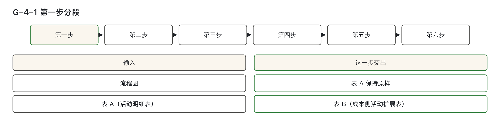
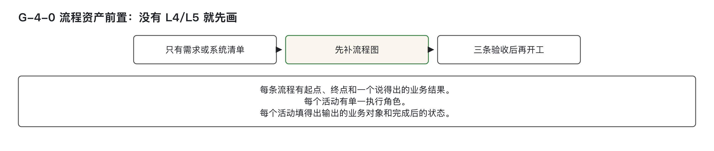
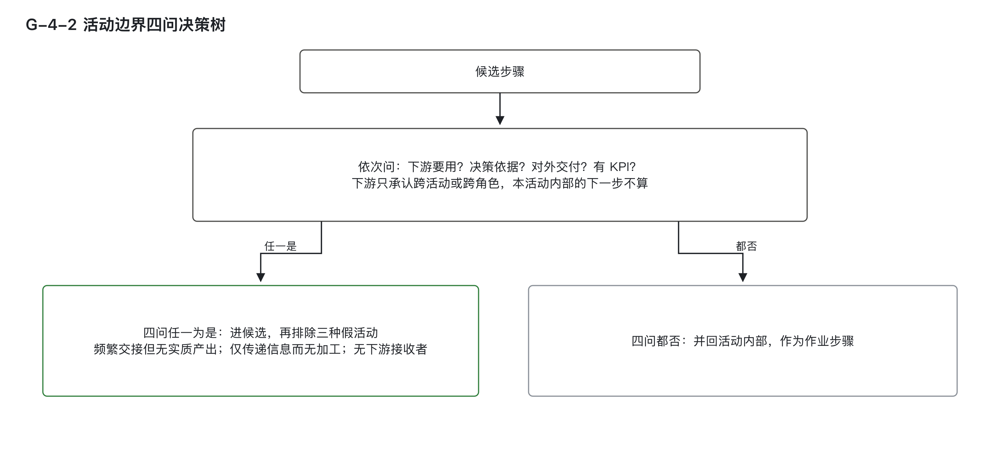
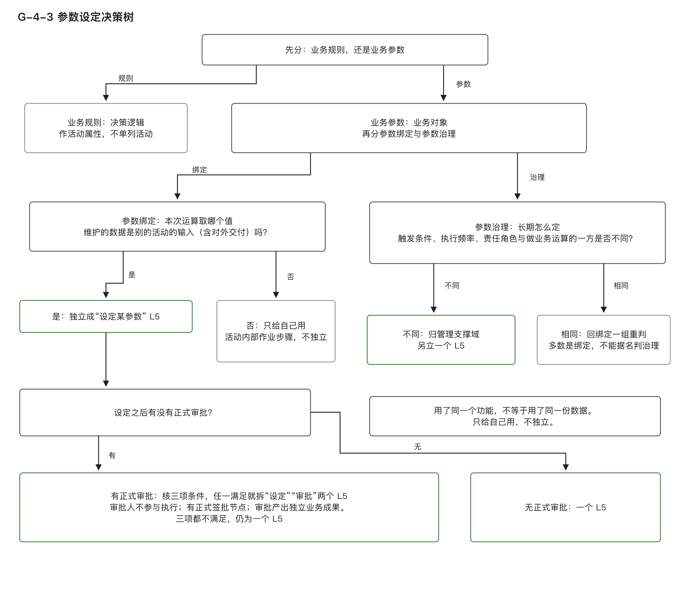
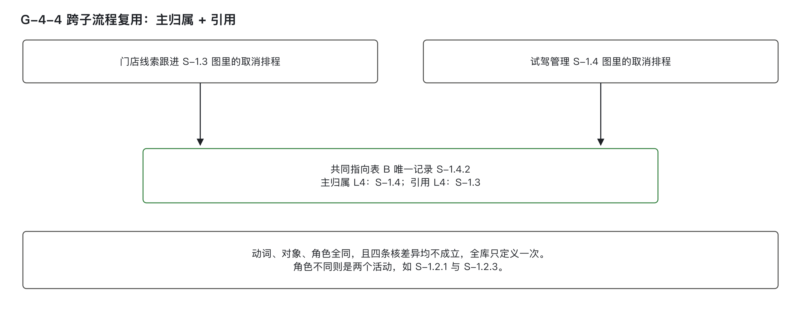
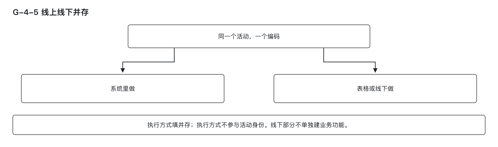

# 第一步：子流程拆到活动

## 一、开工前提与流程资产输入产出

本步骤的输入是已交付的流程建模成果——一张流程图，搭配一份活动明细表（表A）。若仅有需求清单或系统菜单，不得开工，必须先补全流程图，直至通过三条验收标准。

流程资产分为三层，仅使用L4、L5、L6：
- **L4 子流程**：比流程小、比活动大，有明确起点与终点，对外交付一个完整业务结果。例如：“门店线索跟进”。
- **L5 活动**：一个角色完成、业务上不可再分、产出一个独立业务结果的一步操作。例如：“更新首触跟进结果”。
- **L6 作业步骤**：活动内部的操作动作，如“打开线索详情”“勾选跟进方式”，不进入表A，也不单独建模。

L1至L3不在本方法范围内。

### 两张表：表A与表B的分工与职责

本方法产出两张表，分别用于不同目的：

| 表名 | 来源 | 是否可修改 | 主要用途 |
|------|------|------------|----------|
| 表A（活动明细表） | 上游交付 | 不得增删列，保持原样 | 流程建模制品，供流程管理使用 |
| 表B（成本侧活动扩展表） | 本方法自扩 | 可按规则填写，逐行补充 | 成本登记与下钻分析的基础数据 |

#### 表A固定结构说明
表A包含以下11个信息列，列名与内容均不可更改：
- 阶段
- 序号
- 活动名称
- 编码
- 分工模型
- 协同资源
- 输入
- 输出
- KCP（关键控制点）
- 状态
- 活动说明

角色分工列以**流程角色**为列头，格内填分工字母，遵循如下规范：
- **任务型活动**：按RASCI填写  
  - R：执行人（Responsible）  
  - A：问责人（Accountable）  
  - S：支持（Support）  
  - C：咨询者（Consulted）  
  - I：知会者（Informed）
- **会议型活动**：按OARP填写  
  - O：组织者（Organizer）  
  - A：审批人（Approver）  
  - R：汇报人（Reporter）  
  - P：参与者（Participant）

> 执行角色填写流程角色，如线索跟进员、线索统筹员；由哪个岗位担任，各组织自行确定。

#### 表B字段定义与填写要求

表B为本方法新增，一行对应一个活动，主键为活动编码，与表A一致。其字段包括：

| 列名 | 填写内容说明 |
|------|--------------|
| 主键 | 活动编码，与表A完全一致，逐字相同 |
| 输出 | `业务对象·状态` 格式，填写完成后的状态，如“线索·已跟进” |
| 输入 | `业务对象·状态` 格式，填写进入时的状态 |
| 主归属／引用 | 该活动所属的子流程编码；若被其他子流程引用，列出所有引用来源 |
| 执行方式 | 填写线上、线下或并存 |
| 承载系统 | 实际执行该活动的业务系统名称 |
| 关联业务功能编号 | 以 `F-` 开头的编号，挂接至具体业务功能 |
| 下钻状态 | 自动带出，本层取值为：已下钻 / 待下钻 / 不适用 |
| 来源证据 | 判定依据材料出处 |
| 受益方留痕 | 写明“这笔成本算给谁、为什么这样算”的判断依据，作为留痕，非签字 |

> **下钻状态说明**（本层仅用三个）：
> - **已下钻**：已对到机能层级，规模有据可依  
> - **待下钻**：尚未完成后续链路核对，需继续推进  
> - **不适用**：纯线下活动，无软件承载，无需下钻  

> 注：**“未登记”** 出现在更深层级（第⑥篇），当前阶段不涉及。

### 为何不能用需求清单或系统菜单替代流程图？

- **需求清单**描述的是系统改动项，而非业务结果。例如“跟进页增加下拉框”是一次开发变更，不是一次业务动作。若以此为输入，将导致后续判定中无法写出“对象＋状态”形式的结果，偏离业务本质。
- **系统菜单**反映的是实现路径，而非业务流程。同一活动可能分布在多个菜单中，同一菜单也可能包含多个角色的工作。以菜单为输入，等于把“如何做”当作“做了什么”，违背第②篇解耦原则。

> 汽车行业类比：整车厂审核经销商销售流程时，关注的是“线索下发→首触→跟进→邀约→试驾→成交”这条业务线，而非系统中有几个菜单。系统更换不改变这条业务线；业务线变了，系统才跟着改。

---

### 开工前逐项通过三条验收

在开始拆解子流程前，必须确认流程图已满足以下三项验收标准，缺一不可：

| 验收项 | 核查方式 | 必须具备的原因 |
|--------|----------|----------------|
| ① 每条子流程有明确起点、终点和一个可陈述的业务结果 | 对照流程图，逐条写出起始点、终止点及产出结果 | 若起止不明，则子流程边界不清，活动归属无法判定 |
| ② 每个活动只有一个执行角色 | 检查表 A 每行的 R，确认只落在一个流程角色格（允许 `AR` 组合） | 角色不唯一，意味着跨角色协作，不符合“单一角色完成一步”的活动定义 |
| ③ 每个活动在表B中能填出输出的“对象＋状态” | 表B输出列逐行填写 `业务对象·状态`，如“线索·已跟进” | 此为第二步判定业务结果数与数据流向的唯一输入；填不出则后续无法开展 |

> 三条验收均为事实性核查项，两人核对结论应一致。若不一致，说明验收标准未写清楚，须先澄清分歧，再开工。

---

### 补图后先复核活动边界

补完流程图后，需进行一次初步复核：
- 若某条子流程下的活动数量**明显多于同业务域其他子流程**，应怀疑是否将作业步骤误拆为活动。
- “明显偏多”仅为复核信号，**不设具体数量阈值**。因数值判据一旦固化，易被误用作通用标准，违反把复核信号与通用判据混在一起。

复核后确认：
- 若业务本身复杂，活动多属正常，照常推进；
- 若确为作业步骤冒充活动，应按下一节“假活动排除”规则退回。

> 后续发现某个业务动作在流程资产中漏登记，不属于本节补图范围，应走**流程补登清单**（第②篇专用流程），仅允许新增，禁止修改已有活动边界。

---

### 表 B 通过编码关联，成本侧不改上游定义

- **表A不动**：绝不向表A添加新列（如状态列、归属列），避免干扰上游定义。
- **表B独立**：所有成本侧所需字段均放入表B，通过活动编码与表A关联。
- **上游版本更新处理**：
  - 若上游修改了已有活动的名称或执行角色，成本侧仅发出预警，通知流程资产责任方；
  - 不退回上游，也不强制其重审；
  - 成本侧继续沿用新名称对应的活动编码填写表B。

> 本方法不拥有对表A的修改权，也不负责上游版本管理。

---

“未登记”表示记录是什么还没查清，先登记下来；活动层的表 B 只使用已下钻、待下钻和不适用，未登记会在第 ⑥ 篇以后更下层的记录中出现。KCP 的全称是 Key Control Point（关键控制点），用于标明该活动是不是控制点。

上游交付流程资产时常称“一图两表”，表 A 是配套两张表中的活动明细表。本方法的表 B 是成本侧另扩的表，不代替另一张上游表，也不往表 A 加列。估算人员只读表 A。

后续步骤依靠本步输出：第二步从表 B 输出认业务结果；独立性要比输入输出；第四步以后从机能串回活动和子流程。拆得过粗会把不同结果挤在一行，拆得过细会让作业步骤冒充活动而挂不上功能。

完成本篇后，应能逐项核对三条开工验收；按四问写出候选理由及下游活动编码或角色；用输入输出退回三类假活动；把参数步骤判到绑定、治理及设定/审批的合适边界；按三元组和四条核差异决定同名活动是一条还是两条，并填写主归属／引用。

| 当前问题 | 初步判断 | 去哪里核对 |
|---|---|---|
| 只有需求清单或系统菜单 | 先补流程图，三验收通过再开工 | 本节 |
| 活动越拆越多 | 查结果由谁承接，先怀疑作业步骤 | 第二节候选与排除 |
| 只是转给、通知某人 | 比输入输出是否改变 | 第二节假活动 |
| 设定参数、维护权重 | 先认规则还是数据，再看流向 | 第三节参数 |
| 设定后还有审批 | 三条件任一成立就拆 | 第三节审批 |
| 同一事线上线下都有 | 三元组没变，仍一活动 | 第四节执行方式 |
| 两张图都有同一步 | 三元组全等且无核差异就引用 | 第四节引用 |

流程图由谁补、补到哪一版、由谁验收，属于项目实施事项，各项目分别确定，本系列不展开。

> 图 G-4-1　第一步以流程图和表 A 为输入，保持表 A 原样，另扩表 B 供后续下钻。

> 图 G-4-0　没有 L4/L5 流程资产，先补图，再通过起止结果、单一角色和对象状态三条验收。

## 二、从候选走到真活动：四问判定与三假排除

### 2.1 四问判定：进入候选从宽

判定一个步骤是否构成独立活动，需依次回答四个问题。任一问题成立，即进入候选；四问皆不成立，则退回为内部作业步骤。

| 问 | 核查方式 | 成立时 | 不成立时 |
|----|----------|--------|----------|
| 下游要用 | 表 B 输出的「对象·状态」是否出现在另一个活动的输入中，或是否交付给另一个角色 | 进候选，写出下游的活动编码或角色名称 | 看下一问 |
| 决策依据 | 输出是否被某个决策环节当作判断依据 | 进候选 | 看下一问 |
| 对外交付 | 输出是否交付至本组织外部，或直接交予客户 | 进候选 | 看下一问 |
| 有 KPI | 表 A 的 KCP 列是否有标注，或流程图上是否有考核点标记 | 进候选 | 四问均不成立：不进候选，退回作为活动内部作业步骤 |

KPI（Key Performance Indicator，关键绩效指标）指考核工作成果的指标；表 A 的 KCP 列和流程图上的考核点可作核查线索。

**举证要求**：主张“它是独立活动”的一方，必须明确指出下游所在的另一活动编码或另一角色名称。若无法指明，视为“下游要用”不成立，其余三问仍按本表判定。

> **关键说明**：  
> - “下游”仅承认两种情形：跨活动（输出由另一活动承接）或跨角色（输出交由另一角色处理）。  
> - 本活动内部的下一步，不构成“下游”。  
> - 若仅说“后面会用到”，但无法写出具体活动编码或角色名称，则“下游要用”不成立。

---

### 2.2 为什么入口从宽？

四问入口采用客观事实标准，不引入“须有可交付形态”“须有实质加工”等主观条件，原因有三项：

1. **判定一致性高**：跨活动或跨角色是可核查的事实，不同人核对结果一致；主观标准易引发分歧。
2. **避免共用能力遗漏**：许多共用参数或基础数据操作仅涉及“存一次、读一次”，无复杂加工，若门槛过高，将无法进入候选，其成本在后续无法归属。
3. **错误代价不对等**：多拆一个活动，复核时可见，可合并；漏掉一个共用能力，其成本在系统中消失，难以察觉。

因此，**入口从宽、排除从严**。两者结论冲突时，以排除为准。

---

### 2.3 先判本体：它是活动还是子流程？

四问判定的是“是否独立”，而层级归属需根据本体特征另行判断。判定依据不看使用频率，只看自身结构。

| 判据 | 结论 |
|------|------|
| 单一执行角色，业务上不可再分，产出单一业务结果 | L5 活动 |
| 涉及两个及以上执行角色 | L4 子流程；活动定义要求单一角色，跨角色必为子流程 |
| 含两个及以上有先后依赖的不可再分动作，且对外交付一个完整业务结果，有独立起点和终点 | L4 子流程 |
| 只是一个动作的作业步骤繁多 | 仍是 L5 活动；拆作业步骤不升格为子流程 |

> **重点提示**：步骤多 ≠ 子流程。是否升格，取决于责任角色和输入输出关系，而非操作数量。

---

### 2.4 三类假活动：排除从严

进入候选后，需进一步筛查三种典型“假活动”，一律不予保留：

1. **频繁交接但无实质产出**：对象在多个角色间流转，状态未发生任何改变；
2. **仅传递信息而无加工**：输出与输入的「对象＋状态」完全相同，仅位置转移；
3. **无下游接收者**：完成后，没有任何活动或角色承接该输出。

**执行顺序**：先通过四问进入候选，筛查是否只作原样搬运、没有实质加工，再按上述三类复核。

宽进与严判的分歧在于跨了活动却只作搬运的步骤。同一活动内部的步骤，两种判法都不独立；跨活动且有实质产出的，两种判法都独立。排除条件可带主观成分，但只向外排除，不挡住入口；少一个活动在复核时看得见。

---

### 2.5 排除判据与举证规则

| 形态 | 核查方式 | 结论 |
|------|----------|------|
| 输出与输入的「对象＋状态」完全相同 | 逐字比对表 B 的输出列与输入列 | 按“仅传递信息而无加工”退回 |
| 下游活动编码、下游角色、对外交付对象三项均无法指明 | 在全部表 B 输入列中查找该输出 | 按“无下游接收者”退回 |
| 在若干角色之间转手，对象和状态未变 | 观察流程图上的交接线，结合表 B 两列内容 | 按“频繁交接但无实质产出”退回 |
| 举证 | 主张“它是真活动”的一方，须证明： ① 输出与输入在对象或状态上有差异； ② 能指明下游接收方 | 不能举证则退回 |

> **案例说明**：  
> 在“门店线索跟进”子流程中，有人提出“把申诉材料转给线索统筹员”这一步。  
> - 它跨角色，按四问可进候选；  
> - 但实际输出与输入的对象和状态完全相同，仅位置转移；  
> - 无下游活动、角色或对外交付对象；  
> - 故按“仅传递信息而无加工”退回，不进入表 A。  
>   
> 正确做法：转交行为是“提交战败申诉”的收尾，而“审批”才是真正的活动。转交仅为流程衔接，非独立活动。

> **行业常见误判示例**：  
> 展厅将客户到店登记“交给”跟进角色，或试驾单“递给”试驾负责人。这些交接在纸面流程中显眼，但未改变任何业务对象状态，一律退回。

---

### 2.6 教学案例过一遍：S-1.3「门店线索跟进」

本篇各处的例子取自第 0 篇介绍的汽车经销商 4S 店销售线索跟进案例。名称、编码和细节均为演示设定，不是可以直接套用的标准，后文不再逐处标注。

对子流程 S-1.3 中各步骤逐一核对四问：

- **S-1.3.1 首次联系客户** → 输出“线索·已首触”是 S-1.3.2 的输入，下游为另一活动，进候选；
- **S-1.3.3 提交战败申诉** → 输出“战败申诉·待审批”是 S-1.3.5 的输入，进候选；
- **S-1.3.4 邀约客户到店** → 输出“到店邀约·已确认”是另一条子流程中 S-1.4.1 预约试驾的输入，跨子流程，进候选；
- S-1.3.2、S-1.3.5 同理。

每一步均能写出下游活动编码，符合“下游要用”标准。

> 图 G-4-2：四问任一成立只是进入候选，仍须排除三种假活动；四问都不成立则并回活动内部。

## 三、参数与审批的独立性判定：从绑定到治理，从设定到审批

### 3.1 先分规则与参数

业务动作中的“设定某参数”需先区分是**业务规则**还是**业务参数**。二者判定路径不同：

- **业务规则**是决策逻辑，不独立建模。例如：“7 天内有到店意向记 A 级”，属于活动属性，随活动走，不单列活动。
- **业务参数**是可维护、可读取的业务对象，如佣金率、评级权重、返利比例。它是一份被维护的数据。

**关键写法规范**：  
业务参数名称仅体现业务语义，不得包含技术实现细节。例如应写“维护佣金率”，而非“维护配置表某字段”。若写成后者，即为配置数据进入流程，违反第②篇解耦红线。

> **误判后果警示**：  
> - 把规则当参数，会多出一批无依据的“维护某规则”活动；  
> - 把参数当规则，会将多个活动共用的数据埋入某个活动属性，导致成本归属缺失。

---

### 3.2 参数再分：绑定与治理的判定路径

业务参数需进一步拆分为两类：**参数绑定**（运行时取值）与**参数治理**（长期定值）。两者触发条件、执行频率、责任角色均不同，混在一起判层级必然出错。

逐项按下表判到终点：

| 步 | 问 | 是 | 否 |
|----|----|----|----|
| Step 0 | 这是参数绑定还是参数治理？ | 绑定 → 走 A1 | 治理 → 走 B1 |
| A1 | 维护出来的这份数据，是不是别的活动的输入（含对外交付）？ | 独立成「设定某参数」L5活动，再过 A2 | 数据只给自己用：是活动内部的作业步骤，不独立 |
| A1′ | 几个活动调用的是同一个功能，还是读取同一份数据？ | 读取同一份数据：按 A1 的「是」处理 | 各传各的数据调用同一功能：功能共用、数据私有，不独立 |
| A2 | 设定之后有没有正式审批？ | 按独立审批三个条件判，满足任一就拆成「设定」「审批」两个 L5 | 一个 L5 |
| B1 | 治理的触发条件、执行频率、责任角色，与做业务运算的一方是否不同？ | 归管理支撑域，另立一个 L5，不在做业务的流程里建模 | 回 A 组重新判，多数属于绑定，不是治理 |
| 业务规则 | 这是决策逻辑吗 | 作活动属性，不独立 | 回 Step 0 |

> 图 G-4-3：规则作活动属性；参数按绑定或治理分别判断，绑定看数据是否由其他活动承接，治理比较触发条件、频率与责任角色。

---

### 3.3 数据流向为什么比维护人可靠

常见错误做法是以“是否专人维护”判定独立性：维护人非执行人，就判独立。此法虽能抑制活动膨胀，但会漏掉一类共用数据——**执行人自己维护、却被多个活动共用的数据**。

另一极端是只要“跨活动使用”就判独立，这会把“用了同一个功能”误当作“用了同一份数据”，导致活动膨胀。

**正确判定方式**：  
在表 B 中明确写出每个活动的输入与输出的“对象＋状态”。一旦比对发现：
- 输出的“对象·状态”出现在另一个活动的输入中；
- 或该数据对外交付；

则说明该数据被其他活动承接，必须独立成活动。

> **计成本原则**：  
> 建了关联但无针对该项结果的投入，关联保留，成本不计。

---

### 3.4 参数绑定场景：数据复用决定独立性

#### 教学案例 S-1.2 线索评级过程

- **评级规则**：“7 天内有到店意向记 A 级”——是决策逻辑，作活动属性，不单列活动。
- **评级权重**：是业务参数。维护权重产出“评级权重·已生效”，作为 S-1.2.1 评定线索意向等级的输入。
- 初评由线索评级智能体执行，线索统筹员随后定级。维护权重由统筹员完成，产出“评级权重·已生效”，写入S-1.2.1输入“线索·已建档；评级权重·已生效”。这份数据被别的活动承接，所以独立成活动：**S-1.2.2 维护线索评级权重**。
- 表 A 中该活动的 R、A 均为线索统筹员，未设签批节点，按独立审批三条件判，仍为一个 L5。

> **汽车行业对照**：  
> 整车厂商务部门确定的返利比例，经销商结算、区域考核等环节均按其计算。该数据被多个活动使用，维护返利比例应独立成活动。  
> 反之，某线索跟进员在报价测算中临时填写一个折扣试算值，仅用于本笔业务，属内部作业步骤，不独立。

---

### 3.5 治理不因手续完整而自动升格

参数治理与运算的触发条件、频率、责任角色不同，才归管理支撑域，另立L5；不符合时回绑定分支重新判定。管理支撑域是存放管理性、支撑性活动的区域，与业务执行流程分开。

初始化、调整、审批、生效、归档手续齐全，只是有起点终点的结果特征，并非升为子流程的条件。治理侧活动过多导致流程太长，或同一业务有多种场景时，才在治理侧设子流程。

### 3.6 独立审批：三个条件满足任一就拆

“设定某参数”后若有审批，需判断是否应拆为两个独立活动。判定依据为以下三条，**满足任一即拆**：

| 条件 | 核查方式 | 满足时 |
|------|----------|--------|
| 审批人不参与执行 | 表 A 的 A、R 两列：审批那一步的执行角色与设定那一步的执行角色是否同一个 | 拆 |
| 有正式签批节点 | 流程图上是否有签批节点 | 拆 |
| 审批产出独立业务成果 | 表 B 输出列：审批之后的「对象·状态」与设定之后的是否不同 | 拆 |
| 三条都不满足 | 不适用 | 一个L5 |
| 举证 | 主张审批单独成活动者指出满足哪一条 | 不适用 |

> **三条都不满足**：仍为一个 L5 活动。

---

### 3.7 为什么看这三条？

- **第一条看角色**：审批人不参与执行，意味着角色切换，违反“单一角色完成一步”的定义。
- **第二条看流程图**：有正式签批节点，已在流程图中显式标识，是独立控制点的证据。
- **第三条看结果**：审批产出了新状态（如“已审批”），拥有独立的“对象·状态”，具备自身业务成果，下一步可为它单独挂功能。

反例：执行人自己确认一次操作，无角色切换、无签批节点、无新状态产出，仅为内部确认，不应拆。

---

### 3.8 教学案例 S-1.3 战败申诉流程

- **提交战败申诉**（S-1.3.3）：执行角色为线索跟进员。
- **审批战败申诉**（S-1.3.5）：执行角色为线索统筹员。
- 流程图上有正式签批节点。
- 审批后产出“战败申诉·已审批”，状态变化。

三条全部满足，故拆为两个独立活动。

> **行业对照**：  
> 展厅优惠超出跟进员权限时，需由另一个有审批权限的角色签批。签批后优惠单状态从“待审”变为“已批”。审批人不参与报价，有签批节点，产出新状态，三条全中，应拆为两个活动。

---

### 3.9 不应拆的情形：非审批的确认行为

#### 案例 S-1.1 分配线索

- **分配线索**（S-1.1.2）：由线索统筹员完成，产出“线索·已分配”。
- 该动作本身是一个业务操作，非对“登记到店线索”的审批。
- 它有自身结果“线索·已分配”，并非对登记到店线索的审批，也不属于设定加审批。

## 四、同一活动怎样记录执行方式和引用

### 4.1 执行方式不进活动身份，线上线下仍为一个活动

同一件事，无论由系统完成、纸质表格填写，还是线上线下混合操作，只要动词、业务对象、执行角色三者完全一致，即视为同一个 L5 活动。执行方式仅作为表 B 的补充字段，**不参与活动身份的构成**。

- **核心原则**：活动名称表达的是业务本身，而非实现手段。更换系统或改为线下操作，不影响活动本质。
- **后果警示**：若将“线上版”与“线下版”拆成两个活动，会导致成本主体分裂——线上部分可挂功能，线下部分无法挂功能，造成链路断点，影响成本核对。

#### 表 B 填写规则

| 情形 | 判定标准 | 结论 | 表 B 填写 |
|------|----------|------|-----------|
| 同一动词、同一对象、同一角色，有线上操作也有线下操作 | 三元组全等 | 一个活动 | 执行方式：`并存` |
| 仅在线下完成，无系统支撑 | 三元组按相同规则判定 | 一个活动 | 执行方式：`线下`；不挂功能，下钻状态自动带出 `不适用`，不算断链 |
| 线上与线下实际处理的是两件事 | 三元组任一项不同 | 两个活动 | 分别填写各自的执行方式 |

> **举证要求**：主张拆分为两个活动的一方，必须指出三元组中哪一项不同。若无法指明，则按“一个活动”处理。

---

### 4.2 纯线下活动不建业务功能，成本依第③篇两判断路径处理

纯线下活动（如电话沟通、当面签字）不单独建立业务功能，其投入是否计入成本，依据第③篇提出的**两个判断**进行：

1. **行为性与专属性是否通过**？  
   - 若不通过，但确有投入，按既有升级条件重判；仍不通过，则进入不计入投入清单。
2. **关联已通过，但可归属性不通过**？  
   - 投入进入共享服务池，在当期分摊，**不是不计**。

> **关键说明**：  
> - 下钻状态自动标记为 `不适用`，由工具根据执行方式规则带出。  
> - 不挂功能不等于断链：第③篇准入判定未触发，无需强制补功能。

---

### 4.3 先判本体，再判引用

一个活动是否被多个子流程复用，取决于其自身属性，而非使用频率。判定顺序为：**先判本体，再判引用**。

被引用只是对象的属性，不能因为多处使用就升为子流程，也不能因为只使用一次就否定子流程。先用第二节的层级表判本体，再判断引用。

#### 第一步：三元组是否全等？

- `[动词] + [业务对象] + [执行角色]` 三者完全相同 → 进入同源候选；
- 任一项不同 → 两个独立活动，各自建模。

> **常见误判示例**：  
> “评定线索意向等级”在 S-1.2.1 由智能体执行，产出“线索·已初评”；在 S-1.2.3 由统筹员执行，产出“线索·已定级”。角色不同，对象状态也不同，属两个活动。

#### 第二步：四条核差异是否成立？

即使三元组全等，仍需核查以下四条**实质性差异**，任一条成立，必须拆分为两个活动：

| # | 核差异 | 成立则 |
|---|--------|--------|
| 1 | 作业步骤集合发生结构性增减 | 分 |
| 2 | 执行角色发生变更 | 分 |
| 3 | 业务输出成果（业务对象的状态变化）发生改变 | 分 |
| 4 | 所调用的底层业务功能集合发生改变 | 分 |

> **注意**：前置输入、后续去向、时效要求、使用场合等差异，**不算核差异**，仅在流程图中体现。

四条均不成立 → 为同一个活动，全库只定义一次，只有一个编码，表 B 只有一行。

---

### 4.4 引用关系如何记录？载体与填写规范

| 载体 | 处理方式 | 理由 |
|------|----------|------|
| 流程图 | 不体现引用关系，各子流程独立绘制 | 图保持自包含，避免跨图跳转 |
| 表 A 活动明细表 | 不加列，保持原样 | 仅描述活动本身，不涉及引用 |
| 表 B 成本侧活动扩展表 | 主归属／引用列填写： `主归属 L4：〈L4 编码〉；引用 L4：〈L4 编码〉` 多个引用用 `、` 分隔；无引用只写主归属半句 | 同源活动在成本侧集中确认，不另造行 |
| 建模工具 | 新建前必须检索活动库，命中即引用，不得新建 | 防止重复定义，依赖系统校验 |

> **强制要求**：  
> - 同名时仅弹提示，不代替检索；  
> - 不允许事后凭“同名同角色”识别副本；  
> - 是否为同一活动，必须在建模时按三元组与核差异判定。

---

### 4.5 管理方确定：主归属 L4 的三优先级判定

每个被引用的活动有且仅有一个管理方（主归属 L4），按以下顺序判定：

1. **主生命周期所在 L4**：负责该业务对象从产生到结束的完整生命周期的子流程；
2. **首个建模录入**：若无法判出主生命周期，则取表 A 中最早录入该活动的子流程，并标注“须定期复核”；
3. **虚拟公共支撑域**：仍无法判出时，归入虚拟公共支撑域，不归属于任何具体子流程。

> **禁止做法**：  
> - 不以“调用次数最多”为第一判据，因调用频次会随业务热度波动，导致管理方频繁变更。

> **范围标记规则**：  
> - 表 B 不手填范围标记；“主归属／引用”列若含 `引用 L4：`，工具自动记为“全局”范围，汇总至全局活动清单；  
> - 无引用信息的，记为“局部”，不进全局清单。

---

### 4.6 完整判定流程表

| 步 | 问 | 是 | 否 |
|----|----|----|----|
| 1 | 按三元组检索活动库，是否命中？ | 看第 2 步 | 新建活动 |
| 2 | 三元组是否全等？ | 看第 3 步 | 两个活动，各自建模 |
| 3 | 四条核差异是否有一条成立？ | 两个活动，备注同源 | 同一个活动：全库一编码，表 B 一行，写主归属／引用 |
| 4 | 管理方：主生命周期能否判出？ | 取主生命周期所在 L4 | 用“首个建模录入”并标注“须定期复核”；仍判不出，归虚拟公共支撑域 |
| 举证 | 主张新建的一方，指出三元组哪一项不同或哪条核差异成立 | 不适用 | 指不出，按引用处理 |

---

### 4.7 教学案例过一遍

#### 案例一：取消试驾排程（S-1.3 与 S-1.4 共用）

- **动作**：取消试驾排程  
- **三元组**：取消＋试驾排程＋线索跟进员 → 与 S-1.4.2 完全一致  
- **核差异**：四条均不成立  
- **结论**：同一个活动，全库仅定义一次  
- **管理方**：试驾排程的主生命周期在试驾管理（S-1.4），故主归属 L4 为 S-1.4  
- **表 B 填写**：`主归属 L4：S-1.4；引用 L4：S-1.3`  
- **工具处理**：自动纳入全局活动清单，范围为“全局”

> 图 G-4-4：两条子流程引用同一取消排程活动，表 B 只记 S-1.4.2 一行，主归属 S-1.4、引用 S-1.3。

#### 案例二：纯线下活动——首次联系客户与邀约客户

- **S-1.3.1 首次联系客户**：仅通过电话或当面完成，无系统操作  
- **执行方式**：`线下`  
- **表 B 填写**：执行方式填 `线下`，不挂功能，下钻状态自动带出 `不适用`  
- **成本处理**：按第③篇两判断路径评估投入，不因无系统支撑而直接排除

- **S-1.3.4 邀约客户到店**：同样仅靠电话完成，执行方式填 `线下`  
- **与 S-1.3.2 更新首触跟进结果**：动词不同（更新 vs 邀约）、对象不同（跟进结果 vs 到店邀约），三元组不同 → 两个独立活动

### 4.8 跨系统操作：等待才拆，否则只登记告警

一个活动在多个业务系统中执行，是否拆分为两个活动，**在本节跨系统情形中，判据是：是否必须等待另一业务系统的结果才能继续**。

- **必须等待对方结果** → 判定拆分，依据角色与输入输出重新确定活动；
- **彼此独立，互不等待** → 不拆，仍为一个活动，承载系统填写多个。

> **关键原则**：  
> - 一个活动跨系统实现，是设计问题，应反馈给系统整合，**不改变活动边界**；  
> - 按系统边界切活动，等同于把实现当作业务，违背解耦红线。

#### 教学案例：预约试驾（S-1.4.1）

- **动作**：线索跟进员在经销商管理系统中登记排程，同时在车辆管理系统中登记试驾车占用  
- **是否等待**：任一侧都不必等待另一侧返回结果  
- **结论**：不拆，仍为一个活动  
- **表 B 填写**：  
  - 承载系统：`经销商管理系统；车辆管理系统`  
  - 来源证据：`设计告警：经销商管理系统；车辆管理系统`

> **例外情形**：  
> - 若预约必须等车辆管理系统确认占用成功后才能继续，则判定为“必须等待”，应拆分为两个活动。  
> - 发邮件、发日历邀约、即时通讯同步等办公协同行为，不属于系统切换，不触发此判定。

> 图 G-4-5：同一活动可兼有系统操作与线下操作，执行方式记“并存”，线下部分不单独建业务功能。

## 五、正反例与练习自测

### 四问判定：下游只承认跨活动或跨角色

| 例子 | 判法与结论 |
|------|------------|
| 正例 1 | S-1.3.3 提交战败申诉：输出「战败申诉·待审批」是 S-1.3.5 的输入，下游跨活动，进候选 |
| 正例 2 | S-1.3.4 邀约客户到店：输出「到店邀约·已确认」是 S-1.4.1 的输入，下游跨子流程，进候选 |
| 正例 3 | S-1.1.2 分配线索：输出「线索·已分配」是 S-1.3.1 的输入，进候选 |
| 反例 1 | 将「打开详情」「勾选跟进方式」「点保存」逐个登记为活动，理由是“下一步要用”：此做法会持续拆解至原子操作，导致活动数失控，且内部下一步不构成下游，不应进候选 |
| 反例 2 | 仅有需求清单即开始拆分，将每条需求当作候选活动：此做法从源头偏离，无法写出“对象＋状态”的业务结果，须先补全流程图后方可开工 |

---

### 三种假活动

| 例子 | 判法与结论 |
|------|------------|
| 正例 1 | 「把申诉材料转给线索统筹员」：输出与输入的对象、状态完全相同，无独立下游，属“仅传递信息而无加工”，退回 |
| 正例 2 | S-1.3.5 战败申诉审批：输入「战败申诉·待审批」，输出「战败申诉·已审批」，状态发生改变，是真实业务活动 |
| 反例 1 | 流程图上每次交接都画成一个活动框，并照搬进明细表：此类操作会引入大量无结果的活动，第二步无法挂接功能，链路多处中断 |

---

### 参数与规则

| 例子 | 判法与结论 |
|------|------------|
| 正例 1 | 评级权重：属于业务参数；「评级权重·已生效」出现在 S-1.2.1 输入列，是其他活动的输入，独立成 S-1.2.2 |
| 正例 2 | 评级规则「7 天内有到店意向记 A 级」：属于业务规则，作活动属性，不单列活动 |
| 反例 1 | 每一条判断逻辑单独列为「维护某规则」活动：此做法将决策逻辑误作数据管理，导致活动膨胀，规则随活动流转 |
| 反例 2 | 多个活动调用同一换算功能，就将其单列成活动：此做法混淆“共用功能”与“共用数据”，各传各的数据，调用方的换算步骤仍在各自活动内部，不因功能共用而独立 |

---

### 独立审批：三个条件任一满足即拆分

| 例子 | 判法与结论 |
|------|------------|
| 正例 1 | S-1.3.3 与 S-1.3.5：审批人不参与执行、有正式签批节点、产出独立业务成果，三条全中，拆分为提交、审批两个活动 |
| 正例 2 | S-1.1.2 分配线索：该动作本身是业务执行行为，非审批，不拆分 |
| 反例 1 | 执行人自己做一次“确认”操作，也拆成审批活动：此做法引入无结果的活动，未满足任何审批条件，仍应视为一个活动 |

---

### 执行方式与引用

| 例子 | 判法与结论 |
|------|------------|
| 正例 1 | 取消试驾排程出现在 S-1.3 与 S-1.4 两张图上：三元组全等，核差异四条均不成立，全库仅有 S-1.4.2 一行，`主归属 L4：S-1.4；引用 L4：S-1.3` |
| 正例 2 | S-1.2.1 与 S-1.2.3 同名「评定线索意向等级」：执行角色不同（智能体 vs 统筹员），属两个活动 |
| 正例 3 | S-1.3.1 首次联系客户：仅在线下完成，执行方式 `线下`，不挂功能，下钻状态自动标记 `不适用`，不算断链 |
| 反例 1 | 同一件事拆成「线上登记」和「线下登记」两个活动：造成成本主体分裂，线下部分始终无法挂功能，不可接受 |
| 反例 2 | 两条子流程分别为同一个活动编号，各自挂接一次功能：导致同一开发工作重复计算，违反成本归集原则 |

---

### 本篇涉及的、各组织自己确定的数字

本篇不设定具体数值标准。  
“活动数明显偏多”仅为复核阶段的警示信号，**不是判定依据**。  
本篇不新增组织自行确定的数字；换一个组织，仍按这些判据判断。

---

### 练习

取一条真实需求所在的业务线，按本篇的判定表核验一遍：

1. 找到这条需求所在的子流程。没有流程图的，先按第一节的三条验收补到可以开工。
2. 列出这条子流程下的全部候选步骤，逐个核对四问，写出每个下游的活动编码或角色；写不出下游的，这一问不成立，继续核查其余三问；四问都不成立才退回作业步骤。
3. 对已进入候选的每一步，比对表 B 的输入、输出两列，把三种假活动退回。
4. 找出全部「设定某参数」「维护某权重」的步骤，先区分规则与参数，再按判定树判到终点；有审批的，按三个条件判定是否拆分。
5. 写出每个活动的三元组，到既有活动库检索；命中且全等的，改为引用，写出表 B「主归属／引用」一格。

完成后，由另一个人按同一份流程资产独立再核验一遍，比较两份表 B。两人判定不一致的地方，回到对应的判定表，看是哪一步的依据没有写清楚。

---

### 自测

1. 列出流程资产可以开工的三条验收，并各写一句：缺了这条，后面哪一步无法判定。  
   - ① 每条 L4 有明确的起点、终点和一个说得出的业务结果——缺了它，子流程边界与活动归属无法判定；  
   - ② 每个 L5 有单一执行角色——缺了它，三元组无法构建，无法判断同源性；  
   - ③ 每个 L5 在表 B 填得出输出的「对象＋状态」——缺了它，第二步的业务结果数与数据流向无输入。

2. 一个步骤的输出只被同一活动里的下一步使用，能否凭「下游要用」进候选？  
   不能。因为“下游”仅承认跨活动或跨角色的依赖关系；本活动内部的下一步不构成下游，否则会导致无限拆解至原子操作。

3. 有人提出一步「把试驾单转给负责试驾的角色」，输出和输入都是「试驾排程·已预约」，按哪条规则、以什么理由处理？  
   按三种假活动规则退回：输出与输入的对象、状态完全相同，无加工过程，仅传递信息，不构成独立活动。

4. 下面两项各是业务规则还是业务参数，各怎么处理？  
   (a)「7 天内有到店意向记 A 级」：属业务规则，是决策逻辑，应作为活动属性，不单列活动；  
   (b) 评级权重：属业务参数，需先区分绑定与治理，再判断其是否作为其他活动的输入；若是，则独立建模为活动。

5. 三个活动各自传入自己的金额，调用同一个汇率换算功能，换算是否独立成活动？  
   不独立。虽然功能共用，但输入数据各不相同，属于“用了同一个功能”而非“用了同一份数据”，不应拆分。

6. 设定一份参数后由另一个角色签批，签批后参数状态从「待审」变为「已生效」，拆成几个活动？命中了哪几条条件？  
   拆为两个活动：设定、审批各一个。满足“审批人不参与执行”“有正式签批节点”“产出独立业务成果”三项中的任意一项，即可拆分。

7. 两条子流程各有一个「取消试驾排程」，执行角色均为线索跟进员，输出均为「试驾排程·已取消」。表 B 有几行？「主归属／引用」怎么写？  
   一行。三元组全等，四条核差异均不成立，为同一活动。管理方按业务对象主生命周期所在 L4 确定。若试驾排程归试驾管理（S-1.4），另一处为 S-1.3，则填写：`主归属 L4：S-1.4；引用 L4：S-1.3`。

8. 用一句话复述四问判定。  
   四问判定一个步骤是否构成独立活动——下游要用、决策依据、对外交付、有 KPI——“下游”只承认跨活动或跨角色。

---

### 本篇依据

- 三元组同源判定（唯一键含执行角色）、四条核差异、本体判定（活动还是子流程）、引用判定与全局／局部范围、管理方唯一性与按顺序的三条、线上线下并存算一个活动，以及“复用是属性、不是成因”的定性原则：CM-ADR-001 R1、R2、R4、R4′、R5、R10（含 D8）。  
- 先分参数绑定与参数治理、不以“有头有尾”为子流程触发条件、规则与参数分开判、“下游要用”进候选从宽而排除从严、独立的判据是数据流向、跨系统降为设计告警，以及判定树 Step 0、A1、A1′、A2、B1 与配套约束 C1～C5：CM-ADR-013 §3.2、§3.3、§3.4、§3.6、§3.7、§3.8、§4。  
- 功能身份按编号、成本不按名称归集这一前提：CM-ADR-015。  
- 引用判定并入“线上线下并存＝一个活动；跨子流程复用＝先判本体再判引用”一条、管理方第二条只用“首个建模录入”、表 B 不手填范围标记：本系列约定。  
- 各条判定的四栏（谁判、在哪判、谁举证、并列时怎么定）见附录 B；表 A、表 B 的列定义见附录 D；案例全表见附录 E。
