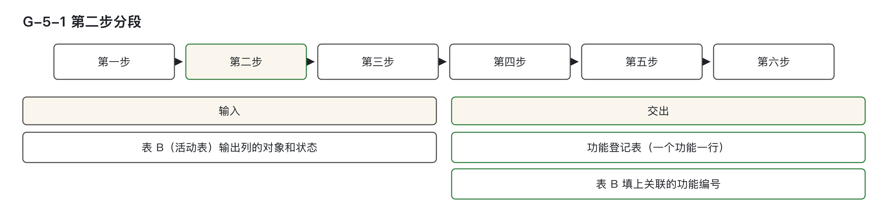
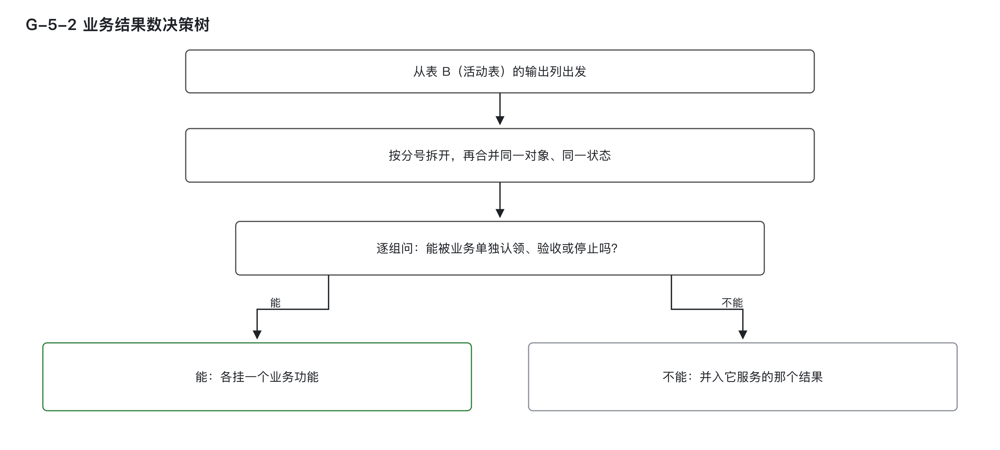
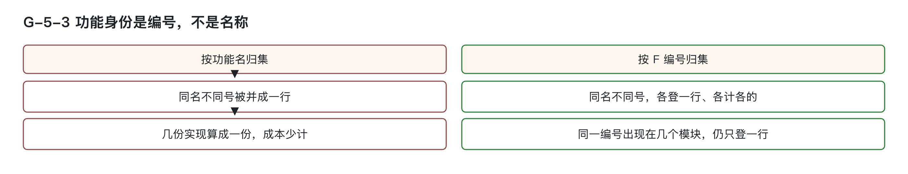
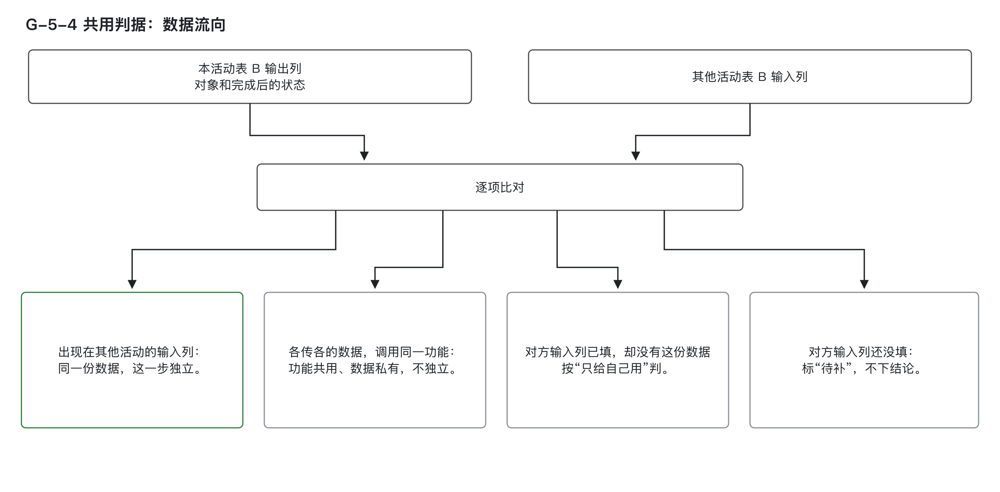
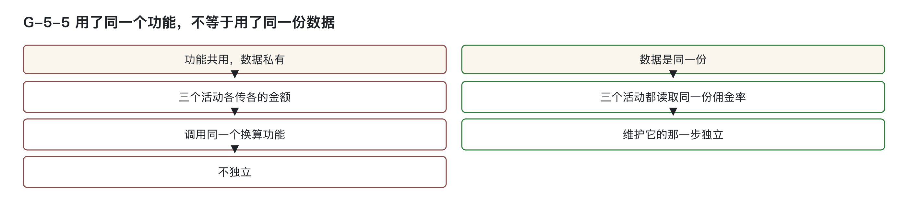

# 从活动输出识别业务功能

## 一、从活动输出认定和计数业务功能

### 学习目标

完成本篇后，能够：

1. 对照拆分表逐行判定一组步骤是一个业务功能还是几个，并写出符合的是哪一行；
2. 从表 B 的输出列数出一个活动产生几个业务结果，并对每个结果写出它能被业务单独认领、验收或停止的理由；
3. 对「同名不同号」「同号跨模块」两种情形，判定是几个功能，并写出功能登记表的登记方式；
4. 拿本活动的输出列和其他活动的输入列比对，判定一份数据是否独立；比对不到或无从比对时，写出应填的结论；
5. 区分「建立关联」和「计入成本」两个判断，对一条已经建立的关联，指出它的成本须凭何种凭证才能计入。

业务功能是可单独认领、验收或停止的业务结果；机能是能被外部触发、用来登记软件规模的交付单位。本步只建立活动与功能的关联，用来核查数字化支撑覆盖和业务归属。功能与机能的关联回答实现和规模归属，是第 ⑥ 篇的工作。活动已有功能，不保证该功能已有实现，所以两类覆盖率不能合成一项。

表 B 是在上游活动明细表之外扩写的活动表，一行一个活动，第 ④ 篇已经交出。下钻就是沿子流程、活动、业务功能、机能逐层找到相应记录。案例取自汽车经销商4S店销售线索跟进；线索是一条客户购车意向记录。S-1.3是子流程，S-1.3.2是其活动；名称、编号与数量只供演示。

### 按问题定位

| 当前情况 | 先问一句 | 初步判定 | 详细阅读 |
|---|---|---|---|
| 一个活动跨越多个画面，定不下计为几个功能 | 这几步合起来产出几个能单独验收的结果 | 一个结果一个功能；画面多少不影响 | 拆分与计数 |
| 同一个功能，不同角色看到的数据范围不同 | 业务规则、允许动作或结果状态有没有改变 | 没有改变就不拆 | 拆分 |
| 同一个功能名对应几个编号，按名字汇总对不上 | 编号是否相同 | 编号不同就是不同功能，各计各的 | 功能身份 |
| 几个活动都在用同一个功能，要不要单独算 | 它们用的是同一份数据，还是各传各的 | 看数据流向 | 数据流向 |
| 已经建立关联，说不清这笔金额该不该计 | 有没有针对这个功能的开发或配置投入 | 建关联和计成本分开判定 | 关联与成本 |

### 本步输入与产出

本步从表 B 的「输出：业务对象 + 完成后的状态」列出发，逐行识别每个活动实际交付的业务结果。每一条活动记录都明确标注了它完成时所改变的业务对象及其最终状态——例如“线索·已跟进”或“战败申诉·待审批”。这些输出写的是业务上可感知、可验证的成果。

所有判定均基于这一列的信息展开。若某活动输出多个不同对象或同一对象的不同状态，需逐一分析其是否构成独立的业务结果。输出列中出现的“；”分隔符将结果分组，先逐组判定，再合并同一对象、同一状态，核查能否独立验收。

本步产出为两张表：
- **功能登记表**：一个功能占一行，主键为 F 编号，用于记录每个独立业务结果的身份与归属；
- **表 B 回填**：将对应的 F 编号填入表 B 的「关联业务功能编号（F-）」列，建立活动与功能的关联。

输入来源为表 B，其字段定义如下：
- **输入：业务对象 + 进入时的状态**：活动开始前该对象所处的状态；
- **输出：业务对象 + 完成后的状态**：活动完成后该对象所处的状态。

本方法不主张将“业务功能”等同于 ArchiMate 中的 Business Function（业务职能），最接近的是 Application Function（应用功能），但两者不完全等价。

### F 编号怎样编

功能登记表以 F 编号为主键，主键唯一，不允重复。F- 后接产出该结果的活动编码，再接一位序号。

- 活动 S-1.3.2 产出第一个独立结果，编为 **F-S-1.3.2.1**；
- 产出第二个独立结果，编为 **F-S-1.3.2.2**。

对于不挂具体活动的功能：
- 平台功能（如登录、权限管理）；
- 公共能力（挂不上业务架构，又被两个以上业务系统共用）；

其编号以 **F-S-0.** 开头。

> 注意：案例中的名称、编号和数量仅为演示设定，不可照抄作为标准值。

---

> 图 G-5-1：本步从表 B 的输出对象和状态识别业务功能，交出功能登记表，并把 F 编号填回表 B。

---

### 挂接前先判支撑手段准入

在建立任何关联前，必须先通过前置判定：该活动所依赖的软件手段是否具备“行为性”和“专属性”。

- **行为性**：是否存在外部触发方（如用户操作、系统定时任务、外部接口调用），能主动启动这串处理流程；
- **专属性**：该手段是否专门服务于当前活动，是否有活动专用的权威记录或专属投入凭证。

只有同时满足这两点，才能进入功能挂接流程。自研系统通常符合；协同平台的原生通知不满足，即使出现在角色格中也不予准入。

特别地，若某个手段仅出现在“只被告知结果”的角色（标记为 I）中，则不参与准入判定，本步也不为其生成 F 编号。

---

### 按业务结果拆分

一个活动是否对应多个业务功能，取决于它是否产生多个彼此独立的结果。关键标准是：**每一个结果是否都能被业务单独认领、验收或停止**。

### 先对照拆分规则

| 判断 | 处理 |
|------|------|
| 多个步骤共同完成同一个业务结果，任何一步都不能被业务单独验收或停止 | 合并为一个业务功能；步骤下沉到机能或功能过程 |
| 一个对象产生可被业务单独认领、验收或停止的结果 | 单独建一个业务功能 |
| 同一画面包含多个彼此独立的业务结果 | 拆成多个业务功能 |
| 只有角色、权限或数据范围不同，业务结果与行为契约相同 | 不拆功能；差异记在活动关系、权限或场景属性里 |
| 角色差异同时改变了业务规则、允许动作或结果状态 | 拆 |
| 只有终端、渠道或界面布局不同，业务结果与行为契约相同 | 不拆业务功能；机能如何按端拆分，属于第 ⑦ 篇 |
| 多个活动调用的是同一个业务目的、同一套行为契约 | 保留一个业务功能，多处使用由活动与功能的关联表达 |

> 注：行为契约指这个功能遵循的业务规则和允许动作；终端指手机端、电脑端等。拆分以业务结果与行为契约为准：角色用来复核活动边界，触发事件（把这串处理启动起来的那件事）用来识别功能过程——角色和触发事件都不是业务功能的拆分条件。

按表从上到下判断，选第一个符合的选项。

| 问 | 核查方式 | 结论 |
|---|---|---|
| 有哪一步能独立验收或停止 | 只完成这步，业务是否认可结果 | 都不能则合并；能则单独成功能 |
| 只在角色、权限、数据范围、终端、渠道、布局上不同 | 对照业务结果和行为契约 | 相同就不拆 |
| 角色差异是否改变规则、动作或结果状态 | 对照两边规则、动作、结果状态 | 改变就拆 |
| 举证 | 主张拆者指出两个独立认领、验收或停止的结果 | 指不出就不拆 |

按角色拆会让功能数随组织增加，软件却可能没有变化。流程角色由哪个岗位担任，各组织自行确定。

### 常见情形对照

| 情形 | 是否拆分 | 理由 |
|------|----------|------|
| 同一页面上登记跟进结果与排定下次任务 | 拆分 | 两者均可独立生效：前者已登记，后者未排定仍可接受 |
| 线索统筹员看全店线索，跟进员仅看本人线索 | 不拆 | 结果相同，规则一致，仅权限范围不同 |
| 一个角色可作废线索，另一个只能退回 | 拆分 | 结果状态不同，行为契约改变 |
| 手机端与车机端远程开启空调 | 不拆 | 业务结果一致，均为“车内温度到位” |

> 示例说明：S-1.3.2 活动产出“线索·已跟进”和“跟进任务·已排定”两个结果。跟进结果已经登记、下一次尚未排定时，业务仍承认前一个结果。因此拆分为两个功能：F-S-1.3.2.1 与 F-S-1.3.2.2。

---

### 从对象状态计数

按下表四步计数，再核对举证：

| 步骤 | 操作 | 说明 |
|------|------|------|
| 1 | 将表 B 输出列按 `；` 拆分为若干组「对象·状态」 | 如“线索·已跟进；跟进任务·已排定”拆为两组 |
| 2 | 合并同一对象、同一状态的多组 | 多步达成同一状态，视为一次结果 |
| 3 | 逐组确认：业务能否单独认领、验收或停止该结果 | 能：保留；不能：并入其服务的功能 |
| 4 | 统计剩余组数，即为业务结果数 | 每个结果对应一个功能，F编号填回表B |
| 举证 | 主张不止一个结果者逐个指出结果，并说明业务怎样单独认领、验收或停止 | 指不出就合并为一个 |

---

### 中间状态与跨画面步骤怎样计数

按对象和状态计数，另一人能拿同一格复算；按画面、按钮或需求条目计数，则会随实现和各人的切法变化。同一对象的中间状态不能直接当成独立结果。例如筛选线索、编辑线索、保存线索只在最后形成业务承认的「线索·已跟进」，前两步并不能各算一个结果。换成一个画面一次提交，业务结果和功能数仍相同。

车主预约保养时，选车辆、选门店和时段、确认提交分在三个画面。只选车辆或时段，门店都无法安排工位；提交后形成「保养预约·已登记」，门店才据此安排工位、准备备件，三步共同产生一个功能。

若提交后另发一张可单独使用、作废的优惠券，便还有「优惠券·已发放」这个结果。优惠券未取得也不影响预约成立，结果数变为两个。两个例子画面数相同，功能数不同；画面与接口在第⑥篇拆机能，功能过程在第⑦篇登记。

### 教学案例的编号对应

- **S-1.3.2「更新首触跟进结果」**：输出为“线索·已跟进；跟进任务·已排定”，两个结果对象不同、状态不同，均可独立验收，故拆分为两个功能：**F-S-1.3.2.1** 与 **F-S-1.3.2.2**。
- **S-1.3.3 提交战败申诉**：输出为“战败申诉·待审批”，仅一组结果，业务结果数为 1，挂 **F-S-1.3.3.1**。
- **S-1.3.5 战败申诉审批**：输出为“战败申诉·已审批”，结果独立，挂 **F-S-1.3.5.1**。
- **跟进结果编辑页**：同一页面含登记跟进结果与排定下次任务两个区块，分别对应 **F-S-1.3.2.1** 与 **F-S-1.3.2.2**。

---

> 图 G-5-2：从输出列拆分对象状态，合并相同项，再逐组核查独立验收条件；留下的结果各挂一个业务功能。

## 二、用编号认定功能身份

功能身份以 F 编号为准，功能名和模块作为行属性。按以下三条登记：

- **F 编号相同，即为同一功能**：无论该功能出现在多少个模块、多少行记录中，只要编号一致，就视为同一个业务功能。
- **F 编号不同，即为不同功能**：即使功能名完全相同，只要编号不同，就是两个独立的功能，需分别登记。
- **按功能名汇总仅作展示**：所有以功能名为维度的报表、视图或统计结果，均不得用于结算、对账或成本归集。

功能名与模块均为辅助属性，不参与身份判定。模块信息作为行属性，填写在功能登记表的「出现模块」列，多个模块用 `；` 分隔。功能名为空或 F 编号缺失的记录，不纳入归集范围，单独列示待补号。

---

### 2.1 为什么不能按功能名归集

功能名属于自由文本，存在多重歧义风险：

- 同一业务事项可能有多种命名方式（如“线索评级”“意向评定”）；
- 同一名字可能指向多个不同实现（如“评定线索意向等级”在智能体初评与人工定级中各有一套逻辑）；
- 一份功能可能在不同系统、终端或版本中重复实现，形成多份投入。

若按功能名归集，会将多个实际发生的独立工作合并为一个功能，导致成本少计。类比汽车行业零件管理：两种“前制动片”因零件号不同而分库存、分采购、分成本；若仅按名称汇总，则账面数量与实物不符。

因此，**F 编号相当于功能的“零件号”**，是唯一可追溯、可验证的身份标识。

---

也不能用“F编号＋模块”当主键：模块只是指向功能的链接，同一编号跨模块仍是一行。不同终端、系统各做一套或旧版尚未下线的多份实现，既各编编号又确实发生工时，就分别全额计入成本。是否重复建设只记在架构异味观察清单，不改变成本模型。

### 2.2 判定表

| 情形 | 判定 | 功能登记表的登记方式 |
|------|------|------------------------|
| 同一个 F 编号出现在多个模块 | 同一个功能 | 只登一行，「出现模块」列填入所有出现模块，用 `；` 分隔 |
| 两个 F 编号，功能名相同 | 两个不同功能 | 各自独立登记，允许重名，不合并 |
| 有功能名但无 F 编号 | 不进归集 | 单列待补号，不可用功能名替代编号 |
| 导入时去重 | 仅按 F 编号去重 | 不得按功能名或「F 编号＋模块」组合去重 |
| 举证要求 | 无需主动举证 | 机械判定，工具可自动核对 |

> 注：表 B 的「关联业务功能编号（F-）」列仅填写 F 编号，不填功能名。每个编号必须在功能登记表中查到，且其功能身份为「业务功能」。数据功能是不挂活动而承接数据本身处理的功能，事件消费者应先按实际下游结果判归属，不能因收到事件一律归数据功能。平台功能、公共能力、数据功能三类不挂接活动，不出现在此列。

---

### 2.3 教学案例

#### 案例 F-S-1.3.2.1  
“更新首触任务跟进结果”功能同时出现在 PC 端的「线索跟进」模块和移动端模块。  
- **判定**：F 编号相同 → 同一个功能  
- **登记方式**：仅登记一行，功能编号为 **F-S-1.3.2.1**，「出现模块」列填写「线索跟进；移动端」

#### 案例 S-1.2  
F-S-1.2.1.1 和 F-S-1.2.3.1 的功能名均为「评定线索意向等级」。  
- **判定**：编号不同 → 两个不同功能  
- **理由**：前者由线索评级智能体（AI角色）完成初评，后者由线索统筹员人工定级，各有自己的业务结果  
- **登记方式**：分别登记为 **F-S-1.2.1.1** 与 **F-S-1.2.3.1**，功能名虽同但不合并

---

### 2.4 成本口径

本篇涉及的成本数据为信息技术部门内部管理口径，非企业会计科目，不进入财务凭证，也不产生付款义务。

- **成本归属**：“成本挂在某个功能上”仅表示该笔投入应归属于哪个功能，表达该笔投入的归属；
- **成本报表**：按 F 编号出具，确保每一份真实投入均有对应归属；
- **按功能名出具的视图**：仅供阅读参考，明确标注“不可用于结算”，不得与结算口径的行加总。

> 图 G-5-3：同名不同号分别登记，同一编号跨模块仍只登记一行；按名字汇总只供展示。

## 三、共用看数据流向

### 3.1 数据流向判别：同一份数据才独立

第④篇用数据流向判断一个步骤是否独立成活动，本节沿用这个判据，区分共用数据与共用功能。

判定一个活动是否独立，核心依据是数据流向：若本活动维护的数据被其他活动作为输入使用，则该步骤独立；若仅自用，不独立。关键区分在于“用了同一个功能”与“用了同一份数据”的本质差异。

- **用了同一份数据**：多个活动读取的是同一份被维护出来的数据，且该数据是下游活动的输入。此时，维护数据的那一步应独立成活动，成本也单独归集。
- **各传各的数据，调用同一功能**：各活动传入自身数据，调用相同功能，但数据彼此隔离。调用方的那一步仍在各自活动内部，不因功能共用而独立。共用功能的成本另按实际受益方判定，见 3.3 节。

比对方法：将本活动表 B 的输出列中每组「对象·状态」，与其他活动表 B 的输入列逐项比对。

| 比对结果 | 结论 |
|----------|------|
| 本活动输出的「对象·状态」出现在其他活动的输入列里——同一份数据被下游使用 | 独立 |
| 多个活动各自传入不同数据，调用同一功能——数据私有，功能共用 | 不独立；该功能在机能侧的身份需至第⑩篇判定：先看其数据对象是否挂得上流程，若未挂上再判断属于平台功能或公共能力；多方复用且挂得上业务架构的，为共通能力（挂得上业务架构、由多方复用的能力） |
| 其他活动输入列已填，但未查到本活动输出的「对象·状态」 | 按「只给自己用」判 |
| 其他活动输入列为空，无法比对 | 标「待补」，不下结论 |

---

### 3.2 查不到时如何判断：输入列状态决定结论

当无法在其他活动输入列中找到本活动输出的「对象·状态」时，需根据对方输入列是否填写来判断：

- 若对方输入列已填，但未包含本活动输出的数据，说明对方确实不以该数据为输入，可得出“只给自己用”的事实结论。
- 若对方输入列为空，缺乏可比对的事实依据，不能下任何结论，必须标为「待补」，等待后续补充后重新判定。

输入列为空时缺少比对事实，须待填写后再判。

---

### 3.3 多活动共用一个功能：只是治理候选

活动与功能之间允许多对多关系：一个活动可挂接多个功能，一个功能也可被多个活动挂接。表 B 中一格可填写多个 F 编号。

功能登记表的「受益方留痕」列自动记录该功能被哪些活动使用，用于追溯成本归属，非审批签字，仅为备查。

当同一 F 编号被两个及以上不同活动挂接时，称为「共性候选」。需核实以下两点：
1. 关联是否真实成立：确认活动确实调用了该功能，而非同一功能被拆分为多行登记；
2. 共用范围：判断共用发生在同一条子流程内、跨子流程的同一领域，还是跨领域。

上述治理判断不设专门字段承载，也不影响成本判定。  
- 「是否共用」是架构治理问题；  
- 「成本归谁」是受益方判断。  

即使功能被跨领域共用，若当期仅有一个实际使用方，成本仍全部归于该使用方。共用成本分摊机制见第⑨篇。

---

### 3.4 判定流程与举证要求

| 步骤 | 操作 | 结论 |
|------|------|------|
| 1 | 提取本活动表 B 输出列中的每组「对象·状态」 | 候选数据 |
| 2 | 在其他活动表 B 输入列中逐项查找 | 找到：写出对方活动编码，判为独立 |
| 3 | 未找到时，检查对方输入列是否已填 | 已填：按「只给自己用」判；未填：标「待补」，不下结论 |
| 4 | 多活动共用一个功能时，确认传入数据是否为同一份 | 同一份：按第2步结论；各传各的：不独立，功能在机能侧身份待第⑩篇判定 |
| 举证 | 主张“独立”的一方须指出：本活动输出的「对象·状态」出现在哪个活动编码的输入列 | 对方输入列已填仍指不出，按「只给自己用」判；未填，标「待补」，不下结论 |

---

### 3.5 教学案例

**案例 S-1.3.3**  
提交战败申诉的输出「战败申诉·待审批」，出现在 S-1.3.5 战败申诉审批的输入列中——同一份数据被下游使用，判定 S-1.3.3 独立成立。

**案例 S-1.4**  
S-1.4.3 签署试驾协议的输出「试驾协议·已签署」交付给试驾执行环节。该环节属另一条子流程，其表 B 输入列尚未填写，无从比对，故标「待补」，不下结论；来源证据中需注明待补原因。

---

> 图 G-5-4：共用判据——数据流向  
> 本活动表 B 的输出列对其他活动表 B 的输入列逐项比对，四种结果落地：  
> - 出现在其他活动输入列 → 独立  
> - 各传各的数据、调用同一功能 → 不独立  
> - 对方已填但比对不到 → 按“只给自己用”判  
> - 对方未填 → 标“待补”，不下结论  

> 图 G-5-5：用了同一个功能，不等于用了同一份数据  
> 三个活动各自传入不同金额，调用同一汇率换算功能 → 功能共用、数据私有 → 不独立  
> 三个活动均读取同一份佣金率 → 数据为同一份，且是下游输入 → 维护该数据的步骤独立

## 四、关联和投入分别落表

### 4.1 规则

本篇核心原则：**建关联 ≠ 计成本**。二者为独立判断，须分别判定，互不推导。

- **判断一：是否建立关联**  
  判断表 B 的「关联业务功能编号（F-）」列是否填写 F 编号。判定标准来自第③篇准入条件：
  - **行为性**：有明确触发方能启动软件行为；
  - **专属性**：承载该活动产出的权威记录，或存在可辨认的专属投入，凭证包括工时记录或需求条目编号，并附独立责任方记录和变更记录编号。

  专属性两项满足其一即可；行为性和专属性须同时通过，才能建关联。外购标准软件服务记外部应用，不编 F 编号，登记例外见本节案例二。

- **判断二：是否计入成本**  
  依据功能点计算表与分摊表是否登记该笔金额。计成本必须基于针对该功能的**开发或配置投入**，并具备可追溯凭证。

  若已建关联，有投入但金额归集不到某次具体交付，成本进入共享服务池，再按各业务功能占全盘业务功能点的比例在当期摊完。

功能点计算表登记各机能的软件规模，计数单位是 CFP（COSMIC Function Point，COSMIC 功能点）；具体计数不在本系列展开。分摊表记录池里的金额分给哪些受益方以及依据。

#### 三种情形处理方式

| 情形 | 处理逻辑 |
|------|----------|
| 建了关联，但无针对性投入 | 关联保留；不按功能点计成本；外购许可费或订阅费走“许可科目”（如外购许可费、订阅费） |
| 有投入，但未通过准入条件 | 不建关联；按第③篇升级条件重判；仍不满足者，列入“不计入投入清单” |
| 建了关联，也有针对性投入 | 建关联；成本按科目计，凭证写入来源证据 |

> 注：许可费、订阅费属于外购支出，不纳入功能点统计，也不与开发成本加总成一个总额。

---

### 4.2 为什么要分开判定

将“建关联”与“计成本”捆绑，易导致两端错误：

- **错误一：建了关联就计成本**  
  如外购标准软件服务承载权威记录（如车辆管理系统），虽应建立关联，但若我方未做任何开发或配置，则不应计开发成本。否则即为无投入而多计。

- **错误二：不计成本就不建关联**  
  若因未发生投入而删除关联，会导致该活动在业务覆盖上被标记为“无数字化支撑”，造成覆盖率失真；后续链路核对将在此断链。

分离后：
- **关联表**回答“谁支撑了谁”；
- **成本表**回答“支出发生在何处”。

落地形式：
- 建关联 → 纳入功能登记的写入表 B「关联业务功能编号（F-）」列，来源证据写依据；外购标准软件服务记外部应用，不编 F 编号；
- 计成本 → 写入功能点计算表与分摊表，凭证同步录入来源证据。

**允许一处有、另一处无**，不必强行对齐。关系表越建越大、所有工具都挂上关联，是误用“关联”表示“支出发生”；已建关联却无法说明支出归属，是混淆“关联”与“投入凭证”。

---

### 4.3 判定表

| 问题 | 核查内容 | 结论 |
|------|----------|------|
| 准入条件是否通过 | 查看机能登记表「触发方式」列；专属性凭证：权威记录所在规则/报表，或工时记录、需求条目编号+独立责任方、变更记录编号，均需写入「来源证据」 | 通过：建关联，纳入功能登记的填 F 至表 B；外购标准软件记外部应用，不编 F；不通过：不建 |
| 是否有针对该功能的开发或配置投入 | 工时记录或需求条目编号，写入来源证据 | 有且可归集到具体交付：按功能点、许可或调用量计成本；有但无法归集：关联照建，成本进共享服务池，当期按比例摊完；无针对性投入：不按功能点计成本，外购费用走许可科目 |
| 举证要求 | 主张“计成本”的一方，必须提供针对性投入的凭证 | 无法提供：不按功能点计成本 |

---

### 4.4 教学案例

#### 案例一：取消试驾排程，仅建一次关联  
活动 S-1.4.2 在全库仅有一行记录（判定依据见第④篇）。其与 F-S-1.4.2.1 的关联仅建立一次，登记于子流程 S-1.4 下。  
- 表 B 「主归属 / 引用」列记录：该活动主归属于哪条子流程（全库唯一一行），以及被哪些子流程引用；
- S-1.3 流程图中虽画出此活动，但仅为引用，**不在 S-1.3 重复建关联**；
- F-S-1.4.2.1 成本仅记一份，不因出现在两张流程图上而重复记账。

> 此为“成本只记一份”在本步的应用，完整规则见第⑨篇。

#### 案例二：外购车辆管理系统  
S-1.4.1 预约试驾时，线索跟进员在车辆管理系统中登记试驾车占用。  
- 车辆管理系统为外购标准软件服务；
- 承载试驾车占用的权威记录 → 专属性成立；
- 按第③篇判断，记为“外部应用”；
- 登记方式：不进功能登记表，不编 F 编号，不计功能点，不进分摊表，不进不计入投入清单，也不计入实际成本总额；
- 表 B 「承载系统」列填写系统名；
- 来源证据填写：`外部应用：车辆管理系统；准入：①＋②(a)；成本：许可／订阅科目，不进功能点`；
- 我方调用该系统的客户端代码，按“谁调用归谁”原则并入调用方，详见第①篇。

#### 案例三：自研经销商管理系统  
该系统支撑预约试驾：
- 线索跟进员在画面上提交 → 有触发方 → 行为性成立；
- 试驾排程以该系统为权威记录 → 专属性第一条成立；
- 存在专属工时记录、独立责任方、变更记录编号 → 专属性第二条成立；
- 两条均成立，两份凭证均写入来源证据，不设优先级；
- 建立 F-S-1.4.1.1；
- 成本可归集至对应需求条目，按功能点计。

---

### 本步产出的两张表

将前述结论落实至表格。以下为教学案例 S-1.3 在本步产出的两张表节选，仅保留本篇涉及字段。

### 表 B 节选

| 主键 | 输出：业务对象 + 完成后的状态 | 关联业务功能编号（F-） |
|------|-------------------------------|------------------------|
| S-1.3.2 | 线索·已跟进；跟进任务·已排定 | F-S-1.3.2.1；F-S-1.3.2.2 |
| S-1.3.3 | 战败申诉·待审批 | F-S-1.3.3.1 |
| S-1.3.5 | 战败申诉·已审批 | F-S-1.3.5.1 |

> 说明：
> - 「关联业务功能编号（F-）」列仅填写 F 编号，多个编号用 `；` 分隔；
> - S-1.3.2 有两个输出结果，故填两个编号；
> - 本节选未列出的纯线下活动（如 S-1.3.1、S-1.3.4）在完整表 B 中仍有记录，无软件支撑，该列不填，下钻状态由工具自动带出“不适用”；
> - 本步不为线下活动挂功能，亦不视为断链。

### 功能登记表节选

| 主键 | 功能名 | 功能身份 | 出现模块 | 受益方留痕 |
|------|--------|----------|----------|------------|
| F-S-1.3.2.1 | 更新首触任务跟进结果 | 业务功能 | 线索跟进；移动端 | S-1.3.2 |
| F-S-1.3.2.2 | 排定下次跟进任务 | 业务功能 | 线索跟进 | S-1.3.2 |
| F-S-1.3.3.1 | 提交战败申诉 | 业务功能 | 线索跟进 | S-1.3.3 |
| F-S-1.3.5.1 | 战败申诉审批 | 业务功能 | 线索跟进 | S-1.3.5 |

> 说明：
> - 一个 F 编号仅占一行，即使出现在多个模块，也仅在「出现模块」列合并填写；
> - 「受益方留痕」由工具从表 B 「关联业务功能编号（F-）」列自动带出，挂接该功能的所有活动；
> - 「下钻状态」由工具根据后续机能登记情况生成，本步暂不处理。

---

## 五、正反例与练习自测

### 业务功能按单一业务目的认定

| 例子 | 判法与结论 |
|------|------------|
| 正例 1：S-1.3.2 的两个结果 | 能分别认领、验收或停止，拆成 F-S-1.3.2.1、F-S-1.3.2.2。业务结果独立，功能可分拆。 |
| 正例 2：战败申诉的提交与审批 | 各自可单独验收，是 F-S-1.3.3.1、F-S-1.3.5.1 两个功能。各自形成独立业务结果。 |
| 反例 1：同一个查看功能，因两个角色看到的数据范围不同，拆成两个功能 | 不成立。仅数据范围差异不构成业务规则、允许动作或结果状态改变，不应拆功能；功能数会随组织架构膨胀。 |
| 反例 2：一个画面上的「筛选」「编辑」「保存」各登一个业务功能 | 不成立。三步共同产出“线索·已跟进”这一唯一结果，任何一步无法单独被业务承认；这是将机能层切法误用于业务功能层，应合并为一个功能。 |

---

### 业务结果数

| 例子 | 判法与结论 |
|------|------------|
| 正例 1：S-1.3.2 输出「线索·已跟进；跟进任务·已排定」 | 两组「对象·状态」，均能单独验收，结果数为 2。每组具备独立可验证性，符合业务结果定义。 |
| 正例 2：S-1.3.3 输出「战败申诉·待审批」 | 一组「对象·状态」，结果数为 1。仅一个可独立确认的业务成果。 |
| 反例 1：按画面数、按钮数或需求条目数定功能数 | 不成立。结果数不应由界面元素数量决定；换一套系统后功能数即变，不可靠；按表 B 输出列先拆组，合并同一对象、同一状态，再逐组核查能否被业务单独认领、验收或停止，留下的组才计数。 |

---

### 功能身份是编号，不是名称

| 例子 | 判法与结论 |
|------|------------|
| 正例 1：F-S-1.3.2.1 出现在两个模块 | 同一个功能，只登一行，模块写进「出现模块」。编号相同即同一功能，跨模块共享不重复登记。 |
| 正例 2：F-S-1.2.1.1 与 F-S-1.2.3.1 同名 | 编号不同，是两个功能，分别计算。功能名可重，但编号唯一，以编号为准。 |
| 反例 1：按功能名汇总成本并用于结算 | 不成立。同名实现可能来自多个独立开发，若合并则导致成本少计；按名称汇总仅作展示，不得用于结算或对账。 |
| 反例 2：导入时按「F 编号＋模块」去重 | 不成立。同一功能在不同模块中使用，不应拆成多行；会造成重复登记，虚增功能点。 |

---

### 共用判据看数据流向

| 例子 | 判法与结论 |
|------|------------|
| 正例 1：S-1.3.3 的输出出现在 S-1.3.5 的输入列 | 同一份数据被下游活动使用，这一步独立，依据写进来源证据。 |
| 正例 2：S-1.4.3 的下游在另一条子流程，输入列还没填 | 标「待补」，不下结论。无实际数据流转信息，无法判断是否共用，须等待补充。 |
| 反例 1：几个活动都调用同一个换算功能，就判它独立 | 不成立。「用了同一个功能」≠「用了同一份数据」；各活动传自己的数据，不能据功能共用将那一步独立出来。 |
| 反例 2：对方输入列还没填，就先按「不独立」下结论 | 不成立。未填不能作为否定依据；缺乏事实支撑，应标「待补」，避免错误推断。 |

---

### 建关联 ≠ 计成本

| 例子 | 判法与结论 |
|------|------------|
| 正例 1：取消试驾排程只在 S-1.4 建一次关联 | 引用它的子流程不再建关联，成本只记一份。主归属唯一，避免重复登记。 |
| 正例 2：车辆管理系统是外购标准软件服务 | 记为外部应用，不编 F 编号；许可费或订阅费走许可科目，不进功能点。有权威记录但无我方投入，不计开发成本。 |
| 正例 3：经销商管理系统支撑预约试驾 | 准入条件通过，建关联；有专属投入凭证，按功能点计。行为性与专属性双满足，可归集成本。 |
| 反例 1：所有沾边的工具都挂上关联，再按关联数给每个工具算一份开发成本 | 不成立。关系表失控，造成成本虚高；关联仅为支撑关系，非支出发生依据。 |

---

### 组织数字

本篇不新增须由各组织自己确定的数字。这些判定规则换一个项目仍然适用。

### 练习

取一条真实需求，找到它支撑的活动，完成五项核查：

1. 逐组写出表 B 输出的「对象·状态」，按第一节拆分、归并并核查独立性，数出业务结果。
2. 对每个结果逐行对照第一节拆分表，指出符合哪一行，认定对应功能，再按该节编法写 F 编号。
3. 按第二节到功能登记表核对编号：同名异号各一行，同号跨模块仍一行，模块填入「出现模块」。
4. 对每个共用功能，先区分同份数据与各传各的数据，再按第三节和其他活动输入列比对。
5. 每条关联分别写建立依据和针对性投入凭证；没有后一项凭证的，单独标出，再按第四节判断成本路径。

另请一人以同一个活动独立核验，比较两份功能登记表。有分歧时回到对应判定表，找出哪一步依据还不清楚。

---

### 自测

1. **判定：一个活动须在三个画面上完成「筛选、编辑、保存」，只有保存之后线索才变为「已跟进」，前两步单独完成时业务不承认。它挂接几个业务功能？**  
   一个。三步共同产出同一个业务结果「线索·已跟进」，任何一步都不能被业务单独验收，合并为一个业务功能；三个画面和背后的接口，属于第三步拆机能时处理。

2. **判定：同一个审批功能，一个角色能看全部门店的单据，另一个角色只能看本店的，业务结果和允许动作都相同。拆不拆？若前者还能「作废」单据而后者不能，又怎么判？**  
   不拆。只是数据范围不同，业务结果与行为契约相同，差异记在权限或场景属性里。若前者能「作废」而后者不能，则改变了允许动作和结果状态，应拆分为两个功能。

3. **计数：一个活动的表 B 输出列写着「线索·已跟进；跟进任务·已排定」，两组都能单独验收。业务结果数是几？**  
   2。两组对象不同、状态不同，都能单独验收，各挂一个业务功能。

4. **判定：两个功能都叫「评定线索意向等级」，编号不同。功能登记表登记几行？成本怎么算？**  
   两行。编号不同就是两个功能，允许重名、重名不合并；成本分别计算、全额计入。

5. **指出：导入功能清单时，哪两种去重方式不得采用，各有什么后果？**  
   不得按功能名去重——会把同名的几份实现并成一份，成本少计；不得按「F 编号＋模块」去重——会把同一个功能按模块拆成几个，造成重复。

6. **判定：本活动的输出「战败申诉·待审批」出现在另一个活动的输入列里。是否独立？对方输入列还没填，又怎么处理？**  
   独立——同一份数据被其他活动使用。对方输入列没填，无从比对，标「待补」，不下结论。

7. **区分：一个外购的标准软件服务承载了某个活动的权威记录，我方没有针对它的开发投入。建不建关联？成本怎么处理？**  
   建关联，记为外部应用：不进功能登记表、不编 F 编号；不按功能点计成本，许可费或订阅费走许可科目。

8. **复述「功能身份是编号，不是名称」这条规则。**  
   F 编号相同就是同一个功能，不论出现在几个模块、几行；F 编号不同就是不同的功能，即使功能名完全相同；按功能名汇总只作展示，不得用于结算，不得用于对账。

---

### 本篇依据

- 业务功能是本方法术语、按可独立认领验收或停止的业务结果归并：CM-ADR-012 §3.1。活动与功能、功能与机能两类关联分开治理：§3.4。业务功能拆分表：§4.1。角色差异不单独拆功能：§6.6。  
- 功能身份是 F 编号、模块降为行属性、按名汇总只作展示、同名多实现各计各的：CM-ADR-015 R1～R5。导入不按功能名去重、也不按「F 编号＋模块」去重：§5。F 编号缺失的行不进归集：§6 第 3 项。  
- 独立的判据是数据流向，「用了同一个功能」不等于「用了同一份数据」：CM-ADR-013 §3.7、§4 A1 / A1′、C6。  
- 活动与功能保留多对多、关联数按 F 编号统计、只生成候选，是否共通与成本归谁分开判：CM-ADR-011 §3、R1～R4、R7。  
- 建关联与计成本是两个判断：CM-ADR-008 §3、§4.1、§4.2、§4.4；CM-ADR-010 §7。准入三条件（行为性、专属性、可归属性）的写法见第③篇。  
- 业务结果数按表 B 输出列的「对象·状态」组数计、他方输入列没填时标「待补」，是本系列教学侧的补充写法。F 编号的编法（F- 加所挂活动的编码再加一位序号；不挂活动的平台功能、公共能力用 F-S-0. 开头）见附录 E。  
- 各条判定的四栏（谁判、在哪判、谁举证、并列时怎么定）见附录 B；表 B 与功能登记表的列定义和填写格式以附录 D 为准；案例全表见附录 E。
