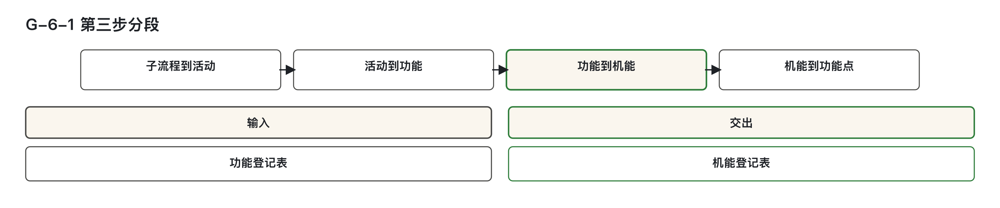
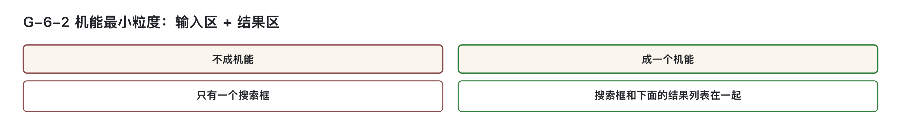
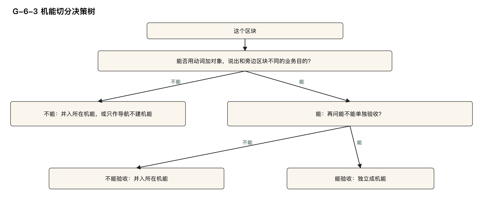
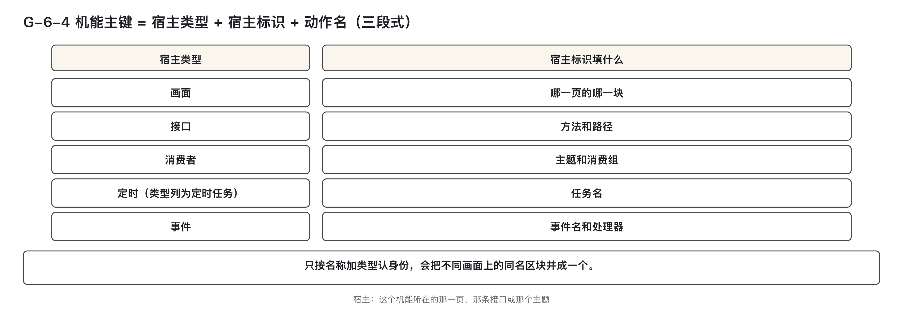
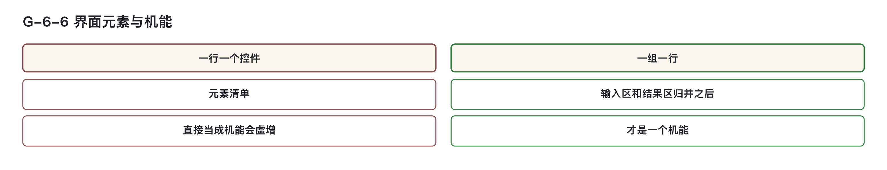

# 从业务功能得到可信的机能登记表

本篇是模块二“逐步下钻”的第六篇，核心任务是将第二步生成的业务功能逐层拆解为可验证、可归属、可分摊的最小单元——机能。其起点是功能登记表中已有的业务功能行（如 F-S-1.3.2.1），产出是机能登记表中的一行或多行机能记录。

判断画面区块是否成机能，要同时满足两个条件：  
1. 能用「动词＋对象」说出自身的业务目的，例如“查询车辆档案”“排定下次跟进”；  
2. 能独立验收，即一次触发后，结果可被确认是否正确、完整。  

画面区块只要有一项不满足，就不能独立成机能。接口、消费者和任务的类型另按触发方式判定。

---

## 一、从功能登记表走到机能登记表

- 机能：软件中由某一块交出特定业务结果的最小可验证单元，是规模登记和成本分摊的基本单位。
- 实现资产：系统内部未被外部直接调用的代码逻辑，如领域服务、私有方法、客户端调用代码等。它们不单独登记成行，也不计入规模。
- 下钻：指沿着子流程、活动、业务功能、机能层层追溯，找到对应的层级，并在登记表中标注链路完整性状态。
- 内部管理口径：本系列所涉金额、池子、投入清单等，均为信息技术部门内部管理用语，非企业会计科目，不进财务凭证，不产生付款义务，仅用于成本归集与分摊。



图 G-6-1：从业务功能拆到机能，再把已计数规模登记到机能；菜单和内部代码不能替代这条链路。

---

### 本篇要完成的判断

完成本篇后，能够：

1. 对页面上的控件、区块或一组按钮，判定是否成一个机能，并准确写出其输入区与结果区。
2. 按五类宿主的填法，写出一个机能的三段式编号，并能核对他人编号格式是否正确。
3. 根据触发方式与判别条件，推导出机能类型，区分“触发方式”与“实现形式”的填写内容。
4. 对首页、工作台、门户等页面，判定哪些区块建机能、哪些不建，并说明不建时的去向。
5. 对一份机能登记表，按名录完整性、类型校验、归并复核三道核对逐项检查，列出问题及处置。
6. 一个机能被多个业务功能共用时，写出其主归属功能编号，并说明来源证据中的写法。

---


### 登记前要分清的对象

| 当前情况 | 先行确认 | 初步判定 | 详细阅读 |
|---|---|---|---|
| 一个搜索框或一个按钮，是否单独登记 | 与它相连的结果区在哪里 | 控件并入输入区加结果区，合成一个机能 | 第二节 |
| 两个页面上都有一个名叫「搜索」的区块 | 所在页面是否相同 | 所在页面不同，就是两个机能 | 第二节、第四节 |
| 首页、工作台上有若干块内容 | 这一块能不能用「动词＋对象」说出自身的业务目的 | 能的建机能，只做跳转的不建 | 第三节 |
| 两个人对同一个机能写出了两条编号 | 三段各取了什么值 | 按三段填法重写，并保证全表唯一 | 第四节 |
| 类型一列，一人填画面，另一人填接口 | 触发方是谁，有没有独立的输入区和结果区 | 类型只由触发方式推导 | 第五节 |
| 机能名录由人工列出，担心有遗漏 | 有没有与机器导出的名录核对 | 两个方向都要核对 | 第七节 |
| 界面元素清单一行一个控件，数出的机能偏多 | 有没有先归并 | 先按输入区加结果区归并，再判定 | 第七节 |


上表用于定位问题；最终判断按各节判定表作出。

- 机能分五类：画面、接口、定时任务、消息消费者、事件消费。后四类来自服务端最底层的指令，是同一段指令对外暴露的四种形式：被人或其他系统直接调用时是接口，被点对点消息启动时是消息消费者，被时间启动时是定时任务，被广播事件启动时是事件消费。
- 规模只登记在机能上。业务功能的规模由它下面的机能汇总上来；实现资产——系统内部、没有谁能直接从外面叫起来的代码——不计规模。
- 实现资产不单独登记成行，例如领域服务、私有方法，以及调用方里与其他系统对接的客户端代码。它们的去处按入口个数定：只有一个入口的，并入那个入口机能；两个及以上入口的，进并入池；一个入口都没有的，进不计入投入清单，并在报表上披露。
- 并入池是共享池的一种：共享池是几个功能共用的钱先放在一起的池子，并入池专收有多个入口的内部逻辑的工时。不计入投入清单是一张专门登记“这笔钱不算进投入”的清单；披露的意思是，这笔金额不挂到任何功能上，但在账上可见，不许在报表里省略。
- 业务功能与机能之间是多对多：一个业务功能可以使用若干机能，一个机能也可以被几个业务功能共用。每个机能只能有一个主归属，“主归属功能编号”一格只填一个 F 编号；其余使用方不丢弃，在分摊表（记录池里的钱按什么依据分给各方的表）里留痕——留痕就是把判断依据写下来备查，不是找人签字。共用时主归属怎么定，见第四节。
- 下钻状态有四个取值，本篇不展开，见第⑧篇。
- 本篇后面提到钱进哪个池、从哪张清单剔除时，金额都按信息技术部门内部使用的管理口径理解——不是企业会计科目，不进财务凭证，不产生付款义务；“记到某个机能上”只表达归属。
机能登记的每一行都须有凭据。第⑦篇把已计量的功能过程挂到机能，第⑧篇核对归属，第⑨—⑪篇处理成本。漏一行会少计规模，投入也找不到归属；多一行会虚增规模，后面难以分清。功能过程是一次触发引起的一串处理，计数方法不在本系列范围。

### 机能登记表的九列

| 列 | 填写内容 | 所在章节 |
|----|----------|----------|
| 主键 | 分三段写的唯一编号（见第四节） | 第四节 |
| 触发方式 | 由谁启动这个机能 | 第五节 |
| 实现形式 | 用什么技术实现，仅作描述 | 第五节 |
| 类型 | 由触发方式推导出的五类之一：画面、接口、定时任务、消息消费者、事件消费 | 第五节 |
| 端 | 画面落在哪个终端（电脑端、手机端等）；其余类型一律填 `—` | 第⑦篇 |
| 主归属功能编号 | 只填一个 F 编号，指向主归属的业务功能 | 第四节 |
| 下钻状态 | 链路是否完整分流，由工具自动带出 | 第⑧篇 |
| 来源证据 | 主键、触发方式、类型的依据；画面类另写区块业务目的、输入区、结果区 | 第二节、第六节、第七节 |
| 受益方留痕 | 本身无单一归属的机能，实际服务到哪些活动 | 第⑧篇 |

> 本篇重点掌握：主键、触发方式、类型、来源证据四列的填写逻辑与依据。

---


## 二、先归并输入与结果，再判断机能

### 单个控件不成机能

界面上的单个零件，如按钮、输入框、下拉框，本身不构成一个机能。原因在于：
- 无法用「动词＋对象」表达独立的业务目的；
- 不具备可单独验收的结果。

例如，一个单独的搜索框只能回答“输入关键词”，但业务不会因输入了字符就认为任务完成。它必须连同下方的结果列表才能形成完整动作。

### 输入区与结果区的定义

| 类型 | 定义 |
|------|------|
| 输入区 | 业务人员主动提供条件或内容的地方，如表单、筛选条件、选择框等。 |
| 结果区 | 本次操作后业务人员可见的输出内容，如列表或详情。 |

有输入的画面区块应把输入区与对应结果区合成候选机能；只读列表没有输入区，按下面的结果区例外判定。



图 G-6-2：搜索框、查询按钮和结果列表共同交付一个业务结果；控件各占一行会虚增机能数量。

### 两种典型场景说明

#### 场景一：搜索框连同结果列表

- 单独搜索框：不成机能。无独立业务目的，不可验收。
- 搜索框 + 搜索结果列表：成一个机能。可命名为“搜索线索”或“搜索客户”，业务目的明确，结果可验证。

#### 场景二：只读列表

- 无输入区，但业务人员可以“查看”内容，查阅本身是一种动作。
- 如“今日待跟进”列表，打开即显示，业务目的为“查看待跟进线索”，结果可验收，因此成一个机能。

> 关键点：只读列表虽无输入区，但只要有结果区且能独立验收，即可成一个机能。

### 跨页面同名局部如何登记

即使两个页面上都有名为“搜索”的区块，只要所在页面不同，就视为两个独立机能。

- 原因：两块都须开发，各有自己的测试和维护工作。
- 编号第二段需体现具体位置，如：
  - `画面|线索列表页 线索搜索区|搜索`
  - `画面|客户列表页 客户搜索区|搜索`

即使检索对象相同，也因页面不同而分属两个机能。合并会导致规模少计，影响后续分摊准确性。

> 说明：该情形为假设性示例，教学案例中未实际出现线索列表页与客户列表页，仅为说明规则而设。两块需分别开发、测试与维护，不因名称或功能相似而合并。

### 为什么取“输入区+结果区”为最小粒度？

- 向下切至控件：粒度过细。一个页面数十个控件，若每项都登一行，登记表膨胀，且无法描述业务目的，后续无法挂功能、分摊成本。
- 向上并至整页：粒度过粗。一张页面常含多个独立业务功能，若整页登一行，成本无法回溯至具体功能。

“输入区+结果区”是一次完整业务动作的最小组合，沿用已有两问判据：
1. 能否用「动词＋对象」说出业务目的？
2. 是否能单独验收？

控件单独过不了第一问，组合后可过。

> 对照案例：4S店维修接待页中，仅输入车辆识别代号的框不成机能；但该框连同下方弹出的车辆档案，可称为“查询车辆档案”，业务员可核对信息，即可验收，故成一个机能。

### 先归并，后判定

处理界面元素清单时，顺序不可颠倒：
1. 先按输入区+结果区归并，形成候选机能；
2. 再对每个候选进行“业务目的”与“可验收性”判定。

若先对单个控件判定，易误判。例如，“导出”按钮看似有业务含义，但若其依赖于当前列表的上下文，应并入该列表所在的机能。

### 按钮级操作的判定原则

一个区块上的多个按钮，是否各自成机能，取决于：
- 是否能独立说出业务目的；
- 是否自带输入区和结果区；
- 是否能独立验收。

若满足以上三点，则各成一个机能；否则并入所在“输入区+结果区”组合。

> 教学案例 S-1.3：申诉审批页上有“通过”“驳回”两个按钮。  
- 单看按钮，无法脱离审批动作独立命名业务目的。  
- 因此并入“申诉审批区”，统一登记为：  
  `画面|申诉审批页 申诉审批区|审批`  
- “通过”“驳回”作为该机能内的两种处理路径，不影响机能数量。

### 来源证据的写法要求

画面类机能的来源证据必须包含三项，缺一不可：
- `区块业务目的：` —— 用「动词＋对象」表述；
- `输入区：` —— 明确写出输入来源，无输入则填 `—`；
- `结果区：` —— 必须填写，不得留空。

> 案例示例：  
`机器导出：页面路由；区块业务目的：登记跟进结果；输入区：跟进结果表单；结果区：跟进记录列表`

审核方由未参与填写的人独立重判，不得由原填写人复核本人内容。

### 判定表汇总

| 当前对象 | 是否成机能 | 依据 | 登记方式 |
|----------|------------|------|----------|
| 单独的搜索框、下拉框、按钮 | 不成 | 说不出可验收的业务目的 | 并入所在输入区+结果区 |
| 搜索框连同搜索结果列表 | 成一个（如「搜索XX」） | 能用动词＋对象命名，能单独验收 | 登一行，来源证据写输入区、结果区 |
| 只读列表，没有输入 | 成一个（如「查看XX」） | 查阅也是动作，不需要提交 | 登一行，结果区必填 |
| 一个区块上的几个按钮 | 各自能独立命名、带输入区和结果区、能验收的，各成一个；否则并入 | 按业务动作判定 | 有没有单独请求，只影响功能过程计数 |
| 两个页面上的同名局部 | 两个 | 所在页面不同 | 两行，编号第二段不同 |

### 教学案例走一遍

在案例 S-1.3 中，以下为画面类机能实例：

- `画面|跟进结果编辑页 跟进结果编辑区|提交`  
  - 输入区：跟进结果表单  
  - 结果区：跟进记录列表  
  - 业务目的：登记跟进结果 → 成机能

- `画面|跟进结果编辑页 下次跟进区|排定`  
  - 输入区：跟进时间选择  
  - 结果区：待办跟进列表  
  - 业务目的：排定下次跟进 → 成机能，主归属 F-S-1.3.2.2

- `画面|战败申诉页 申诉填写区|提交`  
  - 输入区：申诉表单  
  - 结果区：我的申诉列表  
  - 成机能

- `画面|申诉审批页 申诉审批区|审批`  
  - 包含“通过”“驳回”按钮，统一归入该区块  
  - 成机能

> 特别注意：同一张页面上可存在多个机能，切分单位是区块，而非控件或按钮。

### 导出功能的辨析

- 若“导出”按钮仅作用于当前列表，无独立输入条件，也无独立结果展示，则并入该列表所在的机能。
- 但在案例 S-1.1 的“线索导出页”中，该页面有独立的导出条件输入区，导出后生成任务列表供查看进度与结果，可命名为“批量导出线索”，具备输入区与结果区，能独立验收，因此成一个机能：
  - `画面|线索导出页 批量导出区|导出`
- 该机能业务方认领不出，下钻状态为“待下钻”，去向见第⑧篇。



图 G-6-3：业务目的不同且能够单独验收，区块才独立成机能；不满足时并入所在机能，纯跳转按导航处理。

---

## 三、页面是容器，逐区块登记

### 核心规则

- 菜单、整页、导航栏、标签页容器、首页、工作台等纯导航壳，不登记成行。
- 页面名仅作为编号中的“所在页面”部分出现。
- 机能必须建在能独立交出业务结果的区块上。

### 为何不登记整页与菜单？

- 菜单是导航结构，决定入口路径，不决定业务结果。同一区块更换菜单位置，业务无变化。若按菜单建模，菜单调整即引发登记表变动，规模随之漂移。
- 整页太粗：一张工作台上常含多个独立功能区块，若整页登一行，成本无法分摊至具体功能，导致分摊失真。

### 纯导航壳与只做跳转的区块

| 对象 | 是否建机能 | 说明 |
|------|------------|------|
| 首页、工作台、门户、导航栏、标签页容器 | 不建 | 仅为布局容器，不交业务结果 |
| 区块只做跳转，无数据读写 | 不建 | 按“导航聚合”处理，不建机能 |
| 区块使用 iframe 嵌入其他系统内容 | 不建 | 规模属于对方系统，不计入本系统 |

> 重要区分：是否“自己读数据、自己展示”决定归属。

#### 对照案例

| 情形 | 数据来源 | 展示方 | 归属 |
|------|----------|--------|------|
| 用 iframe 嵌入整车厂培训平台 | 培训平台 | 培训平台 | 不计入本系统 |
| 本系统调用接口获取库存，自行展示 | 整车厂接口 | 本系统 | 计入本系统，按正常区块判定 |

两者形态相似，但数据读取与展示责任方不同，归属亦异。

### 容器与区块的登记去向

| 当前对象 | 是否建机能 | 登记方式 |
|---|---|---|
| 菜单项、整页 | 不建 | 不登记成行；页面名只写进画面类编号的所在页面部分 |
| 首页、工作台、门户、导航栏、标签页容器本身 | 不建 | 机能建在它们下面的区块上 |
| 区块能用动词＋对象说出业务目的，能单独验收 | 建 | 一个区块一行 |
| 区块只做跳转，没有数据移动 | 不建 | 按导航聚合处理 |
| 区块用 iframe 嵌入其他系统的内容 | 不建 | 规模属于对方系统，不计入本系统 |


### 教学案例走一遍

在案例 S-1.3 的“顾问工作台”中，四个区块逐一判定：

| 区块 | 能否说出业务目的？能否单独验收？ | 结论 |
|------|-------------------------------|------|
| 今日待跟进区 | 能：“查看待跟进线索” | 成机能：<br>`画面\|顾问工作台 今日待跟进区\|查看` |
| 新线索提醒区 | 能：“查看新分配线索” | 成机能：<br>`画面\|顾问工作台 新线索提醒区\|查看` |
| 逾期跟进区 | 能：“查看逾期跟进” | 成机能：<br>`画面\|顾问工作台 逾期跟进区\|查看` |
| 公告导航区 | 只做跳转，无数据移动 | 按导航聚合处理，不建机能 |


图 G-6-5：页面与菜单是容器，区块是否登记要看它能否交付独立业务结果。

在案例 S-1.4 的“试驾看板”中，同样适用：
- 今日试驾区、试驾车状态区、历史试驾区均能说出业务目的，各成一个机能；
- 历史试驾区的输入区是历史查询条件；今日试驾区和试驾车状态区是只读列表，没有输入区。
- 三个区块逐个验收，看板本身不登记。

最终，复杂页面的切分细节将在第⑦篇展开，本篇仅聚焦“容器不建，机能建在区块上”的基本原则。

---

## 四、机能的唯一编号分三段写

### 4.1 规则

机能登记表的第一列是主键，即该机能的唯一编号。主键采用三段式结构，格式为：`宿主类型|宿主标识|动作名`，三段之间以半角竖线（`|`）分隔，每段均不能为空。三段分别回答三个问题：这个机能在哪一类载体上？在哪个载体上？做什么业务动作？

- 宿主类型仅允许五个词：画面、接口、消费者、定时、事件。
- 宿主标识根据宿主类型填写，具体规则见 4.2 节；第二段的空格按各类型拼接规定填写，不得混入竖线或多余空格。
- 动作名应使用动词描述该机能执行的业务动作，如「提交」「查询」「审批」等。
- 主键必须全表唯一。机能名录需能从四类机器导出清单中提取并核对：
  - 接口清单（基于 OpenAPI 格式）
  - 定时任务配置
  - 监听器清单（消息消费者与事件处理器）
  - 页面路由表

第七节将说明如何通过机器导出名录与登记表逐行比对，确保一致性。



图 G-6-4：主键按宿主类型、宿主标识和动作三段填写。类型列的定时任务，在主键第一段写定时。

---

### 4.2 五类宿主的填写内容

| 宿主类型 | 宿主标识填写内容 | 拼接方式 | 教学案例中的主键 |
|----------|------------------|----------|------------------|
| 画面 | 画面标识 ＋ 区块名 | 中间一个半角空格 | `画面\|跟进结果编辑页 跟进结果编辑区\|提交` |
| 接口 | HTTP 方法（大写）＋ 路径（以斜杠开头） | 方法后空格，再接路径 | `接口\|POST /api/follow/result\|提交` |
| 消费者 | 主题（topic）＋ 消费组（group） | 中间一个半角空格 | `消费者\|clue.status.changed customer-status-group\|更新客户状态` |
| 定时 | 定时作业（job）的类名或任务名 | 一段，不含空格 | `定时\|XxlJob#autoApprove\|战败自动审批` |
| 事件 | 事件名 ＋ 处理器 | 中间一个半角空格 | `事件\|ClueCreated ClueBroadcastHandler\|线索建档广播` |

- 主题是消息的分类名，消费组是处理该类消息的一组消费者实例，二者合起来才能唯一定位“谁在接收这类消息”。
- 宿主类型与机能登记表“类型”列一一对应：画面 → 画面，接口 → 接口，消费者 → 消息消费者，定时 → 定时任务，事件 → 事件消费。
- 类型由触发方式推导得出（见第五节），主键第一段必须与推导结果一致。
- 画面类的宿主标识中，画面标识在前，区块名在后。教学案例中移动端原生页面的画面标识写作 `ios.FollowEdit`、`android.FollowEdit`。
- 区块名在代码和部署配置中通常不存在，需由填表人依据第二节判定标准人工认定，并在来源证据中留痕。

---

### 4.3 为什么写成三段

旧式写法“宿主画面＋组件名”存在两处不足：

1. 覆盖不全：仅适用于画面类，无法支持接口、消费者、定时任务等非画面载体。同一定时任务可能被不同人记为“自动审批任务”或“任务类名”，导致同一对象登记为两条不同主键；反之，多个不同接口可能都被命名为“查询接口”，被合并为一行，造成规模少计。

2. 跨画面同名局部被错误合并：例如线索列表页与客户列表页各有一个“搜索区”，若仅按“名字+类型”识别，会被视为同一机能，导致开发工作量只计一次，形成少计。

三段式分别标明类型、位置和动作：
- 第一段“宿主类型”将五类载体明确区分；
- 第二段“宿主标识”取自系统中可由机器导出的真实身份字段：
  - 画面：页面名 + 区块名
  - 接口：方法 + 路径
  - 消费者：主题 + 消费组
  - 定时：任务类名或任务名
  - 事件：事件名 + 处理器
- 除区块名须人工认定外，其余宿主身份可与路由、OpenAPI 清单、调度配置或监听器清单核对。按同一填法填写，才能得到一致的编号。

此外，主键必须作为第一列且具备机器可读性，因为：
- 功能过程挂载于主键下；
- 成本池的投入分配依据是主键；
- 并入记录的来源证据也引用主键。

若主键不稳定，后续所有数据链路都将错位。

> 可类比车辆识别代号（VIN）记忆：VIN 分为制造厂识别代号、车辆说明部分、车辆指示部分，分别回答“谁造的”“什么型号”“哪一辆”。三段式主键同样分三问：哪一类（宿主类型）、位于何处（宿主标识）、做什么（动作名）。此对照仅用于理解结构，填法仍以本节为准。

---

### 4.4 动作名

动作名应准确反映该机能所执行的业务动作，使用动词形式，如「提交」「排定」「审批」「查看」「线索状态变更」。

目前尚未建立统一的动作名词汇库，这是当前方法的一个已知缺口。对于同一区块上的多个按钮是否构成多个机能，应依据第二节“按钮级操作的判定原则”确定。

---

### 4.5 常见的格式错误

主键由机器进行逐字比对，以下情形均被判为不合格：

| 错误类型 | 具体表现 | 说明 |
|--------|---------|------|
| 画面类缺区块名 | 仅填写“跟进结果编辑页”，未加“跟进结果编辑区” | 一张页面常含多个独立机能，缺少区块名无法区分 |
| 消费者缺消费组 | 仅写“clue.status.changed”，未写“customer-status-group” | 同一主题可有多个消费组，仅凭主题无法定位 |
| 事件缺处理器 | 仅写“ClueCreated”，未写“ClueBroadcastHandler” | 同一事件可被多个处理器处理，仅事件名不足以区分 |
| 接口方法小写 | 如 `get /api/clue/detail` | 必须大写，如 `GET /api/clue/detail` |
| 接口路径未以斜杠开头 | 如 `api/clue/detail` | 必须以 `/` 开头 |
| 定时任务名含空格 | 如 `XxlJob #autoApprove` | 空格会导致字符串被切分为两段 |
| 使用全角竖线或内部多空格 | 如 `画面｜跟进结果编辑页 跟进结果编辑区｜提交` | 必须用半角字符，中间无多余空格 |

任何字符差异都会导致机器核对失败，第七节的名录核对将报错。

---

### 4.6 一个机能被多个功能共用时，主归属如何确定

当一个机能被多个业务功能使用时，“主归属功能编号”一格仅填写一个 F 编号。多人判定应得到相同结果。

本篇规定：按 F 编号升序取第一个，来源证据中注明：`主归属断法：F 编号升序`。

机器校验逻辑记录可以这样写：
- 在功能点计算表中查找该机能的数据移动明细；
- 将所有触发业务功能编号按升序排列；
- 取第一个编号，与登记表中的“主归属功能编号”对比；
- 若不一致，则触发核对异常。

> 注意：主归属不按“使用次数最多”的功能确定。因“最多”可依调用次数、功能过程条数、画面入口数等不同维度统计，结果不一致，无法保证判定一致性。

主归属只为登记表提供一个登记上的 F 编号；其余使用方在分摊表中留痕即可。

另一种情况：服务间调用的接口，若调用方在本系统内，但被调方无明确业务功能归属，则主归属随调用方确定。此属下钻状态分流，详见第⑧篇。

---

### 4.7 判定表

| 情形 | 填写方式 | 机器核对要求 |
|------|----------|--------------|
| 画面区块 | `画面\|画面标识 区块名\|动作名` | 格式核对 |
| 接口 | `接口\|大写方法 /路径\|动作名` | 格式核对 |
| 消息消费者 | `消费者\|topic group\|动作名` | 格式核对 |
| 定时任务 | `定时\|任务名\|动作名`，任务名不含空格 | 格式核对 |
| 事件消费 | `事件\|事件名 处理器\|动作名` | 格式核对 |
| 同一条主键在表中重复出现 | 回到第二节判断是否为同一机能；保留一行或修改宿主标识 | 主键唯一性检查 |
| 一个机能被多个 F 使用 | 主归属取 F 编号升序首项，来源证据写 `主归属断法：F 编号升序` | 主归属一致性核对 |
| 人工名录与机器导出不符 | 分方向处理，见第七节 | 名录核对 |

---

### 4.8 教学案例走一遍

#### 案例 S-1.3：接口共用场景

接口 `接口|GET /api/clue/detail|查询` 被三个功能使用：  
- F-S-1.3.2.1  
- F-S-1.3.3.1  
- F-S-1.3.5.1  

按 F 编号升序排序：F-S-1.3.2.1 < F-S-1.3.3.1 < F-S-1.3.5.1  
→ 主归属填 F-S-1.3.2.1  
→ 来源证据写：`机器导出：OpenAPI 清单；主归属断法：F 编号升序`

其余两个使用方在分摊表中留痕。

#### 多端画面区块示例

跟进结果编辑区在 PC、iOS、Android 三端各登一行，主键分别为：

- `画面|跟进结果编辑页 跟进结果编辑区|提交`
- `画面|ios.FollowEdit 跟进结果编辑区|提交`
- `画面|android.FollowEdit 跟进结果编辑区|提交`

虽然区块名相同，但画面标识不同，三者互不重复。是否各计一份，取决于是否有独立代码库、交付物和发布节奏，详见第⑦篇。

---

## 五、先查触发方，再填写类型

### 5.1 触发方式推导类型：以触发方为唯一依据

每个机能必须有明确的触发方——即启动该段逻辑的外部实体。触发方有四类，表中另有用户＋服务间调用的组合取值，共可填写五个值：用户、调度器、消息中间件、服务间调用、用户＋服务间调用。机能的类型仅由触发方式与判别条件共同推导，不可由实现形式反推。

| 触发方式 | 判别条件 | 推导出的类型 |
|----------|----------|--------------|
| 用户 | 画面上有独立的输入区和结果区 | 画面 |
| 用户 | 没有独立界面产物，仅为纯数据请求 | 接口 |
| 服务间调用 | 不另设条件 | 接口 |
| 用户＋服务间调用 | 同一入口既由页面发起，又被其他服务调用（本系列约定） | 接口 |
| 调度器 | 不另设条件 | 定时任务 |
| 消息中间件 | 点对点消费：有明确的主题和消费组，单一消费方 | 消息消费者 |
| 消息中间件 | 广播：多个订阅者，发布订阅模式 | 事件消费 |

> 关键原则：  
> - 类型只由触发方式决定，不因技术实现而变。  
> - 同一段后端逻辑若同时暴露为 REST 接口与 MQ 监听，应拆成两个机能登记行，分别按各自触发方式填写；两入口分别登记，后端共用逻辑的规模只计一次。  
> - 实现形式（如 REST、gRPC、MQ、XXL-Job）仅用于描述技术载体，不参与分类。

---

### 5.2 触发方式 ≠ 实现形式：两列不可互推

机能登记表中“触发方式”与“实现形式”是两个独立维度：

- 触发方式回答：“谁启动了这个机能？”  
  只能填五个值：`用户`、`调度器`、`消息中间件`、`服务间调用`、`用户＋服务间调用`。

- 实现形式回答：“它用什么技术做成？”  
  可多选，用分号分隔，如 `REST；gRPC`、`MQ`、`XXL-Job`。

#### 为什么不能混用？

同一技术载体可被不同触发方使用：
- 一个 REST 接口可能由用户点击页面触发，也可能被另一个服务后台调用。
- 一个 MQ 监听可能是点对点消费，也可能是广播订阅。

若按实现形式分类，将导致同一类中混入不同触发方的对象，后续判定路径错乱。

> 后果严重性：  
> 类型错误 → 成本归属路径错误 → 成本池分配失真 → 整体投入核算无法复核。  
> 正如一辆车是纯电，不能推出它是乘用车还是商用车；机能的类型与实现形式也是两个独立属性。

---

### 5.3 用户＋服务间调用：接口专用取值

当一个入口同时满足以下两种情况：
- 页面上的用户可以发起调用；
- 其他服务在后台也能调用；

则其触发方式填为 `用户＋服务间调用`，类型为 接口。

>  本系列约定：此取值仅用于接口类型，不适用于画面、定时任务或消息消费者。

#### 案例 S-1.1：`接口|GET /api/clue/pool|查询`

- 用户从线索分配页发起查询；
- 定时任务「超时线索回收」也通过服务间调用访问该接口；
- 触发方式：`用户＋服务间调用`
- 主归属：F-S-1.1.2.1
- 来源证据需注明服务间调入出处，链路完整。

---

### 5.4 点对点 vs 广播：消息中间件的二次分类

同属“消息中间件”触发的机能，还需根据消费模式进一步区分：

| 消费模式 | 特征 | 类型 |
|---------|------|------|
| 点对点消费 | 有明确主题和消费组，一条消息仅由一个消费方处理 | 消息消费者 |
| 广播 | 多个订阅者接收同一消息，发布订阅关系 | 事件消费 |

#### 案例对比：

- `消费者|clue.status.changed customer-status-group|更新客户状态`  
  → 明确主题与消费组，单一消费方 → 类型为 消息消费者

- `事件|ClueCreated ClueBroadcastHandler|线索建档广播`  
  → 多订阅者接收，属于广播 → 类型为 事件消费

事件消费实际服务哪些活动，须由下游处理结果及业务功能映射证明。原例线索建档缓存处理的共用受益活动列为S-1.1.2、S-1.3.2，依据见事件订阅表；活动编号不是业务功能编号，不能直接填进主归属F列。

---

### 5.5 双暴露分别登记，共用逻辑不重复计量

当一段后端逻辑同时具备两种暴露形式：
- 提供一个 REST 接口；
- 同时监听一个 MQ 主题；

称为双暴露。

#### 登记规则：

- 登记为两行：一行接口，一行消息消费者或事件消费；
- 每行独立填写触发方式与类型；
- 后端共用逻辑只计一次规模，因指令仅实现一次。

案例S-1.3没有双暴露，不另造一组接口或主题演示。

---

### 5.6 判定材料以代码注解和部署配置为准

触发方式必须基于实际代码与部署配置判断，而非需求文档。

常见判定材料记录可以这样写：

| 所见位置 | 对应触发方 |
|----------|------------|
| 页面路由表、前端页面发起请求的调用处 | 用户 |
| 定时调度注解（如 `@Scheduled`）、XXL-Job 任务配置 | 调度器 |
| 消息监听注解（如 `@KafkaListener`）、主题与消费组配置 | 消息中间件 |
| 其他服务中指向该入口的调用声明 | 服务间调用 |

>  关键提示：  
> - 若某入口在“页面路由”和“服务调用”中均存在，则触发方式为 `用户＋服务间调用`。  
> - 若消息监听有明确主题与消费组，且只有一个消费方 → 消息消费者；  
>   若多个订阅者 → 事件消费。

---

### 5.7 触发方式与类型推导对照表

| 当前对象 | 触发方式 | 类型 | 主键第一段 |
|----------|----------|------|------------|
| 页面区块，有输入区和结果区 | 用户 | 画面 | 画面 |
| 页面发起的纯数据请求 | 用户 | 接口 | 接口 |
| 由其他服务在后台调入的入口 | 服务间调用 | 接口 | 接口 |
| 既由页面发起、又被服务调入的入口 | 用户＋服务间调用 | 接口 | 接口 |
| 调度器配置的任务 | 调度器 | 定时任务 | 定时 |
| 有主题和消费组、单一消费方的监听 | 消息中间件 | 消息消费者 | 消费者 |
| 多订阅者的广播监听 | 消息中间件 | 事件消费 | 事件 |
| 同一段逻辑既是 REST 又是 MQ | 两行分别按各自的触发方式填写 | 两行分别推导 | 两行分别书写 |

---

### 5.8 教学案例走一遍

以下各行取自教学设定案例：

- `接口|POST /api/follow/result|提交`  
  → 触发方式：用户（页面发起）  
  → 无独立界面产物 → 类型：接口  
  → 实现形式：REST

- `定时|XxlJob#autoApprove|战败自动审批`  
  → 由 XXL-Job 配置触发 → 触发方式：调度器  
  → 类型：定时任务  
  → 功能目的：按规则自动审批，非人工决策 → 不进泳道（流程图角色条），判定见第②篇

- `接口|POST /api/sms/send|发送`  
  → 仅被其他服务调用 → 触发方式：服务间调用  
  → 类型：接口  
  → 主归属：平台功能 F-S-0.3

- `画面|试驾预约页 预约登记区|预约`  
  → 触发方式：用户  
  → 有独立输入区和结果区 → 类型：画面  
  → 实现形式：H5；REST（H5 指移动端网页，两者均为载体）

---

### 5.9 发布、分发和消费分别归到哪里

事件发布跟着产生事件的业务动作对应的业务功能走。开发框架已经实现发布能力，一般不另列机能；确实单列的，仍归产生方。领域事件总线 RabbitMQ 负责事件分发，不单列分发机能。

消费者是收到事件后处理下游业务结果的程序。一条事件可以影响多个下游，各下游有自己的消费者；每个消费机能归它处理的下游活动对应的业务功能。例如“更新首触任务跟进结果”产生“线索状态变更”，下游“更新客户状态”由自己的消费者处理，不能列作上游的第三个机能。

案例里的 `事件|ClueCreated ClueBroadcastHandler|线索建档广播`，实际功能过程是刷新线索缓存，见附录E §2.4。它包含实际缓存处理，不能凭“广播”名称认定为 RabbitMQ 分发。先核对实际处理结果与使用方，再判断真实共用投入；共用机能和多入口实现资产的分摊规则继续适用，定时任务规则也不变。

## 六、内部实现资产写进入口的来源证据

内部逻辑（如服务方法、工具类、客户端代码）本身无触发方，需按调用链归属：

| 调用链情况 | 归属规则 | 示例 |
|------------|----------|------|
| 只有一个入口 | 并入该入口，来源证据写：`归挂：[内部逻辑名]` | `跟进结果校验服务` → 并入 `接口\|POST /api/follow/result\|提交` |
| 有两个及以上入口 | 进并入池，各入口来源证据均写：`归挂：[内部逻辑名]；多个调用方，进并入池` | `线索分配领域服务` → 两个入口均标注并入 |
| 调用外部系统客户端代码 | 若只有一个调用方，并入该调用方；若有多个，进并入池 | `整车厂线索回传客户端` → 被两个接口调用 → 不单独登行，两调用方均写并入 |

>  填写规范：
> - 内部逻辑名取类名，对端系统取目标服务名，客户端名取接口或类名；
> - 名称必须原样抄录，不得意译、缩写；
> - 引用其他机能时，主键逐字抄录并加反引号，如 ``接口|POST /api/clue|登记``；
> - 机器可识别，审核方可追溯至代码。

>  特别注意：  
> - 查遍调用链也找不到任何调用方的（零入口）→ 不计入投入清单，并在报表上披露；
> - 内部逻辑不在机能登记表中占行，仅以“并入”形式出现在入口的来源证据中。

---

画面与其后端接口分别登记。S-1.3的跟进结果编辑区和提交跟进结果接口，同属一个F编号，但各有触发方，各自计算规模。跟进结果校验服务只有提交接口一个入口，工时并入该接口。线索分配领域服务有 `接口|POST /api/clue/assign|分配` 与 `定时|XxlJob#recycleTimeout|超时线索回收` 两个入口，两行来源证据都写明并入，并互相注明另一入口主键。

整车厂线索回传客户端也有两个调用方：`接口|POST /api/clue|登记` 和 `接口|POST /api/follow/result|提交`。它不另列“回传”机能，两调用方都记客户端并入和进并入池的依据。后端不按端复制，接口的“端”一律填 `—`；画面按端拆行的判断交第⑦篇。

需求文档写“定时同步”，代码实际可能由消息触发；需求写的是计划形态，触发判定须回到注解和部署配置。来源材料相同、填法相同，才能核对两人的结果。战败自动审批按线索统筹员预设规则执行，自身不作决策，属于执行工具，不进流程泳道。

## 七、三道核对：先确认机能登记表可信

### 7.1 为什么设三道核对

规模仅登记在机能上，报价由机能规模汇总得出。若机能行数或类型错误，后续所有计算将基于错误数据展开：漏登的机能不会在报表中留下空位，多登的机能与真实登记的行无异。每一行必须有可验证的来源证据，不能以“已填”为凭证。

一张机能登记表失真主要有三种形式：

- 少了：部分机能未被登记。最常见于无界面对象，如定时任务、消息消费者、仅被服务调用的接口。
- 错了：行已登记但类型填错。类型决定去向与核对路径，类型错误将导致后续两处均出错。
- 多了：本应合并为一个机能的多个控件各自独立登记，造成规模虚增。

三道核对分别应对这三类失真：
- 名录完整性防“少了”；
- 类型校验防“错了”；
- 归并复核防“多了”。

三道核对互相关联。名录核对补登的行需过类型校验；画面类补登行须先经归并复核，确认非已有机能中的控件。归并后主键变更，需重新与导出名录核对。任一环节修改，其余两道均须对变动行重新核对。

全景见第⑦篇图G-7-7，本节不单独配图。

---

### 7.2 第一道核对：名录完整性

规则  
机能名录必须与机器导出名录核对。导出来源四份：接口清单（含OpenAPI）、定时任务配置、监听器清单、页面路由。核对分两个方向：

1. 导出名录中每一项，登记表中必须有对应行。缺者补登后重核。
2. 登记表中来源证据以「机器导出：」开头的行，必须能在导出名录中查到。查不到的，该行不合格，以导出为准。

四类导出对应四类对象：
- OpenAPI → 接口
- 定时任务配置 → 定时任务
- 监听器清单 → 消息消费者 / 事件消费
- 页面路由 → 画面

人工列名录从可见对象出发：逐页查看或抄录需求文档。此法易漏无界面对象：
- 定时任务：无界面，仅按时间运行，业务人员只看结果。
- 消息消费者/事件处理器：等消息到达才运行，需求文档常一笔带过。
- 仅被其他服务调用的接口：用户无法直接访问，页面无入口。

机器导出不依赖人工查看，直接从代码与部署配置提取，可覆盖上述三类。因此人工列名录必漏，机器导出是防漏关键。

漏登机能不进规模汇总，造成成本与规模脱节——工时仍在，但无归属行，内部逻辑亦失去去处。差异将在第五步显现。

类比4S店盘点：实物有账无，说明漏登；账有实物无，说明虚记。只核一方，另一类错误无法发现。

- 第一方向防漏登：导出中有、表中无 → 补登。
- 第二方向防虚登：表中写「机器导出：」，导出中查不到 → 不合格，以导出为准。

例外情况：
- 主键中导出无的部分（如区块名），按人工认定留痕，不适用“以导出为准”。
- 整个机能不在本方导出中（如协同平台表单），来源证据写「人工认定：依据」，由审核方判断。第二方向不核此类行。

名录核对双向进行，不以行数对比大小。案例 S-1.4 的 `画面|试驾协议签署单 签署区|签署` 是协同平台专属搭建的表单，不在本方页面路由中。它的来源证据以「人工认定：」开头，写明依据，由审核方查看证据判断。导出名录有 8 项、登记表有 9 行，多出的就是这一行；逐项双向核对后，两方向均通过。

导出名录须从当前定版封存的代码与部署配置中提取，登记表与导出须对应同一版本。工具、版本、导出人属项目实施事项，本系列不展开。

案例 S-1.3  
导出名录共14项：页面路由9项、OpenAPI 3项、监听器1项、定时任务1项。逐项核对，每项均有对应行；登记表中「机器导出：」行均能在导出中查到。两方向均通过。

案例 S-1.1  
导出名录含 `事件|ClueCreated ClueBroadcastHandler|线索建档广播` 与 `定时|XxlJob#recycleTimeout|超时线索回收`。二者均为人工易漏项，因事件消费与定时任务无界面。它们出现在表中，正依赖导出核对。

#### 判定表

| 核对结果 | 处置 | 依据 |
|---------|------|------|
| 导出里有，表里没有 | 补登记，重新核对 | 名录核对第一方向 |
| 表里写「机器导出：」，导出里查不到 | 该行不合格，以导出为准 | 名录核对第二方向 |
| 主键中导出没有的部分（如区块名） | 按人工认定留痕，不以导出为准 | 三段式主键填法 |
| 整个机能不在本方导出中（如协同平台表单） | 来源证据写「人工认定：依据」，由审核方判定 | 第二方向不核此类行 |

---

### 7.3 第二道核对：类型校验

规则  
触发方式与实现形式分两列填写，类型仅由触发方式按推导表推导。类型校验分两层：机器核对三列一致性；抽样换人独立重做，比对结论。

#### 第一层：机器核对

机器检查以下三处是否一致：
1. 类型不空的行，其“触发方式”与“类型”组合必须是推导表七组之一。
2. 主键第一段必须与类型对应：
   - 画面 → 画面
   - 接口 → 接口
   - 消息消费者 → 消费者
   - 定时任务 → 定时
   - 事件消费 → 事件
3. 类型为空的行，下钻状态只能是「未登记」。

任一条件不满足，该行不合格。

机器仅查三列是否一致，不查判定本身是否正确。例如一段同步逻辑实际由MQ触发，但填写人照需求文档写成“调度器”，类型推为“定时任务”，主键写“定时”。三列一致，机器核对通过，但触发方式仍错误。此类错误须由人回到代码注解与部署配置，检查它挂接的是 `@Scheduled` 还是 `@KafkaListener`，确认真实触发源。

#### 第二层：换人独立重做

从登记表中抽取部分行，交由另一人独立判定。不提供原结论，由其根据推导表与判定材料重新判断触发方式与类型，再与原结论比对。

硬性要求：必须换人，不得由原填写人复核本人所填内容。原填写人复核会沿用原有读法，错误难被发现。

抽样数量、一致率门槛由各组织自定，算法见第⑦篇。比对记录可简略。下面的复核人记录是为说明做法而设的假设记录，不是教学案例实际发生的复核：

| 抽到的行 | 原结论（触发方式，类型） | 复核人独立判定 | 复核人查看的材料 | 是否一致 |
|----------|------------------------|----------------|------------------|----------|
| `接口\|POST /api/follow/result\|提交` | 用户，接口 | 用户，接口 | 页面发起请求的调用处、OpenAPI清单 | 一致 |
| `消费者\|clue.status.changed customer-status-group\|更新客户状态` | 消息中间件，消息消费者 | 消息中间件，消息消费者 | 监听注解、消费组配置 | 一致 |
| `定时\|XxlJob#autoApprove\|战败自动审批` | 调度器，定时任务 | 调度器，定时任务 | XXL-Job任务配置 | 一致 |
| `接口\|GET /api/clue/pool\|查询` | 用户＋服务间调用，接口 | 用户，接口 | OpenAPI清单 | 不一致 |

最后一行，复核人仅查OpenAPI清单，未查服务间调用链，误判为用户触发。主张某一类型的一方，必须以代码注解或部署配置为证，不以需求文档描述为准。

两人结论不一致时，不得当场折中。分歧说明判定条件仍有缺口。应登记分歧，回到判定条件补全，再按新条件重判。现场造第三种写法只会掩盖问题，无法提升判定封闭性。

抽样实施、排期、方法属项目实施事项，本系列不展开。

#### 常见错误填法

- 列表分页查询接口登记为画面。虽由页面发起，但无独立输入区与结果区，仅为纯数据请求，应属接口；页面上的“列表区块”另登一行画面。
- 照需求文档填写触发方式。文档写“定时同步”，即填“调度器”；实际由MQ触发，应填“消息中间件”。
- 按实现形式确定类型。看到REST就填接口，看到MQ就填消息消费者；忽略MQ可能为广播模式，应推导为事件消费。

#### 判定表

| 查出的问题 | 处置 | 依据 |
|------------|------|------|
| 触发方式与类型组合不在七组之内 | 该行不合格，返回推导表重填 | 必须是推导表七组之一 |
| 主键第一段与类型不匹配 | 该行不合格，改主键或类型，以触发方式推导为准 | 主键第一段必须与类型对应 |
| 类型为空，下钻状态非「未登记」 | 该行不合格 | 类型空则下钻状态只能是「未登记」 |
| 三列一致，但换人重做结论不同 | 登记分歧，补足判定条件，按新条件重判 | 换人独立重做；结论不同时处理方式 |
| 一致率低于组织设定门槛 | 按组织规定处置 | 各组织自定数字 |

---

### 7.4 第三道核对：归并复核

规则  
元素级清单（如控件一行一个、需求条目一行一个）必须先按“输入区加结果区”归并，再判定能否成为机能。不经归并即当机能，将导致规模虚增。

许多项目现有清单为元素级：界面元素清单一行一个控件，需求明细一行一个按钮或字段，测试用例一行一个操作。这些清单看似完整，但直接当机能使用会导致虚增。

元素不是机能。第二节已说明，单个控件无法表达可验收的业务目的，必须连同其作用的结果区才构成一个机能。例如一个区块含搜索框、筛选下拉、查询按钮、结果列表，按元素登记会出现五六行；按“输入区加结果区”归并，仅作一行。

虚增难以发现。漏登在名录核对中暴露；虚增行均真实存在于界面上，逐行查看无法识别。虚增规模进入报价后，报价会偏高；这些行又说不出独立业务目的，无法挂接业务功能，下钻状态会留下一批待认领行。

需求明细中条目亦然。如“客户姓名必填”“手机号格式校验”“意向车型下拉可选”各为一条，实为同一表单的字段与校验，合起来才是一个输入区。这些细节在第四步体现为数据移动与校验，归并不丢弃。

#### 归并步骤

1. 列出页面全部元素。
2. 查每个输入类元素（输入框、下拉框、按钮）作用于哪一块结果区，将作用于同一结果区的元素归为一组。
3. 仅展示数据的列表，单独成一组。
4. 每组作为候选机能，适用两问：
   - 能否用“动词＋对象”说出不同于其他组的业务目的？
   - 能否单独验收？
5. 通过者登一行，来源证据写区块业务目的、输入区、结果区；未通过者并入所在机能或按导航聚合处理。

先归并，后判定。不可跳过归并直接判定。

案例 S-1.3  
申诉审批页含“通过”“驳回”按钮、审批操作区、申诉审批列表。按元素登记，按钮各占一行。归并时，两按钮与审批操作区均作用于申诉审批列表，归为一组。该组可表述为“审批战败申诉”，能单独验收，登记为：
```
画面|申诉审批页 申诉审批区|审批
```
来源证据：`区块业务目的：审批战败申诉；输入区：审批操作区；结果区：申诉审批列表`

同一子流程的跟进结果编辑页，归并得两组：
- 跟进结果表单作用于跟进记录列表 → “登记跟进结果”
- 跟进时间选择作用于待办跟进列表 → “排定下次跟进”

两组业务目的不同，各成一个机能。



图 G-6-6：先把作用于同一结果区的元素归成一组，再判断该组能否独立表达业务目的并验收。控件数量不能直接当作机能数量。

“输入区加结果区”为通用判据，具体页面区块切分粒度由各组织微调。此项列入本篇末尾“各组织自定数字”。

#### 判定表

| 当前清单 | 处置 | 依据 |
|----------|------|------|
| 一行一个控件的界面元素清单 | 先按结果区归组，再逐组适用两问 | 先归并后判定 |
| 一行一个按钮的需求明细 | 同上；按钮背后的请求数只影响第四步功能过程计数 | 单个控件不成机能；按钮级操作判法 |
| 一组元素归并后说不出不同业务目的 | 并入所在机能，或按导航聚合处理 | 单个控件不成机能；菜单和整页不建机能，机能建在区块上 |
| 登记表中已有行，来源证据缺输入区或结果区 | 该行不合格，补写后重新核对 | 画面类来源证据必须包含区块业务目的、输入区、结果区 |

---

### 7.5 三道核对各留什么痕迹

三道核对的判断必须留痕于表中，审核方可复核，无需重走流程。

| 核对 | 检查内容 | 痕迹所在位置 | 机器核对 |
|------|----------|---------------|----------|
| 名录完整性 | 是否漏登、虚登 | 来源证据以「机器导出：〈导出来源〉」或「人工认定：〈依据〉」开头 | 名录核对；主键三段写全，类型、宿主、动作都在；主键唯一 |
| 类型校验 | 类型推导是否正确 | 触发方式、实现形式、类型三列分开；抽样重做的比对记录 | 触发方式、类型、主键第一段三处要一致 |
| 归并复核 | 是否按元素虚增 | 画面类来源证据写区块业务目的、输入区、结果区 | 画面类来源证据必须包含区块业务目的、输入区、结果区 |

---

### 7.6 三道核对不管的事

三道核对仅验证机能登记表的行数与类型可信度。以下事项不在本节处理：

- 功能过程、数据移动的归属划分，仅确定规模归属哪个机能，如何分配。详见第⑦篇。
- 一次整页加载被多个区块共用时，规模与成本如何处理。详见第⑦篇。
- 机能无法挂接业务功能时的成本分流与池归属。详见第⑧篇。

三道核对守的是规模底数（金额口径已在第一节说明）。底数遗漏，本应归属漏登机能的成本将被摊至其他行；底数虚增，成本被摊薄，报价失真。三道核对是成本核算的前提。

---

## 八、正反例

正例取自教学案例。反例说明实际填报中常见的错误形态，不指向个案。

### 机能最小粒度

| 例子 | 判法与结论 |
|------|------------|
| 跟进结果编辑区：跟进结果表单加跟进记录列表 | 输入区加结果区，一个机能。控件组合作用于同一结果区，可独立表达业务目的“登记跟进结果”，能单独验收。 |
| 申诉审批页的「通过」「驳回」按钮 | 两按钮均作用于申诉审批列表，归并为“审批操作区＋申诉审批列表”，构成一个机能“审批战败申诉”。虽有独立请求，但业务目的不可分，不拆行。 |
| 顾问工作台今日待跟进区 | 只读列表，无输入区，仅展示数据，有结果区即可，一个机能。业务目的为“查看今日待跟进线索”，可单独验收。 |
| 搜索框、查询按钮、结果列表各登一行 | 把控件当成了机能，规模虚增。三者作用于同一结果区，应归并为一个机能“搜索线索”。 |
| 两个页面上的同名搜索区按名字并成一行 | 少计一块规模。所在页面不同，一个在线索列表页，一个在客户列表页，是两个机能，不能合并。 |

### 三段式编号

| 例子 | 判法与结论 |
|------|------------|
| `消费者\|clue.status.changed customer-status-group\|更新客户状态` | 主题加消费组，中间一个空格，格式正确。宿主类型为“消费者”，宿主标识为“clue.status.changed customer-status-group”，动作名为“更新客户状态”。 |
| 查询线索详情接口被三个功能使用 | 主归属按 F 编号升序取第一个（如 F-S-1.3.2.1），来源证据写明定法：“主归属断法：F 编号升序”。 |
| 定时任务的宿主标识写成中文描述「每晚回收超时线索」 | 机器导出中对不上，两个人也写不出同一字符串；应写任务名，一段不含空格。正确写法如 `定时\|XxlJob#recycleTimeout\|超时线索回收`。 |
| 共用机能的主归属填「使用最多的那个功能」 | 两个人的计数结果可能不同；应按 F 编号升序取第一个，避免主观判断。 |

### 机能五类与触发方

| 例子 | 判法与结论 |
|------|------------|
| 查询线索池接口，由页面发起，又被定时任务调入 | 触发方式为 `用户＋服务间调用`，类型为接口。定时任务经服务间调用调入，不按调度器触发的任务机能登记。 |
| 线索建档广播 | 多订阅者广播，类型为事件消费。处理器 `ClueCreated ClueBroadcastHandler` 实际刷新线索缓存；真实共用投入按证据处理，不当作 RabbitMQ 分发。 |
| 需求文档写「定时同步」，就填调度器 | 可能把类型填错。应以代码注解和部署配置为准，若为 `@KafkaListener`，则为消息消费者或事件消费，非定时任务。 |
| 看到 MQ 就填消息消费者 | 把实现形式当成了分类依据。应区分点对点（消息消费者）与广播（事件消费）。若多个订阅者处理同一事件，则为事件消费。 |

### 菜单树不建模

| 例子 | 判法与结论 |
|------|------------|
| 顾问工作台四个区块 | 三个区块能用“动词＋对象”说出业务目的且可单独验收，各成一个机能；公告导航区只做跳转，无数据移动，按导航聚合处理，不建机能。 |
| 试驾看板三个区块 | 各自作用于不同结果区，业务目的各异，各成一个机能。看板本身不登记，仅为容器。 |
| 菜单每一项登一行 | 菜单一调整，规模就跟着变；菜单不进表。菜单是导航结构，非业务功能。 |
| 工作台整页登一行 | 几个区块的成本并在一行里，无法按功能分开；应按区块登记，避免成本混淆。 |

### 三道核对

| 例子 | 判法与结论 |
|------|------------|
| S-1.3 导出名录 14 项与登记表双向核对 | 两个方向都通过：导出中每一项在表中有对应行，表中“机器导出：”行均能在导出中查到。 |
| 协同平台上的签署区，来源证据写人工认定 | 不在本方导出中，不适用“以导出为准”，由审核方根据证据判断。来源证据写明依据，留痕。 |
| 只从菜单和需求文档向下列名录 | 定时任务、消费者、服务间接口会遗漏；应与机器导出核对，覆盖无界面对象。 |
| 填表人自行抽取几行复核本人所填内容；两人判定不一致时当场商定一个折中写法 | 当初读错的地方仍会读错，折中写法也只处理了当前这一行；应换另一个人独立重做，分歧登记后回头补上判定条件。 |

> 三道核对核心要求：
> - 名录完整性：防漏登。导出中有、表中无 → 补登；表中写“机器导出：”但导出中查不到 → 不合格，以导出为准。
> - 类型校验：防错。三列一致性检查 + 换人独立重做。不得由原填写人复核。
> - 归并复核：防虚增。元素级清单必须先按“输入区加结果区”归并，再判定能否成为机能。

---

## 本篇涉及的、各组织自己确定的数字

这类数字没有统一标准，由各组织自己确定；换一个组织要重新确定，重新确定之后，本篇的判据不变。

| 数字 | 用在本篇何处 | 说明 |
|------|--------------|------|
| 机能最小粒度 | 第二节、第七节的归并复核 | 「输入区加结果区」这条判据通用，切到多细可以微调。 |
| 抽样复核抽取多少条、一致到什么程度算通过 | 第七节类型校验 | 各组织自己确定；「必须换另一个人独立重做」是方法，不是数字，留在判据里。 |

> 本篇出现的编号和条数均为演示设定，不是可以照抄的标准值。

---

## 练习

选一张真实系统页面，把关联接口和任务一并纳入登记练习：

1. 列出这张页面上的全部元素，按结果区归组，逐组适用「动词＋对象」和「能否单独验收」两问，写出每个机能的输入区和结果区。
2. 判断这张页面是不是容器。若是，写出哪些区块建机能、哪些按导航聚合处理。
3. 为每个机能写出三段式编号。接口、定时任务、消费者至少各取一个。
4. 对每个机能，到代码注解和部署配置中查触发方式，按推导表写出类型，实现形式另列。
5. 取得该系统的页面路由、OpenAPI 清单、定时任务配置和监听器清单，与本次登记表双向核对，列出需要补登的行和不合格的行。

完成后交由另一人复核：复核人不见原先的结论，按同一份材料独立再判一遍触发方式和类型。两人判定不一致时，回到推导表和判定材料，确认是哪一条条件仍有缺口。

---

## 自测

1. 判定：一个页面上有一个搜索框、一个查询按钮和一张结果列表。应登记几个机能？  
   一个。三者作用于同一结果区，归并为一组，可表述为“搜索线索”，能单独验收。

2. 判定：线索列表页和客户列表页各有一个搜索区，名称都是「搜索区」。应登记几个机能？写出理由。  
   两个。所在页面不同，一个在线索列表页，一个在客户列表页。两块都要开发和维护，按名字并成一行会少计规模。

3. 判定：申诉审批页上有「通过」「驳回」两个按钮，各自背后都有一个请求。应登记几个机能？背后的请求数影响哪一项计数？  
   一个。两个按钮均作用于申诉审批列表，归并为审批操作区加申诉审批列表，登记成 `画面|申诉审批页 申诉审批区|审批`。背后有没有单独的请求，不决定它成不成机能，只决定这个机能里记几条功能过程。

4. 写出：一个消息监听，主题是 `clue.status.changed`，消费组是 `customer-status-group`，动作是更新客户状态。写出它的三段式编号。  
   `消费者|clue.status.changed customer-status-group|更新客户状态`

5. 判定：一个 REST 入口，页面上的用户会调用它，一个定时任务也经服务间调用调入。触发方式和类型分别如何填写？  
   触发方式：`用户＋服务间调用`  
   类型：接口  
   主键第一段是“接口”

6. 指出：机能登记表里「触发方式」和「实现形式」两列分别如何填写？哪一列决定类型？  
   - 触发方式：填由谁启动这个机能（用户、调度器、消息中间件、服务间调用、用户＋服务间调用）  
   - 实现形式：填载体（REST、gRPC、MQ、XXL-Job 等，可多填，只作描述）  
   - 类型只由触发方式按推导表导出

7. 判定：顾问工作台上有四个区块，其中一个只放了几个跳转链接。各如何处理？  
   工作台本身是容器，不建机能。  
   - 能用动词＋对象说出业务目的、能单独验收的三个区块各成一个机能  
   - 只做跳转、没有数据移动的那个按导航聚合处理，不建机能

8. 指出：机器名录核对的两个方向各是什么？不满足时各如何处置？  
   - 一是导出中的每一项在表中都有对应行，缺少的补登记后重新核对  
   - 二是表中写「机器导出：」的行在导出中都能查到，查不到的该行不合格，以导出为准  
   - 区块名这类导出中本来没有的部分，按人工认定留痕

9. 区分：类型校验中，机器核对和换人独立重做各自能够发现什么错误？写出已有前者仍须后者的理由。  
   - 机器核对发现三列之间对不上的错误（如类型为空但下钻状态非“未登记”）  
   - 换人独立重做发现三列一致但判定从根上错误的情形（如把 MQ 触发的同步照文档填成调度器）  
   - 前者只检查一致性，不回到判定材料，所以仍须后者

10. 判定：一张页面上有两块输入，一块作用于跟进记录列表，另一块作用于待办跟进列表。归并后是几个候选机能？  
    两个。归并按结果区归组。两块输入作用于不同的结果区，业务目的也不同，各成一个候选机能，再各自适用两问。

11. 复述机能唯一编号分三段写的一句话规则。  
    机能的唯一编号分三段：宿主类型、宿主标识、动作名。宿主类型只允许画面、接口、消费者、定时、事件五个词；宿主标识按类型取值；主键全表唯一，名录要能与机器导出核对。

---

## 本篇依据

- 切分资格看业务动作（能否用「动词＋对象」说出业务目的、能否单独验收）、资格与计数分开：CM-ADR-006 v2 §3.1。机能最小粒度＝输入区加结果区、归并在判定之前：同文件 §3.1.1。纯导航壳不建机能、只做跳转的区块按导航聚合处理、iframe 嵌入其他系统内容不计入本系统：同文件 §3、§4。  
- 机能五类、后四类是指令的暴露形式、同一段后端逻辑双暴露拆成两个机能：CM-ADR-012 §3.1。业务功能与机能多对多、每个机能恰好一个主归属：同文件 §3.3、§4.2 约束 1。旧候选键「宿主画面＋组件名」由三段式取代：同文件 §5.2。  
- 三段式编号的填法、触发方式到类型的推导表、名录的机器导出核对、三道核对：没有 ADR 条款直接承载，属本系列教学侧的定稿写法。触发方式 `用户＋服务间调用`、共用机能主归属按 F 编号升序取第一个，是本系列的约定。  
- 各条判定由谁判、在哪判、谁举证、并列时怎么定：附录 B。机能登记表的列定义、编号格式与校验项、来源证据的固定填法（`归挂：〈名称〉`、`主归属断法：F 编号升序` 等）：附录 D。案例全表：附录 E。
