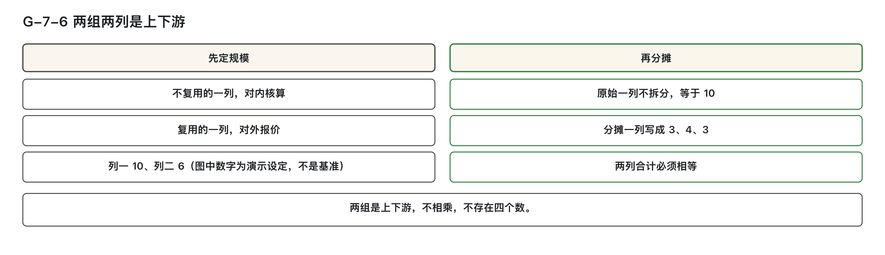

# 第四步：把已计量规模正确挂到机能

本篇不讲功能点如何计数，只处理已计数的功能过程应挂到哪个机能上，以及复杂页面、共享加载、多端复用等场景下的规模归属与分摊规则。所有判定均基于已有计数结果，聚焦于“挂哪里”和“怎么分”。  

> **副标题**：复杂页面按整页还是按区块登记，多个端计为几个  
> **模块二 · 逐步下钻 · 第 ⑦ 篇**。本篇主干规则有两条：一个功能过程只挂一个机能；页面上的位置不能用来划分功能点。共享加载是例外：它仍是一个功能过程，规模却要分给几个区块机能。其余判定：能单独说出业务目的、又能单独验收的区块，独立成机能；共享加载按各区块的已落数据对象数划分，整页级和区块级要标明；多个端是否各计一份，看有没有独立代码、独立交付、独立发布；同一套共用后端只计一次，不按端复制。本篇不讲授功能点的计数方法。

---

## 学习目标

完成本篇后，能够：

1. 对一条已经完成计数的功能过程，判定它挂到哪一个机能；必须拆开时，改写机能边界而不是功能过程，并说明共享加载这个例外按什么处理。  
2. 对一张复杂页面，判定按整页登记还是按区块登记，并写出每个区块的「动词＋对象」业务目的。  
3. 对一次共享加载，标出每条数据移动的归属层级（整页级还是区块级），按已落数据对象数（这次加载真正显示在该区块上的数据对象个数）算出各区块的份额和尾差（拆分后余下的零头归谁），并核对列 A 合计与列 B 合计相等。  
4. 区分规模层的两列（列一、列二）和成本层的两列（列 A、列 B：原始规模与分摊后的规模），说出先用哪一组、后用哪一组，以及各列进入对内核算还是对外报价。  
5. 对同一个画面的多个端，判定拆成几行，检查复用声明缺了哪一项，并写出列一、列二各记多少。  
6. 对一段后端逻辑，判定计几次；对一条主张加上的隐含读或隐含写，检查证据和需求条目号是否具备。

---

## 先按问题查这张表

下钻，指沿着子流程、活动、业务功能、机能一层一层往下找，找到对应的那一行，并写明找到了哪一层。

本篇用到几个前面各篇定下的名称。**机能**，是软件里能被外部触发、用来登记规模的交付单位，一个画面、一个接口、一个定时任务都是机能。**业务功能**，是一项可以单独指认的业务结果，在机能的上一层。**功能点**，是已经数出来的软件规模，登记在机能上；怎么数，本系列不讲。**功能过程**，指一次触发引起的一串处理。**共享加载**，指打开页面时的一次加载同时供给页面上多个区块使用。

已经完成计数的功能过程，只挂一个机能。复杂页面能够拆分时，拆到区块。共享加载的规模按已落数据对象数分。多个端先判定是否拆行，再记两列。

| 当前情况 | 先行确认 | 初步判定 | 详细阅读 |
|---|---|---|---|
| 拟按界面左右两栏，把一个功能过程拆到两个机能上 | 要改的是功能过程，还是机能边界 | 一个功能过程只挂一个机能；必须拆时，改机能边界 | 第三节 |
| 首页或工作台是一整页，按整页还是按区块登记未定 | 该区块能否用「动词＋对象」说出与同页其他区块不同的业务目的，并且单独验收 | 能，独立成机能；说不出，并入它所在的页面；两人判定不一致，按能拆就拆 | 第四节 |
| 打开页面时，一次加载供给多个区块 | 这条数据移动的归属层级填的是整页级还是区块级 | 整页级进整页级登记池，按各区块的已落数据对象数分；某区块对象数为 0，份额记 0，该区块自己的列 A 照计 | 第五节 |
| 除不尽，或有的区块份额为 0 | 尾差归已落对象数最多的哪个机能；最多者是否并列 | 尾差整笔归最多者；并列时按机能主键逐字比较，取升序第一个；全部区块的对象数合计为 0，退回重计 | 第五节 |
| 同一画面在三个端上都有实现 | 独立代码库、独立交付物、独立发布节奏之中，至少成立几项 | 至少两项成立，按端拆行；不足两项，全端一个机能；复用记列二，对内核算用列一 | 第二节、第六节 |
| 一个接口同时供三个端使用 | 后端登记了几行 | 只建一行，只计一次，端填 `—` | 第七节 |
| 每条功能过程都拟加一条权限读、一条日志写 | 主张加计的一方是否举出数据行权限或审计日志，并填写了需求条目号 | 举不出证据，或条目号为空，不加；以前记过的存量不重算 | 第七节 |
| 规模层两列和成本层两列同时出现在一张表上 | 先看哪一组 | 先定规模，再分摊；两组是上下游，不相乘 | 第二节 |

这张表只用来定位，结论按后面各节的判定表作出。本篇例子取自同一个教学案例（第 0 篇交代过背景：汽车经销商 4S 店的销售线索跟进），例子里的机能编号、份额、列一、列二等数字都是为演示设定的，不是可以照抄的标准值，后文不再逐处标注。

数据移动的类型沿用计量规范里的四个字母，本篇只用来读表：E（输入）、X（输出）、R（读）、W（写）。COSMIC（一种按数据移动计量软件规模的方法）的计数细则，本篇不讲。

---

## 一、第四步的输入与产出

第三步的产出是机能登记表。第四步把已经计数的功能点登记到这些机能上，并在机能之间划分共享加载的规模。第四步的产出是两张表：**功能点计算表中的数据移动明细**，以及**机能规模汇总**。规模的单位是 CFP（功能点的计数单位）。

第 ⑥ 篇已经写明边界：凡涉及功能过程、数据移动之处，第 ⑦ 篇只处理这笔规模记在哪个机能上、如何在机能之间划分，不讲授计数方法。本篇假定计数已经完成，用一句识别句认出要挂接的那一笔：一条功能过程，由一次触发事件和至少两次数据移动组成。怎么数出这两次，不在本篇。每个例子只演示两件事：挂在哪个机能，两列如何记载。

机能登记表里有一列「端」：画面类机能填写端名，其余类型一律填 `—`，因为同一套共用后端只建一行，不按端复制。这样填的原因，见第六节、第七节。

本篇写到工时、金额或报表，都按信息技术部门内部使用的管理口径理解：不是企业会计科目，不进入财务凭证，也不产生付款义务。**归集**，指把一笔笔成本收上来、记到某个对象名下；**归属**，指认定这笔成本算谁的；**分摊**，指几个对象共同耗用的成本，按一个说得清的依据分给各方。「挂在某个机能上」只表达归属。

本篇各处的判定都写明谁判、在哪判、谁举证。判定由估算者作出；涉及复核的地方，由未参与初填的另一方独立重做。由哪个岗位担任，各组织自行确定。

机能登记表的行是否可信，靠名录完整性、类型校验、归并复核三道核对保证。三道核对的细则在第 ⑥ 篇，连起来的全景在第八节（图 G-7-7）。

---

## 二、两组两列：先定规模，再分摊

两组“两列”记在不同表上：规模层记在机能规模汇总表，成本层记在功能点计算表的数据移动明细。

- **规模层**：列一（不复用）、列二（复用）——用于对内核算与对外报价；
- **成本层**：列 A（原始规模）、列 B（分摊后规模）——用于归集与分摊。

这两组是上下游关系，**必须先确定规模（列一、列二），再进行分摊（列 A、列 B）**。二者不相乘，也不存在四个独立数值。

### 规模层：列一与列二

- **列一（表头写作「列一 不复用」）**：对内核算用的规模。
- **列二（表头写作「列二 复用」）**：对外报价用的规模。
- 无复用声明时，列二 = 列一。
- 禁止跨列取数：对内核算取列一，对外报价取列二。
- 该组仅对应两种复用类型：多端和跨版本。

图 G-7-6：先确定列一与列二，再划分共享加载的列 A 与列 B。演示中的 10 CFP 分成 3、4、3，合计仍为 10；两组不相乘。

### 成本层：列 A 与列 B

- **列 A**：原始规模，不拆分，留着可核对。
- **列 B**：分摊后的规模，归集成本时用。
- 仅在复杂页面的共享加载上出现；非共享加载的机能，列 B 等于其明细行列 A 之和。
- **列 A 合计必须等于列 B 合计**。

两组通常不同时出现。确实落在同一个机能上时，顺序固定：先定规模（列一、列二），再分摊（列 A、列 B）。

教学案例 S-1.3 里，两组分开出现。跟进结果编辑区的 iOS 行、Android 行有复用声明，用第一组：列一是 2，列二是 1.0。顾问工作台的三个区块没有复用声明，只涉及第二组，列二等于列一。整页级份额是否在列二上再划分一次，这个案例不发生这种情形。S-1.4 的试驾看板同样没有复用声明，列二等于列一。

---

## 三、一个功能过程只挂一个机能

一条功能过程，无论其数据移动分布在页面何处，**只能挂在一个机能上**。界面布局（如左右栏、上下区）不能作为划分功能点的依据。

估算者在功能点计算表的数据移动明细上自判，每条功能过程记录挂一个机能主键。机能主键由载体类型、具体宿主、动作三段拼成，写法见第 ⑥ 篇。主张按界面区块切功能过程的一方负责举证；该主张在本条下不成立。

### 核心原则

- 一个功能过程不得拆到两个机能。
- 若发现必须拆分，应**修改机能边界**，而非拆解功能过程。
- 界面分区与功能过程冲突时，以功能过程为准。

### 特殊例外：共享加载

共享加载仍视为一个功能过程，但其规模需按区块归属分摊：

- 整页级的数据移动（E/R/W）记在「共享加载画面标识」栏下，机能主键填 `—`；
- 区块级的数据移动（X）挂到显示该数据的区块机能上；
- 不新造机能；数据移动明细仍逐行登记。拆的是规模的登记位置，不是功能过程本身。

> 举例：打开顾问工作台是一次共享加载。整页级的 E「工作台查询条件」、R「顾问」行，机能主键为 `—`，共享加载画面标识填「顾问工作台」；四条 X 分别挂至今日待跟进区、新线索提醒区、逾期跟进区。

### 判定表

| 当前情形 | 如何挂接 | 依据 |
|----------|----------|------|
| 一条功能过程的全部数据移动 | 挂同一个机能主键 | 一个功能过程不得拆到两个机能 |
| 界面左右栏、上下区与功能过程对不上 | 以功能过程为准 | 页面上的位置不能用来划分功能点 |
| 认为必须拆成两笔 | 改机能边界，功能过程保持原样 | 必须拆时，改的是机能边界 |
| 主张按界面区块切功能过程 | 该主张不成立 | 主张方举证；本条下不成立 |
| 打开页面的一次共享加载 | 整页级行记在「共享加载画面标识」下，区块级 X 挂对应区块；不新造机能 | 共享加载例外 |
| 同一个机能上的多个按钮，背后各有动作 | 功能过程仍挂这一个机能 | 按钮按业务动作判定，见第⑥篇 |

### 正例

1. **S-1.3「提交跟进结果」**：E「跟进结果」与 X「跟进记录」的机能主键均为 `画面|跟进结果编辑页 跟进结果编辑区|提交`，未按表单区与列表区拆分。
2. **S-1.3「打开顾问工作台」**：整页级 E、R 行机能主键为 `—`，共享加载画面标识为「顾问工作台」；四条 X 分别挂至三个区块。
3. **「展开线索详情」**：属于今日待跟进区自身功能过程，E、X 均挂 `画面|顾问工作台 今日待跟进区|查看`，不并入共享加载。

### 反例

1. 一条「保存」功能过程，因页面左右分栏被拆成两个机能，各挂一半数据移动——错误地将界面布局当作边界。
2. 将「打开工作台」另设为「工作台加载」机能，整页级行挂于此——错误新建机能，违背共享加载不建新机能原则。

---

## 四、复杂页面能拆就拆

复杂页面若满足以下两个条件，应按区块登记，独立成机能：

1. 能用「动词＋对象」说出与同页其他区块不同的业务目的；
2. 能单独验收。

**整页刷新、无提交按钮、无筛选条件，均不否决拆分。**

宿主指区块所在的页面。页面是容器，整页不登记；并入宿主，就是不再单列一行。判定写在机能登记表的主键和来源证据上：画面类主键第二段含区块名，来源证据填写 `区块业务目的：〈动词＋对象〉`。

### 争议处理

两人对“是否可独立验收”判定不一致时，按“能拆就拆”执行。主张合并的一方需举证成立，否则应拆。

### 导航聚合处理

仅负责跳转、无数据移动的区块，按导航聚合处理，不建机能。

### 判定表

| 当前情形 | 建立几个机能 | 依据 |
|----------|--------------|------|
| 区块能用「动词＋对象」说出不同业务目的，且可独立验收 | 独立成一个 | 能拆就拆 |
| 无提交、无筛选，或随整页刷新 | 不因此否决；两问通过仍独立 | 整页刷新、无提交、无筛选不否决 |
| 说不出不同业务目的，或不能单独验收 | 并入宿主 | 主张合并方举证成立 |
| 两人对“可独立验收”判定分歧 | 判定为拆分 | 能拆就拆 |
| 只做跳转、无数据移动 | 不建机能 | 导航聚合，见第⑥篇 |
| 整页只登记一行，其下多个区块均已通过两问 | 改为按区块登记 | 页面是容器 |

### 正例

1. **S-1.3 顾问工作台**：
   - 今日待跟进区：业务目的「查看待跟进线索」，只读列表，仍独立；
   - 新线索提醒区：业务目的「查看新分配线索」；
   - 逾期跟进区：业务目的「查看逾期跟进」；
   三者均可独立验收，各自成机能。
   - 公告导航区仅跳转，无数据移动，不建机能。

2. **跟进结果编辑页**：
   - 跟进结果编辑区：业务目的「登记跟进结果」；
   - 下次跟进区：业务目的「排定下次跟进」；
   同页不同目的，拆成两个机能。

3. **S-1.4 试驾看板**：
   - 今日试驾区、试驾车状态区、历史试驾区各有业务目的；
   三者均独立，各自成机能。

### 反例

1. 一张工作台上三块列表，每块都能用「动词＋对象」表达不同目的，也能单独验收，但登记表仅留一行「工作台」——错误合并，应拆为三行。
2. 一方认为某区块可独立验收，另一方认为不可，当场并入宿主——违反“能拆就拆”原则，应由主张合并方举证，否则应独立。

---

## 五、共享加载按已落对象数分

共享加载不新造机能，规模拆开算。整页级的那几笔规模，按各区块的已落数据对象数占比分；份额保留小数，不取整到整数，取几位由各组织自行确定。

### 核心概念说明

**整页级登记池**：一次共享加载中，服务于整张页面、指不出只服务哪一个区块的数据移动（如 E、R、W），先记入一处临时存放处，再按依据分给各区块。此池为规模层的暂存区，与成本层的共享池（多个功能共用的机能所发生的费用汇集处）无关联，二者互不相干。

**已落数据对象数**：本次共享加载中，真正显示在某个区块上的数据对象个数。仅统计此次功能过程内、归属层级为区块级、且只服务本区块的 X 行所涉及的数据对象。同一对象若有多条 X，只计一次；需求明确要求重复输出的除外，须在来源证据中写明依据。同一数据组出现在多个区块时，仅计入填写人指明的主显示区块，并在来源证据中留痕——留痕指将判断依据记录备查，非签字确认。

> **注意**：E、R、W 不计入已落对象数；其他功能过程的数据移动也不进入。

---

### 分摊规则详解

#### 1. 分摊基数
- 基数为**读写的数据对象数**，非数据移动次数。
- 一次读出 3 个对象，与分 3 次读出，移动次数不同，但对象数相同，故以对象数为准。

#### 2. 已落对象数判定标准
| 情况 | 处理方式 |
|------|----------|
| 同一数据对象在多个区块均有 X 行 | 只计入主显示区块；填写人需指明主显示区块，并在来源证据中留痕 |
| 需求明确要求重复输出该对象 | 重复输出的那一条也计入，来源证据写明依据 |
| 一条 E、R 或 W 无法指明只服务哪个区块 | 归属层级填“整页级”，进整页级登记池 |

#### 3. 份额计算公式
> 区块份额 = 整页级登记池的规模 × 该区块已落对象数 ÷ 各区块已落对象数之和  
> 结果四舍五入至本组织确定的小数位数（本系列演示取 4 位）

#### 4. 尾差处理
- 各区块份额四舍五入后加总，可能与整页级登记池规模存在零头差异，称为尾差。
- 尾差整笔归入**已落对象数最多的机能**。
- 若多个机能并列最多，按机能主键逐字比较 Unicode（统一码，给每个字符编号的国际标准）码位，取升序第一个。
- 来源证据写 `尾差：〈±差额〉`；尾差为 0 时不写 `尾差：`，但仍需参与计算。

> **示例**：顾问工作台三个区块主键从左到右第一个不同的字分别为「今」「新」「逾」，其 Unicode 升序为「今」<「新」<「逾」，故并列时尾差归「今日待跟进区」。

#### 5. 归属层级填写规范
- 一条数据移动的归属层级，在模板上必须明确填写为 `整页级` 或 `区块级`，填表即定，不可口头判断。
- 画面类机能的行和共享加载行必填；
- 画面类机能的 X 行只允许填 `区块级`；
- 非画面类机能的行填 `—`。
- 主张某条 E、R、W 属于区块级的一方，须指出其只服务的具体区块；指不出，则按整页级处理。

#### 6. 已落对象数为 0 的情况
- 该区块份额记为 0；
- 该区块自身功能过程的列 A 照常计算，开发工时照常归集。

#### 7. 全部区块合计为 0 的情况
- 说明计数有误，判不过，整组退回；
- 必须按 COSMIC 计数方法重新数一遍；
- 不设兜底，不等分，不回落至任一区块。

---

### 判定表

| 情况 | 结论 |
|------|------|
| 分摊基数用什么 | 已落数据对象数；数据移动次数不作基数 |
| 哪些行进已落对象数 | 只数本次共享加载所属功能过程中、归属层级为区块级且只服务本区块的 X 行所涉及的数据对象；同一对象多条 X 只计 1；E、R、W 不进；别的功能过程不进 |
| 同一对象在两个区块都有 X，又写不出重复输出的依据 | 只计入填写人指明的主显示区块，来源证据留痕 |
| 需求明确要求重复输出 | 重复的那一条也计入，来源证据写明依据 |
| 一条 E、R 或 W 指不出只服务哪一个区块 | 归属层级填整页级，进整页级登记池 |
| 一条移动只服务一个区块 | 归属层级填区块级，来源证据写「只服务：区块名」 |
| 某区块已落对象数为 0 | 份额记 0；它自己功能过程的列 A 照计，开发工时照归集 |
| 全部区块已落对象数合计为 0 | 判不过，整组退回重计；不设兜底，不回落，不等分 |
| 份额怎么算 | 整页级登记池的规模 × 该区块已落对象数 ÷ 各区块已落对象数之和；保留小数、不取整，四舍五入到本组织确定的位数 |
| 尾差 | 整笔加到已落对象数最多的机能；并列时按机能主键逐字比 Unicode 码位，取升序第一个；来源证据写 `尾差：〈±差额〉`；尾差为 0 不写，但要算 |
| 列 A 与列 B | 同一共享加载组里，列 A 合计必须等于列 B 合计 |

---

### 教学案例演算

#### **S-1.3 顾问工作台**

- 打开顾问工作台是一次共享加载。
- 整页级数据移动：
  - E「工作台查询条件」：各区块都用，指不出只服务哪一块 → 归属层级填 `整页级`
  - R「顾问」：同上 → 归属层级填 `整页级`
  - 整页级登记池规模 = 1 + 1 = 2

- 区块级数据移动（X）：
  - 今日待跟进区：X「线索」→ 已落对象数 = 1
  - 新线索提醒区：X「线索提醒」→ 已落对象数 = 1
  - 逾期跟进区：X「跟进任务」、「线索」→ 已落对象数 = 2

> **关键点**：逾期跟进区的「线索」与今日待跟进区的「线索」是同一数据对象，通常只计一次。但需求-S-06 明确要求“逾期线索须单独列出”，属于重复输出情形，因此该条也计入，来源证据写：`重复输出依据：需求-S-06`

- 各区块已落对象数合计 = 1 + 1 + 2 = 4

- 份额计算（保留四位小数）：
  - 今日待跟进区：2 × 1 ÷ 4 = 0.5000
  - 新线索提醒区：2 × 1 ÷ 4 = 0.5000
  - 逾期跟进区：2 × 2 ÷ 4 = 1.0000
  - 合计：0.5000 + 0.5000 + 1.0000 = 2.0000

- 尾差 = 2 − 2.0000 = 0 → 不写 `尾差：`，但需计算

- 列 A 与列 B 计算：
  - 今日待跟进区：
    - 列 A：共享加载的 X 为 1，加上自身功能过程「展开线索详情」的 E、X 各 1 → 1 + 1 + 1 = 3
    - 列 B：3 + 0.5000 = 3.5000
  - 新线索提醒区：
    - 列 A：共享加载的 X 为 1 → 1
    - 列 B：1 + 0.5000 = 1.5000
  - 逾期跟进区：
    - 列 A：共享加载的 X 为 2 → 2
    - 列 B：2 + 1.0000 = 3.0000

- 核对：
  - 列 A 合计 = 2（整页级）+ 3（今日）+ 1（新）+ 2（逾期）= 8
  - 列 B 合计 = 3.5000 + 1.5000 + 3.0000 = 8.0000
  - 差额为 0，符合要求

> **来源证据示例**：
> - 整页级行：`人工认定：各区块都用，指不出只服务哪一个区块`
> - 区块级行：`只服务：今日待跟进区` / `只服务：新线索提醒区` / `只服务：逾期跟进区`
> - 重复输出：`重复输出依据：需求-S-06`

---

#### **S-1.4 试驾看板**

- 打开试驾看板是一次共享加载。
- 整页级数据移动：
  - E「看板条件」：各区块共用 → 归属层级填 `整页级`
  - R「门店」：同上 → 归属层级填 `整页级`
  - 整页级登记池规模 = 1 + 1 = 2

- 区块级数据移动（X）：
  - 今日试驾区：X「今日排程」→ 已落对象数 = 1
  - 试驾车状态区：X「试驾车状态」→ 已落对象数 = 1
  - 历史试驾区：本次加载未显示任何内容 → 已落对象数 = 0

- 已落对象数合计 = 1 + 1 + 0 = 2

- 份额计算（保留四位小数）：
  - 今日试驾区：2 × 1 ÷ 2 = 1.0000
  - 试驾车状态区：2 × 1 ÷ 2 = 1.0000
  - 历史试驾区：2 × 0 ÷ 2 = 0.0000
  - 合计：1.0000 + 1.0000 + 0.0000 = 2.0000

- 尾差 = 2 − 2.0000 = 0 → 不写 `尾差：`，但需计算

- 列 A 与列 B 计算：
  - 今日试驾区：
    - 列 A：共享加载的 X 为 1 → 1
    - 列 B：1 + 1.0000 = 2.0000
  - 试驾车状态区：
    - 列 A：共享加载的 X 为 1 → 1
    - 列 B：1 + 1.0000 = 2.0000
  - 历史试驾区：
    - 列 A：虽本次加载无数据，但其自身功能过程「展开历史试驾」有 E、R、X 各 1 → 3
    - 列 B：3.0000（自身功能过程独立，不因共享加载而改变）

- 核对：
  - 列 A 合计 = 2（整页级）+ 1（今日）+ 1（状态）+ 3（历史）= 7
  - 列 B 合计 = 2.0000 + 2.0000 + 3.0000 = 7.0000
  - 差额为 0，符合要求

> **说明**：历史试驾区本次加载未落数据，份额为 0，但其自身功能过程列 A 照计，开发工时照归集，列 B 仍为 3.0000。

---

#### **并列尾差演算（设定值，非真实案例）**

- 整页级登记池规模 = 2
- 三个区块已落对象数均为 1，合计 = 3
- 每区份额 = 2 × 1 ÷ 3 = 0.6666… → 四舍五入到四位小数为 0.6667
- 三区合计 = 0.6667 × 3 = 2.0001
- 尾差 = 2 − 2.0001 = −0.0001

- 三个区块已落对象数并列，尾差整笔加至主键升序第一个：**今日待跟进区**
- 该区份额调整为：0.6666
- 其他两区仍为 0.6667
- 三区合计恢复为 2.0000

> **来源证据**：`尾差：-0.0001`

---

### 正例总结

1. **S-1.3 顾问工作台**：按已落对象数 1、1、2 分整页级登记池的 2，份额 0.5000、0.5000、1.0000，尾差 0，列 A 合计等于列 B 合计。重复输出依据已标注。
2. **S-1.4 历史试驾区**：本次加载已落对象数为 0，份额 0.0000；自身功能过程列 A 为 3，列 B 为 3.0000，照计不减。
3. **归属层级标注**：
   - 整页级行：来源证据写 `人工认定：各区块都用，指不出只服务哪一个区块`
   - 区块级行：来源证据写 `只服务：区块名`

---

### 反例警示

1. **按数据移动次数分摊**：一个对象被读三次，就按 3 份摊。不成立。基数应为数据对象数，不是移动次数。
2. **全部区块已落对象数为 0 仍等分或回落**：下面的错误填报是为演示补设的，不是教学案例的提交数据。试驾看板的“今日排程”X和“试驾车状态”X被错填为整页级，区块已落对象数全部成0。整组退回重计，改回区块级后，三块已落对象数为1、1、0；份额为1、1、0，列B才分别得到2、2、3。例如把整页级登记池等分给三个区块，或回落到整页挂一个业务功能并标“未分摊”。不成立。此时必须判不过，整组退回重计，不设兜底。

---

## 六、多端记两列

**端**指终端：电脑端、手机端等。同一个画面在多个端上各有一套实现时，规模层需记两列——列一（不复用）用于对内核算，列二（复用）用于对外报价——禁止跨列取数。

### 判定流程：先拆行，后记两列

1. **是否按端拆行？**  
   看三件事中至少成立几项：  
   - 是否有独立代码库  
   - 是否有独立交付物  
   - 是否有独立发布节奏  

   若三项中至少两项成立，则该画面按端拆行，一个端一行；  
   若不足两项，则全端共用一个机能，「端」一列填写多值（如 `PC；iOS；Android`），规模只计一次，**不得按端数相乘**。

2. **拆行后仍记两列**  
   主张复用、拟在列二折减的一方，必须在「复用声明」中完整填写以下三项：  
   - 被复用机能 ID  
   - 版本号  
   - 契约引用  

   复用类型只能为 `多端` 或 `跨版本`，与另一处取值为“新建、改造、纯复用”的同名字段不同。  
   任一缺项，均按新建处理：**列二等于列一**，不折减。

   当三项齐全且复用类型正确时，列二按本组织确定的复用系数折减；列一保持不变，不因被复用而减少。

> **关键区分**：  
> - 多端：被复用机能须在本期机能登记表查得到，主归属为同一 F 编号（业务功能编号），仅在另一端实现。**不要求进入能力登记簿**。  
> - 跨版本：建设版本早于本期，且能力登记簿可查。登记簿只记复用关系，不记金额。“能力登记簿可查”这一要求只约束跨版本，多端复用无须把被复用机能列入登记簿。

规模汇总中，在“列一 不复用”“列二 复用”“复用声明”三列判定。

### 取数边界与使用规则

- 对内核算：**只取列一**  
- 对外报价：**只取列二**  
- 同一机能上若还有列 A、列 B，须先完成本节规模判定（列一、列二），再进行第五节分摊（列 A、列 B）。两组操作为上下游关系，**不相乘，不存在四个数**。

---

### 判定表

| 情况 | 结论 |
|------|------|
| 独立代码库、独立交付物、独立发布节奏至少两项成立 | 画面按端拆行 |
| 三项中不足两项 | 全端一个机能，端写多值，规模计一次 |
| 复用声明中被复用机能 ID、版本号、契约引用三项齐全，复用类型为多端或跨版本 | 列二按复用系数折减；列一不折减 |
| 三项任一缺 | 按新建处理，列二等于列一 |
| 复用类型写多端 | 被复用机能须在本期机能登记表查得到、主归属同 F 编号、仅在另一端；无需进能力登记簿 |
| 复用类型写跨版本 | 建设版本早于本期，且能力登记簿可查 |
| 对内核算取数 | 只用列一 |
| 对外报价取数 | 只用列二 |
| 同一机能上有列 A、列 B | 先定规模（列一、列二），再分摊（列 A、列 B）；两组不相乘 |

---

### 正例

1. **S-1.3 的跟进结果编辑区**  
   在 PC、iOS、Android 三端均有独立代码库、独立交付物、独立发布节奏，三项均成立 → 拆成三行。  
   iOS、Android 主张复用 PC 画面，复用类型为 `多端`。  
   复用声明填写：  
   - 被复用机能 ID：`画面|跟进结果编辑页 跟进结果编辑区|提交`  
   - 版本号：`V-示例-1`  
   - 契约引用：`交互规格-S-01`  
   三项齐全，符合要求。  
   被复用的 PC 画面无需进入能力登记簿。  
   复用系数取 0.5（演示设定）。  
   - 列一：2.0  
   - 列二：1.0  
   列一用于对内核算，列二仅用于对外报价。

2. **S-1.4 的试驾预约页**  
   PC、iOS、Android 使用同一套代码、同一交付物、同一发布节奏，三项一项都不成立 → 不拆行。  
   「端」列填写 `PC；iOS；Android`，规模只计一次，不按三端乘三。

3. **S-1.3 顾问工作台的三个区块**  
   无复用声明，列二等于列一，未跨列取数。

---

### 反例

1. **某端复用声明缺契约引用**  
   复用声明中写了被复用机能和版本，但契约引用为空 → 三项缺一，应按新建处理，列二等于列一。  
   若仍按折减后报价，错误。

2. **对内核算误取列二**  
   在对内核算时，取了 iOS 行的列二 1.0，未取列一的 2.0 → 错误。  
   列二不用于对内核算，列一不用于对外报价。

---

## 七、同一套共用后端只计一次

同一套接口、消息消费者、定时任务或事件消费的后端实现，无论支撑几个端，**只建一行，只计一次**，「端」列填 `—`。

> **例外说明**：  
> 若同一段后端逻辑以两种形式暴露，两种触发形式分别登记机能和功能过程；共用后端逻辑的规模只计一次，不按端复制。

### 隐含读写：主张加者举证

隐含读（R）、隐含写（W）指需求未逐条明写，但实现时可能需要的数据读取或保存。**默认不加**，主张加者须提供证据：

- 加 R：有单独的数据行权限控制，且在需求条目中明确要求  
- 加 W：有单独的审计日志要保存，且在需求条目中明确要求  

每条主张必须填写对应的 **FUR 依据**（功能性用户需求条目号），并写入来源证据。

> **审核机制**：  
> - 隐含读写这一格由**非初填人**的审核方判，独立重判，不得自己复核自己。  
> - 人工审核把关，不设自动拦截。

### 存量不重算

以前按另一套方法记过的记录，尚未重做的，**不按本条重新计算**。  
不同记法的数字不能直接比较，报表必须标明所用记法。

后端计几次由估算者自判，在机能登记表确认只登记一行。隐含读写由审核方独立判定，在数据移动明细的“隐含读写标记”“FUR 依据”两列留下结果。

### 判定与责任归属

| 情况 | 结论 |
|------|------|
| 接口、消息消费者、定时任务、事件消费支撑多个端 | 只建一行，只计一次，端填 `—` |
| 主张加隐含读 | 必须有单独数据行权限控制，并填需求条目号；否则不加 |
| 主张加隐含写 | 必须有单独审计日志保存要求，并填需求条目号；否则不加 |
| FUR 依据为 `—` 或留空 | 该条隐含读写不计，列 A 记 0 |
| 以前按另一套方法记过、尚未重做 | 存量不重算；两种记法数字不可比，报表须标明记法 |

---

### 正例

1. **S-1.3 接口 `接口|POST /api/follow/result|提交`**  
   供 PC、iOS、Android 三端共用，仅登记一行，端填 `—`，规模只计一次。

2. **同一接口明细中的隐含读写**  
   - R「顾问数据权限」：标了权限读，但 FUR 依据为 `—`，来源证据写明“本功能无单独数据行权限要求” → 不加，列 A 记 0  
   - W「跟进变更日志」：标了审计写，FUR 依据为 `需求-S-07`，来源证据写明“该条要求修改单独留痕” → 加，列 A 记 1  
   - 该接口四行合计列 A = 3，汇总行列一、列二均为 3

3. **S-1.4 接口 `接口|POST /api/sms/send|发送`**  
   被两个业务功能触发，仍只登记一行，只计一次，端填 `—`。

---

### 反例

1. **后端按端复制三行**  
   一个查询接口供三端共用，登记表却按端复制三行，规模乘以三 → 错误。  
   后端只建一行，只计一次。

2. **隐含读写无依据强行加**  
   每条功能过程都加一条权限读、一条日志写，但 FUR 依据为空 → 应不加。  
   已按旧方法结过的记录，又按本条重算一遍，与本期数字混在同一张未标明记法的报表中对比 → 错误。  
   存量不重算，记法必须标明。

---

## 八、三道核对全景，和换一个人重做

三道核对——名录完整性、类型校验、归并复核——均来自第⑥篇，是对机能登记表的检查流程。  
一道核对修改了登记表，另外两道要对改过的行重新核对。暂时找不到归属的金额由第 ⑧ 篇处理。

图 G-7-7：名录完整性、类型校验和归并复核相互校验；类型校验必须由另一人独立重做。

### 换人重做机制

抽取一部分已填好的明细和汇总，交给另一人，**不出示原结论**。  
由该人仅根据本篇判定表，重新完成以下两件事：  
1. 每条功能过程挂哪个机能  
2. 两组两列如何记载  

逐行比对两人结论。

### 一致率计算

> **一致率 = 结论相同的行数 ÷ 抽中的行数**

- 分子：两人在本篇所管几列上完全一致的行数  
- 分母：抽中的总行数  
- “相同”仅指以下几列一致：  
  - 挂上的机能主键  
  - 归属层级  
  - 列 A 与列 B  
  - 列一与列二  
  - 复用声明是否按判定表记载  

> 不比较数据移动如何识别。抽多少行、达到什么一致率算通过，由各组织确定，不进入判据。

### 分歧处理

两人结论不同时，**不在当场商定折中结果**。  
将分歧登记下来，回到本篇判定表，确认哪一个条件尚未满足。  
补齐条件后，重新判定该行。

---

## 练习与自测

### 练习要求

取一个已完成功能点计数的复杂页面，连同其多个端和后端，执行以下操作：

1. 将每条功能过程的数据移动归到一个机能主键上。  
   - 若界面分区导致功能过程跨区块，改机能边界，不改功能过程；  
   - 属于共享加载的，写明哪些行记在「共享加载画面标识」下。

2. 对每个区块写 `区块业务目的：`。  
   - 说不出与同页其他区块不同的“动词＋对象”，或不能单独验收的，**并入宿主**；  
   - 两人意见不一致时，按“能拆就拆”原则处理，并记录分歧。

3. 给每条 E、R、W、X 填归属层级。  
   - 计算各区块已落对象数、份额、尾差；  
   - 核对列 A 合计与列 B 合计相等；  
   - 已落对象数为 0 的区块，份额记 0，列 A 照计，工时照归集。

4. 若有多个端，逐端判断：
   - 是否独立代码库？
   - 是否独立交付物？
   - 是否独立发布节奏？
   - 成立两项以上 → 拆成多行；不足两项 → 全端共用一个机能；
   - 复用声明缺一项 → 列二按新建处理；
   - 明确对内核算取列一，对外报价取列二。

5. 同一套共用后端只保留一行。  
   - 主张加隐含读写的，写出数据行权限或审计日志要求及需求条目号；  
   - 条目号为空 → 列 A 记 0。

完成后，将明细与汇总交由另一人独立重做，不展示原结论。两人结论不一致的行，返回判定表，不当场折中。

---

### 自测题与答案要点

1. **判定**：一条功能过程因页面左右分栏被挂到两个机能上。应改什么？功能过程是否改动？  
   → 改挂接，使该功能过程只挂一个机能。功能过程不改。必须拆时，改机能边界。

2. **写出**：打开顾问工作台时，整页级的 E、R 记在哪一栏？这一例外按什么处理？  
   → 记在「共享加载画面标识」栏，案例中填 `顾问工作台`，机能主键填 `—`。区块级X仍挂显示它的区块机能，这是共享加载的例外处理。

3. **判定**：同页三个区块都能用“动词＋对象”说出不同业务目的。其中一块，甲说可以独立验收，乙说不能。登几个机能？  
   → 按“能拆就拆”原则，三个区块都独立。两人对“可独立验收”判定不一致时，不并入宿主。

4. **判定**：一块区域说不出与同页其他区块不同的业务目的。如何处理？没有提交按钮，能否单独作为并回整页的理由？  
   → 并入宿主。整页刷新、无提交、无筛选都不否决独立；不能用“没有提交”作为并回整页的理由。

5. **判定**：分摊时，一种做法按数据移动次数，另一种做法按已落数据对象数。采用哪一种？E 和 R 是否进入已落对象数？  
   → 采用已落数据对象数。只数本次共享加载中，区块级且仅服务本区块的 X 行所涉及的数据对象。E、R、W 不进。同一对象多条X只计1；需求明确要求重复输出且写明依据的除外。

6. **计算**：整页级登记池规模是 2，顾问工作台三个区块的已落对象数都是 1，份额四舍五入到四位小数。尾差是多少？归哪个机能？来源证据如何填写？  
   → 每区份额 = 2 ÷ 3 ≈ 0.6667，三笔合计 2.0001，尾差 = −0.0001。  
   → 三个区块并列，归主键升序第一个（如“今日待跟进区”）。  
   → 来源证据写：`尾差：-0.0001`。今日待跟进区变为0.6666，另两区仍为0.6667。

7. **判定**：一次共享加载中，三个区块的已落对象数都是 0。下一步做什么？能否等分？  
   → 判不过，整组退回重计。不设兜底，不等分，也不回落整页。

8. **判定**：历史试驾区在「打开试驾看板」里没有 X，自己的「展开历史试驾」列 A 是 3。份额记多少？列 B 记多少？  
   → 份额记 0。它自己功能过程的列 A 照计，开发工时照归集，列 B 记 3.0000。

9. **判定**：iOS 行的复用声明有被复用机能和版本，没有契约引用。列二如何记载？对内核算取哪一列？  
   → 三项缺一，按新建处理，列二等于列一，不折减。对内核算取列一。

10. **判定**：三个端里，只有代码库是分开的，交付物和发布节奏都相同。画面拆几行？  
    → 三项不足两项，全端共用一个机能，规模计一次。

11. **判定**：一个接口给 PC、iOS、Android 三个画面用。登记几行？端填什么？  
    → 一行。端填 `—`。无论支撑几个端，只计一次。

12. **判定**：有人主张加一条权限读，FUR 依据为空。是否加计？审计写需要加计时，须先提供什么？  
    → 不加。FUR 依据留空则不加。主张加计审计写的一方，须举出单独的审计日志要保存，并填写需求条目号。

13. **复述**：一个功能过程挂一个机能的规则，并补上共享加载这个例外的处理写法。  
    → 一条功能过程由一次触发事件和至少两次数据移动组成，页面上的位置不能用来划分功能点。一个功能过程不得拆到两个机能；必须拆时，改机能边界，不改功能过程。共享加载仍是一个功能过程，整页级的行记在「共享加载画面标识」下，这是为例外定的处理写法。

---

## 本篇依据与组织数字约定

### 本篇依据

- 功能过程边界不看界面布局，一个功能过程不拆到两个机能，必须拆时改机能边界：CM-ADR-012 §4.3、§6 第 2 项，CM-ADR-006 §3 R1。
- 复杂页面能拆就拆、说不出则并入宿主、两人判定不一致按能拆就拆、整页刷新无提交无筛选都不否决：CM-ADR-006 §3 切分方向、§3.1 判据 v2、§4 Q2／Q3。
- 共享加载两列记账、数据显示在哪个区块该 X 就归哪个区块：CM-ADR-006 §3.2、§3.2.1、§4 Q4。
- 已落对象数合计为 0 时退回重计、不设兜底，尾差并列时按机能主键比 Unicode 码位取升序第一个，共享加载作为例外的处理写法：均属本系列的约定。原决策记录（CM-ADR-006 L126、L188）的“回落整页挂单一业务功能并标未分摊”写法，本系列不采用。
- 规模层两列，端的拆行看三项里至少两项，复用声明三项任一缺按新建：CM-ADR-005 §3 第 3、4 条、§4 Q1、§6.1，CM-ADR-003 §3.1、R3。
- 复用系数 0.5 是演示设定；§6.1 所引标准资料中的例子是移动端重复事务按 1/6 计。
- 复用类型只分多端、跨版本，「能力登记簿可查」只约束跨版本：属本系列的约定。
- 同一套共用后端只计一次，隐含读写默认不加，存量不重算、报表标明记法：CM-ADR-005 §3 第 2 条、§4 Q2，CM-ADR-012 §3.1 N1，CM-ADR-004 §3.3、R2、§5、§6 第 1 项，CM-ADR-007 §4.3。
- 「新增 2 CFP／变更 1 CFP」属于功能点如何计数，本系列不设列承载。规模层 4 位小数是演示取值。
- 两组两列先定规模、再分摊、不相乘：本系列教学纲目第 ⑦ 篇。各条判定的四栏（谁判、在哪判、谁举证、并列时怎么定）见附录 B。案例里的挂接、份额和两列见附录 E 的 S-1.3 第 1.4 节、S-1.4 第 4.4 节。按钮按业务动作判定、三道核对的细则见第 ⑥ 篇，三道核对的全景是本篇图 G-7-7。

### 组织数字表（各组织自行确定）

| 数字 | 用于何处 | 说明 |
|------|----------|------|
| 新增 2 CFP，变更 1 CFP | 不设列承载 | 属于功能点如何计数，本篇不讲授，仅作背景参考 |
| 规模层保留几位小数 | 第五节份额 | 保留小数、不取整到整数是判据；取几位由各组织自行确定；本系列演示取 4 位，四舍五入 |
| 复用系数 | 第六节列二 | 案例 S-1.3 取 0.5，仅为演示；公开标准中有“移动端重复事务按 1/6 计”；各组织自行确定 |
| 抽样复核抽多少条、一致率到多少算通过 | 第八节 | 只进这张表，不进判定表；「必须换一个人独立重做，不得自己复核自己」是方法，留在正文 |

这些数字由各组织确定，不是换一个项目仍适用的标准；更换组织时重新确定，本篇判据不变。
