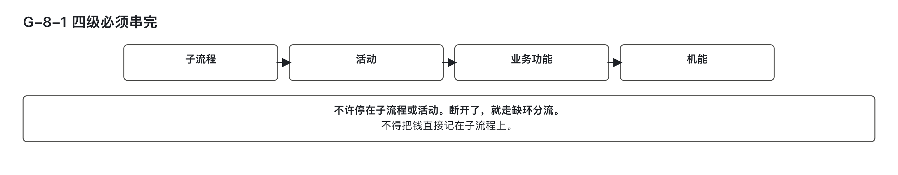
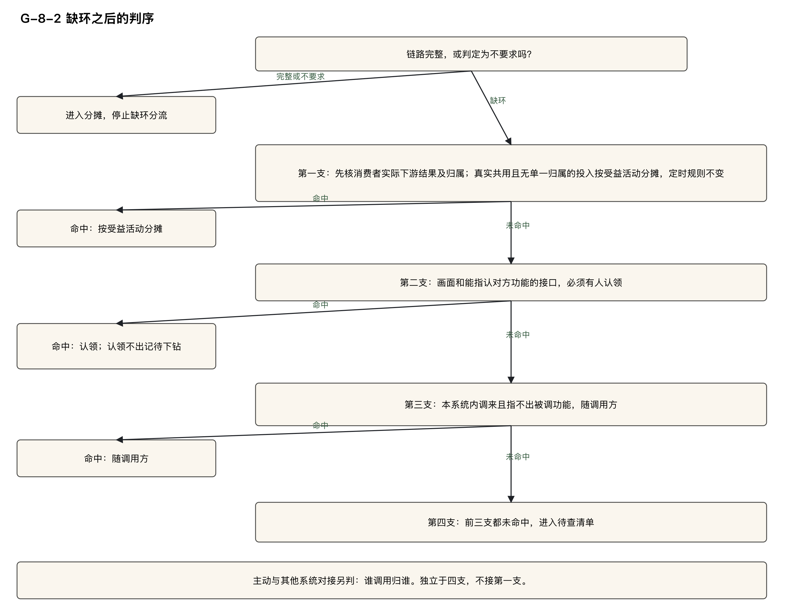
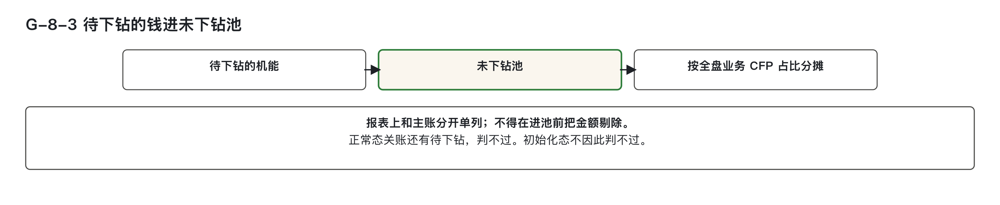
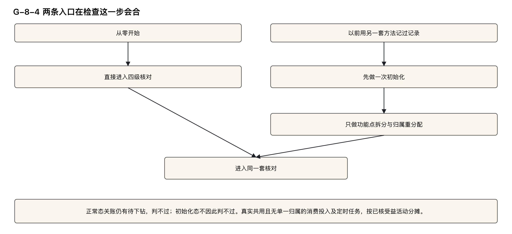

# 检查：四级链路串起来了没有

> 副标题：需求材料只写到子流程或活动时，那笔金额记到哪里去  
> 模块二 · 逐步下钻 · 第 ⑧ 篇  

---

## 学习目标

完成本篇后，能够：

1. 对一个机能，判定子流程、活动、业务功能、机能四级是否已经串接完成，写出链路判定：完整、不要求、缺功能、缺活动、缺子流程。  
2. 对串不起来的机能，按缺环分流的顺序判定它落在哪一支，写出下钻状态；与其他系统对接的，写出归哪个调用方。  
3. 对待下钻行的金额，写出它进哪个池、分摊依据怎么填、报表如何单列，并区分正常态和初始化态下关账时核对的三件事。  
4. 判定一行许不许等分，说清本篇的等分和第 ⑨ 篇的等分各管哪一种行。  
5. 对首次采用本方法的组织，判定是否实施初始化、实施几次、完成后进入什么状态。

---

## 快速判定

先交代本篇用到的几个说法。**下钻**，指沿着子流程、活动、业务功能、机能一层一层往下找，找到对应的那一行，并写明找到了哪一层。**机能**，是用来登记软件规模的单位，一个画面、一个接口都是机能；它上面一层是**业务功能**，指一项可以单独指认的业务结果。**CFP**，功能点的计数单位；功能点本身怎么数，本系列不讲授。

本篇的例子取自同一个教学案例：汽车经销商（4S 店）的销售线索跟进，线索是有购车意向的客户留下的一条记录。案例里流程和活动的编号以 `S-` 开头，业务功能的编号以 `F-` 开头。案例中的金额和数字都是为演示设定的，不是可以照抄的标准值，后文不再逐处标注。

本篇涉及的金额和报表，都按信息技术部门内部使用的管理口径理解：不是企业会计科目，不进财务凭证，不产生付款义务；「记在某个功能上」只表达归属。篇中出现的估算者、审核方都是职能名称，由哪个岗位担任，各组织自行确定。

| 当前情况 | 初步判定 | 详细阅读 |
|----------|----------|----------|
| 需求材料只写到子流程或活动，其下没有机能 | 找出四级中断开的第一环，记缺功能、缺活动或缺子流程，转入缺环分流；该笔金额不得记成任何一个指名业务功能的成本 | 第二节、第三节 |
| 消息消费者、事件消费、定时任务挂不到某一个活动上 | 链路完整的，不进入分流；消费者先核对实际下游业务结果与归属，真实共用且无单一归属时才按受益活动分摊；定时任务原判法保留 | 第二节、第三节 |
| 画面，或能指认对方功能的接口，还没有人认领 | 第二支，必须有人认领；认领不出的，下钻状态记待下钻 | 第三节、第四节 |
| 类型判不出，编号也没有 | 四支都没命中的，先进待查清单；未登记不是成本去处 | 第三节 |
| 本系统主动调用其他系统，成本想单独设一笔 | 不在四支之内；谁调用归谁 | 第三节 |
| 认领不出的金额，想按个数平均分摊 | 受益方留痕为空的，不许等分，只能按全盘业务 CFP 占比分摊 | 第五节 |
| 正常态下，关账时表上还有待下钻 | 关账校验判不过；期内仍先进未下钻池，单列披露 | 第四节 |
| 初始化态下，关账时仍有待下钻 | 不因此判不过 | 第四节、第六节 |
| 首次采用本方法，且以前用另一套方法记过记录 | 必须做一次初始化，只做功能点的拆分与归属重分配；从零开始的不做 | 第六节 |

这张表只用来定位，下结论按后面各节的判定表。

---

## 一、这一步做什么：只核对，不重新计数

第四步交出功能点计算表和机能规模汇总两张表。检查这一步不重新数功能点，也不再拆机能，只做三件事：逐条核对每个机能的四级链路；给串不起来的行定去向；把待下钻行的钱送进未下钻池——暂时找不到归属的钱先放的池子。

这一步交出两样东西：

- **链路核对视图**：一个机能一行，每行写两列。一列是链路判定，取值为完整、不要求、缺功能、缺活动、缺子流程；另一列是下钻状态，取值见下面的状态一览。
- **分摊表里池类型为 `未下钻池` 的行**，以及**报表上与主账分开单列的那一行**。分摊表，是记录池里的钱按什么依据分给各方的表；主账，是记当期实际发生成本的那本账。

下钻状态在机能层只有四个取值，一次给全：

| 下钻状态 | 意思 |
|----------|------|
| `已下钻` | 链路完整，或者主归属是平台功能、公共能力而不要求挂活动；归属已定 |
| `待下钻` | 链路断了，这一行应当有人认领却还没认领到；钱先进未下钻池 |
| `本质无单一归属` | 它服务到的活动不止一个，本身就没有单一归属；按受益活动分摊，是正常路径，不是缺陷 |
| `未登记` | 类型还判不出，行还挂在待查清单上；不是成本去处，关账前必须清零 |

动手核对前，先写明两个校验参数：当前所处状态是 `初始化态` 还是 `正常态`，本次是不是关账校验。**初始化态**，指刚改用本方法、存量记录还没清理完的那段状态；**正常态**，指初始化完成后的日常状态，从零开始、从未需要初始化的，也在正常态。**关账**，指期末封存这一期的账，不再改动。这两个参数写在校验条件里，机能登记表上没有这两列。状态不同，同一行待下钻的关账结论不同，见第四节和第六节。

文中用 **L4**、**L5** 称呼链路中的两层：**L4 是子流程**，**L5 是活动**。另有一列在这里交代：**受益方留痕**，指把「这笔钱算给谁、查过什么材料、为什么查不到」写下来备查的一列。它是留痕，不是找人签字。

---

## 二、四级链路必须串完，第一处断开即停

子流程、活动、业务功能、机能，四级必须逐级串完，不许停在中间某一环。为什么停不得，第 0 篇已经讲过：活动个数和软件规模之间没有固定换算，停在子流程或活动上，就等于拿没串完的材料去算钱。

检查的顺序是从机能往回找：**机能 → 主归属功能 → 活动 → 子流程**。主归属功能，指这个机能登记归属的那个功能。第一处断开即停，断在哪一环，链路判定就记缺哪一环；主归属功能的编号填 `—`（空）的，记缺功能。主归属功能的身份是平台功能（登录、权限这类不挂业务活动、全系统共用的功能）或公共能力（挂不上业务架构、且被两个以上业务系统共用的能力）的，本来就不挂活动，链路判定记不要求。

判定为完整或不要求，链路就算串完，进入后续分摊，不进入第三节的分流。其余情形一律走缺环分流。

串不完的那一笔钱，「不得计入报价」指的是：**不得记成任何一个指名业务功能的成本**。它不是把这笔钱删掉——待下钻行的钱进未下钻池，按全盘业务 CFP 占比分摊，报表单列，也不进不计入投入清单。不计入投入清单，是登记「这笔钱不算进投入」的清单；待下钻的钱仍是投入，只是归属未定。池怎么填、关账怎么判，第四节展开。

链路核对是机械判定，由工具按登记数据自动带出，估算者核对即可。主张「不要求」的一方，以功能登记表上已经写好的身份为证；平台功能和公共能力的身份怎么定，第 ⑩ 篇展开，本篇只使用登记表上已有的结论。

### 判定表

| 当前情形 | 链路判定 | 下一步 |
|----------|----------|--------|
| 从机能能走到主归属功能，从该功能能走到活动，从活动能走到子流程 | 完整 | 链路已经串完，进入分摊，不走缺环分流 |
| 主归属功能的身份是平台功能或公共能力 | 不要求 | 链路已经串完，进入分摊；不因为没有活动而转入分流 |
| 按 机能 → 主归属功能 → 活动 → 子流程 往回查 | 第一处断开即停，不再往下改判 | 断在哪一环，记缺功能、缺活动或缺子流程 |
| 主归属功能编号为 `—` | 缺功能 | 走缺环分流 |
| 主归属功能在，活动接不上 | 缺活动 | 走缺环分流 |
| 活动在，子流程接不上 | 缺子流程 | 走缺环分流 |
| 材料只写到子流程（L4）或只写到活动（L5） | 不得停在这一级 | 必须继续串到业务功能，再串到机能 |
| 任一环节缺失 | 不得记成任何一个指名业务功能的成本 | 待下钻行的钱进未下钻池，按全盘业务 CFP 占比分摊，报表单列，不进不计入投入清单 |

---

### 教学案例走法

1. **S-1.3 的画面 `画面|跟进结果编辑页 跟进结果编辑区|提交`**：主归属是 `F-S-1.3.2.1`，活动是 `S-1.3.2`，子流程是 `S-1.3`。四级都在，链路判定为**完整**，下钻状态为 `已下钻`，进入分摊，不走分流。

2. 同一案例的定时任务 `定时|XxlJob#autoApprove|战败自动审批`，主归属F-S-1.3.5.1，活动S-1.3.5，子流程S-1.3，链路完整。消息消费者则先核对下游业务结果。更新首触任务跟进结果产生线索状态变更事件；本例接收方更新客户状态，其消费者 `消费者|clue.status.changed customer-status-group|更新客户状态` 归 F-S-1.3.6.1，活动 S-1.3.6，子流程 S-1.3，链路完整。不能把它登记成上游功能的第三个机能。每个受影响的下游有自己的消费者；消费者是程序，是角色使用的工具，不是岗位。

3. **S-1.1 的 `接口|POST /api/auth/login|登录`**：主归属是 `F-S-0.1`，身份是平台功能。链路判定为**不要求**，下钻状态为 `已下钻`；它不因为没有活动而被写成缺活动。

图 G-8-1：四层对应须完整核对；出现真正缺环时，按缺口处理投入，不能直接把金额记到子流程或活动。

---

## 三、缺环分流：四支按顺序判，对接的谁调用归谁

缺环，指这条四级链路中间断了一环；分流，指按机能的类型分别给去向，不是一律归进某一类，也不是一律逼认领。

分流各支里，凡是把钱分给几方的，都用同一句分法。先在这里写全，后文只用短名「这三种分法」：能指出名字的，按直接归属（这笔直接算到那一方头上）、消费占比（按各方用掉的功能点比例分）、等分（各方平均分），按顺序判定，选第一个符合的；消费占比这种分法现在做不到，先不用。这三种分法各自在什么条件下用、报表上怎么标注，在第 ⑨ 篇展开。

缺环之后，按下面的顺序判定，选第一个符合的一支：

1. **第一支：本身没有单一归属的一类**  
   消息消费者和事件消费先识别实际处理的下游结果及业务功能；不能仅凭类型归入本支。确有共用且没有单一归属的消费者，以及按原规则处理的定时任务，下钻状态带出 `本质无单一归属`，按受益活动分摊——受益活动，指这项机能实际服务到的那些活动。这是正常路径，不是缺陷。消费者名字带「对接」，仍须先核对实际下游结果及归属；确有共用且没有单一归属时才走这一支。  
   > **关键点**：事件发布随产生方，框架已有发布能力一般不单列；RabbitMQ 负责事件分发，不单列机能。每个下游消费者应根据其实际影响的业务结果归属下游功能。  
   > **案例说明**：`事件|ClueCreated ClueBroadcastHandler|线索建档广播` 实际刷新线索缓存（附录E §2.4），非仅作分发；其真实共用投入仍按证据处理，不能因名称或类型断定无归属或禁止共享。应核对事件订阅表中列出的实际共用关系与受益活动，如 S-1.1.2 和 S-1.3.2，按受益活动分摊。

2. **第二支：必须有人认领的一类**  
   画面、触发方为用户的接口、能指认被调方业务功能的服务间调用接口、调用方在本系统之外且指不出业务功能的接口，属于链路真正断开的地方，必须有人认领；认领不出的，下钻状态记 `待下钻`。调用方在本系统之外、指不出业务功能这一支，也覆盖从外部调入、指不出业务功能的接口。  
   > **案例说明**：S-1.1 的画面 `画面|线索导出页 批量导出区|导出` 缺功能，命中第二支。必须有人认领；认领后仍无法确认主归属的，主归属留空，下钻状态记 `待下钻`。

3. **第三支：随调用方**  
   服务间调用、调用方在本系统内、指不出被调方业务功能的，随调用方。只有一个调用方的：主归属等于调用方的业务功能，下钻状态取调用方的状态，按直接成本记——直接成本，指不经过池、直接记到一个功能头上的成本。有多个调用方的：主归属取各调用方业务功能编号升序的第一个，成本进共享池——几个功能共用的钱先放在一起的池子——使用方为各调用方的业务功能，按这三种分法分。调用方的主归属是平台功能或公共能力的，那一份跟着进平台池或公共池，也就是平台功能的钱、公共能力的钱各自进的池子。调用方全是第一支的，本行也按第一支处理，受益活动取各调用方受益活动的并集。  
   > **案例说明**：回传整车厂线索平台，是本系统主动调用其他系统的对接。客户端代码不单独成行。当前定版封存的调用链上有两个调用方：`接口|POST /api/clue|登记` 和 `接口|POST /api/follow/result|提交`。调用方有多个，进并入池，成本池写 `归挂：外部连携整车厂线索平台／整车厂线索回传客户端`——「归挂」是表上的固定填法，意思就是并入。调用日志只用来补漏，不按调用量分。

4. **第四支：进待查清单**  
   前三支都没命中的，先进待查清单——判定悬着、稍后再定的条目，都登记在那里——下钻状态暂填 `未登记`。每一条只有三种结果：  
   （a）查到调用方：回到前三支重判一次；能指认被调方业务功能的按第二支，什么都不是的随调用方。没有自身触发方的内部逻辑不单独成机能：一个入口，并入那个入口机能；多个入口，进并入池——共享池的一种，专收多入口内部逻辑的工时；查不到入口的，进不计入投入清单并披露——不挂到任何功能上，但账上可见。工时不得凭空消失。随调用方且调用方有多个的，进并入池，成本池写 `归挂：〈名称〉`。  
   （b）查到业务含义：记 `待下钻`；能直接指认到业务功能的，判 `已下钻`。  
   （c）查不清：提下线建议，下线前整笔进未下钻池；下线建议必须写期限，过期判不过。  

> **特别强调**：`未登记` 不是成本去处，分摊表里不许出现。关账时待查清单非空，整期不通过。

---

### 与其他系统对接的一支，不在这四支里

它只指本系统主动调出去的情形；其他系统调进来的，按普通接口登记，再走上面的判定。对接有两种形态：  
- 做成自己端点的——适配服务 `/internal/**` 路径、Feign（一种服务间调用的代码声明）、RPC（远程过程调用）——是一行机能，触发方式是服务间调用，按上面四支判；  
- 只是调用方里面一段客户端代码的，不单独成行，并入调用方，调用方有多个时进并入池。  

**原则只有一句**：谁调用归谁。

点对点队列的另一类场景，本系列暂不展开。

---

### 调用方怎么认定

以当前定版封存的代码为准：从被调端点或对接调用点沿调用链往上找，找到的第一个触发方为用户、调度器、消息中间件或服务间调用、且在登记表里有主键的机能，就是调用方；途经的领域服务不算。调用方取代码里直接看得到的全部调用位置；调用日志只用来补漏，日志里有、代码里没有的，逐条人工判定。不按调用量多少分。

---

### 谁来判

类型分支由工具按登记数据自动带出，估算者核对。接口行有三件事由审核方判：能不能指认被调方业务功能、调用方在本系统内还是本系统外、调用方是谁。旧写法「按类型列机械分流」已废止：同一个类型，链路完整与否的去向不同，只看类型会把链路完整的行也拖进分流。

---

### 谁来举证

主张「能指认被调方业务功能」的一方，写 `被调方功能：〈F〉；依据：〈接口契约条目／需求条目／表 B 活动主键＋输出状态〉`，并且这个业务功能在功能登记表里查得到；表 B 是本方法自己扩的活动表。只凭名字相像的，按指不出处理。  
主张随调用方的一方，列出全部调用方的主键和调用位置出处。  
与其他系统对接，不能再作为归第一支的理由。  
待查清单上的每一条，按结果留痕：  
- `查实调用方：〈调用链/日志〉`  
- `查实业务含义：〈材料〉`  
- `下线建议：〈编号；提出日；期限〉`

---

### 判定表

| 当前情形 | 如何归属 | 下钻状态 |
|----------|----------|----------|
| 链路判定为完整或不要求 | 不进入分流，进入分摊 | `已下钻` |
| 缺环，已确认真实共用且无单一归属的消费者，或按原规则处理的定时任务 | 第一支，按受益活动分摊，这是正常路径 | `本质无单一归属` |
| 缺环，消费者名字带对接 | 先核对实际下游结果及归属，不能按名字定去向 | 根据实际关系判定 |
| 缺环，类型是画面；或触发方为用户的接口；或能指认被调方业务功能的服务间调用接口；或调用方在本系统之外且指不出业务功能的接口 | 第二支，必须有人认领 | `待下钻` |
| 服务间调用，调用方在本系统内，指不出被调方业务功能，调用方只有一个 | 随调用方：主归属等于调用方的业务功能，按直接成本记 | 取调用方的状态 |
| 同上，调用方有多个 | 主归属取各调用方业务功能编号升序的第一个；成本进共享池，使用方为各调用方的业务功能，按这三种分法分；调用方主归属是平台功能或公共能力的，那一份进平台池或公共池 | 取调用方的状态 |
| 调用方全是第一支 | 本行也按第一支处理，受益活动取各调用方受益活动的并集 | `本质无单一归属` |
| 四支都没命中 | 先进待查清单，三种结果只按（a）（b）（c）落 | 暂填 `未登记` |
| 下钻状态是 `未登记` | 不进分摊表；未登记不是成本去处 | — |
| 关账时待查清单还有行 | 整期不通过 | — |
| 本系统主动调用其他系统，调用方只有一个 | 归该调用方的机能；客户端代码不单独成行 | 随调用方的状态 |
| 本系统主动调用其他系统，调用方有多个 | 进并入池，按这三种分法分；调用方主归属是平台功能或公共能力的，那一份进平台池或公共池 | 取调用方的状态 |
| 其他系统调进来 | 按普通接口登记，再走上面的判定 | 不属于对接那一支 |
| 接口行要定被调方、调用方在系统内还是系统外、调用方是谁 | 审核方判这三件；类型本身由工具带出，估算者核对；不按类型清单机械分流 | — |
| 主张能指认，依据只是名字相像 | 按指不出处理 | 走指不出的那一支 |

---

### 教学案例走法

1. **S-1.1 处于初始化态**。事件消费 `事件|ClueCreated ClueBroadcastHandler|线索建档广播` 和定时任务 `定时|XxlJob#recycleTimeout|超时线索回收`，主归属都是数据功能 F-S-0.4——数据功能，指不挂业务活动、承接数据本身的广播与回收等处理的功能。原例登记链路缺活动。定时任务按原规则处理；事件消费须确认实际下游业务结果及真实共用关系，再判其归属集合。受益活动写在受益方留痕里：S-1.1.2 和 S-1.3.2；线索建档处理器实际刷新线索缓存，按事件订阅表所列的实际共用投入及受益关系判断，不能凭广播名将其当 RabbitMQ 分发或自动判无归属。定时任务原判法不变，查不到更直接材料时仍记人工认定。

2. **门店的消息消费者 `消费者|clue.graded follow-plan-group|排定下次跟进任务`**，接收晚于首触记录到达的最终定级消息，完成该次首触后尚未排定的下一次跟进安排。它交出已有的“跟进任务·已排定”结果，归 S-1.3.2 的 F-S-1.3.2.2，子流程为 S-1.3；活动输入相应补评级结果。链路完整，不进入缺环时按受益活动分摊的一支，也不按事件产生方 S-1.2.1、S-1.2.3 分钱。人工与消息是替代入口，不能各写一次任务；并非每次后续评级变化都重新执行首触。期次-示例-2新建消息入口，原人工入口当期未改，不重复计量。消息含客户标识与排程必要信息，本例没有额外读取或外发，E评级消息、W跟进任务共2 CFP，发生额100.00直接归 F-S-1.3.2.2。

3. **S-1.1 的画面 `画面|线索导出页 批量导出区|导出`** 缺功能，命中第二支。必须有人认领；认领之后仍然认领不出，主归属留空，下钻状态记 `待下钻`。它的金额去处见第四节。

4. **回传整车厂线索平台**，是本系统主动调用其他系统的对接。客户端代码不单独占一行机能。当前定版封存的调用链上有两个调用方：`接口|POST /api/clue|登记` 和 `接口|POST /api/follow/result|提交`。调用方有多个，进并入池，成本池写 `归挂：外部连携整车厂线索平台／整车厂线索回传客户端`——这行填法里的「归挂」「外部连携」是表上的固定写法，意思就是「并入」「与其他系统对接」。调用日志只用来补漏，不按调用量分。它不归第一支。池内怎么分，按这三种分法，在第 ⑨ 篇展开。

图 G-8-2：链路完整或不要求的行先进入分摊。确有缺环时，再顺序判断四支。消费者先核实际下游结果与归属；主动对外调用按谁调用归谁处理。

## 四、待下钻的钱进未下钻池，报表单列

下钻状态为 `待下钻` 的行，在初始化态和正常态下，投入都先进入未下钻池，报表单列，并登记到待补清单——待补清单登记的，是去向已定、归属尚待补齐的行。待查清单另存类型仍未判定的条目，待补清单装的是判定完成、认领待补的行。

待下钻行的钱，不得记成任何一个指名业务功能的直接成本或共享池份额，也不进不计入投入清单。

分摊表上这样填：池类型写 `未下钻池`；成本池按机能分组，写该机能的主键；动因——按什么依据分钱——只写 `全盘业务 CFP 占比`；下钻状态写 `待下钻`。报表上单列一行，与主账行分开。提了下线建议的，另列。

全盘业务 CFP 占比，是按功能点比例把整池的钱摊给全部业务功能：每个业务功能的占比，分子是它作为主归属的那些机能的列一之和，分母是本期全部业务功能作主归属的机能的列一之和。列一，指机能规模汇总里对内核算用的那一列规模，记法见第 ⑦ 篇。「本期」取本期计量范围，也就是本期机能规模汇总实际列出的机能：本期新建的机能取全量；本期改造的已有机能取变更规模，即新增、修改、删除三部分之和；本期纯复用的，只计使用方自身的功能过程；往期建成、本期没有改动的机能，不列进本期汇总，也不进分母。

只按全盘业务 CFP 占比分摊。不许等分，也不得拿需求编号当分摊依据。

关账时核对三件事。第一件，正常态下不许有 `未登记` 的行；初始化态免这一件。第二件，两种状态都核对下线建议的期限：期限未到的，整笔留在未下钻池，单列披露；已过期限的，判不过。第三件，正常态下、本次是关账校验的，不许有 `待下钻` 的行，有就判不过——正常态下，待下钻行必须在本期关账前补完；这一件只管正常态。第三件拦的是关账那一刻；期内的钱仍照常规先进未下钻池，单列披露。另外，关账时待查清单非空，整期不通过，两种状态都查。

主张「这一行可以移出未下钻池」的一方，给出认领到的活动编码和业务功能编号；给出之前，钱留在池里。

这一节由估算者判定。

**判定表**

| 当前情形 | 金额记到何处 | 关账如何判定 |
|---|---|---|
| 下钻状态为 `待下钻` | 未下钻池，成本池写该机能的主键，动因只写 `全盘业务 CFP 占比`；报表与主账行分列，并列进待补清单 | 两种状态都先进池、单列披露 |
| 同一行被记成某个指名业务功能的直接成本，或记成共享池份额 | 不许；也不进不计入投入清单 | 改回未下钻池 |
| 正常态，本次是关账校验，机能登记表还有 `待下钻` | 期内的钱已经在未下钻池单列 | 判不过；必须在本期关账前补完 |
| 正常态，本次不是关账校验，还有 `待下钻` | 未下钻池，单列披露 | 不因这一项判不过；关账前仍须补完 |
| 初始化态，还有 `待下钻` | 未下钻池，单列披露 | 不因待下钻判不过；三件事的第三件只管正常态 |
| 正常态，机能登记表还有 `未登记` | 未登记的行不进未下钻池，也不进分摊表 | 第一件事判不过 |
| 初始化态，还有 `未登记` | 仍只在待查清单上 | 免第一件事；关账时待查清单非空，整期仍不通过 |
| 来源证据含 `下线建议：〈编号；提出日；期限〉`，校验日不晚于期限 | 整笔在未下钻池，另列 | 两种状态都放行 |
| 下线建议已过期限 | 补完或下线之前，整笔仍应处理 | 两种状态都判不过 |
| 有人拿需求编号当分摊依据 | 不许；需求编号不作未下钻池的依据 | 改回 `全盘业务 CFP 占比` |
| 分母怎么取 | 取本期机能规模汇总里、各业务功能作主归属的机能的列一之和；往期建成、本期没有改动的机能不进分母 | 按规则取数 |
| 正常态关账，本案例的机能登记表没有待下钻；分摊表上有别的案例的机能摊过来的未下钻池份额 | 那些份额仍属原来机能的未下钻池，单列 | 三件事查的是机能登记表，不查分摊表；登记表没有待下钻，第三件通过 |
| 主张移出未下钻池 | 须提供认领到的活动编码和业务功能编号 | 提供不出，留在池中 |

**教学案例走法**

1. S-1.1 的批量导出区是 `待下钻`。池发生额 100.00 进未下钻池，成本池写这个画面的机能主键，动因写 `全盘业务 CFP 占比`，下钻状态写 `待下钻`，报表单列。它没有被写成某一个 F 编号的直接成本，也没有进不计入投入清单。当期所处状态是初始化态，关账不因这一行待下钻判不过。
2. 本轮教学案例中，全盘业务 CFP 占比的分母仍为列一合计44：F-S-1.1.1.1为5，F-S-1.1.2.1为6，F-S-1.3.2.1为23，F-S-1.3.2.2为2，F-S-1.3.3.1为2，F-S-1.3.5.1为4，F-S-1.3.6.1为2。客户状态消费者的2 CFP从原功能移到下游功能，业务总规模不变。往期建成、本期没有改动的「查询线索池」「查询分配配额」不进这44。批量导出区100.00按比例摊开，各功能份额单列；F-S-1.3.2.1分52.26（含尾差-0.01），新功能分4.55。按比例摊完，合不拢的零头补给谁，在第⑨篇展开。
3. 本例按正常态关账，S-1.3自己的机能登记表没有 `未登记`，没有超期下线建议，也没有 `待下钻`，三件事通过。客户状态消费者已归 S-1.3.6 的 F-S-1.3.6.1。分摊表里看得到批量导出区摊过来的份额，但那些行的机能属于 S-1.1：三件事检查机能登记表中的状态，不依据分摊表上收到的外来份额判定。把 S-1.3自己的任一机能改成待下钻再关账，第三件就判不过。

图 G-8-3：待下钻投入仍进未下钻池并单列披露；正常态关账前必须补齐归属，初始化态保留例外。

---

## 五、指不出受益方的行，不许等分

受益方留痕为空的，不许等分，只能进未下钻池，按 `全盘业务 CFP 占比` 分摊。受益方留痕非空、受益方已经逐一指名的，才轮到这三种分法，等分是其中的第三种。

指不出受益方，却按活动个数、功能个数平均分，等于把一次粗略的摊派写成逐户算清的结果。所以等分只出现在受益方已经逐一指名的共用机能行上；未下钻池那一行的动因，只能是 `全盘业务 CFP 占比`。

本篇和第 ⑨ 篇各管一半：本篇管「指不出名的行，不许等分」；第 ⑨ 篇管「已经逐一指名的共用机能行，可以用等分」。

这一节估算者判定，分摊表「动因」列由审核方复核。主张「这一行可以等分」的一方，举证受益方已经逐一指名、受益方留痕非空。

初始化态下还有一条衔接：未下钻池的行补上归属之后，从补上的这一期起按新归属记账，已经结清期次的主账不回改。

**判定表**

| 当前情形 | 动因怎么填 |
|---|---|
| 未下钻池的一行，受益方留痕为空 | 只许 `全盘业务 CFP 占比`，不许等分 |
| 受益方已经逐一写进受益方留痕 | 可以等分；按这三种分法，用法见第 ⑨ 篇 |
| 有人按活动个数、功能个数把未下钻池平均摊开 | 不许；这样会把粗略的摊派伪装成逐户算清的结果 |
| 等分出现在哪里 | 只出现在受益方已逐一指名的共用机能行；未下钻池行只能是 `全盘业务 CFP 占比` |
| 初始化态，这一期才补上归属 | 从补上的这一期起按新归属记；已结清期次的主账不回改 |

---

## 六、初始化只做一次，做完进入正常态

### 6.1 初始化只做一件事

组织第一次改用本方法，而以前已经用另一套方法把软件规模和归属记下来了，这时要先把那些记录按本方法重新拆开、重新指定归属。这一步叫初始化。它是进入本方法之前的前置工作，不属于六步中的任何一步，也不处理金额和结算。

初始化只做一件事：功能点的拆分与归属重分配——把以前记下的那批功能点按本方法重新拆开，重新指定它们属于哪个活动、哪项业务功能。金额怎么记、结算怎么走、登记方式的其他改造，都不属于初始化，本系列不展开。

### 6.2 三条边界

| 边界 | 规定 |
|---|---|
| 是否实施 | 首次采用本方法，且以前用另一套方法记过记录的，必须做一次；从零开始的，不做 |
| 实施几次 | 一次。它是把存量调整到本方法的起点，不是每期重复，也不是发现错误后再做一次 |
| 完成后的状态 | 做完即进入正常态，此后不允许再出现「没找到归属」的行 |

初始化覆盖哪些记录、由谁做、做完由谁确认、按什么数量分，每次都不一样，属项目实施事项，本系列不展开。

### 6.3 「有没有归属」和「归属是不是只有一个」分开判

消费者先按实际下游结果确定业务归属。确有共用且没有单一归属的消费投入，以及按原规则处理的定时任务，可以按受益活动分摊；已有明确归属集合，不算没找到归属，也不算断链。初始化要清除的，是还没有归属的行：画面和必须认领的接口无人认领的，以及类型判不出、还停在待查清单上的。

初始化态里，没找到归属是待清理的存量：待下钻行的钱按第四节进未下钻池，单列披露，关账不因此判不过。进入正常态之后，不允许再出现没找到归属：待下钻行必须在本期关账前补完，关账校验时还有，判不过；期内的入池和单列照做。关账时待查清单非空、整期不通过这一条，两种状态一样。

**判定表**

| 当前情形 | 结论 |
|---|---|
| 首次采用，且以前用另一套方法记过记录 | 必须做一次初始化 |
| 从零开始，没有以前记下的记录 | 不做初始化 |
| 初始化已经做过，下一期又想整批重来 | 不做第二次；一次是起点 |
| 初始化做完 | 进入正常态；此后不允许再出现没找到归属的行 |
| 本次工作改动的是金额、结算或登记方式的其他内容 | 不属于初始化，本系列不展开 |
| 要确定覆盖哪些记录、由谁做、由谁确认、按什么数量分 | 属项目实施事项，本系列不展开 |
| 实际消费投入确属共用且没有单一归属，或按原规则处理的定时任务按受益活动分摊 | 已有明确归属集合时是正常路径，不算没找到归属 |
| 初始化态关账，机能登记表仍有 `待下钻` | 不因此判不过；钱在未下钻池单列 |
| 正常态关账，机能登记表仍有 `待下钻` | 判不过 |
| 初始化态或正常态，关账时待查清单非空 | 整期不通过 |

**教学案例走法**

1. S-1.1 标明初始化态。批量导出区待下钻，钱在未下钻池按 `全盘业务 CFP 占比` 单列，关账不因此判不过。线索建档处理器实际刷新缓存，按已核对的共用投入处理；超时线索回收保持定时规则，受益活动已留痕。二者的归属集合来自实际处理与受益关系，而非消费者类型；归属不止一个不等于没有找到归属。
2. 一个从零开始、以前没有用另一套方法记过记录的项目，直接做四级核对，不做初始化。

图 G-8-4：从零开始直接核对；已有其他方法记录的，先做一次初始化，再进入同一套核对。初始化只重分规模与归属，不处理金额与结算。

## 七、正反例

**四级必须串完**

| | 例子 | 判法与结论 |
|---|---|---|
| 正例 1 | 画面 `画面\|跟进结果编辑页 跟进结果编辑区\|提交`：主归属 F-S-1.3.2.1，活动 S-1.3.2，子流程 S-1.3 | 四级完整，链路判定为“完整”，下钻状态为“已下钻”，进入分摊环节；不因缺环而分流。 |
| 正例 2 | 接口 `接口\|POST /api/auth/login\|登录`，主归属 F-S-0.1（平台功能） | 链路判定不要求；不因无活动而认定缺环，也不写成“缺活动”；平台功能不强制活动层级。 |
| 反例 1 | 一份需求仅登记至子流程，未继续串至活动、业务功能或机能，估算将整笔金额记在该子流程名下作为某业务功能成本 | 材料尚未登记到机能，不能凭此填出一个链路判定；须先登记，再从机能依第一断环判缺功能、缺活动或缺子流程。这笔钱不得直接记成指名业务功能成本，后续按缺环分流确定去向。 |
| 反例 2 | 机能已挂载业务功能，但活动一栏为空，链路判定仍写为“完整” | 按检查顺序在活动处中断，判为“缺活动”；走缺环分流路径，不可跳过。 |

---

**缺环分流**

| | 例子 | 判法与结论 |
|---|---|---|
| 正例 1 | 定时任务 `定时\|XxlJob#recycleTimeout\|超时线索回收`，主归属为数据功能，链路缺活动 | 第一支命中：“本质无单一归属”；按受益活动分摊，属正常路径。 |
| 正例 2 | 消费者 `消费者\|clue.graded follow-plan-group\|排定下次跟进任务`，完成首触后尚未排定的下一次跟进安排 | 归既有 S-1.3.2 的 F-S-1.3.2.2；链路完整，不按产生方分摊。人工与消息为替代入口，不能重复写任务；期次2新入口的2 CFP、100.00直接归该功能 |
| 正例 3 | 回传整车厂线索平台的客户端代码，被两个调用方使用 | 不单独成行；进并入池，由实际调用方决定归属，谁调用归谁。 |
| 反例 1 | 多个定时任务和消息消费者均缺活动，有人要求每个都必须认领唯一活动，否则从报价中删除 | 定时任务原规则保持；消费者先核实际下游归属，确属共用且无单一归属时才按受益活动分摊。归属集合不止一个不等于没有归属，也不凭缺活动删除成本。 |
| 反例 2 | 一条主动调出其他系统的接口，因对象在外部，被误归入第一支，下钻状态写为“本质无单一归属” | 与其他系统对接不在四支之内；应先找内部调用方，谁调用归谁，不能自动归入第一支。 |
| 反例 3 | 使用类型对照表，将画面、接口、消费者等机械地分类填入固定格子，不再判断链路完整性 | 旧写法「按类型列机械分流」已废止；链路完整的消费者停在第二节，不进入分流。 |

---

**未下钻池**

| | 例子 | 判法与结论 |
|---|---|---|
| 正例 1 | 批量导出区待下钻，100.00 进未下钻池，动因 `全盘业务 CFP 占比`，报表单列 | 未下钻池金额不记为指名业务功能的成本，也不进不计入投入清单；单列披露符合规范。 |
| 正例 2 | S-1.3 正常态关账，分摊表上有批量导出区摊过来的份额 | 原案例这样记录：三件事查机能登记表，不查分摊表。第三件的判据是登记表无待下钻；收到外来未下钻池份额本身不使这一件失败。 |
| 反例 1 | 批量导出区认领不出，有人将其 100.00 写入不计入投入清单，提前剔除 | 待下钻金额应先进未下钻池，不得在进池前剔除；“不计入报价”指不得记为指名功能成本，非清除。 |
| 反例 2 | 同一笔 100.00 被写成 F-S-1.1.1.1 的直接成本 | 待下钻金额不得记为任何一个指名业务功能的直接成本或共享池份额。 |
| 反例 3 | 正常态关账，机能登记表仍留有待下钻行，有人认为报表已单列即可通过 | 正常态关账须在本期完成补完；若仍有待下钻，判不过；单列仅用于披露，不影响关账校验。 |

---

**等分**

| | 例子 | 判法与结论 |
|---|---|---|
| 正例 1 | 批量导出区未下钻池各行，受益方留痕为空 | 动因只能是 `全盘业务 CFP 占比`；不得等分；符合规则。 |
| 正例 2 | 定时任务「超时线索回收」写得出受益活动，留痕齐全 | 金额在共享池，动因可写等分，并标注为较粗算法，依据第⑨篇；但此写法不适用于未下钻池。 |
| 正例 3 | 批量导出区到期次-示例-2 才认领到某个业务功能 | 从期次-示例-2 起按新归属记账；期次-示例-1 已进池的金额不回头修改，仅初始化态允许此处理。 |
| 反例 1 | 认领不出受益方，却将未下钻池按活动数平均分成几份，报表上未说明为粗略摊派 | 留痕为空时禁止等分；只能按 `全盘业务 CFP 占比` 分摊；等分属于对共用机能的细化处理，不适用于未下钻池。 |
| 反例 2 | 受益方一个都指不出，动因仍写成等分，并称这是第⑨篇同一条规则 | 第⑨篇的等分仅适用于已逐一指名受益方的共用机能；未指名者不许等分。 |

---

**初始化**

| | 例子 | 判法与结论 |
|---|---|---|
| 正例 1 | S-1.1 初始化态：待下钻的钱在未下钻池单列，关账不因此判不过 | 初始化态免第一件事（无未登记行），但待查清单仍需清零；关账校验不因待下钻判不过。 |
| 正例 2 | 从零开始的项目 | 直接进行四级核对，不做初始化；无需重分规模与归属。 |
| 反例 1 | 项目从零开始，仍安排一次初始化，并改动结算方式 | 从零开始的项目不做初始化；初始化也不涉及金额或结算改造。 |
| 反例 2 | 初始化已完成，进入正常态；新出现的画面认领不出，被留至下一期，关账时仍为待下钻 | 正常态关账仍有待下钻，判不过；所有待下钻行必须在本期关账前补完。 |
| 反例 3 | 定时任务服务两个活动，有人要求必须认领其中一个，否则初始化未完成 | 按受益活动分摊是正常路径；初始化要清除的是无归属行，而非强制认领单一活动。 |

---

## 本篇涉及的、各组织自己确定的数字

无。

待下钻行补完的期限就是本期关账，不另设期限字段。下线建议自带的期限，写在 `下线建议：〈编号；提出日；期限〉` 里，随那一条证据走。全盘业务 CFP 占比取列一、按主归属业务功能汇总，是判法，不是各组织自己确定的数字；金额保留到哪一位，第 ⑨ 篇再写。

---

## 练习

取一条已登记到机能的需求，再取一条链路疑似未串完的机能，按本篇判定规则走一遍，不改动金额与结算：

1. 从机能回溯至主归属功能，再至活动，再至子流程，第一处断点即停止。若主归属为平台功能或公共能力，注明身份所在列（如“功能登记表第4列”），并写明“不要求”。
2. 判定为完整或不要求的，停止分流；缺环的，按以下顺序判断：  
   - 第一支：确属共用且没有单一归属的投入按受益活动分摊，定时任务保持原规则；消费者先核实际下游业务结果；  
   - 第二支：画面和能指认对方功能的接口等必须有人认领，认领不出记待下钻；  
   - 第三支：本系统内调用，指不出对方功能的，随调用方；  
   - 第四支：无法归入前三支的，进待查清单。  
   写出命中的支序及下钻状态。
3. 属于本系统主动调用外部系统的，列出当前定版封存代码中的调用方主键：  
   - 若只有一个调用方，写明归哪个机能；  
   - 若多个调用方，写明“进并入池，谁调用归谁”。  
   **不得归入第一支**。
4. 是待下钻的，填写：  
   - 池类型：`未下钻池`  
   - 成本池：该画面/接口/消费者对应的机能主键  
   - 动因：`全盘业务 CFP 占比`  
   - 当前状态：`初始化态` 或 `正常态`  
   - 本次是否关账校验：是/否  
   - 三件事是否通过：分别判断（见第四节）
5. 查看受益方留痕：  
   - 留痕为空 → 动因不得写等分，只能写 `全盘业务 CFP 占比`；  
   - 留痕非空 → 标注“可用三种分法”，具体用法见第⑨篇。
6. 属于首次采用本方法、且以前用另一套方法记过记录的，只做功能点拆分与归属重分配；覆盖哪些记录、由谁做、由谁确认、按什么数量分，属项目实施事项，本系列不展开。

完成后，将链路核对视图交由他人重判，不展示原判定。两人结论不一致的行，返回判定表核查依据是否清晰，**不当场折中**。

---

## 自测

1. 一条需求只写到子流程，没有活动、没有业务功能、没有机能。链路能否停在这里？该笔金额能否记成该子流程下某个业务功能的成本？  
   **答**：不能停。必须继续串至业务功能，再至机能。任一环节缺失，这笔钱不得记为任何指名业务功能的成本；待下钻金额应进入未下钻池，不得在进池前剔除。

2. S-1.3 的「战败自动审批」四级都串得上。它走不走第一支？下钻状态写什么？  
   **答**：不走第一支。链路判定为“完整”，进入分摊；下钻状态写 `已下钻`。

3. S-1.1 的「超时线索回收」主归属是数据功能，链路停在缺活动，类型是定时任务。下钻状态写什么？算不算没找到归属？  
   **答**：下钻状态写 `本质无单一归属`，按受益活动分摊，属正常路径。归属不止一个，不算“没找到归属”。

4. 门店的「排定下次跟进任务」消费者收到晚于首触记录到达的最终定级消息，完成该次首触后尚未排定的下一次跟进安排。能否按两个事件产生活动分摊？应归哪个功能？  
   **答**：不能按事件产生方分摊。它归已有 S-1.3.2 的 F-S-1.3.2.2，链路完整，不进入缺环分流。人工与消息是替代入口，不能重复写任务；期次2只计新消息入口，原人工入口当期未改不重复计量。

5. 主动调出的回传客户端有两个调用方。有人因为它调的是外部系统，把它单独登记成一行机能，并把下钻状态写成 `本质无单一归属`。应当如何处理？  
   **答**：不应单独成行，也不得写成 `本质无单一归属`。两个调用方进并入池，谁调用归谁；池内分摊规则在第⑨篇展开。

6. 批量导出区是画面，认领不出。池类型、动因、成本池各写什么？能否按业务功能的个数等分？  
   **答**：池类型 `未下钻池`，动因 `全盘业务 CFP 占比`，成本池写该画面的机能主键。不得等分；留痕为空，只能按占比分摊。

7. 正常态下，本次是关账校验，机能登记表仍有一行 `待下钻`，是否通过？初始化态下的同一行呢？  
   **答**：正常态关账还有待下钻，判不过。初始化态不因待下钻判不过。

8. S-1.3 是正常态关账，它的机能登记表没有待下钻，分摊表上有批量导出区摊过来的未下钻池份额。三件事里的第三件过不过？  
   **答**：第三件通过。三件事查机能登记表，不查分摊表，收到外来份额本身不使第三件失败。本例客户状态消费者已归 S-1.3.6 的 F-S-1.3.6.1，机能登记表无待下钻；若实际项目仍有待下钻，正常态关账时第三件判不过。

9. 四支都没命中，下钻状态暂填 `未登记`。该行能否出现在分摊表里？关账时待查清单仍在，整期是否通过？初始化态免的是三件事里的哪一件？  
   **答**：不能出现在分摊表里，`未登记` 不是成本去处。关账时待查清单非空，整期不通过。初始化态只免第一件事（无未登记行），不免关账清零。

10. 受益方留痕为空，有人把未下钻池的动因写成等分，并说这就是第⑨篇的等分。许不许？  
    **答**：不许。留痕为空，未下钻池只能按 `全盘业务 CFP 占比` 分摊。第⑨篇的等分仅适用于已逐一指名受益方的共用机能行。

11. 初始化态下，未下钻池这一期补上了归属。已结清期次的主账动不动？  
    **答**：不动。从补上的这一期起按新归属记账，已结清期次的主账不回改。

12. 首次采用本方法、以前用另一套方法记过记录：做几次初始化？从零开始的做不做？做完进入什么状态？覆盖哪些记录、由谁确认，写在本篇吗？  
    **答**：必须做一次；从零开始的不做。做完进入正常态，此后不允许再出现“没找到归属”的行。覆盖哪些记录、由谁做、由谁确认、按什么数量分，属项目实施事项，本篇不展开。

13. 复述缺环分流的四支去向，补上与其他系统对接的那一句；再复述等分的那一句。  
    **答**：  
    - 四支依次是：确属共用且没有单一归属的投入按受益活动分摊（消费者先核实际下游结果，定时任务保持原规则）；画面和能指认对方功能的接口等必须有人认领，认领不出记待下钻；本系统内调来、指不出对方功能的随调用方；前三支都未命中的进待查清单，关账前清零。
    - 本系统主动与其他系统对接，不在这四支内：谁调用归谁。事件发布随产生方；框架已有的发布能力一般不单列，单列仍归产生方；RabbitMQ 的事件分发不单列机能。
    - 等分那一句：**能指名才可等分，指不出名不许等分**。

---

## 本篇依据

本节供追溯用，不要求阅读。

- 四级必须串完、缺环分流的四支、待查清单的三种结果、未下钻池的填法、关账时核对的三件事、初始化的三条边界：附录 B 的规则索引和附录 D 的表列定义、校验项；案例走法见附录 E。
- 底稿出处：CM-ADR-010 的 R0、R0-1、R1，CM-ADR-002，CM-ADR-004（当期结清），CM-ADR-014。本篇不使用这些编号下判断，编号仅供回溯。
- 以下各条是本系列在教学侧自行定下的约定（内部裁定记录第 6、12、18、33、62、75、96、98 条）：链路完整性的定义句；与其他系统对接谁调用归谁；待查清单的设置与关账清零；「不得计入报价」指不得记成指名业务功能的成本、不是进池前剔除；全盘业务 CFP 占比取列一、按主归属业务功能汇总，「本期」取本期计量范围；正常态下待下钻行须在本期关账前补完、初始化态不因此判不过；补上归属后从当期起按新归属记、已结清期次不回改。
- 与底稿的两处偏离，采用本篇写法，底稿不随之修改：其一，底稿曾把与其他系统对接的一支并入第一支；其二，底稿曾允许认领不出的行留在未下钻池、仅作披露。后一处收紧的理由：正常态下已具备认领条件，关账后仍挂在池里，未下钻池会变成跨期存放处，与当期结清的要求相悖。
- 初始化覆盖哪些记录、由谁做、由谁确认、按什么数量分：属项目实施事项，本系列不展开。
- 旧写法「按类型列机械分流」已废止。
