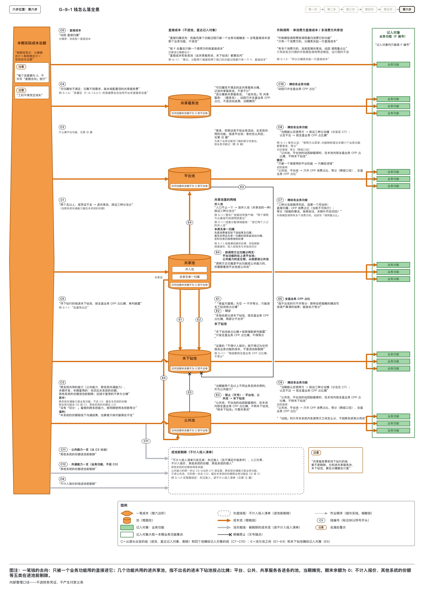
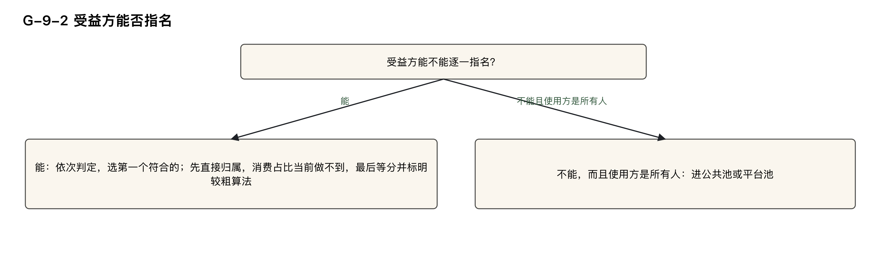
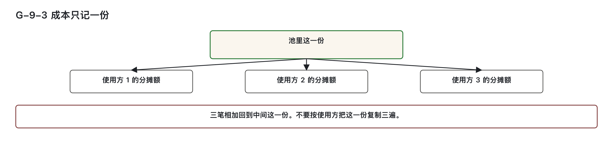
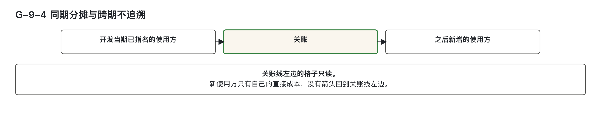

# 共用投入：一笔成本如何分给使用方

> 副标题：一个接口被两个功能调用时，成本如何归属
>
> 模块三 · 钱怎么落 · 第 ⑨ 篇。本篇的主干规则有四条：受益方能逐一指名的共用机能，按直接归属、消费占比、等分这三种分法，按顺序判定，选第一个符合的；一条功能过程只被一个业务功能触发的，直接归属，不进池；成本只记一份，不按使用方数复制；已结清的期次一律不改。

---

## 学习目标

完成本篇后，能够：

1. 对一笔链路已经串完的成本，判定受益方能否逐一指名。能指名的，写出这三种分法里选了哪一种；使用方是所有人、指不出具名受益方的，写出出口是公共池或平台池。
2. 对已指名的共用机能，写出动因一栏怎么填。消费占比当前不可执行时，动因写成 `等分（降级口径）`，并写出关联补齐后必须切回。
3. 区分两层等分：业务功能层的等分要标明是较粗的算法；活动层派生视图的等分是各组织自己确定的做法，默认等分，不参与结算，不标注。
4. 对一条功能过程，判定它是直接归属还是进共享池；写出外购模型调用费单列一行的填法，并判定一笔调用费属不属于研发交付期。
5. 判定同一份成本有没有被按使用方数复制；写出成本恒等式核对的内容；写出活动层派生视图标「不可求和」的含义。
6. 对跨期情形，判定已结清的期次动不动：后期新增的使用方不参与已发生成本的分摊。

---

## 快速判定

读表前先分清几个对象。下钻，指沿着子流程、活动、业务功能、机能一层一层往下找，找到对应的那一行，并写明找到了哪一层。机能，是软件里能被外部触发、用来登记规模的交付单位，一个画面、一个接口都是机能；它上面一层是业务功能，指一项可以单独指认的业务结果。CFP，功能点的计数单位；功能点本身怎么数，本系列不讲授，本篇只决定已经数出规模的那些成本计为几份、分给哪一方。「池」是个临时存放处：暂时归不到单一对象名下的成本，先放在一起。

本篇的例子取自同一个教学案例：汽车经销商（4S 店）的销售线索跟进。案例里流程和活动的编号以 S- 开头，业务功能的编号以 F- 开头。案例中的金额和比例都是为演示设定的，不是可以照抄的标准值，后文不再逐处标注。

本篇涉及的金额和报表，都按信息技术部门内部使用的管理口径理解：不是企业会计科目，不进财务凭证，不产生付款义务；「记在某个业务功能上」只表达归属。归集，指把成本收上来记到某个对象名下；分摊，指几个对象共同耗用的成本，按一个说得清的依据分给各方。篇中出现的估算者、审核方、主张方都是职能名称，由哪个岗位担任，各组织自行确定。

| 当前情况 | 初步判定 | 详细阅读 |
|---|---|---|
| 一个接口或一段并入进来的代码，被两个及以上业务功能使用，受益方都能指名 | 按这三种分法判定，选第一个符合的；当前通常只能等分，动因写 `等分（降级口径）` | 第二节 |
| 机能里某条功能过程只被一个业务功能触发 | 凭证恰好对应一个业务功能编号的：直接成本，进那个业务功能，不进池 | 第三节 |
| 登录、权限、审计这一类，使用方是所有人 | 指不出具名受益方；出口是公共池或平台池，池内细节在第 ⑩ 篇 | 第二节 |
| 同一条成本，一部分能指名、一部分指不出 | 受益方留痕里有 `切分：` 才按比例切开；没有留痕，整池按未指名处理，不得等分 | 第二节 |
| 想按调用次数或按人头，把已指名的池分得更细 | `机能 → 业务功能` 的消费关联还没建立时，不得自定比例；只能等分，并标明是较粗的算法 | 第二节 |
| 两个功能各记了一份同样的开发成本 | 主账上只记一份；引用方不复制记录 | 第四节 |
| 想把业务功能的成本再摊到活动上查看 | 活动层派生视图默认等分，不参与结算，不标注较粗的算法 | 第四节 |
| 后期又增加一个使用方，想把已结清的期次重新分 | 已结清的期次不改；新使用方不参与已发生成本的分摊 | 第五节 |

这张表只用来定位，结论按后面各节的判定表作出。



图 G-9-1：直接成本、共享投入、待下钻投入及平台公共等成本分别进入对应去处。共享池受益方留痕为空时转未下钻池；平台和公共池保持各自处理规则。

---

## 一、起点与输入：接收链路判定为完整或不要求的行

本篇接收链路核对视图判定为“完整”或“不要求”的行，分摊这些行上已归集的成本。链路未完成的，成本归属由第⑧篇决定，不在此处重算。

当前已有三项已填材料，作为本篇分摊依据：

- **功能点计算表**：每条功能过程已标注「触发业务功能编号」，明确谁在使用。
- **机能登记表**：并入逻辑（如多入口内部代码、客户端调用）的来源证据已记录，调用方信息写在对应行上，不另立新机能。
- **分摊表**：需填写池类型、成本池、使用方业务功能、使用方来源档、动因、分摊额、来源证据、受益方留痕八栏。同一池内各使用方的分摊额之和必须等于该池发生额，差额通过尾差补平。


---


并入池是共享池的一种，专收多入口内部逻辑和多调用方客户端代码的工时，没有机能主键，成本池填 `归挂：〈名称〉`。一个使用方一行；同池各行池发生额相同，分摊额合计等于池发生额。动因说明分钱依据，来源档说明名单出处。受益方留痕要写主张人、查过材料与查不到的原因，不是找人签字。



图 G-9-2：能指名才进入三种分法；指不出且使用方是所有人的，转到公共或平台身份判定。

## 二、三种分法：逐一指名后，按顺序选第一个符合的

### 2.1 分法判定规则

当一个共用机能被两个及以上业务功能使用，且受益方可逐一指名时，须按以下三步顺序判定归属方式，选择**第一个符合条件的**：

| 分法 | 适用条件 | 当前能否使用 |
|------|----------|--------------|
| 直接归属 | 功能过程仅被一个业务功能触发，凭证唯一 | 能用 |
| CFP 消费占比 | 按各业务功能消耗的功能点比例分配 | 当前不可执行：多数组织尚未建立 `机能 → 业务功能` 的消费关联 |
| 等分 | 前两者均不满足时采用 | 实际在用 |

等分的三条要求：  
> 数据不足以支持更细分法时，已指名方先均分。使用这个临时分法须满足三条要求：
>
> - 动因栏必须填写 `等分（降级口径）`，标明这是较粗算法；
> - 一旦 `机能 → 业务功能` 的消费关联补齐，必须立即切回 CFP 消费占比重新计算，并取消标注；
> - 不作标注便始终等分，甲方追问为何不能分得更细时，就无法说明依据。等分作为临时分法，须标明其临时性和切回条件；消费关联补齐后切回，不能把临时分法写成正式口径。

### 2.2 来源档优先级与使用方认定

使用方清单应从最高优先级来源获取，**不得混用**。来源档从高到低依次为：

1. `基线调用链`（仅用于并入池）
2. `接口契约`（含 Feign、RPC 声明及对外调用配置）
3. `菜单-功能映射`
4. `事件订阅表`
5. `人工认定`（需注明查过的调用链）

若按业务功能编号去重后只剩一个使用方，则视为**直接归属**，不再进入共享池，走第三节流程。

使用方认定还有三项边界：  
> - 跨系统对接、随调用方接口、多入口内部逻辑等情形，使用方可按调用关系认定，判定方法见第⑧篇。  
> - 消费者先核实际下游结果与归属；确属共用的消费投入及定时任务，不按调用关系机械认定使用方，受益方仍需逐一写出，只有能指名才可进入等分流程。  
> - 若调用方主归属为平台功能或公共能力，其对应成本份额应随同进入平台池或公共池。

### 2.3 混合情形：部分可指名，部分不可指名

若一条成本中，**一部分受益方可指名，另一部分无法指名**，则必须进行切分：

- 切分比例由相关方线下沟通确定，估算者仅核对留痕是否存在，**不得自行设定比例**。
- 切分的留痕写成：
  ```
  切分：已指名〈p〉／未指名〈1−p〉；依据：〈沟通结论出处〉；参与方：〈职能〉
  ```

切分后处理方式：

- 已指名部分，在指名使用方之间按三种分法分摊；需要采用等分时，动因写 `等分（降级口径）`；
- 未指名部分进入**未下钻池**，后续分摊由第⑧篇规定。

缺少切分留痕的处理：  
> 若无 `切分：` 留痕，整笔成本**不得自定比例**，也不得等分，必须整体按“未指名”处理，进入未下钻池。

### 2.4 跨系统共用能力的处理

对于本期开发、本期已有其他系统接入的共用能力（如公共能力、跨系统共通能力），须先切出本系统的份额：

- 其他系统份额在进池前**剔除**，原因填写：`他系统份额：〈系统名〉`
- 功能登记表来源证据写：`使用系统：〈A〉；〈B〉；同期证据：〈接入清单/上线计划编号〉`
- 分摊表来源证据写：`本片份额：〈p〉`
- 主张其他系统本期已在用的一方，必须提供当期已接入或同步上线的证据；预估不计入。

> 若其他系统将在后续版本接入，**不参与本次分摊**，建设成本全额保留在开发当期的本系统。

> **切分后处理**：  
> 本系统内部各使用方之间的分摊，仍按这三种分法判定，动因列仅反映系统内分摊方式，不因跨系统等分而改变。

### 2.5 尾差按组织精度处理，整笔加至最大额行

金额计算公式为：

> 分摊额 = 池发生额 × 本行基数 ÷ 各行基数之和

- 等分时，基数取 1；
- 有切分的，先乘切分比例；
- 中间结果不取整，最终四舍五入至组织自定精度（本系列演示取到分）。

**尾差定义**：池发生额减去各行分摊额之和的余数。

- 尾差整笔加至分摊额最大的一行；
- 若多行并列最大，按使用方业务功能编号升序取第一行；
- 该行来源证据填写：`尾差：〈±差额〉`

> 尾差为 0 时不写 `尾差：`，但必须完成计算。


身份先看数据对象能否挂到流程；挂不上再按四步分平台或公共，挂得上且多方复用的仍是共通能力，详见第 ⑩ 篇。

跨系统没有切分留痕时，按同期使用系统数等分，来源证据写 `本片份额：〈p〉（等分（降级口径））`；其他系统份额写 `等分（降级口径）：同期使用系统〈n〉个`。指不出名的系统不计入系统数。动因只写本系统内部各使用方分法。

估算者自判分法，混合比例与本系统份额取线下沟通结论，估算者只查留痕；审核方复核按调用关系认定的使用方名单。判断写在分摊表八栏中。主张指名的一方写证据，主张指不出的一方写查过材料和原因，不得留空。另按比例的一方给出 `切分：本片〈p〉／〈A〉〈q〉；依据：〈出处〉；参与方：〈职能〉`。

### 2.6 两层等分的本质区别

| 层级 | 管理对象 | 定性与标注要求 |
|------|----------|----------------|
| 业务功能层 | 共用机能的成本如何分给多个业务功能 | 较粗算法：当前只能等分，报表必须标注 `等分（降级口径）`，关联补齐后须切回 |
| 活动层派生视图 | 从业务功能成本向下摊至活动，仅供查看 | 各组织自行决定做法：默认等分，不参与结算，不标注“较粗算法” |

> **核心差异**：  
> 派生视图的等分是管理视角的展示手段，非结算口径，因此无需标注“降级”。活动层各个功能的派生合计可以大于实际总额，查看时须标不可求和；具体原因和填法在第四节展开。

---

### 2.7 判定表：从情形到动因与去处

| 当前情形 | 动因与去处 |
|---------|------------|
| 功能过程触发业务功能恰好一个，凭证齐全 | 直接成本，不进池（第三节） |
| 两个及以上业务功能，受益方已逐一指名，`机能 → 业务功能` 消费关联未建 | 只能等分，动因写 `等分（降级口径）`；不得改用调用次数 |
| 上述关联已按业务功能补齐 | 切回 CFP 消费占比重算，去掉 `等分（降级口径）` 标注 |
| 使用方清单可从接口契约查出，也可人工再写一版 | 仅用接口契约；来源档不混用 |
| 并入池，基线调用链已列出调用方 | 来源档写 `基线调用链`；此档仅用于并入池 |
| 按业务功能编号去重后只剩一个使用方 | 改按直接成本处理 |
| 留痕中有 `切分：已指名〈p〉／未指名〈1−p〉` | 已指名部分在指名方间按三种分法分；未指名部分进未下钻池；两截不合并等分 |
| 声称混合情形，但留痕无 `切分：` | 整池按未指名处理；不得自定比例，不得等分 |
| 跨系统共用，来源证据无 `切分：` | 按同期使用系统数等分，来源证据写 `本片份额：〈p〉（等分（降级口径））` |
| 按调用关系认定的某个调用方尚未下钻 | 该份成本进未下钻池，不与已指名方等分 |
| 使用方是所有人，指不出具名业务功能 | 本篇不完成池内分摊；出口为公共池或平台池，细节见第⑩篇 |
| 受益方留痕为空，仍把动因写成等分 | 不许；能指名才等分，指不出名不许等分 |
| 确属共用的消费投入、定时任务 | 消费者先核实际下游结果及归属；共用投入不按调用关系机械认定使用方；仅当受益方留痕能写出名，才可进入等分 |
| 本期已有其他系统接入 | 先切出本系统份额，其他系统份额进池前剔除；系统内再按三种分法分 |
| 其他系统后续版本才接入 | 不参与本次分摊；建设成本全额留在开发当期本系统 |
| 等分算到分后有尾差 | 整笔记到分摊额最大一行；并列时按使用方主键升序取第一行，标 `尾差：` |

---

### 2.8 正例与反例

### 正例

1. **S-1.3 接口「查询线索详情」**  
   - 主键：`接口|GET /api/clue/detail|查询`  
   - 池发生额：240.00  
   - 使用方：F-S-1.3.2.1、F-S-1.3.3.1、F-S-1.3.5.1  
   - 来源档：`接口契约`（未混用人工名单）  
   - 留痕：主张方已查接口契约  
   - 动因：`等分（降级口径）`  
   - 分摊额：240.00 × 1 ÷ 3 = 80.00（三行各 80.00）  
   - 尾差：0，不写 `尾差：`  
   > 关联补齐后，须切回 CFP 消费占比重算。

2. **并入池：外部连携整车厂线索平台**  
   - 成本池：`归挂：外部连携整车厂线索平台／整车厂线索回传客户端`  
   - 工时：150.00  
   - 调用方：`接口|POST /api/clue|登记`（F-S-1.1.1.1）、`接口|POST /api/follow/result|提交`（F-S-1.3.2.1）  
   - 来源档：`基线调用链`  
   - 动因：`等分（降级口径）`  
   - 分摊额：75.00 × 2  
   > 回传客户端不单独成行，工时并入此池。调用日志只用来补漏，本期没有补出新调用方，也不按调用量分。

3. **线索分配领域服务**  
   - 没有自身的外部触发方，两个入口共用  
   - 工时：90.00  
   - 成本池：`归挂：线索分配领域服务`  
   - 入口之一无接口契约，来源档写 `人工认定`  
   - 留痕：写明查不到原因  
   - 使用方：F-S-1.1.2.1、F-S-1.3.2.1  
   - 分摊额：45.00 × 2  
   - 动因：`等分（降级口径）`

4. **事件消费「线索建档广播」**  
   - 本期工时：300.00  
   - 事件订阅表列出三个下游，其中两个可查到业务功能，一个查不到  
   - 留痕：`切分：已指名 0.6／未指名 0.4；依据：界定记录-S-01；参与方：主张方、受益方、流程资产责任方`  
   - 已指名部分：300.00 × 0.6 = 180.00，两使用方等分，各 90.00，动因 `等分（降级口径）`  
   - 两个指名功能为 F-S-1.1.2.1、F-S-1.3.2.1；第三个旧报表查不到功能映射。
   - 未指名部分：120.00 进未下钻池，后续由第⑧篇处理  
   > 附录 E §2.4 明确：`ClueCreated ClueBroadcastHandler` 实际刷新线索缓存，非事件分发，属真实共用投入，应按证据处理。

### 反例

1. **错误分法**：  
   三个业务功能已写入留痕，分摊时却按调用次数分成 5∶3∶2，动因未标注。  
   > 错误原因：消费关联未建，调用次数 ≠ CFP 消费占比。当前只能等分，并标注“降级口径”。

2. **留痕缺失**：  
   受益方留痕为空，仍在共享池中按功能个数等分。  
   > 错误原因：留痕为空即不许等分，应进入未下钻池按占比分摊。使用方是所有人、指不出名的，出口为公共池或平台池，第⑩篇展开。

---

## 三、直接归属优先

### 3.1 规则

一条功能过程若仅由一个业务功能触发，且有明确凭证支持该唯一性，则其成本应作为直接成本归入该业务功能，不进入共享池。此判定需逐条功能过程进行，不可对整个机能整体认定。

- **直接成本**：指不经过共享池、直接记入单一业务功能的成本。
- **判定依据**：以“触发业务功能编号”列中是否恰好为一个编号为准；若有多个或无编号，视为不满足直接归属条件。
- **凭证要求**：主张直接归属的一方必须提供来源证据，包括需求条目编号或接口契约信息。凭证须与触发关系一一对应。
- **外购模型调用费处理**：
  - 若仅有一个消费方，单独列为一行直接成本，成本池写为 `外购调用：〈服务名〉`，动因填 `直接归属`，不得并入接口开发成本行。
  - 若多个消费方且可获取调用量数据，在 `外购调用：〈服务名〉` 成本池中按消费方分别成行，动因填 `调用量占比`，每个消费方占一行，来源证据注明 `调用量：` 及 `期间：研发交付期`。
  - 只收研发交付期（开发、联调、测试）发生的调用费。上线后运行期属于运行支出，不进本模型、分摊表、不计入投入清单，也不进实际成本总额。
- **有多个消费方，且调用量拿不到或归属不了时**：动因改为 `等分（降级口径）`，报表需标明为较粗算法，待数据补齐后立即切回。
- **判定权属**：由估算者自行判断。
- **判定位置**：在功能点计算表的「触发业务功能编号」列、分摊表中未进池的直接成本行、外购调用费独立行中完成。

### 3.2 判定表

| 当前情形 | 结论 |
|----------|------|
| 功能过程触发业务功能编号恰好一个，来源证据为需求条目或接口契约 | 直接成本，动因 `直接归属`，不进共享池 |
| 同一机能内部分过程仅一个触发方，其余有两个及以上 | 逐条判定，不能整体认定为直接归属 |
| 触发编号填写两个或以上，或凭证缺失（如仅写“多个功能共用”） | 进共享池，按三种分法判定 |
| 外购模型调用费仅有一个消费方 | 单独一行，成本池写 `外购调用：〈服务名〉`，动因 `直接归属`，不混入接口开发成本 |
| 多个消费方，且能提供调用量数据 | 池类型为共享池，成本池仍写 `外购调用：〈服务名〉`，动因 `调用量占比`，每消费方一行，来源证据写 `调用量：` 和 `期间：研发交付期` |
| 多个消费方，但调用量无法获取或归属不清 | 动因改写为 `等分（降级口径）`，报表标注为较粗算法，后续补全后切回 |
| 调用费发生于上线后的运行期 | 不纳入本模型，不进分摊表，也不进不计入投入清单和实际成本总额 |

### 3.3 正例

1. **S-1.3 接口「提交跟进结果」**  
   - 主键：`接口|POST /api/follow/result|提交`  
   - 功能过程仅由 F-S-1.3.2.1 触发  
   - 分摊表中池类型为直接成本，池发生额 120.00，分摊额 120.00，动因 `直接归属`，不进共享池  
   - 其背后的「跟进结果校验服务」仅此一个入口，工时并入该 120.00，不另开行

2. **S-1.2 接口「评级」**  
   - 开发成本 100.00 记在接口行，动因 `直接归属`，使用方为 F-S-1.2.1.1  
   - 外购基础模型调用费 50.00 单独列出，成本池写 `外购调用：外购基础模型推理服务`，动因 `直接归属`  
   - 来源证据注明调用量账单及 `期间：研发交付期`  
   - 本期仅此一个消费方，按调用量即全额分配  
   - 该 50.00 不并入 100.00，也不从实际成本总额中剔除

### 3.4 反例

凭证只写“几个功能都会用”而没有逐个业务功能编号，也属于凭证不全，应进共享池。

1. 一条功能过程的触发业务功能编号填写两个，分摊表仍记为直接成本，整笔金额归入编号较小者。  
   > 错误原因：触发方超过一个，应进入共享池，按三种分法判定，不得强行归入单一编号。

2. 外购模型调用费与接口开发成本合并记在同一行；或将上线后每月的调用费计入同一行。  
   > 错误原因：调用费必须单列；仅研发交付期发生的调用费才计入本模型，运行期费用不纳入。

---

## 四、成本只记一份，不按使用方数复制

### 4.1 规则

同一机能、同一业务功能编号的成本，在主账中仅记录一次。引用方不复制记录。共享池中的成本虽拆分为多行分摊额，但池发生额保持不变，不因使用方数量增加而倍增。

- **核心原则**：一笔成本只记一份，无论有多少使用方。
- **恒等式核对**：每期必须执行成本恒等式验证：  
  > **分摊额合计 + 剔除额合计 = 实际成本总额**  
  该等式必须成立，写入成本恒等式行。
- **剔除额定义**：取不计入投入清单所有行“投入量”的金额合计。不计入投入清单记录的是这笔钱不算进投入的原因。
- **区分投入范围与报价范围**：  
  - “不纳入投入范围”表示这笔钱不算入投入总量；“不计入投入清单”是记录排除项的清单名称，不是“不进入这张清单”的动作；  
  - “不计入报价”表示算成本但不向客户收费，两者不同。
- **非剔除项**：  
  - 可归属性不满足的共享服务费 → 进共享服务池  
  - 未下钻池中的成本 → 算在分摊额合计中  
  二者均不属剔除，应计入恒等式。
- **活动层派生视图**：  
  - 成本向下摊至活动层级，仅供查看，不参与结算  
  - 默认等分，不标注“较粗算法”  
  - 各活动派生视图金额之和可能大于主账实际总额，属正常现象  
  - 必须标注“不可求和”，不可用于对外结算  
  - 主账仍只保留一份原始成本，不随视图调整

估算者自判，工具自动核对。核对分摊表的“池发生额”“分摊额”、不计入投入清单的“不计入原因”“投入量”和成本恒等式行。不计入报价的钱在进池之前剔除，列入不计入投入清单，并计入恒等式的剔除额。主张不计入报价的一方在“不计入原因”写理由。未下钻投入和可归属性不满足的共享服务费仍分别入未下钻池、共享服务池，属于分摊额，不属于剔除。

### 4.2 判定表

| 当前情形 | 结论 |
|----------|------|
| 一个共享池，三个使用方 | 池发生额记一份；三行分摊额之和等于池发生额 |
| 另一条子流程引用了同一个活动 | 引用方不复制记录；成本保留在主归属行 |
| 分摊额合计 + 剔除额合计 = 实际成本总额 | 恒等式成立，写入成本恒等式行 |
| 某个池分完仍有余额，备注写“差额去向” | 不合格；每个池差额必须为 0 |
| 活动扩展表中受益方留痕默认写“等分” | 属派生视图，不标注较粗算法，不参与结算 |
| 派生视图各活动金额求和 > 实际总额 | 属正常；标“不可求和”，不用于结算，不修改主账 |
| 将派生视图合计用于对外结算 | 不允许；结算仅以主账为准 |

### 4.3 正例

1. **「查询线索详情」共享池**  
   - 池发生额 240.00，仅记一份  
   - 三个使用方各分摊 80.00，三行分摊额合计 240.00  
   - 未按三个使用方复制成三份 240.00

2. **取消试驾排程的 F-S-1.4.2.1**  
   - 成本仅在 S-1.4 记录一份  
   - S-1.3 作为子流程引用该活动，不再重复记账

3. **F-S-1.3.2.1 与 F-S-1.3.2.2 均挂于活动 S-1.3.2**  
   - 成本侧活动扩展表中受益方留痕默认写“等分”  
   - 两笔成本在视图中均摊至 S-1.3.2  
   - 这两笔各只有一个关联活动，分别全额摊入。一般情形中，同一份成本按多个活动各列一笔时，合计可能大于主账实际总额，标“不可求和”  
   - 不用于结算，主账仍只保留一份



图 G-9-3：原始成本只有一份；三个使用方各记自己的份额，合计回到池发生额。

### 4.4 反例

1. 一个接口被三个业务功能调用，分摊表将开发成本 240.00 复制为三行，每行池发生额均为 240.00，再各自分摊 240.00。  
   > 错误原因：成本被乘以使用方数，违背“只记一份”原则。

2. 派生视图中各活动金额求和超过实际总额，有人将其合计值用于结算，或回头修改主账使其对齐。  
   > 错误原因：视图合计大于主账是正常现象，应标“不可求和”，主账不可更改。

---

## 五、跨期不追溯：已结清的期次一律不改

### 5.1 规则

已关账封存的期次，其主账只读，不得修改。后期新增的活动或使用方，不参与已发生成本的分摊，仅承担自身产生的直接成本。

后续接入依据两边系统集合是否有交集、工时能否分开，分别写 `接入：`、`含接入：` 或 `他系统接入：`，具体判法见第 ⑪ 篇。

- **能力登记簿用途**：只记共通能力和潜在共通能力的复用关系，不记录金额。
- **功能身份判定**：按当期情况确定，不追溯已结清期次。
- **初始化态下补归属**：从补上归属的这一期起按新规则记账，已结清期次主账不动。
- **判定权属**：估算者自判。
- **判定位置**：分摊表「期次」栏；已结清期次仅读。

主张“改上期账”的一方，该主张在本条下不成立。

### 5.2 判定表

| 当前情形 | 结论 |
|----------|------|
| 期次已关账，后期发现漏记一个使用方 | 已结清期次不改 |
| 后期新增活动或使用方 | 不参与已发生成本分摊，仅承担自身直接成本；接入方式按 `接入：`、`含接入：` 或 `他系统接入：` 写明 |
| 要求将上期主账按新使用方重分 | 该主张不成立 |
| 其他系统将在后续版本接入本期建成的能力 | 不参与本期分摊；建设成本全额保留在开发当期本系统 |
| 初始化态下，未下钻池本期补上归属 | 从本期起按新归属记账，已结清期次主账不动 |
| 本期改变功能身份 | 改判从本期起生效，已结清期次不追溯；身份判定见第⑩篇 |



图 G-9-4：开发当期已指名的使用方分摊当期建设成本；关账后新增的使用方只承担自己的直接成本，已结清主账不重分。

### 5.3 正例

1. **接口「查询客户」在期次-示例-1**  
   - 由 F-S-1.3.2.1 建设，当期仅此一个使用方  
   - 主账直接成本 800.00，动因 `直接归属`，全额归 F-S-1.3.2.1  
   - F-S-1.4.1.1 当时已立项，但属于预估范围，未列入当期实际使用方  
   - 后续接入时，仅承担自身的接入、联调、回归等直接成本  
   - 期次-示例-1 的 800.00 不重新分摊  
   - 能力登记簿只记共通能力和潜在共通能力的复用关系，不记金额

### 5.4 反例

1. 接口建设当期仅点出两个使用方，等分后关账。下一期新增一个使用方，有人将上一期池发生额改为三等分，三行均写回已结清期次。  
   > 错误原因：已结清期次一律不改；新使用方不参与已发生成本分摊。

2. 后续版本才接入的另一个系统，被写入建设当期的使用系统清单，导致本系统份额被压缩，已结清期次主账随之修改。  
   > 错误原因：后续才复用的系统不参与本期分摊；已结清期次主账不可更改。

## 数字约定、练习与自测

### 各组织自行确定的数字

| 数字 | 本篇如何使用 | 更换组织后是否重新确定 |
|------|--------------|------------------------|
| 分摊额保留的小数位 | 演示取到分，四舍五入；尾差整笔归哪一行写在第二节，归法本身是判据，不能随组织改动 | 是 |
| 业务功能层等分 | 较粗的算法：动因写 `等分（降级口径）`；`机能 → 业务功能` 关联补齐后切回 CFP 消费占比，标注取消 | 是 |
| 活动层派生视图默认等分 | 不参与结算，不标注较粗算法；合计可大于实际总额，标「不可求和」 | 是 |

消费占比“当前不可执行”，是因为 `机能 → 业务功能` 关联尚未建立。一旦补齐，必须立即切回，不得永久等分。

---

### 练习

取一条已被两个及以上业务功能调用的接口，再取一条仅被一个业务功能触发的功能过程，按以下步骤操作：

1. **确认受益方能否逐一指名**：指不出、且使用方是所有人的，只写出口「公共池或平台池」，停止本篇分摊。
2. **选择分法**：能指名的，按三种分法顺序选；消费关联未建的，动因写 `等分（降级口径）`，并写明切回条件；不得按调用次数自定比例。
3. **来源档处理**：只留最高优先级的一档；并入池的，成本池写 `归挂：〈名称〉`，来源档写 `基线调用链`。
4. **混合情形**：必须留痕 `切分：`；无此留痕，整池按未指名处理，不得等分；未指名的一截进哪种池，按第二节判定表写明出口。
5. **外购模型调用费**：另起一行，写 `期间：研发交付期`；运行期调用费不记。
6. **核对池发生额**：只有一份，引用方不复制。活动层派生视图默认等分，不标较粗算法，合计标“不可求和”，不用于结算。
7. **查看期次**：已结清期不改；后期才出现的使用方不写进已发生成本分摊。

完成后，隐藏分摊表原有的动因，再交由另一人按判定表独立重写分法与来源档。两人结论不同的行，返回判定表核对，不在当场折中。

---

### 自测题与答案要点

1. **判定**：接口「查询线索详情」被三个业务功能触发，三个名字都在留痕里。当前动因怎么填？240.00 怎么落到三行？尾差填不填？  
   > 动因 `等分（降级口径）`；三行各 80.00；尾差为 0，不写 `尾差：`；来源档用 `接口契约`。

2. **判定**：同一个池，有人按调用次数分成不平均的三份，说这样比均分合理。许不许？等分的定性是什么？  
   > 不许。消费占比当前不可执行，不得改用调用次数。等分的定性是：数据还不支持更细分法，先均分；报表必须标明这是较粗的算法。

3. **判定**：`机能 → 业务功能` 的消费关联已经补齐。还留在等分吗？报表上的标注怎么处理？  
   > 不留。按 CFP 消费占比重算，标注取消。

4. **判定**：回传客户端有两个调用方，工时 150.00。成本池怎么填？来源档用哪一档？两行分摊额各是多少？  
   > 成本池写 `归挂：外部连携整车厂线索平台／整车厂线索回传客户端`；来源档 `基线调用链`；两行各 75.00，动因 `等分（降级口径）`。

5. **判定**：一条成本一部分能指名业务功能、一部分指不出，留痕里没有 `切分：`。能否自行确定一个比例再等分？  
   > 不能。没有留痕的整池按未指名处理，不得自定比例，也不得等分。

6. **判定**：登录、权限、审计，使用方是所有人。本篇把钱分完了吗？出口写什么？  
   > 本篇不分完。出口是公共池或平台池，细节在第 ⑩ 篇。

7. **判定**：接口「提交跟进结果」的功能过程只由 F-S-1.3.2.1 触发。进不进共享池？它并入的校验服务另开一个池吗？  
   > 不进共享池：直接成本，动因 `直接归属`，120.00 进 F-S-1.3.2.1。校验服务只有一个入口，并入这一行，不另开并入池。

8. **判定**：外购基础模型在联调、测试中发生了调用费，上线后又有运行期调用费。哪一笔进本模型？进的那一笔写在哪一行？  
   > 只收研发交付期（开发、联调、测试）发生的调用费，另起一行，成本池写 `外购调用：〈服务名〉`。一个消费方时动因 `直接归属`，不混进接口开发成本那一行；多个消费方时动因 `调用量占比`，来源证据写 `期间：研发交付期`。上线后运行期的调用费不进本模型，不进分摊表，也不进不计入投入清单和实际成本总额。

9. **复述**：「成本只记一份」这条规则。三个使用方分 240.00 时，实际成本记几份？引用方复制不复制记录？  
   > 成本只记一份，不按使用方数复制；实际成本只有一份240.00；同池三个使用方行可以都填池发生额240.00，作为同池信息，分摊额各80.00，不能三方各承担240.00。引用方不复制成本记录。

10. **判定**：活动层派生视图默认等分，各活动行相加大于实际总额。要不要标注较粗的算法？能否用于结算？主账动不动？  
    > 不标注。这一层是各组织自己确定的做法，默认等分，不参与结算。合计大于实际总额属正常，标「不可求和」，不用于结算；主账不改，仍只记一份。

11. **判定**：期次-示例-1 已把「查询客户」的 800.00 全额归给当时唯一的使用方。后来的使用方参不参与这 800.00？已结清的期次动不动？  
    > 不参与。后期新增的使用方只承担自己的直接成本；已结清的期次一律不改。

12. **复述**：这三种分法的完整规则——三种分法各叫什么，按什么顺序选，消费占比和等分各带什么说明。再复述等分的那一句：能指名才等分，指不出名不许等分。  
    > 三种分法是直接归属、CFP消费占比、等分，按顺序判定，选择第一个符合的；消费占比带「当前不可执行」，等分带「较粗的算法，报表标注，关联补齐后切回」。能指名才等分，指不出名不许等分。

---

## 本篇依据

- 三种分法按顺序判定、来源档不混用、去重后只剩一个使用方改按直接成本、混合情形的切分、跨系统切出本系统的份额、直接归属优先、外购模型调用费单列且只收研发交付期、成本只记一份、活动层派生视图、跨期不追溯：附录 B 的规则索引和附录 D 的表列定义、校验项；案例走法见附录 E 的 S-1.3 第 1.6 节、S-1.1 第 2.6 节、S-1.2 第 3.6 节。
- 底稿出处：CM-ADR-002（§3.1、§3.4、§4 S1 至 S3、§5）、CM-ADR-004（直接归属）、CM-ADR-007 与 CM-ADR-008（运行期调用费不进本模型）、CM-ADR-010（分摊入口、派生视图）、CM-ADR-012（§4.2 约束 5）、CM-ADR-015（成本只记一份）。本篇不使用这些编号下判断，编号仅供回溯。
- 以下各条是本系列在教学侧自行定下的约定（内部裁定记录第 12、18、19、36、94 条）：初始化态下未下钻池补上归属后从当期起按新归属记；调用方作使用方；混合情形的切分留痕、无留痕整池按未指名处理；每个池差额为 0、不计入报价的钱进池前剔除；外购模型调用费多个消费方时走共享池、动因 `调用量占比`。跨系统切分的写法和尾差归法也是本系列的约定。
- 与底稿的两处偏离，采用本篇写法，底稿不随之修改：其一，CM-ADR-004 的层级扩展；其二，CM-ADR-010 曾写差额大于 0 时说明去向，本篇规定每个池差额为 0，不写「差额去向」。
- 纲目第 ⑨ 篇的结论句：先看受益方能否指名；能指名的按三种分法分，指不出名（使用方是所有人）的走公共池或平台池，见第 ⑩ 篇。
