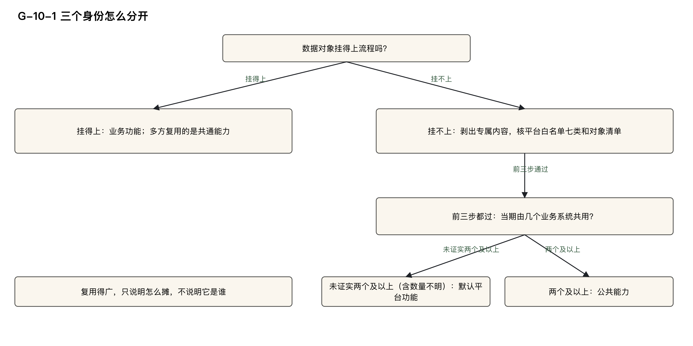
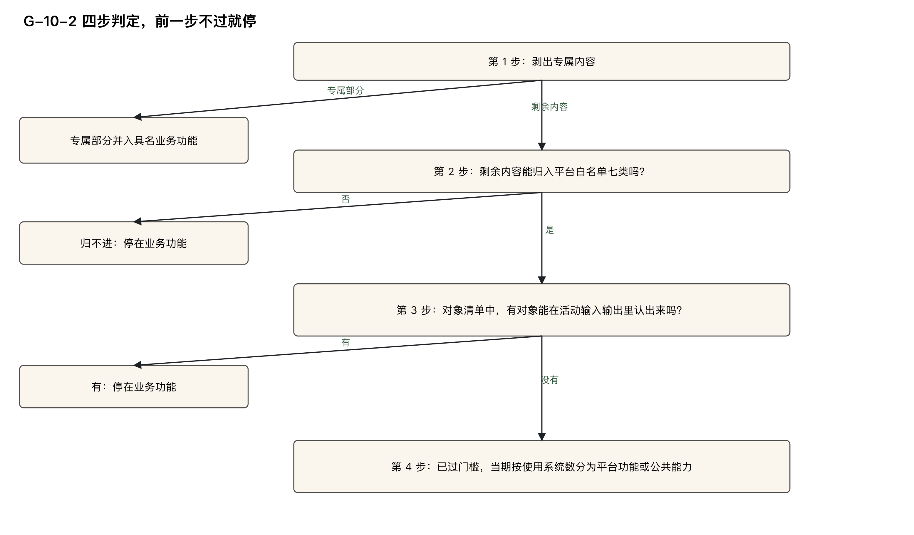

# 公共与平台：说不清归属的那些

> 副标题：登录、权限、审计的身份与成本归属如何确定
>
模块三 · 钱怎么落 · 第⑩篇。

先剥出专属部分，剩余能力继续核对白名单和数据对象；门槛未过的剩余部分判业务功能。门槛都过之后，再按当期使用系统分平台功能与公共能力。复用得广只说明如何分摊，“平台功能用户”只作记录，都不改变身份。

平台功能加公共能力的规模占比有预警线和上限。预警只提醒；到上限仍摊入，但超限部分逐条复核、留下依据。公共池和平台池当期摊完，期末余额为0。“平台功能花了多少”另列管理视图，不能与业务功能成本相加。

---

## 学习目标

完成本篇后，能够：

1. 区分平台功能、公共能力、共通能力：身份看数据对象能不能挂到子流程或活动，不看复用得多广。
2. 对一条「这是平台功能」的主张按四步判定，专属部分先剥出，剩余部分白名单或对象核对不过就判业务功能；写出停在哪一步，以及结论是业务功能、平台功能还是公共能力。
3. 写出举证责任：主张是平台的一方举证，门槛上拿不出证据按业务功能判；主张升公共的一方举证，拿不出证据按平台功能判。
4. 填写功能登记表的「平台功能用户」一栏：只作记录，从枚举里选，不以这一栏改变功能身份。
5. 算出平台功能与公共能力的规模占比，对照预警线和上限作出处理，并完成两条自查。
6. 对已经判进公共池或平台池的一笔钱，写出当期怎么摊完：主账当期一次摊完，池不留底，期末余额为 0；「平台功能花了多少」单列成管理视图，不能与业务功能成本相加。

---

## 快速判定

先交代本篇用到的几个说法。下钻，指沿着子流程、活动、业务功能、机能一层一层往下找，找到对应的那一行，并写明找到了哪一层。机能，是软件里能被外部触发、用来登记规模的交付单位；业务功能，是它上面一层，一项可以单独指认的业务结果。本篇用 L4、L5 称呼链路中的两层：L4 是子流程，L5 是活动。功能点是已经数出来的软件规模，登记在机能上；CFP 是功能点的计数单位；怎么数，本系列不讲授。

三种身份先各给一句话。平台功能：登录、权限、审计这类不挂业务活动、全系统共用的功能。公共能力：挂不上业务架构、且当期被两个及以上不同业务系统共用的能力。共通能力：挂得上业务架构、只是被多方复用的能力；它仍是业务功能，复用关系记到能力登记簿——一本只记复用关系、不记金额的登记簿——见第 ⑪ 篇，不进本篇的公共池和平台池。

第 ⑨ 篇已经定过去向：能逐一指名受益方的共用机能，钱进共享池；指不出具名业务功能的，去向是公共池或平台池。公共池是公共能力的钱进的池子，平台池是平台功能的钱进的池子。本篇据此确定身份，并把公共池、平台池在当期摊完。指不出名字，本身不等于平台身份。

| 当前情况 | 先问一句 | 初步判定 | 详细阅读 |
|---|---|---|---|
| 有人主张「这是平台功能」 | 专属剥离、白名单、对象核对三项证据齐了没有 | 主张是平台的一方举证；剥出专属部分，剩余核对白名单与对象，门槛未过的部分判业务功能 | 第二节、第三节 |
| 登录、通用的权限机制、通用的审计日志，说不清归哪个业务功能 | 四步走到哪一步 | 教学案例里的登录判为平台功能；权限机制、审计日志机制各自过四步；为某一个业务功能专门做的配置，先剥出 | 第二节、第六节 |
| 两个业务域都在用，想升成公共能力 | 当期是几个业务系统，还是同一个系统里的几个域 | 同一系统里多个域共用，不升公共能力；升公共要举证使用系统 | 第二节 |
| 「平台功能用户」写了某一类业务角色 | 身份是按这一栏定的，还是按四步定的 | 这一栏只作记录，选哪一类都不改身份 | 第四节 |
| 调用方很多，想判成平台 | 数据对象挂不挂得到子流程或活动 | 挂得到就是业务功能；多方复用的是共通能力；复用多广只进分摊依据 | 第五节 |
| 平台功能的规模占比往上走 | 触到预警线或上限没有 | 本系列取值：预警 10%，上限 15%；预警只提醒、不拦截摊入；到上限仍摊入，但逐条复核、留下记录 | 第五节 |
| 池里的钱还没摊完 | 期末余额是不是 0 | 主账当期一次摊完，池不留底；余额不为 0 即不合格 | 第六节 |
| 想把「平台功能花了多少」和业务功能成本加在一起 | 业务功能成本里有没有已经摊进来的平台成本 | 那一行是管理视图，不得与业务功能成本相加 | 第六节 |

快速表帮助定位问题，正式结论按后文判定表填写。

本篇涉及的金额和占比，都按信息技术部门内部使用的管理口径理解：不是企业会计科目，不进入财务凭证，也不产生付款义务；「记在某个功能上」只表达归属。归集，指把一笔笔成本收上来、记到某个对象名下；归属，指认定这笔成本算谁的；分摊，指几个对象共同耗用的成本，按一个说得清的依据分给各方。篇中出现的估算者、审核方都是职能名称，由哪个岗位担任，各组织自行确定。

本篇的例子取自同一个教学案例：汽车经销商（4S 店）的销售线索跟进，流程和活动的编号以 S- 开头，业务功能的编号以 F- 开头。案例里的金额和比例都是为演示设定的，不是可以照抄的标准值，后文不再逐处标注。

图 G-10-1：对象挂得上业务架构，是业务功能；剩余非业务能力先过平台门槛，当期已接入或同步上线两个及以上业务系统才判公共能力，数量未证实则默认平台。

---

## 一、这一步的输入与产出

第 ⑨ 篇把能逐一指名的共用机能分进共享池——几个功能共用的钱先放在一起的池子；指不出具名业务功能的那部分，去向留在本篇。能指名时按哪三种分法分，见第 ⑨ 篇，本篇用到时只引短名。本篇决定两件事：功能身份是哪一种；公共池、平台池里的钱当期摊给谁。

判定需要四项已填材料：

- 功能登记表。要看的列是「功能身份」「平台功能用户」「平台白名单类别」「来源证据」。
- 功能点计算表的数据移动明细。对象清单只取 E、X、W 行的「数据对象」，R 行不取。数据移动的类型沿用计量规范里的四个字母，本篇只用来读表：E（输入）、X（输出）、R（读）、W（写）。
- 表 B 的两列：「输入：业务对象 + 进入时的状态」「输出：业务对象 + 完成后的状态」。表 B 是本方法自己扩的活动表；第 3 步的对象核对就在这两列上查。系统名以表 B「承载系统」为准。
- 分摊表，即记录池里的钱按什么依据分给各方的表。平台功能进平台池，公共能力进公共池。成本池填该机能的主键；没有机能主键的，填 F 编号。

完成后留下两项结果：

- 功能身份，以及来源证据里的四项依据：专属剥离、白名单、对象清单、对象核对结果。判成公共能力的，再写出使用系统。
- 分摊表上公共池、平台池的各行：一个使用方一行，各行分摊额求和等于池发生额，期末余额为 0。

消费者先看实际下游业务结果和归属，确有共用才依受益关系处理；不能凭类型或名称认定没有单一归属。另有一类不进本篇这两个池。消息消费者（收到一条消息后接着处理的那段程序）、事件消费（一条消息多方收到、各自接着处理的那类）、定时任务（由时间启动），主归属可以是数据功能——不挂业务活动、承接数据本身的广播与回收等处理的功能。数据功能不挂活动，它不是平台功能，也不是公共能力；那一笔钱按第 ⑧ 篇、第 ⑨ 篇走。

平台身份由审核方判。判成平台，意味着可以不认领具体业务归属，存在把成本做大的激励，所以主张是平台的一方举证。本篇不写谁设计、谁评审、怎么走流程。

图 G-10-2：专属部分先并入具名业务功能，剩余部分继续核对白名单与对象。任一门槛未过就判业务功能；均过后才按当期系统数分平台和公共。

---

## 二、三种身份按四步判

规则是：非业务能力先过平台门槛——剥出专属内容之后，白名单七类与对象核对两项同时满足；过了门槛，默认判平台功能；当期被两个及以上不同业务系统共用的，升为公共能力；过不了门槛的一律是业务功能，多方共用的就是共通能力。

判定顺序：按四步判，前三步是平台门槛，专属部分先并入具名业务功能，剩余部分继续核对；剩余内容白名单或对象核对不过，判为业务功能；第 4 步只分平台功能与公共能力，不再判回业务功能。

---

### 第 1 步，剥出专属内容

为具名业务功能专门搭建或配置的部分，并入该业务功能，作直接成本——不经过池、直接记到一个功能头上的成本——不进平台池。判是不是专属，问两句，任一句答「是」即专属：

1. 拿掉这部分，是不是只有为之搭建或配置它的那一个具名业务功能交付不了自己的业务结果，用同一能力的其他功能照常？  
   所有业务功能都依赖的整体能力（例如登录、通用的字典维护功能本身），拿掉后普遍受影响、指不出唯一可并入的业务功能，这一问答「否」，交后面各步判。

2. 这部分规定的是不是业务对象由谁处理、谁能看、按什么条件或格式在环节之间流转（指业务对象在环节之间传递、处理）？  
   例如审批人设置、数据可见范围、单据打印格式、导入或导出字段对应到哪个业务对象。

> **教学案例应用**：  
> 身份认证 F-S-0.1，机能是 `接口|POST /api/auth/login|登录`。  
> - 第 1 步：没有为具名业务功能专门做的部分；登录是所有业务功能都依赖的整体能力，问句①答「否」，问句②也答「否」。  
> → 此例无专属内容，进入第 2 步；有专属内容时只剥离那部分，剩余能力继续。

---

### 第 2 步，对平台白名单

剩下的部分须归入平台白名单七类之一，归不进就是业务功能。填写时写编号加类名：

- `1 身份认证与单点登录`  
- `2 授权与访问控制`  
- `3 审计日志与安全合规`  
- `4 系统参数、数据字典、基础配置`  
- `5 基础技术设施`  
- `6 监控、告警、运维控制台`  
- `7 个性化与易用性`

> **说明**：  
> 登录归第 1 类；权限管理、数据行权限的机制归第 2 类；审计日志的机制归第 3 类。各类还收什么，本篇不逐类展开；归不进七类的，是业务功能。

> **教学案例应用**：  
> 身份认证 F-S-0.1，机能是 `接口|POST /api/auth/login|登录`。  
> - 第 2 步：归白名单第 1 类，类别填 `1 身份认证与单点登录`。  
> → 白名单通过，进入第 3 步。

---

### 第 3 步：核对对象清单

从数据移动明细只取 E、X、W 的数据对象，R 不取。在表 B 的输入、输出两列核对，只要有一个对象能认作某条活动的业务对象，平台门槛就未通过，判为业务功能。全部核对后均挂不上，才进入第 4 步。具体取对象、逐项留痕和例外条件见第三节。

谁在用、为谁建设和立项目标用户，都不能替代对象核对；“平台功能用户”一栏仅作记录。

### 第 4 步，看跨系统

当期已接入或同步上线的业务系统数达到两个及以上，升为公共能力。

> 判定标准：
> - 预估使用方不算；
> - 登记为外部应用的系统（来源证据含 `外部应用：`）不计入；
> - 同一个业务系统里多个业务域共用不算；
> - 系统内部几块之间共用也不算；
> - 使用系统数说不清时，按平台功能判。

> **教学案例应用**：  
> 身份认证 F-S-0.1，机能是 `接口|POST /api/auth/login|登录`。  
> - 表 B「承载系统」中，该登录能力仅服务于经销商管理系统。  
> → 当期只有一个业务系统，不满足“两个及以上”的条件。  
> → 不升公共能力。

> **对比案例**：  
> 集团统一认证由集团建设，多个业务系统当期都接入——那才是公共能力。  
> 但若本系统只接入、非自建，则不进本系统的度量范围，只承担接入开销，客户端代码随调用方。这条对照只演示，不登记，不进金额。

> **反例警示**：  
> 白名单类别先写成第 1 类，对象清单还没核，功能身份就填了平台功能。  
> → 白名单与对象核对要同时满足，前一步不过就停；门槛上拿不出证据，按业务功能判。

---

### 判定表

| 所见情形 | 结论 |
|---------|------|
| 第1步判定专属，或第2/3步门槛未过 | 专属部分并入具名业务功能、不进平台；剥出部分之外的剩余能力继续核对。剩余部分第2/3步未过时判业务功能 |
| 问句 ① 或问句 ② 有一句答「是」 | 这一部分是专属：并入那个具名业务功能，作直接成本，不进平台池 |
| 登录或通用字典维护本身，拿掉后指不出唯一可并入的业务功能 | 问句 ① 答「否」；留下的整体能力交第 2 步 |
| 剩下的部分对不上白名单七类里的任何一类 | 业务功能 |
| 白名单过了，对象核对没有过 | 业务功能；白名单单独不够，两项要同时满足 |
| 前三步都过，当期只有一个业务系统 | 平台功能 |
| 前三步都过，当期已接入或同步上线的业务系统数达到两个及以上 | 公共能力；预估使用方不算，登记为外部应用的不计入 |
| 同一个业务系统里几个业务域都在用 | 不升公共能力；身份仍看前三步 |
| 系统内部几块之间共用 | 不算跨系统；按业务系统数算，不按软件块数算 |
| 使用系统数说不清，或主张升公共却拿不出接入清单、调用方注册或网关配置 | 按平台功能判 |
| 专属剥离、白名单、对象核对缺一项，或门槛上说不清 | 按业务功能判 |
| 这套能力是别方建的，本系统只接入 | 不进本系统度量范围；本系统只记接入开销 |
| 上一期判的平台功能，这一期有其他系统接入 | 从这一期改标公共能力；已结清期次的成本不改 |

---

### 身份判定位置与举证责任

- **谁判**：审核方判。
- **在哪判**：功能登记表的「功能身份」（`业务功能` / `平台功能` / `公共能力` / `数据功能` 四选一）、「平台功能用户」「平台白名单类别」「来源证据」。
- **平台功能**：来源证据中先写 `非业务功能理由：〈一句话〉`，再依次列出四项依据：专属剥离、白名单、对象清单、对象核对。
- **公共能力**：另写 `使用系统：〈系统名；系统名〉；依据：〈接入清单/调用方注册/网关配置〉`。系统名以表 B「承载系统」为准。
- **举证责任**：
  - 主张「是平台功能」的一方，逐步举证专属剥离、白名单、对象核对；
  - 主张升公共的一方，举证使用系统；
  - 门槛上拿不出证据，按业务功能判；
  - 升公共拿不出证据，按平台功能判。

> **特别说明**：  
> 身份按期判。平台功能在后续期有其他系统接入的，当期改标公共能力；已结清的期次不回改。

---

### 边界情况处理

- 本系统只接入别方建设的能力（如集团统一认证），不进本系统的度量范围——计量规范已有约定。本系统只承担接入开销，客户端代码随调用方。
- 本系统自建、其他系统同期也在用的，先按第 ⑨ 篇的跨系统切分，切出本系统的份额。

---

各端自有登录只服务一个域时，判平台，成本摊给该域；同一系统的一套登录被多个域使用仍不升公共。身份改判只改变当期报表分组，不改变成本；已结清期次不回改。

## 三、数据对象挂不挂得上

第3步逐项核对本功能各机能录入、输出或写入的数据对象。只要一个能对应到本系统活动（L5）的输入或输出，就判业务功能；所有对象均不能对应，这一步才通过。核对结果逐项写进来源证据，前缀是 `P1-①：`；后文称这一步为对象核对。

先完成第2步白名单判定，再核对对象。白名单没过，不得凭对象核对挽回平台身份。

对象清单取这个功能各机能在数据移动明细「数据对象」列的 E、X、W 行，R 行不取，去重后写进来源证据的 `对象清单：`。逐个对象到表 B 的输入列、输出列查。业务对象清单还没整理出来时，人工认定，依据写进来源证据。

先逐项查询；备用写法为 `P1-②：`。对象清单里有一个查到在某条活动的输入输出里，就是业务功能；全部查不到，这一步过。只有逐项查询没法执行——业务对象清单没整理出来、人工也认定不出——时才用备用写法，并写明逐项查询为什么判不出、认领方是谁。备用写法不得与逐项查询并列，不得单独否决它。

对象身份取决于数据组描述的事物，分四类核对。

**（a）派生对象。** 统计、汇总、列表、检索结果、导出文件这类由业务对象的属性计算或复制而来的，按来源业务对象认定。

**（b）载体。** 消息、短信、待办、附件、日志条目这类载体，只带业务对象的编号、标题或摘要、跳转链接、投递地址，或只带一段由调用方拼好、本功能原样转发的正文的，按载体认定，视作认不出业务对象；带了业务对象的其他属性、并按这些属性处理或展示的，按该业务对象认定。

**（c）取值集合（字典、代码表、参数表）。** 问一句：这组取值增删一项，是否要经业务环节讨论决定、发布，发布后按新取值开展或统计业务？是，它就是业务环节制定、发布的取值集合，按业务对象认定，视作能识别。流程资产（流程图和活动明细表）里还没画出这个制定或发布活动的，是业务架构缺口：在流程补登清单（补登活动的登记清单）登记待补，不得因此判平台功能。登记待补期间，这个功能按业务功能处理，链路停在 `缺活动`；缺环之后钱往哪里去，按第 ⑧ 篇的缺环分流处理，不进平台池。

例外很少见：业务环节制定、发布的取值集合，录进既有的通用字典功能或通用参数功能维护、没有为它另行开发或定制的，算业务沿用了平台功能，和技术性取值一样视作认不出，不拆出业务功能。来源证据 `P1-①：` 里这组取值写 `沿用通用字典` 或 `沿用通用参数`，另写 `未另行开发：〈查过的工时台账或需求条目〉`，不写 `技术性取值`。

主张沿用的一方举证「没有另行开发或定制」。另行开发或定制，指为这组取值发生过可辨认的开发或配置投入，以工时台账或需求条目里有没有为它记的开发或配置工时为准——例如为它做的维护页面或区块、校验或联动规则、审批流、导入导出模板、接口；只在既有功能里新增字典类型或参数项、录入和增删取值，不算。拿不出证据的，按另行开发或定制判。

另行开发或定制了的，这组取值的维护连同这些开发或配置按业务对象认定（例如车型车种）；单独成一个功能还是并入使用它的业务功能，按能否被业务单独认领、验收或停止认定。通用字典功能、通用参数功能本身不受影响。流程资产里没画出它的制定或发布活动的，照样在流程补登清单登记待补，但不影响功能身份。

取值只随技术需要或通用标准变、业务方不决定取值的，按技术性取值认定，视作认不出；为它另做的定制不改变这一认定，定制部分归谁，按第二节第 1 步的两问判。说不清的，按业务环节制定、发布的取值集合认定。

**（d）组织、人员、岗位。** 这里指本单位内部的组织架构、人员及其归属，不含经销商、门店、客户这类业务往来方。流程资产里有以它们的状态变化为输出的业务管理活动的，按业务对象认定。没有这类活动的，本系统里维护的组织、人员、岗位只作登录账号、权限主体和数据范围的参照，按权限机制所用的主体数据认定，视作认不出；它们作为参照出现在某个活动的输入里（例如线索分配的输入里有销售顾问），也照此认定。组织、人员由人事系统等外部系统管理、同步到本系统的，外部系统里的管理不在本系统度量范围；本系统的同步、映射、账号与角色维护照本步判，对象是权限机制所用的主体数据。同一对象既是业务往来方、又被用作数据范围的，按业务对象认定。

人工判断须写明依据，便于另一人重判；留痕不等于签字。审核方之间的判定一致率要统计，门槛是各组织自己确定的数字，本篇不规定条数；「换一个人独立重做」是方法，留在判据里。

谁判：审核方判。

在哪判：对象清单写在功能登记表「来源证据」的 `对象清单：`；查询结果写 `P1-①：`；只有逐项查询没法执行时才写 `P1-②：`。

谁举证：主张「是平台功能」的一方举证。能逐项查询时，须证明它录入、输出、写入的数据对象逐个不在任何活动的输入输出里；逐项查询无法执行时，才可按前述条件使用备用写法。适用的查法拿不出依据，按业务功能判；备用写法不能推翻已有查询结果。

**判定表**

| 所见情形 | 结论 |
|---|---|
| 对象清单里有一个对象，出现在某条活动的输入列或输出列 | 业务功能；这一步不过 |
| E、X、W 行的对象全部查不到，R 行未列入对象清单 | 这一步过；白名单已在前一步过，才算平台门槛过了 |
| 业务对象清单还没整理出来，人工认定写明了依据 | 按人工认定的结果走逐项查询，留痕 |
| 逐项查询还能查，另有人只用备用写法否决 | 不得；备用写法不得单独否决逐项查询 |
| 导出文件、统计结果来自某个业务对象 | 按来源业务对象认定；查得到就是业务功能 |
| 短信、日志只带号码、编号、摘要，或只转发调用方拼好的正文 | 按载体认定，这一条视作认不出 |
| 待办里显示了业务对象的其他属性，并按它排序或筛选 | 按该业务对象认定 |
| 取值要经业务环节讨论、发布，发布后按新取值开展或统计业务 | 按业务对象认定，视作能识别；说不清时也按这一支 |
| 业务环节制定、发布的取值集合，制定或发布活动还没画进流程资产，也不是沿用既有通用字典 | 业务架构缺口：在流程补登清单登记待补，不得因此判平台功能；登记待补期间按业务功能处理，链路停在 `缺活动`，缺环的去向按第 ⑧ 篇分流，不进平台池 |
| 沿用既有通用字典或通用参数，流程资产没画出制定或发布活动 | 照样登记待补，但不影响功能身份 |
| 业务取值只录进既有通用字典或通用参数，没有另行开发或定制 | `P1-①：` 里这组取值写 `沿用通用字典` 或 `沿用通用参数`，另写 `未另行开发：〈查过的工时台账或需求条目〉`，不写 `技术性取值`；视作认不出，不拆出业务功能 |
| 主张沿用，但拿不出「没有另行开发或定制」的证据 | 按另行开发或定制判，按业务对象认定 |
| 性别、证件类型、国家标准行政区划代码这类技术性取值 | 视作认不出；另做的定制不改变取值本身的认定 |
| 组织、人员、岗位在本系统没有设立、调整、入职、离职这类管理活动 | 按权限主体数据认定，视作认不出 |
| 门店既是业务往来方，又被用作数据范围 | 按业务对象认定；同一对象两用时按业务对象 |

**教学案例走法**

1. F-S-0.1 的对象清单取登录接口的 E、X 行：登录凭据、登录结果。账号是 R 行，不列入对象清单。四条子流程的表 B 输入列、输出列都查不到这两项，这一步过。来源证据写 `对象清单：登录凭据；登录结果`，并写 `P1-①：四条子流程表 B 输入输出列查不到登录凭据、登录结果`。加上第二节的白名单第 1 类，它是平台功能。
2. 行政区划字典维护 F-S-0.2 的对象是字典项。行政区划代码照国家标准，业务方不决定取值，按技术性取值认定，视作认不出，这一步过，它因此可以留在平台功能。这里走的是技术性取值；权限机制和审计日志不按这一条判。
3. 接口「提交跟进结果」上有一条权限读、一条审计写。权限读的 FUR 依据是空的——FUR（功能性用户需求），指需求里写明系统要为使用者做什么的那些条目——依据是空，这一条不加。审计写的数据对象是跟进变更日志，需求条目要求跟进结果修改单独留痕，这一笔写在业务功能 F-S-1.3.2.1 上：这是为该功能专门做的审计规则，作直接成本，不进平台池。通用的权限机制、通用的审计日志机制若要单独成平台功能，仍要走第二节的四步，白名单分别是第 2 类、第 3 类。教学案例没有把这两条登记成平台功能。

**反例**

1. 一组取值要在业务环节讨论后发布，发布后就按新取值统计业务，流程资产里还没画出那个发布活动。有人因为它「暂时挂不上活动」判成平台功能，钱进了平台池。这是业务架构缺口：登记待补期间按业务功能处理，链路停在 `缺活动`，缺环的去向按第 ⑧ 篇分流，不进平台池。
2. 对象清单里有一个对象已经出现在某条活动的输出列里，主张方改用备用写法，说认领方说不清，仍判平台功能。备用写法不得单独否决逐项查询；有一个查得到，就是业务功能。

---

## 四、平台功能用户只作记录

平台功能和公共能力需填“平台功能用户”，按照立项或需求文档的目标用户记录为谁建设、谁提出需求。计量规范本来要求为功能记录它的使用者是谁；这一栏也作认定公共池、平台池使用方时的线索。它不参加第二节的四步，不作身份判据。

填写时从枚举中选，不写自由文本。各组织确定自己的枚举值，但至少区分三类：

- `治理或管理类角色`
- `所有已认证用户（集合）`
- `具体业务角色`

照立项或需求文档中的目标用户段填；缺了，取需求提出方；都没有的，按实际使用的角色填。不以权限配置现状为准。

枚举值只影响记录，功能身份仍由四步判定。选了 `具体业务角色` 的，照样可以是平台功能——只给销售顾问用的个人工作台布局设置，就是一例。功能身份仍按第二节的四步判。

记录与立项文档冲突时，按立项文档更正这一栏，保留按四步确定的功能身份。

谁判：审核方核。这是记录项，不判身份。

在哪判：功能登记表「平台功能用户」。功能身份不是平台功能、也不是公共能力的，这一格填 `—`。

谁举证：无需举证。填写人写明取自目标用户段、需求提出方，还是实际使用。

**判定表**

| 所见情形 | 结论 |
|---|---|
| 功能身份是平台功能或公共能力，目标用户段写的是全体登录用户 | 记录填 `所有已认证用户（集合）`；身份不因这一栏改判 |
| 目标用户段写的是维护系统取值的管理职能 | 记录填 `治理或管理类角色`；身份仍按四步 |
| 目标用户段点名某一个业务角色 | 记录填 `具体业务角色`；身份仍可以是平台功能 |
| 这一格写成自由文本，例如一句岗位说明 | 不合格；改成枚举里的取值 |
| 目标用户段空着，需求提出方写得清楚 | 按需求提出方选枚举；不按当前权限配置改写 |
| 这一格和立项文档不一致 | 改记录，改成立项文档的目标用户；不改功能身份 |
| 业务功能、数据功能 | 「平台功能用户」「平台白名单类别」都填 `—` |
| 有人因为这一格写了全体用户，就略过四步 | 不得；身份按四步判 |

**教学案例走法**

1. F-S-0.1 的需求文档目标用户段是「本系统全部登录用户」，这一栏填 `所有已认证用户（集合）`。这是填写依据；它是平台功能，依据是第二节、第三节的四步，这一格不改身份。
2. F-S-0.2 的目标用户段是「系统管理职能（维护系统字典取值）」，这一栏填 `治理或管理类角色`。实际执行维护的流程角色是谁，不参与身份判定。
3. 短信发送 F-S-0.3 的目标用户段是「所有需要给客户发通知的业务功能」，这一栏填 `所有已认证用户（集合）`。谁在操作不作身份依据；它判成平台功能，依据是白名单第 5 类和对象核对。这一栏不参与判定。

**反例**

1. 「平台功能用户」写成「各业务部门的操作人员」这种自由文本，并拿它主张平台身份。取值必须用枚举；身份不看这一栏。
2. 这一格填了 `具体业务角色`，审核方就改判业务功能，四步里的对象清单不再查。选了 `具体业务角色` 的照样可以是平台功能；功能身份按四步判。

## 五、复用得广不改身份，占比须留意

功能身份的判定，核心依据是数据对象能否挂到子流程（L4）或活动（L5），而非复用范围多广。能挂到，即为业务功能；多方复用的是共通能力，其复用关系应登记在能力登记簿中，见第⑪篇。若数据对象无法挂到子流程或活动，则进入平台门槛判断流程。

**功能身份由审核方判**，判定位置在功能登记表的「功能身份」与「来源证据」栏。复用广度仅作为分摊动因，记入分摊表的「动因」列——即“按什么依据分钱”的那一栏，不得用于更改功能身份。

主张“因复用广泛所以是平台功能”的一方，在本条规则下该主张不成立；主张平台功能的一方需逐步举证专属剥离、白名单、对象核对等条件，方可确认平台身份。

---

### 激励风险与监控机制

平台功能全额摊入，按业务功能的功能点占比进行分摊：建多少摊多少，摊多少收多少。实施方自身不承担成本压力，导致“做大成本”与“增收”同向增长。此为激励设计问题，非精度问题，故需重点监控平台功能与公共能力的规模占比。

**监控占比**：

> 占比 = 平台功能与公共能力的列一之和 ÷ 全部机能的列一之和

其中，“列一”指机能规模汇总中用于对内核算的那一列规模，具体记法见第⑦篇。注意：该分母与分摊时使用的消费占比分母不同——后者仅含业务功能的CFP，不含平台功能自身的CFP。

本系列设定的组织级阈值为：
- **预警线：10%**
- **上限：15%**

这两个数值由各组织自行确定，非通用基准。低于预警线视为正常；达到预警线但未达上限，标记预警——仅提醒，不拦截摊入；达到上限，超限部分须逐条复核，复核结论写入来源证据，钱仍可摊入，但禁止新增“超限不得摊入”规则。

---

### 自查要点（每次报表必查）

1. **平台功能占比是否随项目变大而持续上升？**  
   若是，说明可能存在身份判定过宽，应回到四步流程重新审视。

2. **是否存在将平台功能改挂至某业务域以降低占比的行为？**  
   若是，身份必须重走四步流程，依据数据对象能否挂到子流程或活动重新判定。

---

### 判定表

| 所见情形 | 结论 |
|----------|------|
| 数据对象能挂到子流程或活动，调用方数量众多 | 业务功能；多方复用的是共通能力；不因调用方多就升格为平台 |
| 数据对象挂不到，复用范围窄，仅在一个域使用 | 仍走平台门槛；使用范围窄不影响平台身份；摊时仅摊给该域，见第六节 |
| 主张方将调用方个数写入「来源证据」以替代对象清单 | 该主张不成立；身份回归第二节、第三节流程 |
| 调用方数量影响的是摊给谁、各摊多少 | 应写入分摊表「动因」，不改变「功能身份」 |
| 平台功能与公共能力的列一占比低于10% | 算过；10%为本系列取值，各组织自定 |
| 占比达到10%，未达15% | 标记预警；仅提醒，不拦截摊入；逐条复核并留痕 |
| 占比达到15% | 超限部分逐条复核，复核结论写进来源证据；仍可摊入；不设“超限不得摊入” |
| 占比随项目规模扩大而持续上升 | 自查第1条命中；回溯四步流程，检查身份判定是否过宽 |
| 平台功能被改挂进某个业务域，使占比下降 | 自查第2条命中；身份须重判，依据是否能挂到子流程或活动 |

---

### 教学案例走法

1. **行政区划字典**被登记和评级两个域使用。  
   此行为仅影响成本摊给哪些使用方，不改变其平台功能身份。评级权重仅在一个域使用，使用范围窄，也不因此转为业务功能。身份判定依据为白名单与对象核对结果。

2. **短信发送功能**当期仅用于经销商管理系统一个业务系统，调用它的业务功能有两个。  
   调用方数量不使其升格为公共能力，也不改为业务功能。使用方认定后如何分摊，依第六节执行。教学案例中该平台池金额为120.00，两个使用方各摊60.00，池不留底。

3. **经销商系统自有登录功能**被多个业务域使用，身份仍为平台功能。  
   复用范围仅决定摊给哪些使用方，不决定其是否进入平台池。

---

### 反例警示

1. **某业务功能被十几个调用方复用，数据对象明确出现在某条活动的输出列中。**  
   有人据此将其身份改为平台功能，以便不挂活动、进池全额摊回。  
   **错误**：能挂到子流程或活动的即为业务功能，多方复用的是共通能力，不能因调用方多而改身份。

2. **平台功能占比已达上限，有人将其改挂至某业务域名下，使占比回落至线以下，且复核留痕为空。**  
   **错误**：此举属于规避比例监控，自查第2条已命中。身份必须重走四步流程，依据数据对象能否挂到子流程或活动重新判定。

---

## 六、当期一次摊完

主账——记录当期实际发生成本的账目——必须当期一次性摊完，所有池期末余额均为0。

### 成本归集原则

- **直接成本**：为特定业务功能专门配置的权限、菜单挂接、审计规则，属该功能直接成本，不进池。
- **通用机制**：通用登录、权限机制、审计日志机制，须先经第二节流程判定为平台功能或公共能力，方可进入对应池。

### 分摊顺序与方法

平台池与公共池先按当期能否认定使用方分两种情况，再检查后面的共同要求：

1. **当期可认定使用方**：在这些使用方之间按三类方法分摊：
   - 直接归属（直接算到某一使用方）
   - 消费占比（按各方使用功能点的比例分摊）
   - 等分（平均分摊）

   选择顺序为：优先适用直接归属，其次消费占比，最后等分。若消费占比当前无法实现，采用等分，并在动因栏填写 `等分（降级口径）` ——括号内为固定填法，表示等分，并标明是较粗的算法。

2. **无法认定使用方**：按全盘业务 CFP 占比摊入全部业务功能。取数规则见第⑧篇。若占比也无法计算，采用等分，标注为较粗算法；本期若有业务功能规模，不会走到这一档。

> **动因使用CFP消费占比时，分母仅含业务功能的CFP，不含平台功能自身的CFP。**

两种情况都要检查以下要求：

- **动因留痕缺失时处理**：若动因应写等分或消费占比，但受益方留痕为空，则该笔费用留在本池内，改按全盘业务 CFP 占比摊出，**不转入未下钻池**。

- **单一域使用场景**：只被一个业务域使用的平台机能，仅摊给该域。各端独立登录若仅服务于单个域，成本也仅摊给该域。

- **共享服务费处理**：无法归集到需求、版本或具体配置项的共享服务费（如协同平台年度服务包中的搭建费），进入**共享服务池**，成本池名称为 `共享服务：〈服务名〉`，动因仅允许 `全盘业务 CFP 占比`，当期摊完，不追溯具体活动。**该池非平台池**。

- **不计入报价的成本**：进池前剔除，不在池中留存。

- **期末余额要求**：任一池期末余额非零，即为不合格。主账必须当期摊完，池不留底。

---

未下钻池是暂时归属未明投入的去处。受益方留痕为空转未下钻池的规则仅适用于共享池；平台池和公共池仍在各自池内按全盘业务 CFP 占比处理。

估算者自判，工具核对所有池（含共享服务池）的期末余额。管理视图单独列一行，注明不得与业务功能成本相加。主张某项是为具名功能专门做的直接成本的一方给出凭证；期末余额是直接核对，不另要求举证。

### 管理视图与业务功能成本不能相加

- **管理视图**：单独列出平台功能发生额，用于立项与复用效益分析。例如：“这套登录的平台池发生额是600.00”。
- **禁止重复求和**：业务功能成本中已包含摊入的平台成本，若将管理视图的平台金额与业务功能成本相加，会造成重复计算。公共能力摊入的成本也已包含在业务功能成本中。报表上两行应分列，并注明“**不得与业务功能成本相加**”。

---

### 判定表

| 所见情形 | 结论 |
|----------|------|
| 权限配置、菜单挂接、审计规则为某具名业务功能所做，凭证齐全 | 属该业务功能直接成本，不进公共池或平台池 |
| 平台功能或公共能力当期使用方已从菜单、接口契约或调用关系认定 | 在使用方间按三法分摊；消费占比无法实现时，动因写 `等分（降级口径）` |
| 使用方无法认定 | 按全盘业务 CFP 占比摊出；不适用“转未下钻池”规则 |
| 动因应为等分或消费占比，但受益方留痕为空 | 留在本池，改按全盘业务 CFP 占比摊出；不转未下钻池 |
| 全盘业务 CFP 占比分母 | 仅含业务功能的CFP，不含平台功能自身CFP |
| 平台机能仅被一个域使用 | 仅摊给该域 |
| 本期业务功能规模可计算，却仍使用“占比也算不出”的等分 | 不可达此档 |
| 协同平台年度服务包搭建费，归集不到具体交付项 | 进共享服务池，动因 `全盘业务 CFP 占比`，当期摊完 |
| 不计入报价的成本 | 进池前剔除，不留在池底 |
| 任一池期末余额非0 | 不合格；当期摊完，不留底 |
| 管理视图平台金额与业务功能成本相加 | 不得；已含摊入成本，求和会重复 |
| 调用方主归属为平台功能或公共能力 | 该份成本随其进入平台池或公共池，不留在共享池再按业务功能等分一次 |

---

### 教学案例走法

1. **平台池：成本池 `接口|POST /api/auth/login|登录`**，池发生额600.00。  
   使用方通过菜单-功能映射查出六个业务功能：F-S-1.1.1.1、F-S-1.1.2.1、F-S-1.3.2.1、F-S-1.3.2.2、F-S-1.3.3.1、F-S-1.3.5.1。  
   消费占比当前无法实现，动因写 `等分（降级口径）`，每行100.00，合计600.00，池不留底，期末余额为0。  
   留痕注明主张方及查阅的菜单-功能映射。  
   该登录跨多个域，不适用“仅摊给一个域”；也不升为公共能力——因仍在同一业务系统内，系统内共用不算跨系统。

2. **接口「提交跟进结果」** 中，跟进结果修改需单独留审计日志，该笔成本记入 F-S-1.3.2.1 的直接成本，不进平台池。  
   数据行权限读无功能性用户需求依据，不予增加，也不另设权限池。

3. **短信发送平台池120.00**，接口契约列出两个调用方业务功能，等分，各60.00，期末余额为0。  
   若动因留痕为空，则在本池内改按全盘业务 CFP 占比摊出，不转未下钻池。  
   本案例留痕完整，未触发缺留痕路径。

> **管理视图可单列“这套登录的平台池发生额是600.00”**；但业务功能成本中已有各100.00的摊入额，两行不能相加，否则重复计算。

---

### 反例警示

1. **平台池摊完后留下余额，备注“期末再处理”**。  
   **错误**：主账当期一次摊完，池不留底；期末余额非零即为不合格。

2. **管理视图列出平台功能发生额，再与六个业务功能成本相加，作为本期总成本**。  
   **错误**：业务功能成本中已含摊入的平台成本，求和造成重复计算。

---

## 各组织确定数值，更换组织需重新确定；预警只提醒、不拦截和超限仍摊入的规则保持。

| 数字 | 本篇的用法 | 换组织是否重新确定 |
|---|---|---|
| 平台功能占比预警线 | 本系列取值 10%。占比＝平台功能与公共能力的列一之和 ÷ 全部机能的列一之和。到了就标预警，只提醒、不拦截，逐条复核留痕 | 是 |
| 平台功能占比上限 | 本系列取值 15%。到了上限，超限部分逐条复核，复核结论写进来源证据；仍然摊入 | 是 |
| 审核方判定一致率的门槛 | 人工认定对象核对时要统计一致率；门槛是各组织自己确定的数字，本篇不规定条数 | 是 |
| 业务功能层的等分 | 公共池、平台池在使用方已经认定、消费占比又做不到时，动因写 `等分（降级口径）`；关联补齐后切回。这一档的定性见第 ⑨ 篇 | 是 |

> **占比两条自查**（每次报表必查）：
> 1. 占比是否随项目变大而持续上升？  
>    若是，说明可能存在身份判定过宽，应回到四步流程重新审视。
> 2. 是否存在将平台功能改挂至某业务域以降低占比的行为？  
>    若是，身份必须重走四步流程，依据数据对象能否挂到子流程或活动重新判定。

---

## 练习

取登录、一套权限机制、一套审计日志，各判定一遍。金额若要写，标明这是为演示设定的数，并按内部管理口径读：不进入财务凭证，也不产生付款义务。

1. 先按四步判断各部分的身份。第1步剥出专属部分，并入具名业务功能；剩余能力继续第2、3步。剩余部分白名单或对象门槛未过，就判业务功能，不到第4步再改判。
2. 第1步用两句问。为某一个具名业务功能专门做的权限配置、菜单挂接、审计规则，剥出来，作直接成本；登录这种拿掉后大家都受影响、又指不出唯一归属的，问句①答「否」。
3. 剩下的部分对平台白名单：登录用 `1 身份认证与单点登录`，权限机制用 `2 授权与访问控制`，审计日志机制用 `3 审计日志与安全合规`。对不上就停。
4. 列出 E、X、W 的对象清单，到表 B 的输入列、输出列逐个查。有一个查得到，就是业务功能；全部查不到，才写下这一步过。
5. 前三步都过之后，再数当期业务系统。同一系统里的多个域不算跨系统；数不清或拿不出证据，保持平台功能，不升公共能力。
6. 「平台功能用户」从三个枚举里选一个，写明取自目标用户段、需求提出方，还是实际使用。不得用这一栏改身份。
7. 进了池的，当期摊完。使用方点得清的，按这三种分法写动因（用法见第⑨篇）；点不清的，按 `全盘业务 CFP 占比`。期末余额写成 0。另起一行管理视图，标明不得与业务功能成本相加。
8. 算一遍平台功能与公共能力的列一占比，对照本组织定的预警线和上限，写下预警或复核留痕。再写两条自查的答案。

完成后，把功能身份和分摊表交给另一个人，不出示已有结论，由对方按四步重判。两人判定不一致的行，回到本篇判定表核对，不当场折中。

---

## 自测

本篇的自测不另设评分。下面各题的答案，就是上文已经写明的结论；题中出现的具体金额都是演示设定。

1. 用一句话说清：平台功能、公共能力、共通能力各靠什么分开？  
   非业务能力先过平台门槛：剥出专属内容后，白名单七类与对象核对两项同时满足；过了默认判平台功能；当期被两个及以上不同业务系统共用的，升为公共能力；过不了门槛的一律是业务功能，多方共用的就是共通能力。身份看数据对象能不能挂到子流程或活动；复用广度只作分摊依据。

2. 判定：一套登录被两个业务域使用，两个域属于同一个业务系统。第4步升不升公共能力？教学案例里经销商系统自有登录的身份是什么？  
   不升。同一系统内多个业务域共用不算跨系统。教学案例的身份认证是平台功能，使用系统只有经销商管理系统。

3. 判定：主张「这是平台功能」，来源证据里没有对象清单。说不清时按什么判？主张升公共而没有使用系统证据，按什么判？  
   门槛上拿不出证据，按业务功能判。升公共拿不出证据，按平台功能判。

4. 判定：跟进结果修改要单独留审计日志，需求写明了，挂在一个具名业务功能上。这笔进不进平台池？  
   不进平台池。为某功能专门做的审计规则，是该功能的直接成本。

5. 判定：对象清单里登录凭据、登录结果在四条子流程的表B上都查不到。账号是R行。这一步过不过？对象清单写哪几项？  
   这一步过。对象清单只写登录凭据、登录结果；账号是R行，不取。白名单还要同时满足，身份才是平台功能。

6. 判定：一组取值要经业务环节发布，流程资产还没画出发布活动。能不能因此判平台功能？  
   不能。这是业务架构缺口，在流程补登清单登记待补；登记待补期间按业务功能处理，链路停在 `缺活动`，缺环之后的去向按第⑧篇分流，不进平台池。

7. 判定：「平台功能用户」填了 `具体业务角色`。功能身份是否跟着改成业务功能？取值能不能写成自由文本？  
   不改。选了 `具体业务角色` 的照样可以是平台功能，身份按四步判。取值不得自由文本，只用 `治理或管理类角色`、`所有已认证用户（集合）`、`具体业务角色`。

8. 判定：一个业务功能被很多调用方复用，数据对象挂在某条活动的输出上。它是平台功能还是共通能力？复用广度写到哪一列？  
   能挂到活动，就是业务功能；多方复用的是共通能力。复用广度只进分摊表「动因」，不进功能身份。

9. 判定：平台功能加公共能力的列一占比到了15%。摊不摊？是否新增「超限不得摊入」？两条自查各问什么？  
   仍然摊入。现行处置是10%预警、15%上限，预警只提醒、不拦截，逐条复核留痕；不新增「超限不得摊入」。自查两条：占比是否随项目变大而一直上升；有没有把平台功能塞进业务域来躲开这个比例。

10. 判定：身份认证的平台池600.00，六个使用方已经从菜单-功能映射认定。每行多少？期末余额是多少？管理视图上的600.00能不能和业务功能成本相加？  
    每行100.00，动因 `等分（降级口径）`；六行合计600.00，期末余额为0。管理视图不得与业务功能成本相加——业务功能成本里已经含了摊进来的平台成本。金额是内部管理口径。

11. 判定：平台池的受益方留痕是空的。这笔转不转未下钻池？  
    不转。公共池、平台池动因缺留痕时，在本池内按全盘业务 CFP 占比摊；「转未下钻池」只管共享池。

12. 判定：只被一个域使用的登录，成本摊到哪？和教学案例里那套跨多个域的登录有什么不同？  
    只摊给该域。教学案例的身份认证被六个业务功能使用，使用方从菜单-功能映射查出本期六个业务功能都要登录，等分，每个100.00；它仍是平台功能，因为系统数是一个。

---

## 本篇依据

- 三种身份的四步判定、白名单七类与对象核对同时满足、平台功能用户只作记录、对象清单与 `P1-①：` 的写法、10%预警与15%上限的处置、当期一次摊完与期末余额为0：附录B的规则索引和附录D的表列定义、校验项；案例走法见附录E（S-1.1的身份认证四步与集团统一认证对照、平台池600.00分六个使用方各100.00；S-1.3分摊表中同一登录池的各行、数据移动明细中「提交跟进结果」的权限读与审计写；S-1.2的行政区划字典技术性取值；S-1.4的短信发送判平台功能）。
- 底稿出处：CM-ADR-007 §4.4、§4.4.1、§4.4.2、§4.4.3、§5.1；CM-ADR-004 §3.2。四步判定、白名单与对象核对同时满足，为修正口径第24条。P3与失忆测试不再作身份判据、跨系统升公共、所有池清零且不设「期间费用（不摊）」池、复用广度只作分摊信号不作身份判据，是本系列在教学侧自行定下的约定（内部裁定记录第7、36、37、125条）。与底稿的偏离，采用本篇写法，底稿不随之修改：CM-ADR-007 L4④、L118、L120、L134、L190–195；CM-ADR-004 R1、CM-ADR-010 R4的孤岛测试改用跨系统口径；CM-ADR-010 R1的期间费用不摊。本篇不使用这些编号下判断，编号仅供回溯。
- 「能力由别方建设、本系统只接入的，不进本系统度量范围」和「为功能记录它的使用者是谁」：计量规范（COSMIC）的通行约定。
- 另行开发或定制之后，单独成一个功能还是并入使用它的业务功能，按能否被业务单独认领、验收或停止认定（内部裁定记录第24条，方案D）。
- 教学纲目第⑩篇的结论是：归池、全额摊入业务功能、池不留底，当期一次摊完；「各端各自登录、成本只摊各自域」的案例也出自该篇。已知激励风险按该篇原意：全额摊入、按业务规模占比摊，实施方零自担。该篇曾把功能用户写成身份证据的一种；冻结附录已改为只作记录，本篇按冻结附录写。
- 能指名时的三种分法、较粗算法的标注和切回，见第⑨篇；共通能力的复用关系账见第⑪篇；公共能力与平台功能不进能力登记簿。
