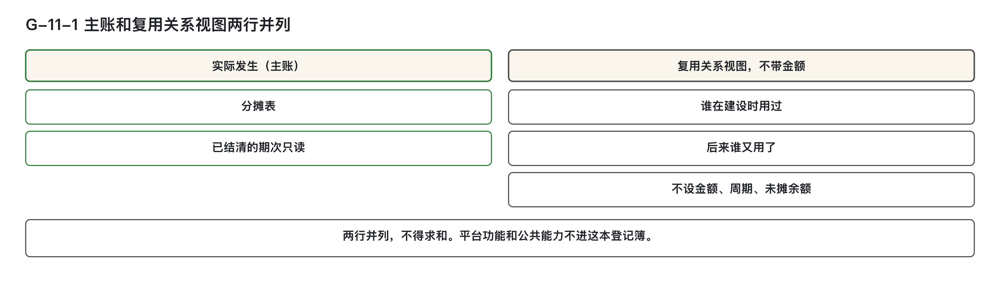
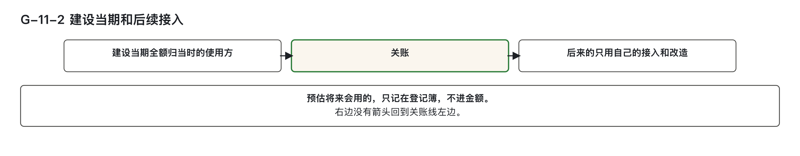
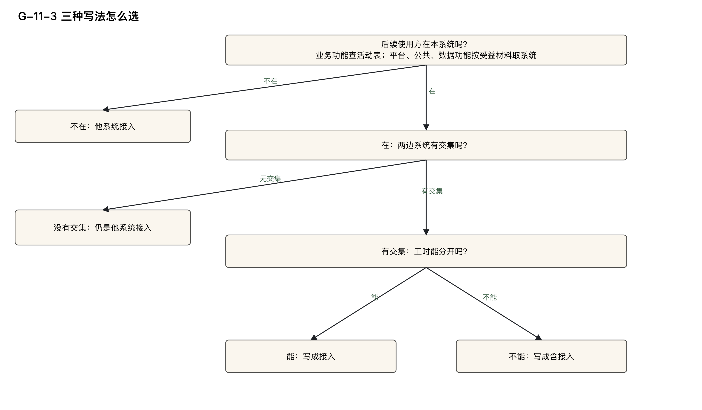

# 跨版本：这次建的、下次还在用

> 副标题：上期建设的接口本期再次使用，建设成本要不要重新分配  
> 模块三 · 钱怎么落 · 第 ⑪ 篇。本篇主干规则：能力登记簿只记谁复用了谁，不记金额。建设当期只有一个使用方时，建设成本全额归该使用方；此后接入的使用方只承担自己的接入和改造。后续接入按两边系统有没有交集，分别写成 `接入：`、`含接入：` 或 `他系统接入：`。需求编号只是标签，不得用来代替业务功能。

---

## 学习目标

完成本篇后，能够：

1. 判定已结清的期次改不改：主账当期摊完，已经结清的期次不回改；后期才用上的一方，不回头分建设成本。  
2. 填写能力登记簿：它只记共通能力和潜在共通能力的复用关系，共通标记只取 `共通能力`、`潜在共通能力`；登记簿不记金额；公共能力与平台功能不进登记簿。  
3. 分开实际使用方和预估使用方：已排期、已立项、将来要用的，只记在清单里并写出立项依据；它们不算建设期使用方，不参与当期分摊，也不计入跨系统的系统数。  
4. 判定后续复用方承担什么：同一系统、其他系统都只承担接入、联调、回归的直接成本；改造的另承担改造成本；不承担建设成本，也没有摊销额（把建设成本分几期慢慢记的那一笔）；本系统原建设成本不回算。  
5. 写出同一系统、其他系统的判法，以及 `接入：`、`含接入：`、`他系统接入：` 三种写法各用在哪种情形。  
6. 并列写出报表的两行：实际发生（主账）、复用关系视图（不带金额）；只出一行是披露不完整，两行不能相加。  
7. 判定需求编号能做什么：它是标签，只用于追溯和跨期分析；它覆盖的、还没下钻的规模仍走缺环分流，有需求编号仍须按缺环规则分流。

---

## 快速判定

读表前先分清几个对象。**下钻**，指沿着子流程、活动、业务功能、机能一层一层往下找，找到对应的那一行，并写明找到了哪一层。**业务功能**，指一项可以单独指认的业务结果，编号以 F- 开头。**机能**，是用来登记软件规模的单位，一个画面、一个接口都是机能；机能主键是机能的唯一编号，由三段拼成：在哪类载体上、在哪个载体上、做什么动作。**CFP**，功能点的计数单位；功能点本身怎么数，本系列不讲授。

主账与登记簿的用途各有分工。**主账**，指记录当期实际发生成本的那本账。**能力登记簿**，是只记复用关系、不记金额的一本登记簿；复用关系，指谁在建设时用过、后来谁又用了。本篇还借用管理会计的三个词：**归集**，指把一笔笔成本收上来、记到某个对象名下；**归属**，指认定这笔成本算谁的；**分摊**，指几个对象共同耗用的成本，按一个说得清的依据分给各方。

本篇的例子取自同一个教学案例：汽车经销商（4S 店）的销售线索跟进，案例里流程和活动的编号以 S- 开头。案例中的金额和数字都是为演示设定的，不是可以照抄的标准值，后文不再逐处标注。本篇涉及的金额和报表，都按信息技术部门内部使用的管理口径理解：不是企业会计科目，不进财务凭证，不产生付款义务；「记在某个业务功能上」只表达归属。篇中出现的估算者、审核方都是职能名称，由哪个岗位担任，各组织自行确定。

第 ⑨ 篇已经写下两句：已结清的期次不改；能力登记簿只记复用关系，不记金额。本篇把这两句写完：登记簿各列怎么填，后续复用方的钱记在哪，需求编号能用来做什么。登记簿不设金额列，不设可核算周期列。

- 主账记当期实际发生，当期摊完：当期发生的成本在当期全部分完、记完，不留到以后各期。期末封存这一期的账、不再改动，叫关账；已经结清的期次只读，不回改。  
- 能力登记簿记复用关系：谁在建设当期用了，后来又有谁接入，有没有改造。它不记金额。  
- 需求编号是标签。追溯和跨期分析用它；归集、分摊、下钻不靠它。

两类情形先排除在本篇之外。其一，多端复用不进本篇：第 ⑦ 篇的复用声明——机能规模汇总里声明「这个机能复用了哪个既有机能」的一栏——写 `复用类型：多端` 时，被复用机能不用进能力登记簿；「能力登记簿可查」只约束跨版本这一种复用。其二，一个活动被另一条子流程引用，也不进登记簿：引用记在表 B（本方法自己扩的活动表）的「主归属 / 引用」列，成本仍只记一份。教学案例里，取消试驾排程全库只有 S-1.4.2 一行，写着 `主归属 L4：S-1.4；引用 L4：S-1.3`（L4 指子流程）；S-1.3 不因此再记一份成本，这一行也不进能力登记簿。

| 当前情况 | 先问一句 | 初步判定 | 详细阅读 |
|---|---|---|---|
| 上期结过账，这期又有人用同一个接口 | 要改的是已结清的期次，还是本期新发生的接入 | 已结清的期次不改；新使用方只承担自己的直接成本 | 第二节、第四节 |
| 建设当期只有一个使用方，另有人已经立项、以后要用 | 期末前是否已经接入 | 标 `潜在共通能力`，主账全额归当期这一个；预估只记登记簿第 5 列，写立项依据 | 第二节 |
| 建设当期已经有两个及以上使用方接入，或与本期同步上线 | 这几个是实际使用方，还是预估 | 标 `共通能力`，按第 ⑨ 篇当期摊完；预估不参与 | 第二节 |
| 登记簿上想加金额、周期、回收额、未摊余额 | 规则里有没有这一列 | 没有；出现任一项，该行不合格 | 第三节 |
| 报表只出主账，或把主账和复用关系视图加在一起 | 两行齐了没有 | 只出一行，是披露不完整；两行并列，不能相加 | 第三节 |
| 登录、短信、集团统一认证是否进登记簿 | 功能身份是平台功能或公共能力吗 | 公共能力与平台功能不进登记簿 | 第二节 |
| 后来的使用方和当初建设的能力在同一系统，接入工时混在它自己的机能里 | 两个承载系统集合有没有交集 | 同一系统：不拆行，来源证据写 `含接入：` | 第四节 |
| 接入、联调、回归的工时能按功能过程分开 | 分得开吗 | 单列直接成本行，来源证据写 `接入：` | 第四节 |
| 后来的使用方是另一个业务系统 | 集合有没有交集；复用方在不在本系统的表 B 里 | 不是同一系统：它那一侧的调用和联调归它自己；本系统另花的钱进池前剔除，写 `他系统接入：`；原建设成本不回算 | 第四节 |
| 有需求编号，想拿它充当记入对象，把还没下钻的规模先落下去 | 记入对象一列填的是 F 编号，还是需求编号 | 需求编号只作标签；它覆盖的、还没下钻的规模仍走缺环分流，有需求编号仍须按缺环规则分流 | 第五节 |

这张表只用来定位，结论按后面各节的判定表作出。

图 G-11-1：主账记录实际发生，复用关系视图不带金额；两行都要披露，不能求和。

---

## 一、这一步的输入与产出

第 ⑨ 篇处理能指名的共用机能投入，并规定已结清期次不回改。第 ⑩ 篇把公共能力和平台功能分进各自的池，当期摊完。本篇做三件事：一个能力进不进能力登记簿，后续复用方本期的钱记在哪，需求编号停在标签列。共用机能怎么分，用第 ⑨ 篇的结论；平台身份怎么定，用第 ⑩ 篇的结论。

这一步的输入是五项已经填好的材料：

- **分摊表**，记录池里的钱按什么依据分给各方的表。要看的是「期次」一列：已结清的期次只读；建设成本在哪一行、后续直接成本在哪一行，都在这张表上。  
- **能力登记簿**。列是：主键、建设版本、共通标记、建设期使用方、受益方留痕（各期使用方清单）、改造历史、下钻状态、来源证据。第 5 列填表时的列名是「受益方留痕（各期使用方清单）」，本篇也称它各期使用方清单；留痕，指把判断依据写下来备查，不是找人签字。  
- **表 B**。它的第 7 列是「关联业务功能编号（F-）」，用来找出含这个 F 的活动行；这些行的「承载系统」合成一个集合，用来判同一系统还是其他系统。来源证据里写了 `外部应用：` 的系统，不计入这个集合。  
- **不计入投入清单**，登记「这笔钱不算进投入」的清单。其他系统后续接入时，本系统另花的钱写在这里，不计入原因以 `他系统接入：` 开头。  
- **功能点计算表的数据移动明细**，以及分摊表的「需求编号（标签）」一列。这一列只作标签；记入对象那一列只能是 F 编号。

这一步的产出是三项：

- **能力登记簿上，该进的能力有一行**：共通标记、建设期使用方、各期的预估和实际使用方、立项依据都填上。金额不出现在这一行。  
- **本期主账上，后续复用方只增加它自己的直接成本**；其他系统另花的钱进不计入投入清单。已结清期次的建设成本原样留着。  
- **报表两行并列**：① 实际发生（主账）；② 复用关系视图（不带金额）。  

这些判定都由估算者作出；「复用关系视图不带金额」这一条，另由工具自动核对登记簿和报表里有没有金额、周期、回收额、未摊余额。

图 G-11-2：建设当期按实际使用方分完；后续接入只记自己的接入和改造，不能回分已结清建设成本。

---

## 二、主账当期摊完，登记簿只记复用关系

### 2.1 规则

主账当期摊完，已经结清的期次不回改。能力登记簿只记共通能力和潜在共通能力的复用关系，不记金额；共通标记只取 `共通能力` 或 `潜在共通能力`。

**共通能力**，指挂得上业务架构、只是被多方复用的能力；**潜在共通能力**，指现在只有一个使用方、以后可能多方复用的能力。共通标记，是登记簿里标明这个能力属于哪一种的一列。判定按下面的分工：

- 建设当期只有一个使用方的，共通标记写 `潜在共通能力`，主账全额归这一个使用方。  
- 建设当期有两个及以上使用方的，共通标记写 `共通能力`，按这三种分法在当期摊完：能指出名字的，按直接归属（这笔直接算到那一方头上）、消费占比（按各方用掉的功能点比例分）、等分（各方平均分），按顺序判定，选第一个符合的；消费占比这种分法现在做不到，先不用。分法的细则在第 ⑨ 篇。  
- **实际使用方**，指本期期末前已接入，或与本期同步上线的使用方。  
- 其余本期已知、将来要用的——已排期、已立项的都算——是**预估使用方**：只记在登记簿第 5 列，并在来源证据写立项依据，也就是它已排期或已立项的凭据，例如立项编号。预估使用方不算建设期使用方，不参与当期分摊，也不计入跨系统的系统数。  
- 后续才接入的复用方，只承担接入、联调、回归的直接成本；改造的，另承担改造成本，改造成本归提出改造的一方；不承担建设成本，也没有摊销额，本方法不设这一笔。详见第四节。  
- 登记簿不能与主账相加；公共能力与平台功能不进登记簿；报表只出两行中的一行，是披露不完整。

第 5 列每一期写成一段：`〈期次〉：预估〈F 编号、F 编号…〉／实际〈F 编号、F 编号…〉`。期与期之间用 `；`，一段之内的 F 编号用顿号 `、`。

本期开发、本期就有其他系统在复用的，先按第 ⑨ 篇的跨系统切分，切出本系统的份额，时间上算同期。后续版本才接入的其他系统，不参与这笔建设成本，见第四节。

谁判：估算者自判。在哪判：能力登记簿的主键、建设版本、共通标记、建设期使用方、各期使用方清单、改造历史、下钻状态、来源证据；报表的两行并列。谁举证：主张「这是共通能力」的一方举证——它能挂到 L4（子流程）或 L5（活动）上，且建设当期的使用方达到两个及以上（含本期复用的其他系统）；拿不出两个实际使用方，就写 `潜在共通能力`，全额归建设当期那一个。

能挂到 L4 或 L5、又被多方复用的，才是共通能力或潜在共通能力。挂不到的，先按第 ⑩ 篇四步判断身份；被判为平台功能或公共能力的，不进本登记簿。登录、权限等不能仅靠复用范围取得平台身份。教学案例里，身份认证、短信发送是平台功能，钱在第 ⑩ 篇的池里当期摊完；集团统一认证是公共能力，不跟身份认证、短信发送放在一起。本系统只接入、又不进本系统度量范围的能力，不登记，也不进金额。

### 2.2 判定表

| 所见情形 | 结论 | 依据 |
|---|---|---|
| 建设当期实际使用方只有一个 | 共通标记写 `潜在共通能力`，主账全额归它 | 只有一个使用方，标潜在共通能力，全额归它 |
| 建设当期实际使用方两个及以上，含本期已接入或同步上线的其他系统 | 共通标记写 `共通能力`；能指名的按这三种分法分，当期摊完，消费占比这种分法现在做不到 | 两个及以上，按这三种分法当期摊完 |
| 已排期、已立项、将来要用，期末前还没接入 | 预估使用方：只记第 5 列，来源证据写立项依据；不算建设期使用方，不参与当期分摊，不计入跨系统的系统数 | 预估使用方的定义 |
| 本期期末前已接入，或与本期同步上线 | 这一期的实际使用方 | 实际使用方的定义 |
| 期次已经关账 | 这一期主账不改 | 主账当期摊完，已经结清的期次不回改 |
| 后期才增加使用方 | 不参与已发生的建设成本；它自己的直接成本见第四节 | 后续复用方只承担直接成本；已结清的期次一律不改 |
| 功能身份是公共能力或平台功能 | 不进能力登记簿 | 公共能力与平台功能不进登记簿 |
| 数据对象挂得到 L4 或 L5，建设当期只有一个使用方 | 进登记簿，标记 `潜在共通能力` | 主张共通能力，要举证挂得到、且使用方两个及以上；不够两个就标潜在共通能力 |
| 登记簿上的关系要和主账的金额加在一起 | 不得求和，两套数分别查看 | 登记簿不能与主账相加 |
| 报表只出主账，或只出复用关系视图 | 披露不完整 | 只出其中一行，是披露不完整 |

### 2.3 正例

正例取自教学案例。

1. 接口「查询客户」，主键 `接口|GET /api/customer/query|查询`，建设版本 V-示例-1，期次-示例-1 为 F-S-1.3.2.1 建设，当期实际使用方只有这一个。能力登记簿：共通标记 `潜在共通能力`，建设期使用方 F-S-1.3.2.1；第 5 列写 `期次-示例-1：预估 F-S-1.3.2.1、F-S-1.4.1.1／实际 F-S-1.3.2.1`。F-S-1.4.1.1 已立项（立项-S-02），只记在预估里。主账直接成本 800.00，动因——按什么依据分钱——写 `直接归属`，使用方 F-S-1.3.2.1。这 800.00 不因立项而拆开。  
2. 接口「查询线索池」「查询分配配额」在期次-示例-0 建设，当期都只有 F-S-1.1.2.1 一个使用方，也没有已立项的预估使用方，两条都标 `潜在共通能力`。主账在期次-示例-0 全额归 F-S-1.1.2.1，登记簿只记复用关系。  
3. 到了期次-示例-2，F-S-1.4.1.1 实际接入「查询客户」，F-S-1.2.3.1 实际接入「查询线索池」。登记簿第 5 列只把新接入的使用方补进它实际接入的那一期，不回改已结清期次的实际段。期次-示例-1 已经关账，那一期主账里的 800.00 仍全在 F-S-1.3.2.1；本期主账不为「查询客户」的建设成本再出一行。

身份认证、短信发送不出现在这本登记簿里：它们是平台功能。

### 2.4 反例

反例取自实际填报中常见的错误形态，只说明形态，不指向个案。

1. 建设当期只有一个使用方，另一个系统已经立项。有人把立项的那一方写成建设期使用方，把全额拆成两半，并把这一方计入跨系统的系统数。已立项、期末前未接入的，是预估使用方：不算建设期使用方，不参与当期分摊，也不计入系统数。  
2. 一套登录被两个业务域使用，有人因为它「以后还会被用」就写进能力登记簿，标记 `共通能力`。登录在第 ⑩ 篇判成平台功能；公共能力与平台功能不进登记簿。

---

## 三、复用关系视图不带金额

### 3.1 规则

复用关系视图不带金额，不能与主账相加。能力登记簿仅记录复用关系，不记录金额、周期、回收额、未摊余额；复用关系视图与主账不得合并为同一合计行。

- 能力登记簿各列中，**禁止出现金额、可核算周期、到期日、回收额、未摊余额**等字段。该类信息若出现在登记簿或报表的“复用关系视图”行中，该行判定为不合格。
- 复用关系视图不能与主账相加，两行必须并列存在，不可合并为一行，也不得在合计行中合算。
- 由于无周期设定，因此不存在“到期”“沉没”“延长”等状态判断。
- 历史变更说明：原方法中的“价值账”“可核算周期 24 个月”“未摊余额记在最初使用方名下”三项已取消。现行规定中，能力登记簿仅记录复用关系，不涉及金额与周期核算。

## 四、后续复用方只承担直接成本

后续复用方（含后续才接入的其他系统）只承担直接成本，不参与建设成本分摊。直接成本指不经过池、直接记到一个功能头上的成本。

后续直接成本按三条规则记载：

- 后续复用方仅承担接入、联调、回归的直接成本；本系统原建设成本不回算，无论复用方是否同属一个系统。
- 若有改造需求，改造成本归提出改造的一方；改造不导致建设成本重新分摊。
- 后续复用方不承担建设成本，也没有摊销额。

后续复用方的直接成本按能否按功能过程拆分，采用两种记法：

- **能按功能过程分开**：单列一行直接成本，来源证据写 `接入：` + 反引号包起的三段式机能主键。
- **无法拆分、混入复用方自身某个机能中**：不拆行，随该机能记直接成本，来源证据写 `含接入：` + 反引号包起的三段式机能主键。

跨系统按两个承载系统集合判定：

- 判断是否为同一系统，需依据表 B「承载系统」求交集：
  - 复用方取表 B 第 7 列含本行复用方（使用方）业务功能 F 编号的各行，提取这些行的承载系统集合；
  - 被复用能力取表 B 第 7 列含其主归属 F 的各行，提取其承载系统集合；
  - 若两个集合有交集，则为同一系统，写 `接入：` 或 `含接入：`；
  - 若无交集，则为其他系统，写 `他系统接入：〈系统名〉`，系统名取复用方集合，多个用 `；` 分隔。
- 来源证据含 `外部应用：` 的系统，不计入承载系统集合。
- 复用方不在本系统表 B 中（如后续版本才接入），直接按其他系统处理，系统名取接入清单或调用方注册信息。

被复用能力若不挂活动（即主归属为平台功能、公共能力或数据功能），则被复用集合的取法调整为：

- 平台功能、公共能力：合查分摊表和已结清期次留存副本，以该机能（没有机能主键时取其 F 编号）为成本池的最早一期就是建设当期。只取该期各行的使用方 F，再到表 B 汇集这些 F 的承载系统；后续各期同池的使用方不并入；
- 数据功能：取机能登记表「受益方留痕」中的受益活动，再取这些活动的承载系统集合；
- 以上集合均排除来源证据含 `外部应用：` 的系统。

若原成本池非三段式机能主键（如 `归挂：`、`外购调用：`、`共享服务：` 等），成本池为 F 编号的仍按上一段平台功能、公共能力取法；其余被复用集合取该池在分摊表中与本行同一期次的使用方承载系统集合，同样排除外部应用。

若剔除外部应用后，复用方集合或被复用集合为空，应退回补全承载系统（业务功能须挂活动，且活动至少一步在我方系统完成；平台功能、公共能力、数据功能仍按前述受益材料取系统，不强制挂活动）；补不出则重判挂接。建关联先看触发和专属，计成本再看能否归到一次交付；建了关联但成本归不到一次交付的，进共享服务池，不是删除投入。相关承载系统或受益材料补齐之前，不下同一系统或其他系统的结论，判不过。

按第④篇确认各系统互不等待、无需拆活动时，一个活动写多个承载系统仅为设计告警，不因此改变系统归属。须等待另一系统结果的，仍按第④篇拆活动，不能靠此处告警放行。

谁判：估算者自判。  
在哪判：能力登记簿的「受益方留痕（各期使用方清单）」「改造历史」；分摊表中后续复用方的直接成本行；不计入投入清单中「不计入原因」字段。  
谁举证：主张“后续复用方应分担建设成本”的一方——该主张不成立；主张某笔费用为其他系统接入所花的，须明确写出系统名。

格式要求：

- `接入：`、`含接入：` 后必须为反引号包裹的三段式机能主键，且在机能登记表中可查；
- `他系统接入：` 行必须同时满足：
  - 对象类别写进池前剔除，不计入原因写 `他系统接入：〈系统名〉`；
  - 来源证据写明 `原池：〈池类型〉 〈成本池〉`；
  - 缺少 `原池：` 字段，判为不合格；
- 登记簿「改造历史」列：未发生改造填 `—`；发生过改造，每次一段，格式为 `〈期次〉、〈需求编号〉、〈变更 CFP〉`，段间用 `；` 分隔；
- 需求编号仅作标签，不能替代业务功能编号用于归集或分摊。

---

### 两类判定表

复用关系视图的核对：

| 所见情形 | 结论 | 依据 |
|---|---|---|
| 登记簿或复用关系视图出现金额 | 该行不合格 | 出现金额、周期、回收额、未摊余额任一项，该行不合格 |
| 出现可核算周期、到期日、回收额 | 该行不合格 | 同上 |
| 出现金额、周期、回收额、未摊余额任一项 | 该行不合格；主账在建设当期已经摊完 | 同上 |
| 写到期、沉没、延长周期 | 没有这些状态 | 没有周期，也就没有到期、沉没、延长 |
| 复用关系视图和主账放进同一合计行 | 不许，两行不出现在同一合计 | 不能与主账相加 |
| 报表两行都在，各自带自己的标题 | 通过；复用关系视图这一行不带金额 | 两行并列 |
| 只披露实际发生，或只披露复用关系 | 披露不完整 | 只出其中一行，是披露不完整 |

后续接入的核对：

| 所见情形 | 结论 | 依据 |
|---|---|---|
| 后续使用方，同一系统，接入工时能按功能过程分开 | 单列直接成本行，来源证据写 `接入：〈被复用机能主键〉`，动因是直接归属 | 能分开的单列 |
| 后续使用方，同一系统，工时混在它自己的某个机能里，拆不出来 | 不拆行，随该机能记直接成本，来源证据写 `含接入：〈被复用机能主键〉` | 分不开的不拆行 |
| 两个承载系统集合有交集 | 同一系统，写 `接入：` 或 `含接入：` | 有交集是同一系统 |
| 两个集合没有交集 | 其他系统，写 `他系统接入：` | 没有交集是其他系统 |
| 集合里有来源证据含 `外部应用：` 的系统 | 这个系统不计入，再求交集 | 外部应用不计入 |
| 多承载系统且已按第④篇确认互不等待、无需拆活动 | 仅设计告警，不因此改成其他系统；若须等待另一系统结果，仍按第④篇拆活动 | 先满足不需拆活动条件，再按集合交集判系统归属 |
| 复用方不在本系统表 B 里 | 直接按其他系统判，系统名取接入清单或调用方注册 | 复用方不在本系统表 B |
| 其他系统那一侧的调用代码和联调 | 归它自己，随调用方 | 它那一侧归它自己 |
| 本系统为其他系统另花的改造费 | 发生当期进池前剔除，不计入原因写 `他系统接入：〈系统名〉`，来源证据写 `原池：` | 本系统另花的进池前剔除 |
| 同一系统或其他系统，是否回头分本系统原建设成本 | 不回算，两种情形一样，也没有摊销额 | 本系统原建设成本不回算 |
| 有人提出改造 | 改造成本归提出改造的一方，建设成本仍不重分 | 改造成本归提出方 |
| 剔除外部应用后，要用的集合仍是空的 | 不下同一系统或其他系统的结论；退回补承载系统或重判挂接；判不过 | 集合为空 |
| 被复用的是平台功能、公共能力、数据功能，或原池不是机能主键 | 被复用集合按本节的取法取；这些能力本身仍不因本条进登记簿 | 不挂活动时取集合的办法 |

### 教学案例走法

正例取自教学案例。

1. **期次-示例-1**：  
   - “查询客户”接口主键为 `接口|GET /api/customer/query|查询`，建设版本 V-示例-1，建设当期使用方为 F-S-1.3.2.1。  
   - 能力登记簿中：共通标记 `潜在共通能力`，建设期使用方 F-S-1.3.2.1，第 5 列填写：`期次-示例-1：预估 F-S-1.3.2.1、F-S-1.4.1.1／实际 F-S-1.3.2.1`。F-S-1.4.1.1 已立项（立项-S-02），仅作为预估使用方记录。  
   - 主账中：800.00 记在 F-S-1.3.2.1，动因 `直接归属`，来源证据 `接入：` 或 `含接入：` 不适用。  
   - 复用关系视图行：实际使用方为 F-S-1.3.2.1，预估使用方为 F-S-1.4.1.1（立项-S-02），不带金额。  
   - 两行并列，不能相加。

2. **期次-示例-2**：  
   - F-S-1.4.1.1 接入「查询客户」，联调工时混在“保存预约”机能中。  
     - 分摊表中：池发生额 120.00，使用方 F-S-1.4.1.1，动因 `直接归属`，来源证据写 `含接入：` + 反引号包起的 `接口|GET /api/customer/query|查询`。  
     - 复用方活动 S-1.4.1，承载系统为经销商管理系统（示例）、车辆管理系统（示例）；其中车辆管理系统标注 `外部应用：`，不计入。  
     - 被复用能力主归属 F-S-1.3.2.1，活动 S-1.3.2，承载系统集合为 {经销商管理系统（示例）}。  
     - 两集合交集为 {经销商管理系统（示例）}，判定为同一系统。  
     - 本期主账不为「查询客户」的 800.00 再出一行，建设成本不回算。  
   - F-S-1.2.3.1 接入「查询线索池」，联调工时与“定级”画面工时混在一起，无法拆分。成本记在哪一行，以工时实际混在哪个机能为准，不从结果区或数据移动推断。  
     - 分摊表中记在 `画面|评级复核页 复核操作区|定级` 行，金额 80.00，使用方 F-S-1.2.3.1，动因 `直接归属`，来源证据写 `含接入：` + 反引号包起的 `接口|GET /api/clue/pool|查询`。  
     - 复用方活动 S-1.2.3，承载系统集合 {经销商管理系统（示例）}；被复用能力主归属 F-S-1.1.2.1，活动 S-1.1.2，承载系统集合 {经销商管理系统（示例）}。  
     - 有交集，判定为同一系统。  
     - 登记簿中将 F-S-1.2.3.1 补入期次-示例-2 的实际使用方清单，并写立项依据（立项-S-03）。  
   - 两笔接入均因工时混入而使用 `含接入：`，未单独列出 `接入：` 行。

3. **假设场景（演示用，不进教学案例）**：  
   - 本系统覆盖售后服务系统（示例）上的活动“受理维修预约”，表 B 承载系统仅写售后服务系统（示例）。  
   - 功能 F-示例-09 在本期接入「查询客户」。  
   - 复用方集合：{售后服务系统（示例）}；被复用集合：{经销商管理系统（示例）}。  
   - 无交集，判定为其他系统。  
   - 该系统侧的调用代码和联调归其自己；本系统为其另花的适配费，在发生当期进池前剔除，不计入原因写 `他系统接入：售后服务系统（示例）`。  
   - 本系统原建设成本 800.00 仍留在期次-示例-1，不回算。  
   - 该情形仅在本系统同时覆盖多个业务系统时出现，判别依据为业务系统层级。

图 G-11-3：先看复用方是否在活动表中，再判系统集合交集；同一系统内，工时能分开才单列接入，分不开写含接入。

另有平台适配的填法示例：短信接口为售后服务系统（示例）另做适配，本系统支出在发生当期进池前剔除。不计入原因写 `他系统接入：售后服务系统（示例）`；来源证据说明属改造、归提出方，并写 `原池：平台池` 和短信机能主键。短信是平台功能，不进入能力登记簿；模板金额是占位，此处不代入数字。

期次-示例-2 的三条登记簿仍只记关系：“查询客户”实际使用方为 F-S-1.3.2.1、F-S-1.4.1.1；“查询线索池”为 F-S-1.1.2.1、F-S-1.2.3.1；“查询分配配额”仍只有 F-S-1.1.2.1。改造历史均填 `—`，三条本期没有新的建设发生额；使用方的联调直接成本不写回登记簿。

### 反例

反例仅说明形态，不指向具体案例。

1. 有人将「查询客户」的 800.00 从 F-S-1.3.2.1 划出一半，改写期次-示例-1，或在本期主账补一行摊销额给 F-S-1.4.1.1。  
   - 错误点：已结清期次不回改；后续复用方不承担建设成本，也无摊销额。  
   - 正确做法：本期主账仅增加 F-S-1.4.1.1 的直接成本（如 120.00），原建设成本不重分。

2. 「保存预约」与「查询客户」的承载系统集合有交集，却仍写 `他系统接入：`，将 120.00 剔出本系统。  
   - 错误点：有交集应为同一系统，不应写 `他系统接入：`。

3. 售后服务系统（示例）与经销商管理系统（示例）无交集，却写成 `含接入：`，把本系统为它另花的适配费摊进本系统的业务功能。  
   - 错误点：无交集应为其他系统，应写 `他系统接入：`，且该费用应在进池前剔除。

4. 有人在能力登记簿中添加“未摊余额”列，将建设成本按月向后续使用方摊销，或设置“可核算周期 24 个月”“到期记沉没”等。  
   - 错误点：能力登记簿不设金额、周期、回收额、未摊余额列；无周期则无到期、沉没、延长状态。

5. 报表中将主账 800.00 与复用关系视图合并为一行，标题为“这项能力到本期值多少”。  
   - 错误点：复用关系视图不带金额，两行不得相加。

## 五、需求编号只作标签

### 5.1 规则

需求编号不是归集的依据；它是标签，仅用于追溯与跨期分析。  
落实到操作层面，有三条禁令，且缺环分流不因标签齐全而省略：

- **不得用需求编号代替业务功能归集**：记入对象一列只能是 F 编号，不能以需求编号替代。
- **不得拿需求编号当未下钻池的分摊依据**：未下钻池（暂时找不到归属的钱先放的池子）只按全盘业务 CFP 占比分摊，摊法在第 ⑧ 篇。
- **不得拿需求编号当机能和功能之间的桥**：即不能用需求编号将一条机能直接关联到某个业务功能。
- **有需求编号，覆盖的规模仍按缺环规则分流**：缺环分流是第 ⑧ 篇的去向规则——链路中间断了一环时，实际结果确属共用且没有单一归属的消费者，以及按原规则处理的定时任务本身没有单一归属，按受益活动分摊；画面和能指认对方功能的接口必须有人认领；本系统内调来、指不出对方功能的，随调用方；类型判不出的，进待查清单。与其他系统对接的，谁调用归谁。

以需求编号充当临时记入对象、让还没下钻的规模先落下去，是典型的错误做法：过渡期过后，口径收不回来。

**谁判**：估算者自判。  
**在哪判**：功能点计算表的数据移动明细、分摊表的「需求编号（标签）」一列——这一列只作标签；记入对象一列只能是 F 编号。  
**谁举证**：无需举证，这是禁令。

预估使用方的立项依据写在能力登记簿的来源证据里，例如立项-S-02：它说明预估使用方凭什么记入第 5 列；它不代替建设期使用方，也不填进分摊表的使用方列。

---

### 5.2 判定表

| 所见情形 | 结论 | 依据 |
|---|---|---|
| 「需求编号（标签）」写了编号，使用方列写的是 F 编号 | 标签留着，归集仍按 F 编号 | 只作标签；记入对象一列只能是 F 编号 |
| 使用方列、主归属列填了需求编号 | 不合格；记入对象只能是 F 编号 | 不得用需求编号代替业务功能归集 |
| 未下钻池的动因写成某个需求编号，或按需求编号各摊一截 | 不许；未下钻池不以需求编号作为分摊依据 | 需求编号只是标签；待下钻的钱进未下钻池，按全盘业务 CFP 占比分摊，报表单列 |
| 一条机能还没下钻，因为数据移动上有需求编号，就把它当成已经挂上某个 F | 覆盖到的规模仍走缺环分流 | 有需求编号仍须按缺环规则分流 |
| 用需求编号把机能和功能连起来，中间没有 F 编号 | 不许；不得作机能和功能之间的桥 | 需求编号不得作桥 |
| 跨期要查「这笔建设是哪条需求提出的」 | 可以，顺着标签追溯；不改已结清的期次，不改记入对象 | 只用于追溯与跨期分析 |
| 预估使用方的立项编号写在登记簿来源证据 | 这是立项依据，说明为什么记入预估；不参与当期分摊 | 预估使用方只记第 5 列，来源证据写立项依据 |

---

### 5.3 正例

正例取自教学案例。

1. 「查询客户」的建设行，需求编号（标签）是需求-S-05，使用方业务功能是 F-S-1.3.2.1，分摊额 800.00；标签说明这笔建设对应哪条需求，记入对象仍是 F 编号。期次-示例-2 的接入行，标签是需求-S-41，记在「保存预约」的 120.00 上。两期各用各的标签追溯；800.00 不改记到需求-S-41 名下。
2. 登记簿来源证据写立项-S-02，对应预估使用方 F-S-1.4.1.1。这个编号只说明当时已经立项：它不出现在期次-示例-1 的使用方列，也不把 800.00 拆开。
3. 画面「定级」那一行的标签是需求-S-23；`含接入：` 记的是接入了哪个机能。需求编号不代替这一个 `含接入：` 的写法，也不代替使用方 F-S-1.2.3.1。

---

### 5.4 反例

反例只说明形态，不指向个案。

1. 一条画面认领不出活动，数据移动上却有需求编号。有人把需求编号填进使用方列，动因写成「按该需求」，让这一截规模在未下钻池之外落下去。需求编号不得作未下钻池的分摊依据，不得代替业务功能归集；这一截仍走缺环分流，有需求编号也不豁免。
2. 跨期分析时，有人按需求编号把两期的分摊额相加，当成这个需求的成本，中间不再看 F 编号，也不看已结清的期次。需求编号只用于追溯和跨期分析；已结清期次的主账不因换了一个需求编号而重写。

---

## 本篇涉及的、各组织自己确定的数字

本篇不新增数值。登记簿没有金额和可核算周期列，24个月和未摊余额去向已取消；换组织也不在本篇重新定月数或余额归属。分摊额到分沿用第⑨篇示例取值，未下钻池占比沿用第⑧篇，平台占比预警见第⑩篇。

## 练习

取一条上期已经建设、本期又有使用方的接口，连同它上面的需求编号，按本篇的判定表走一遍：

1. 先看功能身份。公共能力、平台功能停下，不进能力登记簿；数据对象挂得到 L4 或 L5 的，才继续。
2. 找出建设当期的实际使用方：本期期末前已接入，或与本期同步上线的。已排期、已立项、将来要用的，写入第 5 列的预估，来源证据写立项依据；不得把预估计入建设期使用方，也不得计入跨系统的系统数。
3. 实际使用方只有一个，共通标记写 `潜在共通能力`，主账全额归它；两个及以上，写 `共通能力`，分法回到第 ⑨ 篇，当期摊完。
4. 看建设那一期关账了没有。已经关账的，不得改那一期；后续使用方不写进那笔建设成本。
5. 用表 B 第 7 列取出两边的活动，把承载系统合成两个集合，去掉 `外部应用：`。有交集：工时分得开就写 `接入：`，分不开就写 `含接入：`。没有交集，写 `他系统接入：`，并写 `原池：`。复用方不在本系统表 B 里的，直接按其他系统判，系统名取接入清单或调用方注册。集合是空的，先退回去补承载系统或重判挂接，同一系统还是其他系统先不下结论。
6. 登记簿上检查一遍：没有金额，没有周期，没有回收额，没有未摊余额。报表写出两行，注明不得相加。
7. 需求编号留在「需求编号（标签）」一列，使用方列仍是 F 编号。这条需求覆盖到的、还没下钻的规模，仍走缺环分流，有需求编号仍须按缺环规则分流。

完成后，把登记簿和本期分摊表交给另一个人，不出示已有的共通标记和三种写法，由对方按判定表重判一遍。两人判定不一致的行，回到本篇判定表核对，不当场折中。

---

## 自测

本篇的自测不另设评分。下面各题的答案，就是上文已经写明的结论。

1. 复述：主账当期摊完、登记簿只记复用关系的规则句。能力登记簿记什么？共通标记有哪两个取值？  
   → 主账当期摊完，已经结清的期次不回改。能力登记簿只记共通能力和潜在共通能力的复用关系——谁在建设当期用了，后来又有谁接入，有没有改造——不记金额；共通标记取 `共通能力`／`潜在共通能力`。

2. 判定：期次-示例-1，「查询客户」只有 F-S-1.3.2.1 一个实际使用方，F-S-1.4.1.1 已立项。共通标记写什么？800.00 归谁？F-S-1.4.1.1 算不算建设期使用方？  
   → `潜在共通能力`。800.00 全额归 F-S-1.3.2.1，动因 `直接归属`。F-S-1.4.1.1 是预估使用方，只记第 5 列，来源证据写立项-S-02；不算建设期使用方，不参与这 800.00，也不计入跨系统的系统数。

3. 判定：期次-示例-2，F-S-1.4.1.1 已经接入。期次-示例-1 的 800.00 改不改？本期主账是否为这笔建设成本再出一行？  
   → 不改。已结清的期次只读，本期主账不为这笔建设成本再出一行。F-S-1.4.1.1 只承担它自己的接入、联调、回归；登记簿把这一期的实际使用方补上，不写金额。

4. 判定：登记簿是否加「未摊余额」和「可核算周期 24 个月」？复用关系视图能不能和主账放进同一个合计？  
   → 不加。出现金额、周期、回收额、未摊余额任一项，该行不合格；没有周期，也就没有到期、沉没、延长。复用关系视图与主账不相加，不出现在同一合计行。本篇没有要自定的数字，不把 24 个月写回来。

5. 判定：身份认证、短信发送是否进能力登记簿？集团统一认证若判成公共能力，是否进入登记簿？  
   → 都不进。公共能力与平台功能不进登记簿；它们的钱在第 ⑩ 篇的池里当期摊完。

6. 判定：「保存预约」写了 `含接入：`，两边集合在去掉车辆管理系统之后都是 {经销商管理系统（示例）}。为什么不写 `他系统接入：`？车辆管理系统为什么不计入？  
   → 两个集合有交集，是同一系统，所以写 `含接入：`。车辆管理系统的来源证据含 `外部应用：`，不计入；不剔除它，交集里仍有经销商管理系统（示例），结论相同。按第④篇确认互不等待、无需拆活动时，多承载系统只是设计告警，不改系统归属；须等待另一系统结果的仍要拆活动。原建设成本不回算。

7. 判定：画面「定级」的 80.00 里含着接入「查询线索池」的联调，工时拆不出来。这一行怎么写？建设成本回不回算？  
   → 不拆行。80.00 仍是画面「定级」的直接成本，使用方 F-S-1.2.3.1，来源证据写 `含接入：` 和「查询线索池」的机能主键。两边都是经销商管理系统（示例），是同一系统，接入费进本系统。建设成本不回算。

8. 判定：售后服务系统（示例）的 F-示例-09 接入「查询客户」，两个承载系统集合没有交集。本系统为它另花的适配费记在哪？「查询客户」的建设成本动不动？  
   → 记在不计入投入清单，不计入原因写 `他系统接入：售后服务系统（示例）`，发生当期进池前剔除；它那一侧的调用代码和联调归它自己。「查询客户」的建设成本不回算。这一条是模板里的演示，不进教学案例。

9. 判定：`接入：` 和 `含接入：` 差在哪一步？`他系统接入：` 的来源证据还要写什么？  
   → 同一系统并且工时能按功能过程分开，单列一行，写 `接入：`；同一系统并且工时混在复用方自己的机能里，不拆行，写 `含接入：`。其他系统写 `他系统接入：`，来源证据还要写 `原池：〈池类型〉 〈成本池〉`。三种写法都不把本系统原建设成本回算。

10. 判定：需求-S-05 写在「查询客户」的建设行上。能不能把使用方改成这个需求编号？有需求编号，能不能因此不走缺环分流？  
    → 不能。记入对象一列只能是 F 编号；需求-S-05 留在「需求编号（标签）」，供追溯和跨期分析。不得代替业务功能归集，不得作未下钻池的分摊依据，不得作机能和功能之间的桥。它覆盖的规模仍走缺环分流，有需求编号仍须按缺环规则分流。

11. 判定：取消试驾排程在 S-1.3 的流程图上也有，表 B 写了 `引用 L4：S-1.3`。是否为这个引用在 S-1.3 再记一份成本，或在能力登记簿加一行？  
    → 不。引用记在 S-1.4.2 的「主归属 / 引用」，全库只有这一行；成本只在 S-1.4 记一份。引用不因此进能力登记簿，也不因此重分。

12. 判定：报表只列出「实际发生（主账）」一行。披露完整吗？  
    → 不完整。报表要两行并列：① 实际发生（主账）；② 复用关系视图（不带金额）。只出其中一行，是披露不完整；两行不得相加。

---

## 本篇依据

本节供追溯用，不要求阅读。

- 主账当期摊完、登记簿只记复用关系、复用关系视图不带金额、后续复用方只承担直接成本、需求编号只作标签：规则出处为 CM-ADR-014 §3 第 1 条、R1、R3、R4，CM-ADR-014 L73 前半、L74，CM-ADR-004 §3.2(b)、L116，CM-ADR-010 §3 第 3 条、R2、R5；纲目第 ⑪ 篇另列 D9、N6。预估使用方不作预先分摊：CM-ADR-014 L53。各条判定的四栏（谁判、在哪判、谁举证、并列时怎么定）见附录 B。
- 以下三处是本系列在教学侧定下的口径：能力登记簿改为复用关系账，不记金额，没有周期、摊销、余额、沉没、延长（内部裁定记录第 36 条，第 64 条随之消解）；需求编号只作标签（内部裁定记录第 8 条）；同一系统、其他系统按表 B「承载系统」求交集（内部裁定记录第 108 条）。与底稿的偏离——CM-ADR-014 R2、R3②、R4 的金额字段、R5、R6 的「＋当期摊销额」（L73），以及 CM-ADR-003 L70——采用本系列的写法，底稿不随之修改。
- 纲目第 ⑪ 篇旧稿仍写着两套账，其中一套是价值账，并写可核算周期只作用于价值账、未摊余额继续挂在最初使用方名下，要自定的数字写成 24 个月和未摊余额去向。现行规定已改为复用关系账，本篇按现行规定写，纲目旧稿不随之修改。
- 「主账当期摊完，已经结清的期次不回改」与第 0 篇第六节同一句。第 ⑨ 篇已经写明：已结清的期次一律不改；后期新增的活动或使用方不参与已发生成本的分摊，只承担自己的直接成本。本篇把直接成本怎么记、登记簿怎么填补完。初始化态下，未下钻池的行补上归属后，从补上的这一期起按新归属记账，已结清期次的主账不回改——这句在第 ⑧ 篇、第 ⑨ 篇。第 ⑩ 篇写公共能力与平台功能，那两种不进本篇的登记簿。
- 同一系统、其他系统的正反例对照见附录 D §6.2；「互不等待、无需拆活动时，多承载系统仅设计告警」出处 CM-ADR-013 L201–205。案例走法见附录 E：S-1.3 第 1.6 节（「查询客户」建设当期一个使用方，800.00 全额归 F-S-1.3.2.1，F-S-1.4.1.1 只记预估，立项-S-02）；S-1.1 第 2.6 节（「查询线索池」「查询分配配额」潜在共通能力，没有预估使用方）；S-1.4 第 4.6 节（跨期不改 800.00，三条登记簿只记关系；「保存预约」写 `含接入：`）；S-1.2 第 3.6 节（画面「定级」写 `含接入：`，接入「查询线索池」）；S-1.4 表 B（S-1.4.2 的引用 L4，成本不因引用再记一份）。
