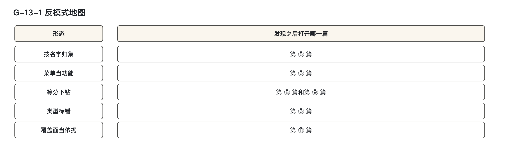
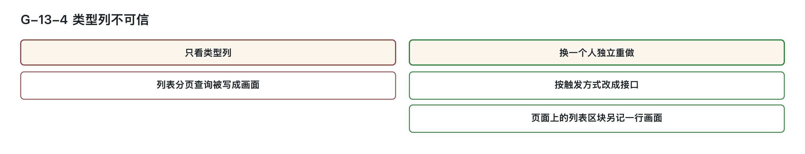
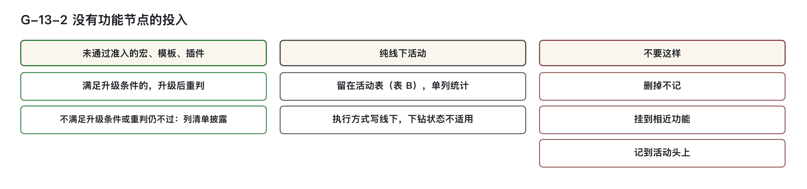
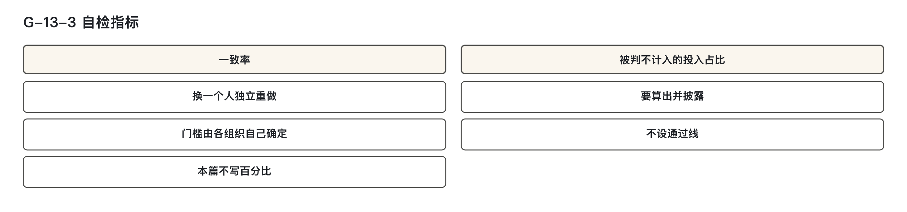

# 反模式与自检  
这些填法会漏什么？

---

## 一、先看表里哪些行需要重查

完成本篇后，能够：

1. 看见一种填法，说出它会把哪一截漏掉，或把哪一截伪装成已经算清。  
2. 用材料把这种填法从表里找出来，不靠印象。  
3. 找到之后，打开写定判法的那一篇核对：第③篇管宏、模板、插件的去处，第④篇至第⑫篇管其余各步。不拿反模式代替判定表。

本篇涉及的金额和占比，均按信息技术部门内部使用的管理口径理解：非企业会计科目，不进财务凭证，不产生付款义务；「挂在某一行上」仅表达归属。练习中若出现金额数字，仅为演示设定，不可照抄为标准值，按同一口径理解。  

下钻，指沿着子流程、活动、业务功能、机能一层一层往下找，找到对应的那一行，并写明找到了哪一层。机能，是登记软件规模的单位，一个画面、一个接口都是机能；其上一层为业务功能，指一项可单独指认的业务结果。功能点是已数出的软件规模，登记在机能上；CFP 是功能点的计数单位，本系列不讲授计数方法。归集，指将一笔笔成本收上来并记到某个对象名下；归属，指认定这笔成本算谁的；分摊，指多个对象共同耗用的成本，按可说明的依据分配给各方。

本篇只描述错误填法、遗漏及发现方式，不给实测条数、可抄比例或标准值。还没做到对应步骤时，仍须回到判定表。

下表用于定位，不是新的判定表。反例只描述错误形态，不指名某次填报或填报人。填表一方、未参与初填的另一方、主张方、受益方是职能名称，具体岗位由各组织安排。

| 所见填法 | 先把它认成 | 发现之后打开 |
|----------|------------|--------------|
| 功能名相同就并成一行，或按名字去重 | 按名字归集 | 第⑤篇 |
| 菜单项各登一行 | 菜单当成功能 | 第⑥篇 |
| 一个控件、一条明细各登一行 | 零件直接登记 | 第⑥篇 |
| 列表分页查询写成画面，或类型列照需求文档抄 | 类型标错 | 第⑥篇；分流已走错的，再打开第⑧篇 |
| 整页一行，或按左右栏把功能过程拆开 | 页面当成切分边界 | 第⑦篇；整页该不该登记，同时打开第⑥篇 |
| 需求编号填进使用方、主归属或动因 | 以覆盖面充当依据 | 第⑪篇；用它摊未下钻池的，同时打开第⑧篇 |
| 受益方留痕空着，未下钻池仍按个数平均分 | 等分下钻（假精度） | 第⑧篇 |
| 受益方已经逐一写明，动因是 `等分（降级口径）` | 不是错：这是第⑨篇允许的一档，不算上一条 | 第⑨篇 |
| 本系统主动调出去的对接，下钻状态写成没有单一归属 | 对接被放错类 | 第⑧篇 |
| 宏、模板、线下工时从账上消失 | 没有功能节点的投入被丢掉 | 宏、模板打开第③篇；线下活动那一行打开第④篇 |

表中的 `等分（降级口径）` 表示已有受益方、暂时使用较粗的算法，关联补齐后切回更细分法。

> 图 G-13-1 反模式地图：按错误填法找到对应篇章，再用该篇判据核对；不从反模式另推一套规则。

---

### 1. 同名行不能自动合并

功能名是人写的句子。同一件事可有多种叫法，同一个叫法也可能指向多件事。同一个名字也可能对应不同 F。F 身份按业务结果判断，换端、换系统或换时期不会自动另编 F；同一 F 下可以有多份另编号的机能或实现资产，各自投入仍要核算。

当名字读得懂而编号对不上账时，归集易误入按名字走的路径。导入时按功能名去重，会把不同编号的记录误并，掩盖真实差异。

| 核对项 | 说明 |
|---|---|
| 会怎样填 | 功能名相同就并成一行。导入按功能名去重。表 B（本方法自己扩的活动表）的「关联业务功能编号」一列写名字，不写编号。没有编号的行用名字顶上，照样进归集。按功能名汇总的视图被用于结算、用于对账。 |
| 会漏什么 | 同名但 F 编号不同的功能被合成一行，其余功能已发生的投入被漏掉；同名的多份实现资产也不能丢掉投入。待补编号的行与已有编号的行混在一起，后续无法按编号回溯。编号不同即为不同功能，即使名称相同。按功能名汇总仅作展示，不得用于结算或对账。 |
| 怎么发现 | 将功能登记表按名称排序，并与原材料核对：原有同名不同 F，导入后却只剩一行，就要检查是否按名字去重。检查结算与导入去重所用键是名字还是编号。「关联业务功能编号」列出现功能名且与功能登记表中编号不符，即为此类错误。 |

**发现之后打开第⑤篇**。编号相同才是同一功能；按名字的汇总仅供阅读。

---

### 2. 菜单变化不应带动规模变化

菜单标明入口位置，不反映实际功能内容。同一功能区块，今日挂在此菜单下，明日移至另一菜单，业务结果可能不变。

菜单是现成清单，一项看起来就是一件事，易被误当作独立功能登记。

| 核对项 | 说明 |
|---|---|
| 会怎样填 | 菜单树逐项登记，每一项写成一行业务功能或一行机能。菜单改名、挪位置后，登记表随之修改一行。 |
| 会漏什么 | 规模随导航结构变动。同一功能因曾挂于两个菜单被登为两行，或因菜单合并导致少记一行。真正需挂活动、分成本的那一块无独立编号，链路从菜单项出发无法挂回业务结果。 |
| 怎么发现 | 登记表行与菜单树逐项同名、同层级。来源证据中仅有菜单路径，无输入区与结果区（填东西的地方与出结果的地方），也无功能编号。对比菜单调整前后的两版表：行数随菜单变化，但业务未变。 |

**发现之后打开第⑥篇**。菜单不登记为行。

---

### 3. 先归并控件，再判断机能

控件指界面上的单个零件，如按钮、输入框。界面清单、原型标注、字段清单常以“一行一个控件”方式录入，每个搜索框、按钮、明细条目就会被记成一行机能。

清单已拆至零件，照抄最省事，也显得“拆得细”。

| 核对项 | 说明 |
|---|---|
| 会怎样填 | 界面元素清单一行一个控件。按钮各占一行，明细条目各占一行。这些行的类型多半写成画面。一条子流程下的机能行细到无法对应任何活动。 |
| 会漏什么 | 漏掉的是归并。必须先归并、后判定：单个控件应并入「同一个输入区加结果区」的那个机能；只读列表只要有结果区即可。输入区与结果区本为一体，被拆开后，其规模与归属都对不上。行数增多不代表计算更细。 |
| 怎么发现 | 主张单独成机能的一方应指出输入区及对应结果区；只读列表只需指出结果区。该指认的区块说不出，来源证据也没有，才是零件行。再核对页面路由或界面分区：一个输入区加一个结果区，在表上被拆成多行。 |

**发现之后打开第⑥篇**。先按输入区加结果区归并，再判断是否构成机能。本篇不涉及一个控件应计几个功能点。

## 二、重查触发方式和页面边界

### 1. 类型标错：类型只由触发方式推导，不看实现形式

类型列常被照抄需求文档中的“列表”“画面”等词填写，导致接口被误标为画面，消息消费者被误标为定时任务。此类错误根源在于混淆了“实现形式”与“触发方式”的关系。

- 触发方式回答“谁把它叫起来”，如用户点击、定时调度、消息触发。
- 实现形式回答“它用什么技术做成”，例如 REST（接口采用的一种架构风格）、MQ（消息队列技术）。这些只描述实现技术，不代表触发方式或机能类型。
- 类型仅由触发方式决定，不得依据文档描述或实现形式推断。

当三列（触发方式、类型、主键第一段）看似一致时，仍需独立重做：未参与初填者应仅凭代码注解、部署配置、页面路由、接口清单判断类型，不参考原结论。

> 图 G-13-4 类型列不可信：分页查询接口与页面列表区块分别登记；触发方式、类型、主键三列一致，仍需另一方依据代码与配置重做。

| 核对项 | 说明 |
|---|---|
| 会怎样填 | “列表分页查询”接口在需求文档中写为“列表”，便直接填入类型列“画面”； 实现形式虽为接口或消息，但类型仍照文档词填写； 触发方式未核对代码注解或部署配置，仅依赖文档一句描述。 |
| 会漏什么 | 接口被标为画面，会进入画面认领分支。画面、触发方为用户的接口，以及能指认被调方业务功能的服务间接口，必须有人认领； 服务间调用、调用方在本系统内、无法指认对方功能的，应随调用方归属，却因类型错误而未随调用方； 消费者须查实际下游活动的业务结果及F；只有真实共享才按受益活动分摊，缺证据不能凭类型判共享。定时任务仍按第⑧篇原判序。类型标错会把缺环行送错分支，例如该认领的没认领、应走受益活动的被写成待下钻，或相反； 页面上真正的列表区块可能未单独登记，造成规模遗漏。 |
| 怎么发现 | 先检查触发方式、类型、主键第一段是否彼此一致； 再由未参与初填者独立重写类型：以代码注解或部署配置为证，不以需求文档描述为证； 若两人结论不一致，优先采纳代码证据； 列表分页查询无输入区与结果区，却标为画面，直接命中此反模式。 |

### 修正依据

- 所有类型必须按第⑥篇的触发方式推导表重新判定；
- 分流已走错的行，须打开第⑧篇重新分流；
- 抽多少行、两方一致到何种程度算通过，由各组织确定，见第四节自检表。

---

### 2. 页面当成切分边界：两种方向相反的填法

页面是容器，不是功能过程的天然切分点。将其作为边界，会导致两种相反错误：

1. 整页只登一行：将整张页面视为单一机能，主键仅含页面名，不含区块名；
2. 按版式拆开：因左右栏、上下区结构，将一个完整功能过程拆分为多个机能，每边各挂一部分。

功能过程指一次触发引起的一串处理。已数好的完整功能过程不能按页面版式拆开，分到哪个机能及共享加载怎么分，按第⑦篇判断，不能由布局决定。

| 核对项 | 说明 |
|---|---|
| 会怎样填 | 整页仅登一行机能，主键中仅有页面名，无区块名； 一个已数完的功能过程，因页面布局分为两栏，被拆至两个机能上，每边挂部分逻辑； 只跳转无数据的区块也因占据页面位置被登记为机能。 |
| 会漏什么 | 未能识别真正独立的业务目的：能用“动词＋对象”说出与同页其他区块不同的业务意图，且可独立验收的，才应独立成机能； 说不出不同业务目的或不能独立验收的，应并入宿主（所在页面）； 整页一行时，该独立的区块被合并为一笔； 按栏拆开时，功能过程边界随版式变动，导致归属不稳定； 版式调整后，同一功能过程挂在不同机能上，归属失去一致性。 |
| 怎么发现 | 主键中仅出现页面名，未包含区块名； 同一功能过程的标识出现在两个机能上，拆分理由为“左右栏”“上下区”； 主张“合并”的一方举证：该区块无法说出与同页其他区块不同的“动词＋对象”业务目的，或不具备独立验收能力； 两人对“可独立验收”判定不一致时，按“能拆就拆”处理； 仅跳转无数据的块，不应登记为机能。 |

### 修正依据

- 整页是否应成行，打开第⑥篇判定；
- 已数完的功能过程能否按页面拆开，复杂页面应按区块拆分还是整页登记，打开第⑦篇；
- 本系列不涉及数据移动识别或触发事件判定，仅关注归属与登记方式。

---

消费者是程序，先核实际下游业务结果；发布跟产生方，框架一般不另列，单列仍归产生方。不能因事件来自某F就把更新客户状态的消费者当上游第三机能。线索建档广播处理的是线索缓存，真实共用投入按证据核对，不按名称当RabbitMQ分发删去。

## 三、重查成本依据、共享边界和漏记投入

### 1. 以覆盖面充当依据：需求编号只是标签

需求编号常被误用为成本归集的依据，多数行都填写了需求编号，但它的用途仍是追溯标签。若将未下钻池金额按需求编号切分，或跨期求和时将其作为归属依据，即构成反模式。

| 核对项 | 说明 |
|---|---|
| 会怎样填 | 使用方、主归属或动因任一列出现需求编号；未下钻池金额按该编号分配，甚至跨期合并后归入新需求名下；数据移动携带需求编号，便提前认定机能已归属某功能。 |
| 会漏什么 | 未下钻规模绕过第⑧篇分流规则，提前落至非业务功能的需求编号上；跨期按需求编号汇总成新需求成本，会把历史成本重写到新的名下；初始化态补齐归属只从补齐当期起采用新归属，已结期次的主账不回改；标签列保留需求编号，不代表可当依据。 |
| 怎么发现 | 在使用方、主归属、动因三列中搜索需求编号；任一列出现需求编号，就是把标签当作归集依据；略过未下钻池分流是另一个错误证据。需特别注意：标签列有值 ≠ 可作归集依据。 |

> 图 G-13-5 覆盖面大仍不是依据：使用方、主归属和动因各有自己的判据；需求编号即使每行都填，也只能保留在标签列。

需求编号只作标签，用于追溯和跨期分析，查第⑪篇；用它分未下钻池的同时查第⑧篇。主账记当期实际发生，已结期次不因后续补归属回写。

---

### 2. 等分下钻是假精度：能指名才等分

未下钻池中无明确受益方时，不得按活动个数或功能个数平均分摊。留痕为空却出现均分，是将粗略摊派伪装成精确归属的“假精度”。

| 核对项 | 说明 |
|---|---|
| 会怎样填 | 受益方留痕为空，动因写为“等分”或“平均分摊”；金额按数量均开，报表未注明为粗略算法；有人错误引用第⑨篇“等分（降级口径）”用于未指名情形。 |
| 会漏什么 | 隐藏了“尚未确定受益方”的事实；原均分结果会被误读为已经算清归属；粗略摊派被藏于小数位中，造成成本失真。 |
| 怎么发现 | 打开未下钻池行，检查受益方留痕是否为空，动因是否为等分，金额是否按个数均开。留痕空而均分，即为等分下钻。已逐一指名并走第⑨篇降级流程的，不在本条范围。 |

受益方留痕记录算给谁、查过什么材料及为何查不到，是备查记录，不是签字。指不出受益方，未下钻池动因只许 `全盘业务 CFP 占比`，查第⑧篇。已经逐一指名时，第⑨篇允许 `等分（降级口径）`：消费占比当前用不上，暂时等分，关联补齐后切回更细分法。两条路径不能混写。

待下钻的钱不能冒充任何指名业务功能的直接成本或共享池份额；直接成本不经池，共享池汇集共用投入。报表单列，与主账分列，不能加上已指名业务成本后当成更准的总数。这里不重写两篇判序。

---

### 3. 主动调出去的对接被写成没有单一归属：放错类

这里说的是本系统主动调出去的对接客户端代码，它总有内部调用方。一个调用方时并入其机能，多个调用方时进入并入池，客户端代码不单独成机能。并入池属于共享池，专收多入口内部逻辑和多调用方对接客户端工时。其他系统调进来的接口按普通接口登记，不属于本条。若因对象在外部系统，便直接标记为“本质无单一归属”或建独立功能户，即属放错类。

| 核对项 | 说明 |
|---|---|
| 会怎样填 | 下钻状态写为 `本质无单一归属`；来源证据中无调用方主键；多个调用方未并入共享池；把实际消费者强挂事件产生方，或将真实共用消费者和定时任务硬塞给一个活动。 |
| 会漏什么 | 调用方一侧的成本未记录；多调用方场景下，共享池缺失对应份额；成本脱离调用链，失去追踪路径；强行认领会压缩真实受益范围，导致部分功能在账上消失。 |
| 怎么发现 | 先判断是否为本系统主动调用其他系统。消费者按实际下游活动/F；真实共用才按受益活动，不按类型判共享。定时保持原缺环判序。名字带“对接”的消费者也不据名改成主动调用客户端。主动调用客户端的来源证据中应有调用方主键；下钻状态为 `本质无单一归属` 或来源无调用方，即为放错类。有真实受益方证据却强挂产生方或一个无依据的活动，也属放错类。 |

主动调出的归属查第⑧篇，份额疑问查第⑨篇；第⑫篇可对照一格回传对接的具体填法，本篇不重复该格金额。

---

### 4. 没有功能节点的投入被丢掉：承认的漏变成看不见的漏

有投入而没有功能节点可挂，需要把去处写清。这里的宏、模板、插件限于第③篇判断一未过的情形：行为性或专属性不满足，尚未建关联。先按原升级条件重判，仍不过才进不计入投入清单，写原因、折金额披露，不进报价。判断一已经建关联、仅可归属性不满足的，仍走共享服务池，不能借本条排除。纯线下部分在表B另行统计，不通过这组软件准入判断。

| 核对项 | 说明 |
|---|---|
| 会怎样填 | 宏、模板、插件工时从清单中删除，或挂到相近功能上，计入其直接成本；纯线下活动被补挂功能，下钻状态改为 `已下钻`，或整行从表B删除。 |
| 会漏什么 | 工时彻底消失，报价与披露中均无体现；挂靠功能成本虚高，宏本身未被统计；补成功能后，无软件支撑的活动被计入功能覆盖；删除行导致单列统计缺失。 |
| 怎么发现 | 将工时或费用中无功能编号的笔，与不计入投入清单、表B中执行方式为 `线下` 的行比对。若存在工时但两处皆无记录，即为丢弃；清单原因写“挂到某功能”或线下行下钻状态改为 `已下钻`，亦属此列。 |

> 图 G-13-2 没有功能节点的投入：“未通过准入”仅指判断一行为性或专属性未过且有投入；升级重判仍不过才列清单披露。仅可归属性不过的已关联投入走共享服务池。纯线下活动保留表B、执行线下、下钻不适用，单列统计；不删记录、不假挂相近功能或记到活动头上。

---

工时或费用没有功能编号时，应对不计入清单与表B线下行，不得删工时、挂相似F或记到活动头上。清单金额须在本期成本恒等式Σ剔除额中找得到：Σ分摊额加Σ剔除额等于实际总成本，剔除额是进池前拿掉的钱。宏模板插件查第③篇；线下活动查第④篇。两处分别保留，工时折金额的单价属于项目实施事项，本系列不展开。不计入清单的金额不能与功能点报价加成新的报价。

事件发布归产生方，消费者归实际下游；真实共用机能和多入口实现资产的分摊仍按证据。线索建档广播有实际缓存处理，不能按名字删成RabbitMQ分发，也不能仅凭订阅数确认共享；更新客户状态消费者归 S-1.3.6 的 F-S-1.3.6.1，完整演练见第⑫篇。

## 四、让另一方用同一份材料重做

### 1. 按自检表查材料，再回到对应篇目

试点时，先用下面的表检查已填记录。前两行是指标，后五行把前文的错误填法收成检查项。这里不重数功能点，也不另设评分。

一致率必须由没参与初填的人重做：不看已有结论，只用同一份材料判断抽中的行，再逐行比对。类型检查对照触发方式和类型；规模检查只比第⑦篇规定的结论列，不比功能点计算过程。两人结论不同，回到对应篇目的判定条件查原因。自己复核自己不算独立重做。

被判“不计入”的投入占比，分子取不计入投入清单的金额，分母取本期实际成本总额，算出后写进报表，不设通用通过线。结果为0时，先核对无功能编号的工时，确认没有丢掉投入。宏、模板、插件只在判断一未过且有投入时，按第③篇升级条件重判；仍不过才列清单。已经建关联、仅可归属性不过的，走共享服务池。

| 自检项 | 怎么发现 | 门槛或处置 | 发现之后打开 |
|---|---|---|---|
| 一致率 | 另一方未参与初填、不看原结论，用同一份材料重做。类型看触发方式和类型；规模只比第⑦篇规定的结论列，不比功能点计算过程 | 抽多少行、到多少算过由各组织确定。结论不同的行，回查判定条件 | 类型第⑥篇；规模第⑦篇 |
| 被判“不计入”的投入占比 | 清单金额除以本期实际成本总额；再将无功能编号的工时与清单、表B线下行核对 | 必须计算并披露，不设通过线。清单漏记的工时补记，或回到升级重判，不继续空置 | 宏、模板、插件第③篇；线下活动第④篇；恒等式第⑨篇 |
| 归集用的键 | 查结算视图和导入去重究竟用功能名还是功能编号 | 按名字汇总的结果不能用于结算和对账 | 第⑤篇 |
| 类型与页面 | 查列表分页查询是否误标画面、主键是否只有页面名、功能过程是否按左右栏拆开 | 类型按触发方式重判，页面不作功能过程边界 | 第⑥篇；过程拆分第⑦篇 |
| 需求编号的位置 | 查使用方、主归属或动因任一列是否出现需求编号 | 需求编号只留在标签列 | 第⑪篇；用它摊未下钻池时同时查第⑧篇 |
| 未下钻池 | 查受益方留痕是否为空、动因是否为等分 | 指不出受益方不得等分。已逐一指名且写`等分（降级口径）`的，不记入本项 | 留痕为空第⑧篇；已指名第⑨篇 |
| 主动调出去的对接 | 查下钻状态是否为`本质无单一归属`，来源证据里有无调用方 | 谁调用归谁。消费者先查实际下游活动/F，真实共用才分摊；定时任务仍按原受益活动判序。不能改成主动对接，也不能强挂事件产生方 | 第⑧篇 |

> 图 G-13-3 自检指标：一致率靠另一方独立重做，门槛由各组织确定；被判不计入的投入占比必须计算并披露，不设通用通过线。

### 2. 组织自行确定的数字

下面的数字没有统一标准。换一个组织，需重新确定，不能把本篇的百分比当作通用门槛。

| 数字 | 本篇的处理 |
|---|---|
| 一致率抽多少行、到多少算通过 | 组织自行确定，本篇不给数；另一方不看原结论独立重做的方法保留 |
| 被判“不计入”的投入占比 | 必须计算、必须披露，不设通过线，也不给示范比例 |
| 工时折成金额的单价 | 属项目实施事项，本系列不展开 |

### 3. 练习：找三行，各写三句话

取一张已经填过的表，找出三行，不得重数功能点：

1. 一行按功能名归集、对账或去重过的功能。
2. 一行写成画面、但材料显示是接口、消费者或定时任务的机能。若找不到，就找整页只登一行，或按页面左右栏拆开的功能过程。
3. 一笔没有功能编号的投入：宏、模板、插件，或执行方式为`线下`的活动。

每行各写三句话：当时为什么这样填；因此漏了什么，或把什么假装算清了；另一方不看原结论，从哪份材料能发现。这里要求读者找自己的记录，不预填答案。

三行写完，按本节自检表填写“发现之后打开”的篇名。打开对应篇目只核对判法，不在本篇改判。金额可以不写；要写时，注明为内部管理口径下的演示金额，不是基准，不与功能点报价相加。

### 4. 自测与答案

**1. 受益方留痕为空，未下钻池按活动个数均分，这叫什么？已经逐一指名并写`等分（降级口径）`，是否相同？**

前者是等分下钻，把粗略摊派装成逐户算清。指不出受益方不得这样填，查第⑧篇。后者已逐一指名，是第⑨篇允许的降级口径，查第⑨篇；两者不能混写。

**2. 本系统主动调用其他系统，对象位于外部系统，于是被写成没有单一归属，应该归哪里？**

归内部调用方。单个调用方并入该机能，多个调用方进并入池；并入池是共享池的一种。能指名受益方的池，按直接归属、消费占比、等分的顺序选第一个满足的分法。消费占比当前做不到，先不用。主动调用客户端不写`本质无单一归属`，查第⑧篇。

**3. 为一个活动做的宏没有功能可挂，工时被删除，应记哪里？纯线下活动的行又记哪里？**

先区分第③篇的两个判断。判断一行为性或专属性未过且有投入，按既有升级条件重判；仍不过，列不计入投入清单、写原因、披露，不进报价。不得删工时或改挂相近功能。判断一已建关联而仅可归属性不过的，走共享服务池，不能一概排除宏。纯线下活动留在表B，执行方式为`线下`、下钻状态为`不适用`，单列统计，查第④篇。两处都要在账上看得见。

**4. 为什么不给一致率写固定百分比？怎样重做才算数？**

门槛由组织确定，固定百分比容易被抄成到处适用的标准。重做必须换没参与初填的人，不看原结论，按同一份材料独立判断；自己复核自己不算。

### 5. 依据与追溯

本节只供查出处，不要求读者逐条阅读。

- 教学纲目第⑬篇及写作纪律限定本篇只写反模式形态，不给实测条数或比例。
- 判法回到对应篇目：功能名与编号查第⑤篇；菜单、零件、类型、页面容器查第⑥篇；功能过程边界查第⑦篇；未下钻池及主动对接查第⑧篇；已指名后的等分查第⑨篇；需求标签查第⑪篇；具体填表格子查第⑫篇。
- 宏、模板、插件的升级与不计入清单见第③篇、CM-ADR-008。纯线下活动及`不适用`状态见第④篇、CM-ADR-001线上线下并存条款。
- 未指名不得等分见第⑧篇；指名后`等分（降级口径）`见第⑨篇、CM-ADR-002。
- 主动对接不归“没有单一归属”见第⑧篇及内部裁定记录第18条。消费者按实际下游活动及结果归属，真实共用才按受益活动分摊；定时任务仍按该篇原判序。线索建档广播的实际处理是刷新线索缓存，不能据名改成RabbitMQ分发；更新客户状态消费者的修订案例见第⑫篇。
- 需求编号只作标签见第⑪篇、CM-ADR-014。
- 一致率算法和所比列见第⑦篇，类型的独立重做见第⑥篇；抽样量和通过门槛由组织确定。
- 成本恒等式、分摊额和剔除额见附录D。工时折金额单价、导出者及重做者的岗位安排属项目实施事项，本系列不展开。
- 所有演示金额只用于内部管理，不是基准，不进财务凭证，不产生付款义务。不计入清单、未下钻池单列金额与功能点报价不能加成新总数。
